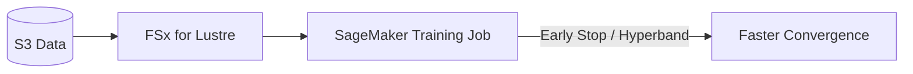

# Task 2.2 – Train and Refine Models

## Overview
Task 2.2 focuses on training ML models in Amazon SageMaker, refining them via hyperparameters/regularization, reducing training time/size, and managing versions. Core goal: produce high-performing, efficient models using built-in tools, script mode, transfer learning, and ensembles while avoiding overfitting/underfitting. Exam emphasizes SageMaker-native features (AMT, JumpStart, Model Registry) over raw theory.

## Core Training Elements
- **Epoch**: One full pass over the entire training dataset.
- **Step/Batch**: Dataset split into mini-batches; one step = forward/backward pass on one batch.  
  - Batch size ↑ → fewer steps/epoch, more memory, smoother gradients.  
  - Batch size ↓ → noisier updates, better generalization, slower wall-clock time.
- **Learning rate**: Step size for weight updates (key hyperparameter).
- **Parameters vs. Hyperparameters**:  
  - Parameters (weights, biases) learned from data.  
  - Hyperparameters (epochs, LR, layers, #trees) set by you to control training.

**Exam Tip**: Know that validation loss rising after epoch N signals overfitting → apply early stopping.

## Reducing Training Time & Cost
| Technique              | How it Works                              | When to Use                          | Trap to Avoid                     |
|------------------------|-------------------------------------------|--------------------------------------|-----------------------------------|
| Early Stopping        | Halt when metric (val loss) plateaus     | Long jobs, neural nets              | Too aggressive → underfit        |
| Distributed Training  | Data/model parallelism across instances  | Large datasets/models               | Network overhead if not needed   |
| FSx for Lustre        | High-throughput cache in front of S3     | Fast iterative training from S3     | EFS is slower; PCA shrinks data but does **not** speed startup |
| Transfer Learning     | Fine-tune pre-trained model (JumpStart/Bedrock) | New domain, limited data            | Catastrophic forgetting if LR too high |
| Hyperband (in AMT)    | Dynamically allocate epochs, kill poor configs | Resource-constrained tuning         | —                                |

**Comparison**: FSx for Lustre >> EFS for SageMaker training throughput. PCA reduces dimensionality (helps performance/size) but still requires full S3→instance load → no startup speedup.

**Mermaid – Training Speedup Flow**:

## Improving Model Performance & Preventing Issues
### Regularization (prevents overfitting)
- **L1 (Lasso)**: Adds absolute weight penalty → sparse models (feature selection).
- **L2 (Ridge)**: Adds squared weight penalty → smaller weights, smoother models.
- **Dropout**: Randomly zero neurons during training (NN only).
- **Weight Decay**: Synonym for L2 in many frameworks.
- **Feature Selection / Pruning**: Drop low-importance features or neurons.

**Underfitting**: Model too simple → ↑ capacity (#layers/#trees), ↓ regularization, train longer.  
**Overfitting**: Val loss ↑ while train loss ↓ → early stop, more dropout/L2, more data.  
**Catastrophic Forgetting**: Fine-tuning erases old knowledge → lower LR on early layers, elastic weight consolidation, or rehearsal.

### Ensembles (combine models)
- **Bagging** (e.g., Random Forest): Parallel independent models → average.  
- **Boosting** (XGBoost, CatBoost): Sequential, each corrects previous errors.  
- **Stacking**: Meta-model learns to combine base models.  
SageMaker supports custom ensembles in one training/tuning job → single endpoint (lower cost/ops).

**Use Cases**: Fraud, medical diagnosis, CV/NLP. Libraries: scikit-learn, XGBoost (built-in).

## Hyperparameter Tuning
SageMaker Automatic Model Tuning (AMT) supports built-in algorithms, script-mode containers (TensorFlow, PyTorch, etc.), and custom images.

| Strategy          | Mechanism                                      | Pros                          | Cons                     |
|-------------------|------------------------------------------------|-------------------------------|--------------------------|
| Grid Search      | Exhaustive categorical combinations           | Simple, complete             | Exponential cost        |
| Random Search    | Random samples from ranges                    | Better coverage than grid    | Still wasteful          |
| Bayesian Opt.    | Regression model predicts next best point     | Sample-efficient             | Overhead for tiny jobs  |
| Hyperband        | Adaptive resource allocation + early kill     | Fastest for deep models      | Needs many parallel jobs|

**Key Hyperparameters & Effects**:
- Neural nets: #layers/width ↑ capacity (risk overfit); LR too high → diverge.
- Trees: #trees/depth ↑ performance then plateaus; min-child-weight controls split.
- Optimizers: SGD (simple), Adam (adaptive, default for most NNs), etc.

**Exam Tip**: AMT can tune both built-in and BYO models via script mode. Always define objective metric + ranges.

## SageMaker Training Workflows
1. **Built-in Algorithms** – Zero-code (XGBoost, Linear Learner, Image Classification…).
2. **Script Mode** – Bring TensorFlow/PyTorch/Hugging Face code; SageMaker handles container, scaling, metrics.
3. **JumpStart / Bedrock** – One-click fine-tune of foundation models on custom data (transfer learning).
4. **Bring Your Own** – Custom container or script mode + AMT.

**Model Size Reduction**:
- Lower precision (FP16/INT8).
- Pruning / distillation / feature selection.
- Compression (SageMaker Neo for edge).

## Model Management & Governance
- **SageMaker Model Registry**: Catalog versions, attach metadata, approval workflow, CI/CD deploy. Ensures repeatability & audits.
- **ML Lineage Tracking**: Automatic graph of data → train → model → endpoint for governance.
- **Studio vs Notebooks**: Studio runs on managed multi-user environment with EFS; includes JumpStart, Experiments, Pipelines, Registry.

**Redshift ML Trap**: When data already lives in Redshift, train + infer **in-database** (SQL) instead of export→S3→SageMaker. Streaming ingestion cannot push features to SageMaker endpoints.

## Exam Tips & Common Traps
- **Early stopping** is the go-to for “validation loss rises after epoch X + save cost”.
- FSx for Lustre is the correct answer for “fast startup + high-throughput S3 training”; EFS is slower; PCA does not help I/O.
- L1 = sparsity/feature selection; L2 = weight shrinkage. Know both names (Lasso/Ridge).
- Transfer learning / JumpStart = fine-tune without training from scratch.
- Ensembles can be trained/tuned/deployed as **one** SageMaker job/endpoint.
- Model Registry ≠ Model Monitor; Registry = versioning & approval.
- Hyperband and early stopping both reduce compute by killing bad trials.
- Catastrophic forgetting appears in fine-tuning questions → lower LR or freeze layers.
- Always prefer managed SageMaker features (AMT, JumpStart, Registry) over DIY.

## Quick Reference Checklist
- [ ] Choose batch size / epochs / LR consciously.
- [ ] Apply L1/L2/dropout + early stop to fight overfit.
- [ ] Use AMT (Bayesian/Hyperband) for systematic tuning.
- [ ] Speed data with FSx; shrink model with pruning/quantization.
- [ ] Fine-tune via JumpStart/script mode instead of scratch.
- [ ] Register every production candidate in Model Registry.
- [ ] Ensemble when single model plateaus (boosting/stacking).

Master these patterns and you will confidently answer any “train & refine” question on the MLA-C01.