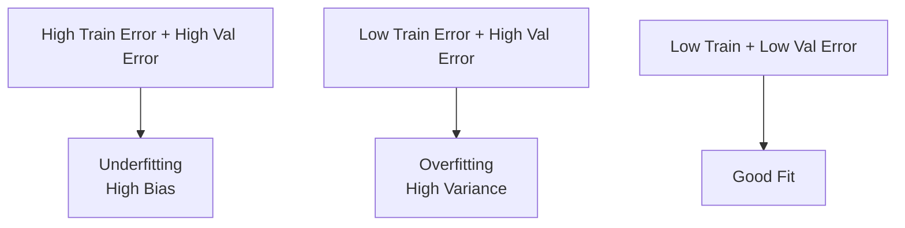
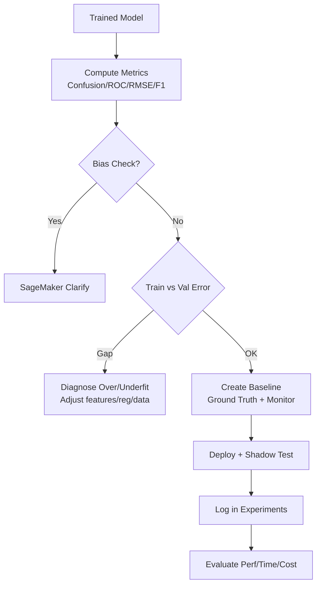

# Task 2.3 – Analyze Model Performance

## Overview
After training a model, evaluate its performance on held-out data before production use. Focus on selecting appropriate metrics, detecting bias/overfitting/underfitting, establishing baselines, debugging convergence, and using AWS tools (SageMaker Clarify, Debugger, Experiments, Model Monitor, shadow testing) for insights and reproducible comparisons. Assess trade-offs between accuracy, training time, and cost.

## Key Evaluation Metrics and Techniques
Select metrics based on problem type (classification vs. regression) and business needs (e.g., cost of false positives).

### Classification Metrics
- **Confusion Matrix**: Table of TP, TN, FP, FN. Foundation for other metrics. Heat maps visualize it.
- **Accuracy**: (TP + TN) / Total. Misleading on imbalanced data.
- **Precision**: TP / (TP + FP). “Of predicted positives, how many correct?”
- **Recall (Sensitivity)**: TP / (TP + FN). “Of actual positives, how many found?”
- **Specificity**: TN / (TN + FP).
- **False Positive Rate (FPR)**: FP / (FP + TN) = 1 – Specificity.
- **F1 Score**: Harmonic mean of Precision and Recall: \( 2 \times \frac{P \times R}{P + R} \). Balances both; useful for imbalance.
- **ROC Curve**: Plots TPR (Recall) vs. FPR at thresholds. 
- **AUC-ROC**: Area under ROC (0.5 = random, 1.0 = perfect). Threshold-independent ranking quality.

### Regression Metrics
- **RMSE** (Root Mean Square Error): \(\sqrt{\frac{1}{n}\sum(y_i - \hat{y}_i)^2}\). Penalizes large errors; same units as target.
- **MSE**: RMSE without root.
- **MAE** / **MAPE**: Mean Absolute Error / Percentage Error. More robust to outliers than RMSE.

**Exam Tip**: Know formulas and when to prefer F1/AUC over accuracy (imbalanced classes). SageMaker Model Monitor auto-selects metrics by problem type (e.g., MSE for regression, confusion-matrix derived for classification).

| Metric       | Best For                  | Weakness                     | SageMaker Use Case          |
|--------------|---------------------------|------------------------------|-----------------------------|
| Accuracy    | Balanced classes         | Imbalance                    | Quick baseline             |
| Precision   | High FP cost (spam)      | Ignores FN                   | Fraud detection            |
| Recall      | High FN cost (medical)   | Ignores FP                   | Disease screening          |
| F1          | Imbalance, balance P/R   | Less interpretable           | General classification     |
| AUC-ROC     | Ranking, threshold-free  | Can be optimistic on imbalance | Model comparison         |
| RMSE        | Regression, large errors | Outlier-sensitive            | Continuous targets         |

## Performance Baselines and Model Quality Monitoring
Create a **baseline** using a labeled dataset (often with SageMaker Ground Truth labels stored in S3). 

- Use **SageMaker Model Monitor** (Model Quality jobs) to continuously compare live predictions vs. Ground Truth.
- Metrics depend on problem type (linked in AWS docs; e.g., RMSE/MSE for regression, precision/recall/F1/AUC for classification).
- Detect data/model quality drift; trigger alerts via CloudWatch.

**Exam Tip/Trap**: Baseline requires Ground Truth. For production endpoints, pair with data capture. Visualize precision-recall via EMR → S3 → QuickSight dashboards (or CloudWatch for load-test metrics from notebook instances).

## Overfitting vs. Underfitting
Compare training vs. validation/evaluation error.

**Remediation** (key exam knowledge):
- **Underfitting**: Increase flexibility → add domain features / feature crosses / higher n-grams; decrease regularization; try more complex model; more training passes.
- **Overfitting**: Decrease flexibility → fewer feature combinations / lower n-grams; increase regularization (L1/L2/dropout); more data; early stopping; simpler model.
- **Both poor**: Insufficient data → collect more examples or increase epochs/passes; improve feature processing; tune hyperparameters.

**Exam Trap**: Regularization direction is opposite for under- vs. over-fitting. Always diagnose via train/val gap before changing architecture.

## SageMaker Clarify – Bias and Explainability
- **Pre-training & Post-training bias metrics**: Quantify fairness conceptions (e.g., demographic parity, equalized odds) on data and model predictions.
- Detects bias in training data and model outputs.
- Integrates with Model Monitor.
- **SageMaker Canvas**: No-code overview + scoring for model accuracy; can feed QuickSight visualizations.

**Skills**: Select/interpret metrics + detect bias. Use Clarify to interpret outputs (feature attributions, bias reports).

## Convergence Issues and Debugging
**SageMaker Debugger**:
- Registers hooks/callbacks to capture tensors → save to S3.
- Built-in rules detect: overfitting, vanishing/exploding gradients, saturated activations, poor weight initialization, etc.
- Integrate with CloudWatch Events + Lambda for automated actions (stop training, notify via SNS).

**SageMaker TensorBoard** (hosted in SageMaker Domain): Visualize scalars, histograms, graphs for convergence debugging.

**Comparison**:
| Tool              | Primary Use                          | Output                     | Automation                  |
|-------------------|--------------------------------------|----------------------------|-----------------------------|
| Debugger         | Real-time tensor analysis + rules   | S3 tensors + rule alerts  | CloudWatch/Lambda/SNS      |
| TensorBoard      | Interactive visualization           | UI dashboards             | Manual exploration         |
| Clarify          | Bias + explainability               | Bias metrics + SHAP       | Reports + Monitor jobs     |
| Model Monitor    | Production drift/quality            | Metric baselines + alerts | Scheduled jobs             |

## Shadow Testing and Production Comparison
- Deploy a **shadow variant** alongside production variant.
- Route copy of traffic to shadow (no user impact); compare latency, errors, predictions.
- Monitor progress, catch config/performance issues, then promote.
- Useful for infrastructure or model changes.

**Exam Tip**: Shadow testing evaluates serving changes safely vs. A/B (which impacts users).

## Reproducible Experiments and Trade-offs
**SageMaker Experiments**:
- Logs parameters, metrics, artifacts, metadata.
- Enables search, comparison via tables/charts, reproducibility.
- Download charts to share with stakeholders.
- Track multiple hyperparameter runs to find optimal model.

**Trade-offs**: Balance model performance vs. training time vs. cost (instance size, spot vs. on-demand, early stopping, distributed training). Use Experiments + Debugger to iterate efficiently. Load-test on notebook instances and visualize via CloudWatch dashboards before production right-sizing.

**Skills**: Perform reproducible experiments; compare shadow vs. production; assess cost/performance/time.

## Exam Tips and Common Traps
1. **Metric Selection**: Match to problem + business cost (FP vs FN). Never default to accuracy.
2. **Baseline Creation**: Always involve Ground Truth + S3; Model Monitor uses problem-specific metrics.
3. **Fit Diagnosis**: Train/val gap is diagnostic gold. Know exact remedies for under/overfit (regularization & feature complexity directions flip).
4. **AWS Tool Mapping**:
   - Bias/insights → Clarify (or Canvas)
   - Convergence/debug → Debugger (rules) or TensorBoard
   - Tracking/reproducibility → Experiments
   - Production quality → Model Monitor + Ground Truth
   - Safe rollout → Shadow testing
5. **Visualization Paths**: Precision-recall → EMR/S3/QuickSight; Load tests/metrics → CloudWatch dashboards; Experiments → built-in charts.
6. **Trap**: Confusing Debugger (training tensors/rules) with Model Monitor (production predictions). Shadow ≠ canary/A/B.
7. **Cost Awareness**: Right-size via load tests; use spot/Debugger early-stop to control spend while maximizing performance.
8. **Iteration Mindset**: ML is experimental—Experiments + systematic metric comparison are mandatory for the exam scenarios.

## Quick Decision Flow

Master these metrics, diagnostics, and SageMaker services. Questions often combine a metric choice with the correct AWS visualization or monitoring tool, or ask for the precise fix to an under/overfit scenario.