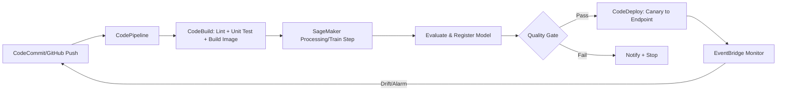

# Task 3.3 – Automated Orchestration for CI/CD Pipelines

## Overview
Task 3.3 focuses on using AWS orchestration tools to build CI/CD pipelines for ML workflows. MLOps joins ML development with deployment/operations, emphasizing **version control, automation, continuous testing, and model governance**. Pipelines handle data ingestion → training → validation → deployment → monitoring/retraining. Key services: CodePipeline, CodeBuild, CodeDeploy, SageMaker Pipelines, Step Functions, EventBridge.

**CI vs CD vs Continuous Deployment**:
- **Continuous Integration (CI)**: Compile + unit/integration tests on every commit.
- **Continuous Delivery (CD)**: Produce deployable artifact; manual approval optional.
- **Continuous Deployment**: Auto-deploy to production after tests pass.

## Core AWS CI/CD Services
### Capabilities & Integration
| Service       | Role in Pipeline                  | Key Features for ML                          | Quotas/Limits (Exam-Relevant) |
|---------------|-----------------------------------|----------------------------------------------|-------------------------------|
| **CodePipeline** | Orchestrates stages (Source → Build → Test → Deploy) | Integrates CodeCommit/GitHub, SageMaker, EventBridge; visual editor |  max 50 pipelines/account (soft); stages ≤10 actions |
| **CodeBuild**    | Builds/tests code & containers   | Runs unit/integration tests; builds Docker images for SageMaker training/inference; pay-per-minute | Concurrent builds limited by compute type |
| **CodeDeploy**   | Deploys artifacts to EC2, Lambda, ECS, SageMaker endpoints | Blue/green, canary, linear; pre/post-traffic hooks; auto-rollback on CloudWatch alarms | Deployment groups per app |
| **CodeCommit**   | Git-based source control         | Triggers pipelines on push; IAM fine-grained access | Standard Git limits |

**How they work together**: Push to CodeCommit/GitHub → CodePipeline starts → CodeBuild compiles/tests → CodeDeploy pushes model/endpoint. Use CloudFormation/SAM to provision the entire pipeline + IAM roles + VPC.

**Exam Tip**: CodePipeline can deploy CodeCommit code directly to a single EC2 instance via CodeDeploy. Step Functions can nest inside CodePipeline for complex ML branching/retries.

## Deployment Strategies
Know **when/why** each is used (especially serverless & SageMaker endpoints):

| Strategy          | Description                              | Traffic Shift                  | Rollback                  | Best For                     | Serverless Support |
|-------------------|------------------------------------------|--------------------------------|---------------------------|------------------------------|--------------------|
| **All-at-once**   | Instant full cutover                     | 100% immediately               | Manual/fast               | Low-risk, small changes     | Yes (Lambda)      |
| **Blue/Green**    | Two identical environments; switch alias | Instant via alias/weighted     | Instant switch back       | Zero-downtime ML endpoints  | Yes               |
| **Canary**        | Small % first, then rest                 | e.g., 10% → 100% over time     | Auto on alarms            | Risk reduction              | Yes (CodeDeploy)  |
| **Linear**        | Gradual equal increments                 | e.g., 10% every 10 min         | Auto                      | Controlled rollout          | Yes               |
| **Rolling**       | Replace instances in batches             | Incremental                    | Partial                  | EC2/ECS                     | No                |
| **Immutable**     | New instances; terminate old             | Full new fleet                 | Keep old                  | Safe EC2                    | No                |
| **Rolling w/ extra batch** | Temporary capacity boost             | Batches + buffer               | Flexible                  | High availability           | No                |

**CodeDeploy specifics**: Define pre-traffic (validate config) & post-traffic hooks (run tests). Monitor with CloudWatch alarms → automatic rollback. For Lambda: publish version → test → update alias.

**Exam Trap**: “Serverless deployment strategies” = all-at-once, blue/green, canary/linear (not rolling). Blue/green is preferred for SageMaker real-time endpoints.

## Version Control & Branching Flows
- **Git basics**: commit, branch, merge, pull request (PR).
- **GitHub Flow**: short-lived feature branches → PR → merge to main → deploy.
- **GitFlow**: main (prod), develop, feature/*, release/*, hotfix/*. Use CodePipeline + CodeBuild to run tests on PRs before merge.
- Multi-account/multi-environment: CloudFormation stacks per branch (dev/main) create isolated CodeCommit, CodeBuild, CodePipeline, VPC, EC2.

**Exam Tip**: Test PRs with CodeCommit + CodeBuild + Lambda before merge. Failed tests block progression.

## ML-Specific Orchestration & SageMaker Integration
### SageMaker Pipelines
- Native CI/CD for ML: steps for processing, training, evaluation, register, deploy.
- SDK defines DAG; integrates with CodePipeline or runs standalone.
- Supports model registry, automatic approval conditions, retraining triggers.

### Other Orchestrators
| Tool                          | Strengths                              | When to Choose                              | Integration with SageMaker |
|-------------------------------|----------------------------------------|---------------------------------------------|---------------------------|
| **SageMaker Pipelines**      | ML-native steps, model registry       | Pure SageMaker workflows                    | Native                    |
| **AWS Step Functions**       | Visual state machines, error handling, retries, low idle cost | Long-running, branching, idle-heavy orchestration | Data Science SDK / native |
| **Amazon MWAA (Airflow)**    | Existing Airflow DAGs, complex deps   | Teams already on Airflow; data pipelines    | Operators via API         |
| **Kubernetes + SageMaker Operators** | kubectl / K8s API for jobs         | K8s-centric orgs                            | Install operators         |
| **SageMaker Notebook Jobs**  | Schedule non-interactive notebook runs| Simple batch EDA/retraining                 | Direct                    |

**Cost Trap**: Lambda orchestrators with long idle waits → move flow to Step Functions (pay per transition).

### Configuring Training & Inference Jobs
1. Training job parameters: S3 input URL, instance type/count, S3 output, ECR training image.
2. Inference: real-time endpoint or **batch transform** / **processing job**.
3. Triggers: EventBridge rules on S3 events, schedule, or SageMaker model state changes → start pipeline.
4. Retraining loop: EventBridge detects data drift/model degradation → CodePipeline/SageMaker Pipeline retrain → register new model version → canary deploy.

**Data Ingestion Automation**:
- AWS Data Pipeline / Glue → S3 → SageMaker.
- AWS Data Exchange for third-party datasets → S3.
- Example: RDS SQL Server → Data Pipeline copy to S3 → SageMaker notebook/training job.

## Automated Testing in Pipelines
- **Unit tests**: CodeBuild runs pytest/unittest on checkout.
- **Integration/functional**: Deploy to test env (CodeDeploy) → run tests.
- **End-to-end**: Lambda or Glue jobs; SAM for serverless.
- Pipeline pattern: Source → Build + Unit Test (CodeBuild) → Deploy to staging → Integration Test → Manual approval → Prod deploy.
- Glue: unit-test Python scripts; deploy jobs via CodePipeline.

**Exam Tip**: Always add a CodeBuild test action before prod deploy. Use manual approval gates between test and prod.

## End-to-End Pipeline Example (Mermaid)

## Retraining & Monitoring Mechanisms
- EventBridge rules on `SageMaker Model State Change` or custom metrics.
- Scheduled SageMaker Pipeline executions.
- Model Monitor + EventBridge → retrain trigger.
- Store versions in Model Registry; promote via pipeline approval step.

## Exam Tips & Common Traps
1. **MLOps pillars** = version control + automation + continuous testing + governance.
2. Prefer **SageMaker Pipelines** for pure ML; **Step Functions** when you need general orchestration or already have idle Lambda costs.
3. Blue/green + canary + linear are CodeDeploy/Lambda staples; know pre/post-traffic hooks.
4. GitFlow vs GitHub Flow: know which branches map to which environments.
5. Always test before prod: CodeBuild unit + staging deploy + manual approval.
6. Data movement: Data Pipeline/Glue/Data Exchange → S3 is the standard pattern into SageMaker.
7. Quotas rarely tested deeply, but know CodePipeline stage/action limits exist.
8. Trap: “optimize idle orchestrator” → Step Functions, not more Lambda.
9. Trap: Serverless strategies ≠ rolling/immutable.
10. Infrastructure as Code (CloudFormation/SAM) creates the pipeline itself + supporting roles/VPC.

## Quick Memory Aids
- Source = CodeCommit/GitHub  
- Build/Test = CodeBuild  
- Deploy = CodeDeploy (strategies!)  
- ML Orchestrate = SageMaker Pipelines / Step Functions / MWAA  
- Trigger/Monitor = EventBridge  
- Everything as Code + Git + automated tests = MLOps CI/CD success

Master these services’ integration points and the decision criteria for deployment strategies/orchestrators—you will be ready for Task 3.3 questions.
