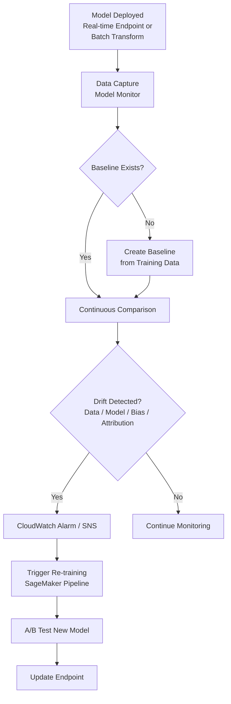

# Task 4.1 – Monitor Model Inference

## 1. Key Concepts Overview
Model inference monitoring is the **6th step** in both the ML Engineer and Well-Architected ML lifecycles.  
Once a model is deployed, continuous monitoring is mandatory because **data distributions drift**.  
A production monitoring system must:

1. Automatically capture inference data  
2. Compare it against the training baseline  
3. Apply rules to detect issues  
4. Raise alerts / trigger re-training  

**Four primary drifts/issues detected**:
- Data quality drift  
- Model quality drift  
- Bias drift  
- Feature attribution drift  

**Core principle**: Data used for prediction must statistically resemble the training data. Significant deviation → re-train.

---

## 2. AWS Services & How They Map to Monitoring Needs

| Need | Primary Service | Supporting / Complementary Services | Notes |
|------|-----------------|-------------------------------------|-------|
| Data & Model Quality Monitoring | **Amazon SageMaker Model Monitor** | CloudWatch, SNS | Captures real-time or batch data, compares to baseline |
| Bias & Feature Attribution Drift | **Amazon SageMaker Clarify** (integrated with Model Monitor) | – | Detects bias drift & SHAP/feature attribution changes |
| Endpoint Health & Latency | SageMaker Endpoint Metrics → **CloudWatch** | – | Invocation errors, model latency, CPU/GPU utilization |
| Anomaly Detection in Metrics | **Amazon Lookout for Metrics** | Lambda, SNS | Auto-detects anomalies & root causes |
| Data Quality Rules & Anomalies | **AWS Glue Data Quality** | – | ML-based anomaly detection on statistics over time |
| Human-in-the-Loop Validation | **Amazon Augmented AI (A2I)** | – | Compare human labels vs model predictions |
| Orchestration of Re-training | **SageMaker Pipelines** + **SageMaker Projects** | Step Functions Data Science SDK, EventBridge, CloudTrail | Full CI/CD for ML |
| Visualization & Aggregation | **Amazon OpenSearch + Kibana** | – | Dashboards for prediction metrics |
| A/B Testing / Shadow Traffic | SageMaker Endpoints (ProductionVariants) | – | Traffic splitting for model comparison |

### Comparison of Similar Components
- **Model Monitor vs Clarify**: Model Monitor = statistical data/model quality; Clarify = fairness & explainability drift.  
- **Lookout for Metrics vs Glue Data Quality**: Lookout = time-series metric anomalies (business KPIs); Glue = dataset-level statistical anomalies.  
- **CloudWatch vs OpenSearch**: CloudWatch = raw metrics & simple alarms; OpenSearch = rich search + visualization of inference logs.

---

## 3. Monitoring Workflow (Mermaid)



---

## 4. Detailed Monitoring Capabilities

### 4.1 SageMaker Model Monitor
- **Baselines**: Created once from training dataset (statistics + constraints).  
- **Monitoring jobs**:
  - Data quality  
  - Model quality (needs ground truth)  
  - Bias drift (via Clarify)  
  - Feature attribution drift (via Clarify)  
- **Schedules**: Continuous (real-time endpoint) or scheduled (batch transform / Async Inference).  
- **Outputs**: Violations report → S3 + CloudWatch metrics.

### 4.2 Detecting Drift Types
| Drift Type | What is Compared | Tool |
|------------|------------------|------|
| Data Quality | Input feature distributions vs baseline | Model Monitor |
| Model Quality | Predictions vs ground truth (accuracy, F1, etc.) | Model Monitor |
| Bias Drift | Pre/post-training bias metrics over time | Clarify + Model Monitor |
| Feature Attribution | SHAP value distributions | Clarify + Model Monitor |

### 4.3 Re-training Triggers
- Fixed schedule (e.g., weekly)  
- Threshold breach (CloudWatch alarm)  
- New data arrival (S3 event → EventBridge → Step Functions / Pipelines)  
- Human feedback loop (A2I)

**Best practice**: Always re-train on **original + new data**. Re-training only on original data or simple hyper-parameter tuning does **not** solve drift.

### 4.4 A/B Testing & Shadow Deployment
- Use multiple `ProductionVariants` on a single endpoint.  
- Traffic weighting (e.g., 90/10).  
- Compare live metrics → promote winner.

### 4.5 Automatic Scaling & Endpoint Metrics
SageMaker automatically emits:
- `Invocations`, `ModelLatency`, `OverheadLatency`  
- `CPUUtilization`, `MemoryUtilization`, `GPUUtilization`  
Configure target-tracking or step scaling policies on these metrics.

---

## 5. End-to-End Automation Pattern (Exam Favorite)

1. Model Monitor detects drift → CloudWatch Alarm  
2. Alarm publishes to SNS or directly invokes EventBridge  
3. EventBridge starts SageMaker Pipeline (or Step Functions)  
4. Pipeline:  
   - Data prep / feature engineering  
   - Training job  
   - Evaluation  
   - Model Registry registration  
   - Conditional deployment (A/B or blue/green)  
5. SageMaker Projects can template the entire above flow + custom containers.

Alternative lightweight trigger:
```
S3 new data → CloudTrail / EventBridge → Step Functions → Training job
```

---

## 6. Human-in-the-Loop & Ground Truth
- For model quality monitoring you **must** supply ground truth.  
- Use A2I to obtain human labels on a sample of predictions.  
- Compare human vs model → estimate real-world performance degradation → decide re-train.

---

## 7. Exam Tips & Traps

**High-probability questions**
- “Performance dropped after weeks in production – what do you do?”  
  → Re-train on **original + new data** (not just original, not just hyper-parameter tune).  
- “Need to detect bias drift in real time” → Model Monitor + Clarify.  
- “Automatically start re-training when drift occurs” → Model Monitor + CloudWatch + Pipelines/Step Functions.  
- “Monitor batch transform jobs” → Schedule Model Monitor on the batch output.  
- “Visualize prediction distributions” → OpenSearch + Kibana or QuickSight.

**Common Traps**
- Thinking regularization or hyper-parameter tuning alone fixes data drift.  
- Forgetting that model quality monitoring requires ground truth.  
- Using only CloudWatch without Model Monitor (CloudWatch alone cannot compute statistical drift).  
- Re-training solely on new data (catastrophic forgetting) – always include original data or use continual learning techniques.  
- Confusing Lookout for Metrics (business KPIs) with Model Monitor (ML-specific drift).

**Quick Memory Aids**
- **4 Drifts**: Data, Model, Bias, Attribution  
- **3 Tools**: Monitor (quality), Clarify (bias/explainability), A2I (human)  
- **2 Triggers**: Schedule **or** Threshold  
- **1 Goal**: Keep inference data distribution ≈ training distribution

---

## 8. One-Page Cheat Sheet

```
Deploy → Capture (Model Monitor) → Baseline Compare
       ↓
   Drift? → CloudWatch Alarm → SNS / EventBridge
       ↓
   Re-train Pipeline (original + new data)
       ↓
   A/B Test → Promote → Continue Monitoring
```

**Services to memorize**:  
SageMaker Model Monitor, Clarify, Pipelines, Projects, A2I, CloudWatch, EventBridge, Step Functions, Lookout for Metrics, Glue Data Quality, OpenSearch.
