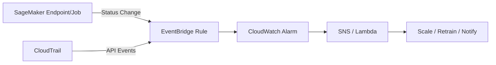

# Task 4.2 – Monitor and Optimize Infrastructure and Costs

## Overview
Task 4.2 focuses on ensuring ML infrastructure reliability, performance, and cost-efficiency throughout the ML lifecycle. Key pillars draw from the AWS Well-Architected Framework (Cost Optimization): right-size resources, increase elasticity, choose optimal pricing, match storage to usage, and continually measure/monitor. Observability (metrics, logs, traces) enables troubleshooting latency/scaling issues and automated remediation. Core services include CloudWatch, X-Ray, CloudTrail, EventBridge, Cost Explorer, Trusted Advisor, Budgets, SageMaker Inference Recommender, and Compute Optimizer.

**Word count target focus**: Concise coverage of exam-tested knowledge/skills only (no advanced internals).

## 1. Key Performance Metrics for ML Infrastructure
Monitor these to detect issues early:
- **Utilization**: CPU, memory, GPU (e.g., SageMaker endpoint metrics).
- **Throughput**: Invocations, predict count (by request mode: real-time vs. batch).
- **Availability/Scalability**: Endpoint status, auto-scaling events, service quotas.
- **Fault Tolerance**: Error rates, latency spikes, cold starts.
- **Latency breakdown** (SageMaker-specific): Model latency + overhead latency; multi-model endpoints add model loading/download/cache-hit times.

**Exam Tip**: High model latency often stems from inference code delays, overused endpoints, or infrequent requests (cold starts). Pre-warm endpoints with test invocations.

## 2. Monitoring & Observability Tools
Instrument apps for traces/metrics/logs. Primary tools for latency/performance troubleshooting:

| Tool | Primary Use | Key ML Features | When to Choose |
|------|-------------|-----------------|---------------|
| **Amazon CloudWatch** | Metrics, logs, alarms, dashboards | SageMaker endpoint metrics (latency, CPU/mem, invocations); Logs Insights for interactive queries; Anomaly Detection; Application Insights; ServiceLens (correlates traces/metrics/logs) | Default for most monitoring; set alarms on thresholds |
| **AWS X-Ray** | End-to-end distributed tracing | Visualize component interactions, latency bottlenecks | Deep performance debugging across services |
| **CloudWatch Lambda Insights** | Serverless metrics | Aggregates system-level metrics for Lambda | Lambda-based inference/preprocessing |
| **CloudWatch Logs Insights** | Log analysis | Search/filter SageMaker/Lambda logs | Root-cause on errors |
| **Amazon EventBridge** | Event-driven automation | Rules on SageMaker job/endpoint status changes; AWS Health events | Auto-remediate (e.g., trigger retrain or scale) |
| **AWS CloudTrail** | API auditing | Logs SageMaker actions (user/role/service); integrity hashing | Traceability + trigger re-training on events |

**Comparisons**:
- CloudWatch = metrics + basic logs; X-Ray = request traces (use together via ServiceLens).
- CloudWatch Logs Insights vs. Athena: Insights for quick interactive queries on CloudWatch; Athena for S3-based historical analysis.
- GuardDuty/Inspector/Security Hub: Security-focused (not primary for performance, but exam may link to observability).

**Workflow (Mermaid) – Automated Remediation**:

**Skills**:
- Create CloudWatch alarms/metric filters (e.g., on S3 policy changes via CloudTrail → Logs).
- CloudWatch dashboards or QuickSight for visualization.
- Subscription filters: Stream logs to Kinesis/Firehose/Lambda.
- CloudTrail trails → CloudWatch Logs for real-time alerts.

**Exam Trap**: Accidental S3 bucket policy change breaking CI/CD? Solution = CloudTrail trail + metric filter + alarm (≥1) + SNS. Also enable CloudTrail log-file integrity (hashes) for tamper-proof audits.

## 3. Instance Types, Rightsizing & Performance
Choose based on workload (right-sizing is #1 cost lever):

| Family | Optimized For | ML Use Case | Examples |
|--------|---------------|-------------|----------|
| **General Purpose** | Balance | Notebooks, light inference | m5, m6i |
| **Compute Optimized** | High CPU | Batch processing, training | c5, c6i |
| **Memory Optimized** | Large datasets in-memory | Feature engineering, large models | r5, r6i, x2 |
| **Accelerated / Inference Optimized** | GPU/Inferentia/Trainium | Deep learning inference/training | g4dn, g5, inf1, trn1, p4 |
| **Storage Optimized** | High I/O | Data lakes, large feature stores | i3, d2 |

- **SageMaker-specific**: Inference Recommender recommends instance type/config for real-time/serverless endpoints (best perf/$).
- **AWS Compute Optimizer**: Analyzes utilization → rightsizing recommendations (EC2, Auto Scaling, Lambda, EBS).
- Auto Scaling on endpoints: Dynamically adjust instances. Elastic Load Balancing for traffic.
- Latency fixes: Benchmark outside endpoint; compile with SageMaker Neo (up to 2x faster); use Inferentia (up to 3x throughput, 45% lower cost vs GPU); fix code delays; enable provisioned concurrency (Lambda) or pre-warm.

**Exam Tip**: Multi-model endpoints → watch model cache hit / loading times in CloudWatch. Over-provisioned notebooks waste money—monitor custom CloudWatch metrics.

## 4. Cost Analysis, Tracking & Optimization Tools
**Cost Pillars Recap**:
1. Right-size (above).
2. Elasticity (Auto Scaling, Spot).
3. Pricing model.
4. Storage matching (S3 lifecycle, EBS snapshots via Data Lifecycle Manager/AWS Backup).
5. Measure/monitor continually.

**Key Tools**:

| Tool | Capability | Best For |
|------|------------|----------|
| **AWS Cost Explorer** | Interactive high-level reports; filter by tags | Drill-down analysis, forecasting |
| **AWS Cost & Usage Report (CUR)** | Hourly/daily granular data (product, tags) | Detailed breakdowns, Athena queries |
| **AWS Budgets** | Custom budgets + alerts | Cost quotas, free-tier alarms |
| **AWS Trusted Advisor** | Cost/performance/security checks | Low-utilization EC2 detection |
| **AWS Cost Optimization Hub** | Aggregates recommendations across accounts/Regions | Prioritize best $/perf tradeoffs |
| **Billing Alarms** | CloudWatch on estimated charges | Simple threshold alerts |

**Tagging Strategy (Critical)**:
- Apply resource tags + cost allocation tags.
- Enforce via AWS Organizations / Control Tower / Service Control Policies.
- Use in Cost Explorer filters and CUR.
- Review regularly for drift.

**Purchasing Options Comparison** (choose by interruption tolerance & commitment):

| Option | Discount | Flexibility | Interruption | Best ML Fit |
|--------|----------|-------------|--------------|-------------|
| **On-Demand** | None | Highest | None | Unpredictable, short jobs |
| **Spot Instances** | Up to 90% | High (with fallback) | Yes | Fault-tolerant batch training/processing |
| **Reserved Instances** | Up to 72% | Medium (1-3 yr) | None | Steady-state endpoints |
| **Savings Plans** (Compute / EC2 / **SageMaker**) | Up to 72% | High (EC2/Fargate/Lambda/SageMaker) | None | Flexible compute mix; SageMaker-specific plan ideal for notebooks/training/inference |
| **Dedicated Hosts/Instances** | Varies | Low | None | Compliance / licensing |

**Other Optimizations**:
- Data transfer: CloudFront, Direct Connect, VPC endpoints, SageMaker Neo.
- Migration: DataSync, Snow Family, Transfer Family, Storage Gateway (minimize egress).
- Lifecycle rules: Auto-delete unused data/snapshots.
- Provisioned concurrency / service quotas: Watch for capacity throttling that inflates costs via retries.

**Skills in Action**:
- Trusted Advisor + EventBridge + Lambda: Detect low-util EC2 → terminate.
- EventBridge rule on AWS Health (EC2 maintenance) → SNS for Hadoop/EMR clusters.
- SageMaker Model Monitor + CloudWatch + Cost Explorer for endpoint cost/perf.
- Set Budgets + tagging for chargeback.

## 5. Exam Tips & Common Traps
- **Automation first**: Prefer EventBridge + Lambda/SNS over manual. CloudWatch alarms trigger CodeDeploy rollbacks.
- **Latency root causes**: Code > cold start > overload > wrong instance. Neo/Inferentia = easy wins.
- **Cost vs Perf trade-off**: Inference Recommender / Compute Optimizer almost always appear in rightsizing questions.
- **Tagging is mandatory** for allocation; untagged resources = invisible costs.
- **Spot for batch** (interruptible); Savings Plans for mixed flexible compute; never Spot for real-time low-latency endpoints.
- **Trap**: Confusing Cost Explorer (visual/high-level) with CUR (raw/granular). Use both.
- **Trap**: Forgetting CloudTrail integrity validation or log-file hashing for audit questions.
- **Trap**: Ignoring multi-model endpoint specific metrics or provisioned concurrency costs.
- **Well-Architected**: Always link answers back to cost-optimization pillars + observability.
- Practice: Create trail → metric filter → alarm; rightsizing recommendations; budget alerts.

## Quick Reference Checklist
- [ ] CloudWatch metrics/alarms/dashboards + Logs Insights + X-Ray
- [ ] EventBridge for SageMaker/Health events
- [ ] CloudTrail trails + integrity
- [ ] Tag everything + Cost Explorer/Budgets/Trusted Advisor
- [ ] Inference Recommender + Compute Optimizer + correct instance family
- [ ] Spot / SageMaker Savings Plans / Auto Scaling
- [ ] Lifecycle policies + data-transfer minimization

Master these services’ integration points and decision criteria. Questions typically present a symptom (high latency/cost/under-util) and ask for the monitoring tool + remediation action. Focus on “what metric/alarm/event triggers what automated response” and “which purchasing/instance option minimizes cost for given constraints.” 
