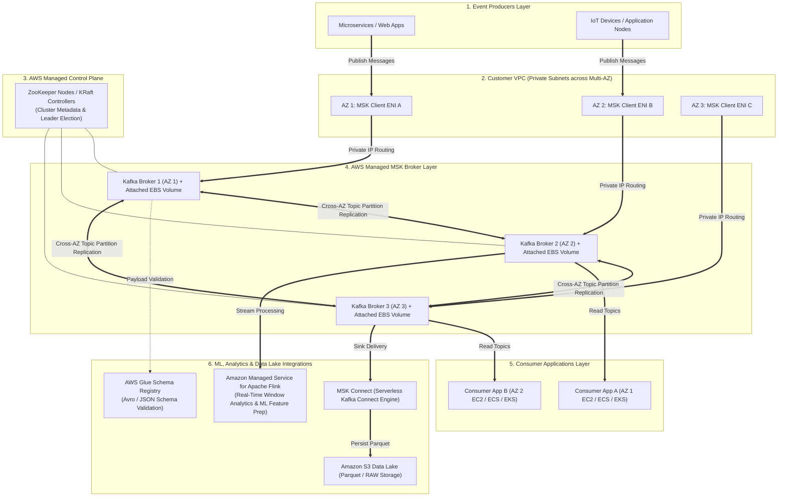

# 1 - Event Driven Architecture - AWS services

## Amazon Kinesis Data Streams
- Event-Driven Architecture serivce

### Asynchronous Decoupling

Producers publish state changes (e.g., user clicks, IoT telemetry, database mutations) directly to the stream as immutable events. The producer does not need to know which downstream microservices will consume the data or wait for them to finish processing.

### Multi-Consumer Fan-Out Pattern

A single stream can be read concurrently by multiple independent microservices without interfering with one another or causing data contention:

* **Consumer A (AWS Lambda):** Triggers real-time security alerts.
* **Consumer B (Kinesis Data Firehose):** Streams raw events to Amazon S3 for long-term data lake storage.
* **Consumer C (Managed Service for Apache Flink):** Performs continuous real-time sliding window analytics.

### Event Replayability & Persistence (Event Sourcing)

In classic messaging queues, an event is deleted once consumed. Kinesis retains events for **24 hours up to 365 days**. This allows microservices to:

* Replay past events after deploying bug fixes.
* Rebuild application state from scratch (Event Sourcing pattern).
* Onboard new downstream services that need historical context.

### Strict Ordered Processing

By assigning a `Partition Key` (e.g., `Account_ID` or `Order_ID`), Kinesis guarantees that all events with the same key are routed to the same shard and delivered to consumers in the exact order they occurred (e.g., `AccountCreated` $\rightarrow$ `DepositMade` $\rightarrow$ `WithdrawalRequested`).

### Capacity modes
1. Provision mode: 
    - pay per "shard" provisioned per hour
    - scale manually increase/decrease number of shard
2. On-demand mode
    - Provision capacity instead
    - scale automatically based on observed throughput peak during last 30 days
    - pay as you go (stream per hour / data in/out)

## Amazon Data Firehose (Formerly Kinesis Data Firehose)
- Serverless delivery stream service, fully managed
- Streams data directly into **Amazon S3, Amazon Redshift, Amazon OpenSearch, Snowflake, Splunk, Datadog, or custom HTTP endpoints**
- Can invoke an AWS Lambda function to clean, transform, or enrich records in-flight
- Converts incoming JSON payloads directly into columnar formats (Apache Parquet or Apache AWS Glue Schema) to optimize downstream query speeds in Amazon Athena or Redshift Spectrum
- **Near real-time** with buffering (compared with real time EDA from Kinesis Data Streams)
- Cannot replay

## Troubleshooting Kinesis Data Streaming

| High-Priority Scenario | Key Metric / Symptom | Root Cause | Exam Resolution (`IF ... THEN ...`) |
| --- | --- | --- | --- |
| **Consumer Processing Lag** | `IteratorAge` or `MillisBehindLatest` steadily rising | Consumer application (Lambda, KCL, EC2) is processing records slower than the ingestion rate. | Scale out consumer instances, increase stream shard count, or optimize consumer code. |
| **Write Throttling ("Hot Shards")** | `ProvisionedThroughputExceededException` (HTTP 400) on Writes | A low-cardinality Partition Key is routing disproportionate traffic to a single shard. | Switch to a high-cardinality Partition Key (hash/UUID), use Exponential Backoff, or split (reshard) the hot shard. |
| **Multi-Consumer Read Contention** | `ReadProvisionedThroughputExceeded` across multiple reader apps | Multiple standard consumers are competing for the default **2 MB/sec per shard** read limit. | Enable **Enhanced Fan-Out (EFO)** to provision dedicated 2 MB/sec HTTP/2 push pipes per consumer. |
| **KCL Checkpointing Failures** | Expired shard iterators or KCL workers failing during failover | Throttling on the internal **Amazon DynamoDB table** used by KCL for shard leases and checkpoints. | Increase provisioned RCU/WCU or enable **On-Demand mode** on the KCL DynamoDB tracking table. |
| **Streaming Data Lake Ingestion** | Ingesting, buffering, and converting continuous data into S3/Redshift without custom code | Need serverless stream delivery, batching, and format transformation (JSON $\rightarrow$ Parquet) | Route stream data through **Amazon Data Firehose** connected to AWS Glue Data Catalog schemas. |

## Amazon Kinesis Data Analytics
- For SQL Applications:
    - Apply SQL opeartions to stream as it goes through

- With Lambda:
    - Allows lots of flexibility for post-processing (code logic)

### Managed Service for Apache Flink
- Flink = underhood engine for Kinesis Data Analytics (Processing data streams)
- Formerly Kinesis Data Analytics for Apache **Flink** or for Java
- Now also supports **Python** and **Scala**

## Amazon Managed Streaming for Apache Kafka (Amazon MSK)
- Alternative to Kinesis
- Fully managed Kafka on AWS (EDA)
- Dual-VPC Networking: Brokers reside in an AWS-managed VPC and expose **Elastic Network Interfaces (ENIs)** inside your private subnets across multiple AZs.
- Uses EBS for broker storage
- Supports **MSK Tiered Storage** to offload historical topic data to low-cost storage automatically

### MSK integrations
- **AWS Glue Schema Registry:** Validates payloads (Apache Avro / JSON) produced to MSK topics. Prevents malformed or corrupted records from entering downstream ML feature stores or data lakes.
- **MSK Connect:** Serverless Kafka Connect engine used to stream topic data directly into **Amazon S3** (for ML data lakes) or **Amazon OpenSearch** without writing custom consumer code.
- **Amazon Managed Service for Apache Flink:** Reads MSK topics in real time for stream windowing, anomaly detection, and live feature engineering.

### Amazon MSK vs. Amazon Kinesis Data Streams

| Architectural Dimension | Amazon MSK | Amazon Kinesis Data Streams |
| --- | --- | --- |
| **Ecosystem / Protocol** | Open-source **Apache Kafka API** & client libraries. | AWS-native proprietary API / SDKs. |
| **Best For** | Existing Kafka workloads, multi-cloud setups, or Kafka ecosystem tools (Kafka Connect, Schema Registry). | AWS-native event streaming, serverless integrations, and quick setups. |
| **Capacity Management** | Provisioned Brokers (m5/g1 instances) or **MSK Serverless**. | On-Demand or Provisioned Shards. |
| **Data Retention** | Configurable / Unlimited (via Tiered Storage). | 24 hours to 365 days. |
| **Data Ingestion Sink** | **MSK Connect** $\rightarrow$ S3 / OpenSearch. | **Amazon Data Firehose** $\rightarrow$ S3 / Redshift / OpenSearch. |

| IF the Scenario Mentions... | THEN Choose... |
| --- | --- |
| **Migrating an existing Apache Kafka or Kafka Connect pipeline to AWS with zero code changes** | **Amazon MSK** |
| **Enforcing schema validation on streaming data payloads before ML processing** | **AWS Glue Schema Registry** with MSK |
| **Streaming Kafka topic records directly into an S3 data lake without writing consumer code** | **MSK Connect** |
| **Unpredictable or spike-heavy streaming traffic requiring zero cluster sizing** | **MSK Serverless** or **Kinesis Data Streams (On-Demand)** |
| **Offloading historical Kafka topic data to lower cost storage without expanding EBS volumes** | **MSK Tiered Storage** |

### MSK Monitoring
1. CloudWatch Metrics
    - Cluster and broker metrics
    - Topic level metrics
2. Prometheus, open-source monitoring
    - Port on broker to export cluster, broker and topic level metrics
3. Broker log delivery
    - Either CloudWatch logs, S3 or Kinesis Data Streams