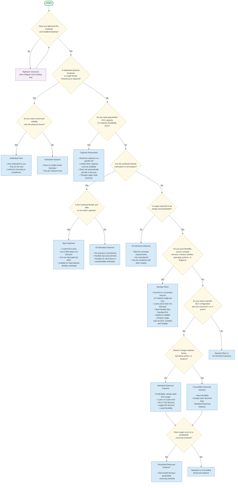
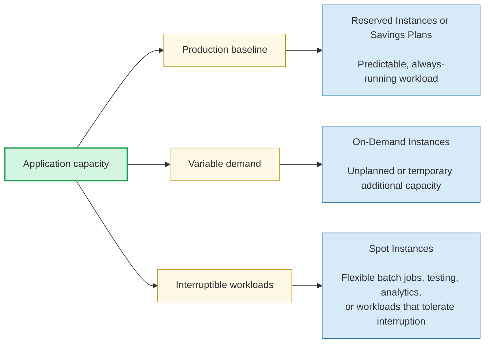
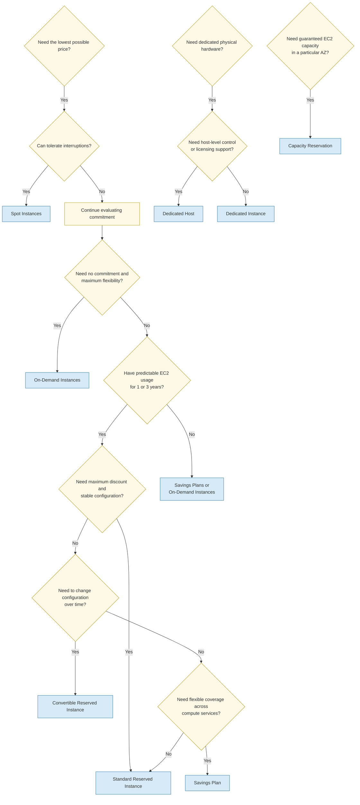

# CLF-C02 Study Notes: Task Statement 4.1 — Compare AWS Pricing Models

## 1. Cost Optimization Fundamentals

**Cost optimization** means running systems that deliver business value at the lowest possible cost.

Key principles:

- **Right-size resources:** Choose the smallest or most cost-effective resource that meets performance requirements.
- **Increase elasticity:** Scale resources up when demand increases and down when demand decreases.
- **Choose the appropriate pricing model:** Match pricing to workload duration, predictability, and tolerance for interruption.
- **Use the appropriate storage class:** Match storage cost and performance to access requirements.
- **Monitor and optimize continuously:** AWS environments change over time, so regularly review usage and costs.
- **Measure and control costs:** Use tagging, budgets, monitoring, and cost-management tools.

### Rightsizing

Rightsizing involves selecting:

- The correct instance size
- The correct instance family
- The appropriate operating system and tenancy
- The most cost-effective resource that satisfies workload requirements

For example, replacing an underutilized large EC2 instance with a smaller instance can reduce costs without affecting application performance.

> **Exam tip:** Rightsizing should generally be considered before committing to a long-term pricing model such as Reserved Instances or Savings Plans.

---

## 2. EC2 Pricing Models

### Pricing Model Comparison

| Pricing model | Commitment | Discount | Best for | Main risk or limitation |
|---|---:|---:|---|---|
| On-Demand Instances | None | Lowest flexibility-based price | Short-term, unpredictable, or interruption-intolerant workloads | More expensive over long periods |
| Reserved Instances | 1 or 3 years | Up to approximately 72% compared with On-Demand | Steady-state, predictable workloads | Commitment continues even if instances are not running |
| Spot Instances | None, but capacity may be interrupted | Up to approximately 90% compared with On-Demand | Fault-tolerant and flexible workloads | AWS can interrupt the instance |
| Savings Plans | 1 or 3 years of usage commitment | Reduced price | Predictable compute usage with flexibility | Commitment to a usage amount |
| Dedicated Hosts | Host allocation | Pricing is for the host | Licensing, compliance, or host-level requirements | You pay for the dedicated host, not only running instances |
| Dedicated Instances | No long-term commitment required | Generally higher than shared tenancy | Single-tenant hardware requirements | You pay per running instance |
| Capacity Reservations | No discount by itself | On-Demand pricing | Ensuring EC2 capacity in a specific Availability Zone | Capacity is reserved whether used or not |

---

## 3. On-Demand Instances

On-Demand pricing allows you to pay for compute capacity without a long-term commitment.

### Best use cases

- Applications with uncertain requirements
- Short-term workloads
- Workloads with flexible start and end times
- Applications that cannot tolerate interruption
- Development and testing environments
- Temporary increases in demand

### Advantages

- No 1-year or 3-year commitment
- No requirement to purchase capacity in advance
- Flexible instance selection and usage

### Disadvantage

- Usually more expensive than Reserved Instances or Savings Plans for steady, long-term usage

> **Exam clue:** If a question emphasizes **unpredictable usage**, **short-term workloads**, or **cannot tolerate interruption**, consider **On-Demand Instances**.

---

## 4. Reserved Instances

Reserved Instances provide a discounted rate in exchange for a **1-year or 3-year commitment**.

### Best use cases

- Steady-state workloads
- Predictable, long-term usage
- Production workloads that run continuously
- Applications with known capacity requirements

### Payment options

Reserved Instances can be paid for as:

- **All Upfront**
- **Partial Upfront**
- **No Upfront**

Typically, a longer term and greater upfront payment provide a larger discount.

### Important characteristics

- The commitment applies whether or not the instance is running.
- A **3-year term** is generally more cost-effective than a 1-year term.
- **Standard Reserved Instances** generally offer the largest discount.
- **Convertible Reserved Instances** provide more flexibility, allowing changes such as instance family, operating system, or tenancy, subject to the applicable rules.

### Regional and zonal scope

- **Regional Reserved Instances:** The discount can apply to eligible instances in any Availability Zone within the selected Region.
- **Zonal Reserved Instances:** Associated with a specific Availability Zone and can provide capacity reservation benefits.

> **Exam trap:** A Reserved Instance is primarily a **billing discount commitment**. It does not automatically mean that physical EC2 capacity is guaranteed unless the relevant zonal capacity reservation feature is used.

### Reserved Instance sharing across accounts

With **AWS Organizations consolidated billing**, Reserved Instance benefits can be shared across eligible accounts in the organization.

For example, one account can purchase a Reserved Instance, while another account may receive the applicable hourly benefit when using a matching instance.

> **Exam tip:** Consolidated billing treats the accounts in an organization as one for certain volume pricing and Reserved Instance benefit calculations.

---

## 5. Spot Instances

Spot Instances use spare Amazon EC2 capacity and can provide discounts of up to approximately **90% compared with On-Demand pricing**.

### Best use cases

- Batch processing
- Data analysis
- Background jobs
- Stateless web servers
- Distributed workloads
- Workloads that can restart or resume
- Applications that tolerate interruptions

### Important characteristics

- Spot capacity is not guaranteed.
- AWS can interrupt Spot Instances when the capacity is needed.
- The price can change based on available spare capacity.
- Applications must be designed to tolerate interruption or failure.

> **Exam clue:** If the question asks for the **lowest-cost EC2 option** and the workload is **fault tolerant or interruptible**, choose **Spot Instances**.

> **Exam trap:** Do not choose Spot Instances for a critical workload that cannot tolerate interruption.

---

## 6. Savings Plans

Savings Plans provide lower prices in exchange for a commitment to a consistent amount of compute usage, usually measured in dollars per hour, for a 1-year or 3-year period.

Savings Plans can apply to compute usage such as:

- Amazon EC2
- AWS Lambda
- AWS Fargate

They are generally more flexible than a Standard Reserved Instance because the discount can apply across certain changes in instance usage, Region, operating system, or compute service, depending on the type of Savings Plan.

> **Exam tip:** For a question describing **predictable compute usage across EC2, Lambda, or Fargate**, consider **Savings Plans**.

### Savings Plans versus Reserved Instances

| Feature | Reserved Instances | Savings Plans |
|---|---|---|
| Commitment | Specific reservation configuration or usage | Consistent compute spending |
| Flexibility | More limited, especially Standard RIs | Generally more flexible |
| Applies to | Primarily EC2 configurations | EC2 and, depending on plan, Lambda and Fargate |
| Best for | Predictable EC2 usage with known configuration | Predictable compute usage with changing configurations or services |

---

## 7. Dedicated Hosts and Dedicated Instances

### Dedicated Hosts

A Dedicated Host is a physical server dedicated to a single AWS customer.

- Other AWS customers do not share the host.
- You pay for the dedicated host rather than individual instances.
- Useful for:
  - Compliance requirements
  - Software licenses tied to physical sockets or cores
  - Host-level visibility and control

### Dedicated Instances

Dedicated Instances run on hardware dedicated to one AWS customer, but AWS manages the underlying host.

- You pay per running instance.
- They provide single-tenant hardware.
- They do not provide the same host-level control as Dedicated Hosts.

### Comparison

| Feature | Dedicated Host | Dedicated Instance |
|---|---|---|
| Billing | Per dedicated host | Per instance |
| Host visibility | Greater visibility and control | Less host-level control |
| Physical server dedicated to customer | Yes | Yes |
| Useful for host-based licensing | Yes | Generally less suitable |

> **Exam trap:** Dedicated Hosts and Dedicated Instances are not the same as **Reserved Instances**. “Dedicated” describes tenancy and hardware allocation; “Reserved” describes a pricing commitment.

---

## 8. Capacity Reservations

Capacity Reservations allow you to reserve EC2 capacity in a specific Availability Zone.

They are useful when you need confidence that EC2 capacity will be available when required.

Important points:

- Capacity Reservations are associated with an Availability Zone.
- They are charged at On-Demand rates.
- They are not primarily a discount mechanism.
- You pay for the reserved capacity whether or not you launch instances into it.

> **Exam trap:** Do not confuse a Capacity Reservation with a Reserved Instance:
>
> - **Reserved Instance:** Primarily provides a billing discount.
> - **Capacity Reservation:** Primarily ensures EC2 capacity availability in a specific Availability Zone.

---

## 9. Combining Pricing Models

A single environment can use multiple pricing models.

Example:

- **Reserved Instances or Savings Plans:** Baseline production capacity
- **On-Demand Instances:** Unpredictable or temporary workloads
- **Spot Instances:** Flexible batch processing or additional capacity

This combination helps match supply to demand while controlling costs.

### Example architecture

A company normally requires 10 EC2 instances but occasionally needs 20:

- Reserve or commit to the baseline 10 instances.
- Use On-Demand capacity for unexpected short-term needs.
- Use Spot Instances for interruptible batch jobs.

---

## 10. Storage Cost Optimization

AWS provides several storage services and storage classes. Choose based on:

- How frequently data is accessed
- Required retrieval time
- Durability and availability requirements
- Retention period
- Cost

Examples include:

- **Amazon S3:** Object storage with multiple storage classes
- **S3 Glacier and S3 Glacier Deep Archive:** Lower-cost archival storage
- **Amazon EBS:** Block storage for EC2
- **Amazon EFS:** Managed shared file storage
- **AWS Storage Gateway:** Hybrid cloud storage integration

> **Exam tip:** Infrequently accessed or archival data should generally be moved to a lower-cost storage class instead of remaining in a frequently accessed class.

---

## 11. Data Transfer Cost Optimization

Data transfer costs depend on where data is moving.

Important concepts:

- Data transfer **into AWS** is often free.
- Data transfer **out of AWS** or between certain services, Regions, or Availability Zones may incur charges.
- Data transferred to an on-premises data center is considered data transfer out from AWS and may be charged.
- AWS may use tiered pricing for data transfer to the internet.

### Services that can help optimize network costs or performance

#### Amazon CloudFront

CloudFront is a content delivery network that caches content at edge locations.

Benefits include:

- Lower latency for end users
- Reduced origin load
- Potentially lower data transfer costs from the origin, such as Amazon S3

#### AWS Direct Connect

Direct Connect provides a private network connection between an on-premises environment and AWS.

It can provide:

- More consistent network performance
- Private connectivity
- Potentially more predictable network costs than using the public internet

> **Exam trap:** Do not assume that all AWS data transfer is free. Always consider the direction, source, destination, Region, Availability Zone, and service involved.

---

## 12. Cost and Usage Monitoring Tools

### AWS Cost Explorer

Used to:

- Visualize and analyze AWS costs
- View historical spending
- Filter costs by service, account, Region, and other dimensions
- Identify spending trends

### AWS Cost and Usage Reports

Provides detailed cost and usage information for analysis and reporting.

Useful for:

- Detailed billing analysis
- Allocating costs across teams or accounts
- Tracking resource usage over time

### AWS Budgets

Used to:

- Set custom cost or usage budgets
- Monitor spending against a target
- Receive alerts when actual or forecasted costs exceed thresholds

### AWS Trusted Advisor

Provides recommendations that can include:

- Underutilized resources
- Potential cost savings
- Service limits
- Security and performance improvements

### Amazon CloudWatch

Used to:

- Monitor resource metrics such as CPU utilization
- Create alarms
- Observe resource usage
- Help identify resources that may need to be scaled up or down

### Cost allocation tags

Tags such as `Department`, `Project`, or `Environment` help organizations:

- Attribute costs to teams or applications
- Analyze spending
- Improve accountability
- Track costs by business unit

> **Exam tip:** Cost allocation tags must be properly defined, consistently applied, and activated for cost reporting purposes.

---

## 13. Cost Optimization Best Practices

AWS cost optimization practices include:

1. **Rightsize resources**
2. **Use elasticity and automatic scaling**
3. **Match pricing models to workload requirements**
4. **Use lower-cost storage classes where appropriate**
5. **Monitor data transfer charges**
6. **Define and enforce a tagging strategy**
7. **Use consolidated billing with AWS Organizations**
8. **Use Cost Explorer, Budgets, Cost and Usage Reports, and Trusted Advisor**
9. **Review infrastructure and costs regularly**
10. **Give teams visibility into the cost of their resources**
11. **Define cost-related metrics and target goals**
12. **Establish a Cloud Center of Excellence (CCOE)** to promote AWS best practices and cost awareness

### Elasticity and Auto Scaling

Services that can help match resources to demand include:

- **Amazon EC2 Auto Scaling**
- **AWS Auto Scaling**
- **AWS Lambda**

Scaling down unused resources is an important part of a pay-for-what-you-use model.

---

# Exam Tips and Common Traps

- **Lowest EC2 price:** Usually Spot Instances, but only when interruptions are acceptable.
- **Cannot tolerate interruption:** Choose On-Demand or an appropriate committed option, not Spot.
- **Steady, predictable EC2 usage:** Consider Reserved Instances or Savings Plans.
- **Uncertain or short-term usage:** Choose On-Demand.
- **Reserved Instance commitment:** You pay for the reservation even if the instance is stopped or unused.
- **Standard Reserved Instances:** Usually provide a greater discount than Convertible Reserved Instances.
- **Convertible Reserved Instances:** Offer more flexibility, but usually a smaller discount.
- **Capacity Reservation:** Reserves capacity; it is not the same as a Reserved Instance discount.
- **Dedicated Host:** Charged per host.
- **Dedicated Instance:** Charged per instance.
- **CloudWatch:** Primarily monitors metrics and creates alarms.
- **Cost Explorer:** Analyzes and visualizes costs.
- **AWS Budgets:** Sets spending or usage thresholds and sends alerts.
- **Trusted Advisor:** Provides recommendations, including cost optimization recommendations.
- **CloudFront:** Improves content delivery performance and can reduce origin data transfer.
- **Consolidated billing:** Can allow Reserved Instance and volume pricing benefits to be shared across AWS Organization accounts.

---

# Practice Questions

## Question 1

A company runs a batch-processing workload that can be interrupted and restarted. The company wants the lowest possible EC2 cost.

Which pricing option should the company use?

A. On-Demand Instances  
B. Standard Reserved Instances  
C. Spot Instances  
D. Dedicated Hosts  

**Answer: C. Spot Instances**

**Explanation:** Spot Instances use spare EC2 capacity and offer the largest discounts, but they can be interrupted. They are appropriate for fault-tolerant workloads.

---

## Question 2

A company has an application that runs continuously with predictable EC2 usage for the next three years. The application cannot tolerate interruption.

Which pricing option is most appropriate?

A. Spot Instances  
B. On-Demand Instances  
C. Reserved Instances  
D. Capacity Reservations only  

**Answer: C. Reserved Instances**

**Explanation:** Reserved Instances provide a significant discount for predictable, long-term usage. Spot Instances are unsuitable because the application cannot tolerate interruption.

---

## Question 3

A company needs to ensure that EC2 capacity is available in a specific Availability Zone during a critical event. The company is not primarily seeking a discount.

Which option should the company use?

A. Regional Reserved Instance  
B. Capacity Reservation  
C. Spot Instance  
D. Savings Plan  

**Answer: B. Capacity Reservation**

**Explanation:** Capacity Reservations reserve EC2 capacity in a specific Availability Zone. They use On-Demand rates and are intended to provide capacity assurance rather than a pricing discount.

---

## Question 4

A company wants to analyze its AWS spending by service, account, and Region over time.

Which AWS service should it use?

A. Amazon CloudWatch  
B. AWS Cost Explorer  
C. AWS Trusted Advisor  
D. AWS Auto Scaling  

**Answer: B. AWS Cost Explorer**

**Explanation:** Cost Explorer provides visualization and analysis of historical and current AWS costs.

---

## Question 5

A company wants to receive an alert when its monthly AWS spending reaches a defined threshold.

Which service should it use?

A. AWS Budgets  
B. Amazon CloudFront  
C. AWS Cost and Usage Reports  
D. Amazon Inspector  

**Answer: A. AWS Budgets**

**Explanation:** AWS Budgets allows customers to define cost or usage thresholds and receive notifications when actual or forecasted usage exceeds those thresholds.

---

## Question 6

A company wants to reduce costs by identifying EC2 instances that are consistently underutilized.

Which combination would best help?

A. Amazon CloudWatch and AWS Trusted Advisor  
B. AWS WAF and Amazon Route 53  
C. Amazon CloudFront and AWS Shield  
D. AWS Direct Connect and AWS Snowball  

**Answer: A. Amazon CloudWatch and AWS Trusted Advisor**

**Explanation:** CloudWatch provides utilization metrics, while Trusted Advisor can provide recommendations for underutilized resources and potential cost savings.

---

## Question 7

A company has a baseline compute requirement but also experiences unpredictable spikes. It wants to use multiple pricing models to reduce costs.

Which approach is most appropriate?

A. Use only Dedicated Hosts  
B. Use Reserved Instances for the baseline and On-Demand Instances for spikes  
C. Use only Spot Instances  
D. Use only Capacity Reservations  

**Answer: B. Use Reserved Instances for the baseline and On-Demand Instances for spikes**

**Explanation:** Reserved Instances can cover predictable usage, while On-Demand Instances provide flexibility for unexpected short-term demand. Spot Instances could also be used for interruptible workloads.

---

# AWS Pricing Model Decision Guide

## Core decision principle

Choose a pricing model **after** you have:

1. Rightsized the workload.
2. Determined whether demand is steady, variable, or unpredictable.
3. Identified whether interruptions are acceptable.
4. Decided whether you need dedicated tenancy or capacity guarantees.
5. Estimated the expected duration of usage.

## Pricing model decision flowchart

> **Exam note:** Scheduled Reserved Instances are a historical EC2 pricing concept and may not be available for new purchases in all AWS contexts. For CLF-C02 questions, recognize the concept as a commitment for predictable recurring schedules, but follow the specific wording of the question.

---

## Pricing model comparison

| Pricing model | Commitment | Discount level | Can be interrupted? | Best for |
|---|---:|---:|---:|---|
| **On-Demand Instances** | None | Baseline price | No AWS interruption because of the pricing model | Short-term, unpredictable, or interruption-intolerant workloads |
| **Reserved Instances** | 1 or 3 years | Up to 72% below On-Demand | No AWS interruption because of the pricing model | Steady-state, predictable EC2 usage |
| **Standard Reserved Instances** | 1 or 3 years | Highest RI discount | No | Stable EC2 configuration with little need for change |
| **Convertible Reserved Instances** | 1 or 3 years | Lower than Standard RI, generally | No | Long-term usage with expected changes to instance family, OS, or tenancy |
| **Scheduled Reserved Instances** | Recurring schedule | Discounted during schedule | No | Predictable recurring workloads |
| **Savings Plans** | 1 or 3 years | Discounted compute usage | No | Predictable compute spending with flexibility across eligible compute services |
| **Spot Instances** | No long-term commitment | Up to 90% below On-Demand | **Yes** | Fault-tolerant, flexible, interruptible workloads |
| **Dedicated Hosts** | Varies | Usually more expensive | No shared-tenancy interruption | Licensing, compliance, and physical-server visibility requirements |
| **Dedicated Instances** | Usually usage-based | Generally higher than shared tenancy | No shared-tenancy interruption | Single-tenant hardware without host-level control |
| **Capacity Reservations** | Reservation-based | Does not inherently provide a discount | Capacity is reserved | Guaranteeing EC2 capacity in a specific Availability Zone |

---

## Practical workload patterns

A cost-optimized architecture commonly combines pricing models:

### Example

A company runs an application with:

- A stable baseline of four EC2 instances.
- Variable traffic during business hours.
- Batch processing that can restart if interrupted.

A suitable approach is:

- **Reserved Instances or a Savings Plan** for the stable baseline.
- **On-Demand Instances** for unexpected demand.
- **Spot Instances** for interruptible batch processing.
- **Auto Scaling** to match capacity with demand.

---

## Reserved Instance payment options

Reserved Instances can generally be purchased using:

- **All Upfront** — highest payment at the beginning; typically the lowest effective cost.
- **Partial Upfront** — part of the cost paid initially, with the remainder paid periodically.
- **No Upfront** — no initial payment, but usually a higher effective cost than upfront options.

Important points:

- The commitment is charged whether or not the instance is running.
- A **3-year term** is generally more cost-effective than a 1-year term.
- **Regional Reserved Instances** can apply across Availability Zones within a Region.
- Reserved Instance benefits can be shared across accounts through **consolidated billing** in AWS Organizations, subject to applicable billing rules.

---

## High-value CLF-C02 decision rules

### Choose On-Demand when:

- The workload is short-term.
- Requirements are uncertain.
- Start and end times are flexible.
- The application cannot tolerate interruption.
- You do not want a long-term commitment.

### Choose Reserved Instances when:

- EC2 usage is steady and predictable.
- The workload will run for 1 or 3 years.
- You want a discount in exchange for commitment.
- You can accept less flexibility than Savings Plans.
- The exam asks for the **largest Reserved Instance discount**: choose **Standard Reserved Instances**.

### Choose Savings Plans when:

- You have predictable compute spending.
- You want a commitment-based discount.
- You need more flexibility across eligible compute usage.
- The workload may move between services such as EC2, Lambda, and Fargate.

### Choose Spot Instances when:

- The workload can tolerate interruption.
- The workload is fault tolerant or restartable.
- You want the lowest possible EC2 price.
- Examples include batch processing, big data processing, CI workloads, and stateless flexible applications.

### Choose Dedicated Hosts when:

- You need an entire physical server dedicated to your organization.
- You need host-level visibility or control.
- You have software licensing requirements based on physical sockets or cores.
- The question emphasizes **paying for the host**, not individual instances.

### Choose Dedicated Instances when:

- You need single-tenant hardware.
- You do not require control over the physical host.
- The question emphasizes paying **per instance-hour**.

### Choose Capacity Reservations when:

- You must guarantee EC2 capacity.
- The requirement is tied to a specific Availability Zone.
- The question emphasizes capacity availability rather than a pricing discount.

---

## Pricing model selection summary

## Key exam traps

- **Spot Instances are the cheapest, but they can be interrupted.**
- **On-Demand is not always the cheapest; it is chosen for flexibility and lack of commitment.**
- **Reserved Instances require a 1-year or 3-year commitment.**
- **You pay for a Reserved Instance commitment even when the instance is not running.**
- **Standard Reserved Instances provide the greatest RI discount.**
- **Convertible Reserved Instances provide more flexibility than Standard Reserved Instances.**
- **Capacity Reservations guarantee capacity but are not primarily a discount mechanism.**
- **Dedicated Hosts are billed for the host; Dedicated Instances are billed per instance.**
- **Auto Scaling and rightsizing should be considered before selecting a pricing model.**
- **Multiple pricing models can be used together in the same environment.**