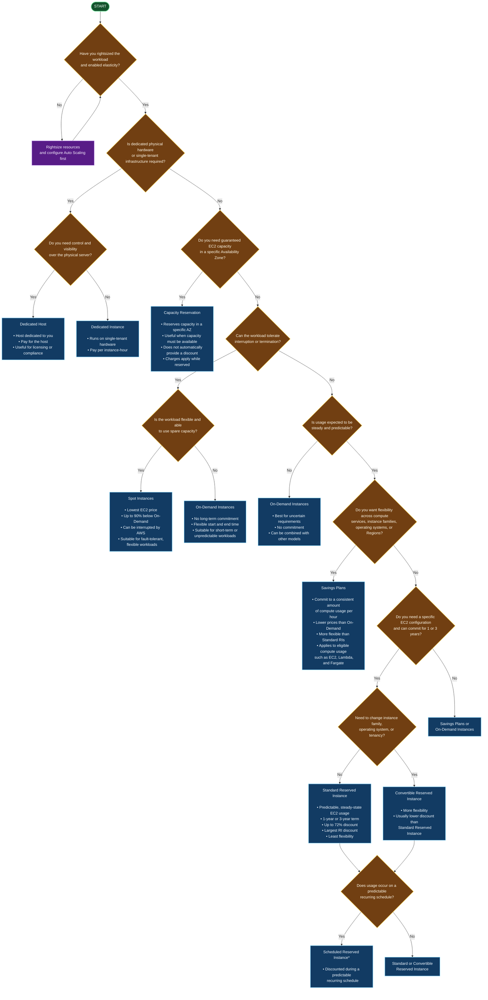
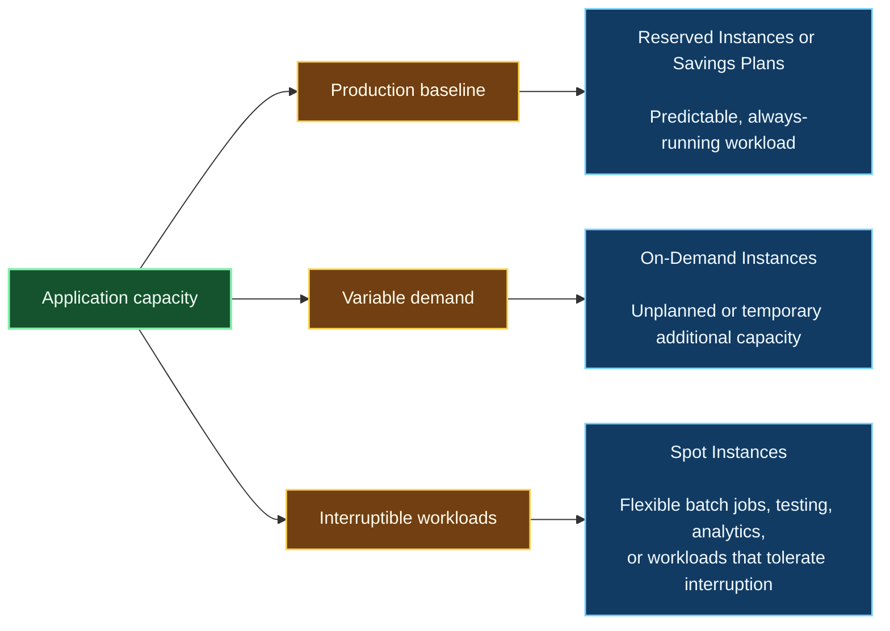
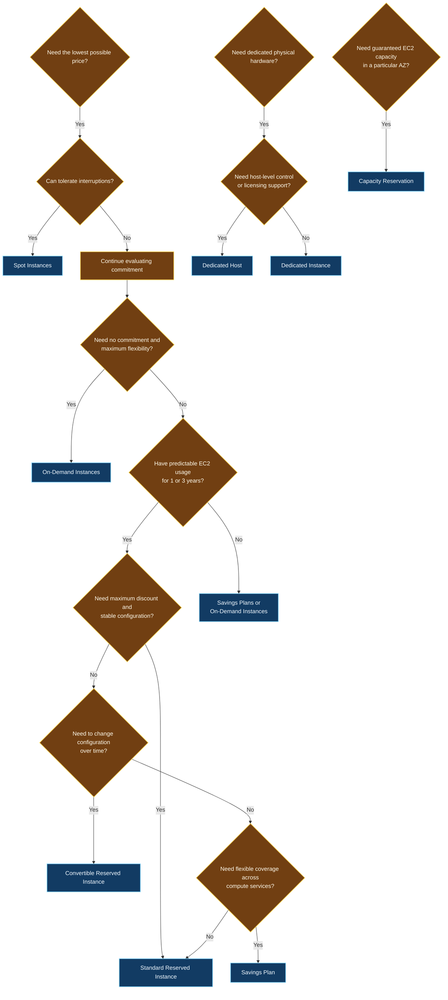

# AWS Pricing Model Decision Guide

## Core decision principle

Choose a pricing model **after** you have:

1. Rightsized the workload.
2. Determined whether demand is steady, variable, or unpredictable.
3. Identified whether interruptions are acceptable.
4. Decided whether you need dedicated tenancy or capacity guarantees.
5. Estimated the expected duration of usage.

## Pricing model decision flowchart

> **Exam note:** Scheduled Reserved Instances are a historical EC2 pricing concept and may not be available for new purchases in all AWS contexts. For CLF-C02 questions, recognize the concept as a commitment for predictable recurring schedules, but follow the specific wording of the question.

---

## Pricing model comparison

| Pricing model | Commitment | Discount level | Can be interrupted? | Best for |
|---|---:|---:|---:|---|
| **On-Demand Instances** | None | Baseline price | No AWS interruption because of the pricing model | Short-term, unpredictable, or interruption-intolerant workloads |
| **Reserved Instances** | 1 or 3 years | Up to 72% below On-Demand | No AWS interruption because of the pricing model | Steady-state, predictable EC2 usage |
| **Standard Reserved Instances** | 1 or 3 years | Highest RI discount | No | Stable EC2 configuration with little need for change |
| **Convertible Reserved Instances** | 1 or 3 years | Lower than Standard RI, generally | No | Long-term usage with expected changes to instance family, OS, or tenancy |
| **Scheduled Reserved Instances** | Recurring schedule | Discounted during schedule | No | Predictable recurring workloads |
| **Savings Plans** | 1 or 3 years | Discounted compute usage | No | Predictable compute spending with flexibility across eligible compute services |
| **Spot Instances** | No long-term commitment | Up to 90% below On-Demand | **Yes** | Fault-tolerant, flexible, interruptible workloads |
| **Dedicated Hosts** | Varies | Usually more expensive | No shared-tenancy interruption | Licensing, compliance, and physical-server visibility requirements |
| **Dedicated Instances** | Usually usage-based | Generally higher than shared tenancy | No shared-tenancy interruption | Single-tenant hardware without host-level control |
| **Capacity Reservations** | Reservation-based | Does not inherently provide a discount | Capacity is reserved | Guaranteeing EC2 capacity in a specific Availability Zone |

---

## Practical workload patterns

A cost-optimized architecture commonly combines pricing models:

### Example

A company runs an application with:

- A stable baseline of four EC2 instances.
- Variable traffic during business hours.
- Batch processing that can restart if interrupted.

A suitable approach is:

- **Reserved Instances or a Savings Plan** for the stable baseline.
- **On-Demand Instances** for unexpected demand.
- **Spot Instances** for interruptible batch processing.
- **Auto Scaling** to match capacity with demand.

---

## Reserved Instance payment options

Reserved Instances can generally be purchased using:

- **All Upfront** — highest payment at the beginning; typically the lowest effective cost.
- **Partial Upfront** — part of the cost paid initially, with the remainder paid periodically.
- **No Upfront** — no initial payment, but usually a higher effective cost than upfront options.

Important points:

- The commitment is charged whether or not the instance is running.
- A **3-year term** is generally more cost-effective than a 1-year term.
- **Regional Reserved Instances** can apply across Availability Zones within a Region.
- Reserved Instance benefits can be shared across accounts through **consolidated billing** in AWS Organizations, subject to applicable billing rules.

---

## High-value CLF-C02 decision rules

### Choose On-Demand when:

- The workload is short-term.
- Requirements are uncertain.
- Start and end times are flexible.
- The application cannot tolerate interruption.
- You do not want a long-term commitment.

### Choose Reserved Instances when:

- EC2 usage is steady and predictable.
- The workload will run for 1 or 3 years.
- You want a discount in exchange for commitment.
- You can accept less flexibility than Savings Plans.
- The exam asks for the **largest Reserved Instance discount**: choose **Standard Reserved Instances**.

### Choose Savings Plans when:

- You have predictable compute spending.
- You want a commitment-based discount.
- You need more flexibility across eligible compute usage.
- The workload may move between services such as EC2, Lambda, and Fargate.

### Choose Spot Instances when:

- The workload can tolerate interruption.
- The workload is fault tolerant or restartable.
- You want the lowest possible EC2 price.
- Examples include batch processing, big data processing, CI workloads, and stateless flexible applications.

### Choose Dedicated Hosts when:

- You need an entire physical server dedicated to your organization.
- You need host-level visibility or control.
- You have software licensing requirements based on physical sockets or cores.
- The question emphasizes **paying for the host**, not individual instances.

### Choose Dedicated Instances when:

- You need single-tenant hardware.
- You do not require control over the physical host.
- The question emphasizes paying **per instance-hour**.

### Choose Capacity Reservations when:

- You must guarantee EC2 capacity.
- The requirement is tied to a specific Availability Zone.
- The question emphasizes capacity availability rather than a pricing discount.

---

## Pricing model selection summary

## Key exam traps

- **Spot Instances are the cheapest, but they can be interrupted.**
- **On-Demand is not always the cheapest; it is chosen for flexibility and lack of commitment.**
- **Reserved Instances require a 1-year or 3-year commitment.**
- **You pay for a Reserved Instance commitment even when the instance is not running.**
- **Standard Reserved Instances provide the greatest RI discount.**
- **Convertible Reserved Instances provide more flexibility than Standard Reserved Instances.**
- **Capacity Reservations guarantee capacity but are not primarily a discount mechanism.**
- **Dedicated Hosts are billed for the host; Dedicated Instances are billed per instance.**
- **Auto Scaling and rightsizing should be considered before selecting a pricing model.**
- **Multiple pricing models can be used together in the same environment.**