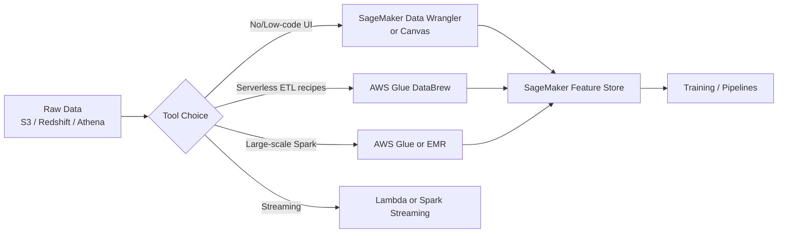

# MLA-C01 Study Notes: Task 1.2 – Transform Data and Perform Feature Engineering

## Overview
Task 1.2 focuses on preparing raw data for ML model training through cleaning, transformation, and feature engineering. The goal is to convert messy, heterogeneous data into clean, numeric, model-ready features that improve accuracy, reduce bias, and ensure reliable predictions. Key AWS services include SageMaker Data Wrangler, AWS Glue / Glue DataBrew, SageMaker Feature Store, Ground Truth, and supporting tools such as EMR Spark and Lambda. Only exam-relevant techniques (no advanced research-level methods) are covered.

## Data Types You Must Recognize
Before any transformation, classify columns correctly:
- **Numerical / Continuous** – real numbers (price, temperature).
- **Binary** – 0/1 or True/False.
- **Categorical / Nominal** – unordered labels (color, city).
- **Ordinal** – ordered categories (low/medium/high).
- **Text** – free-form strings (reviews).
- **Temporal** – dates/timestamps.
- **Useless** – IDs, constant columns, pure noise (drop early).

Mis-classifying a column leads to wrong encoding or scaling and is a common exam trap.

## Data Cleaning & Transformation Techniques
| Technique              | Purpose                              | Common Methods                          | Exam Tip |
|------------------------|--------------------------------------|-----------------------------------------|----------|
| Missing-value handling | Prevent bias & model failure         | Mean/median/mode, MICE, forward/back-fill | Prefer supervised imputation or MICE over dropping when >5-10 % missing |
| Outlier treatment      | Reduce skew from extremes            | IQR, z-score, winsorizing, drop         | Visualize first (box-plot) before deciding |
| Deduplication          | Remove identical rows                | Exact match or fuzzy (Glue)             | Always run before feature creation |
| Combining / Joining    | Enrich features                      | Inner/left joins, concatenation         | Watch for data leakage (future info) |

**Imputation guidance (exam favorite)**  
- <5 % missing → simple mean/median.  
- 10-20 % missing → MICE or model-based imputation.  
- Do **not** drop columns that may still be predictive.  
Amazon Forecast offers built-in middle/back/future fill for time-series; elsewhere use Data Wrangler or Glue recipes.

## Feature Engineering Techniques
Transform raw columns into more predictive signals.

- **Scaling & Standardization**  
  - Normalization (Min-Max) → [0,1]  
  - Standardization (Z-score) → mean 0, std 1  
  Critical for distance-based models (k-NN, SVM) and gradient-based algorithms.  
- **Log / Power transforms** – compress skewed distributions (income, counts).  
- **Binning / Discretization** – convert continuous → ordinal buckets.  
- **Feature splitting** – extract day-of-week, hour, domain from email, etc.  
- **Dimensionality reduction** – PCA (feature-reduction algorithm) to remove multicollinearity and speed training.

**Why engineer features?**  
Raw data rarely matches model assumptions. Proper engineering raises accuracy, speeds convergence, and reduces overfitting.

## Encoding Techniques (Categorical → Numeric)
| Encoding          | Output                          | When to Use                     | Pitfall |
|-------------------|---------------------------------|---------------------------------|---------|
| One-hot           | N binary columns                | Low-cardinality nominal         | Curse of dimensionality if >50 levels |
| Label / Ordinal   | Single integer                  | Ordinal data only               | Implies false order on nominal |
| Binary            | log₂(N) bits                    | Medium cardinality              | Less interpretable |
| Target / Mean     | Probability of target           | High-cardinality + target known | Data leakage risk |
| Tokenization      | Token IDs or embeddings         | Text / NLP                      | Not for simple categoricals |

**Exam question pattern**  
“Convert categorical features into numeric values for a predictive model” → **one-hot encoding** (DataBrew recipe or Data Wrangler).  
“Convert a column into binary values” → one-hot (not target encoding or tokenization).

## AWS Tools Comparison

| Service                  | Strengths                              | Best For                          | Integration |
|--------------------------|----------------------------------------|-----------------------------------|-------------|
| SageMaker Data Wrangler  | Visual flows, 300+ transforms, bias reports, export to Processing/Pipelines/Feature Store | Interactive exploration & feature engineering | Native SageMaker |
| AWS Glue DataBrew        | 250+ pre-built recipe actions, one-hot, scaling, profiling | Business-analyst friendly cleaning | Glue jobs, S3 |
| AWS Glue / EMR Spark     | Massive scale, custom PySpark          | TBs of data, complex joins        | Feature Store via code |
| SageMaker Canvas         | Completely no-code + custom Python     | Citizen data scientists           | Same export paths as Wrangler |
| Lambda                   | Event-driven, lightweight              | Real-time streaming transforms    | Kinesis / MSK |
| SageMaker Feature Store  | Online (low-latency) + Offline (S3) store, versioning, time-travel | Reusable, consistent features across teams | Training & inference |

**Feature Store key points**  
- Create feature groups, ingest from Data Wrangler or Spark.  
- Online store for real-time inference; offline for training.  
- Ensures training-serving skew is minimized—frequently tested.

## Data Annotation & Labeling
High-quality labels are required for supervised learning.
- **SageMaker Ground Truth** – managed labeling workflows, automatic labeling (active learning), built-in UI for images/text/tabular. Supports private, public, or vendor workforces.
- **Amazon Mechanical Turk** – raw crowd-sourcing; use when you need maximum flexibility or very large scale, but quality control is manual.
Ground Truth is preferred on the exam because of automation, audit trails, and direct SageMaker integration.

## Streaming Data Transforms
- Lightweight → AWS Lambda (parse, enrich, write to Firehose/S3).  
- Heavy stateful → Spark Structured Streaming on EMR or Glue streaming jobs.  
Both can land cleaned features into Feature Store or S3 for near-real-time training.

## End-to-End Workflow (Exam Mental Model)
1. Ingest (S3, Redshift, Athena).  
2. Profile & clean (Data Wrangler / DataBrew).  
3. Engineer & encode features.  
4. Validate (bias reports, missing-value checks).  
5. Store in Feature Store.  
6. Export to SageMaker Processing / Pipelines for repeatable training.  
7. Label remaining unlabeled data with Ground Truth if needed.

## Exam Tips & Traps
- **One-hot is the default answer** when the question mentions “categorical → numeric” and cardinality is not extreme.  
- Normalization/standardization appears with k-NN, K-means, or “features on different scales.”  
- Missing-value questions: dropping columns is almost always wrong if % missing is moderate; choose imputation (MICE or model-based).  
- Data Wrangler vs DataBrew: Wrangler if the stem mentions SageMaker Canvas, visual ML prep, or Feature Store integration; DataBrew if pure ETL recipe focus.  
- PCA = feature reduction / dimensionality reduction.  
- Never leak target information during encoding (target encoding must be done inside CV loops—rarely the correct exam choice).  
- Mechanical Turk alone is weaker than Ground Truth for quality and integration.  
- Useless features (IDs, constants) should be dropped early—simple but easy to overlook.  
- Canvas/Data Wrangler flows can be exported as Python scripts or directly into Pipelines—know the hand-off points.

## Quick Memory Hooks
- Scales differ → Normalize.  
- Categories → One-hot (DataBrew/Wrangler).  
- Missing & bias → Impute (MICE) or Forecast fill.  
- Reuse features → Feature Store.  
- Labels needed → Ground Truth.  
- Streaming light → Lambda; heavy → Spark.

Master these patterns and the accompanying AWS service choices; they constitute the bulk of Task 1.2 questions on MLA-C01.
