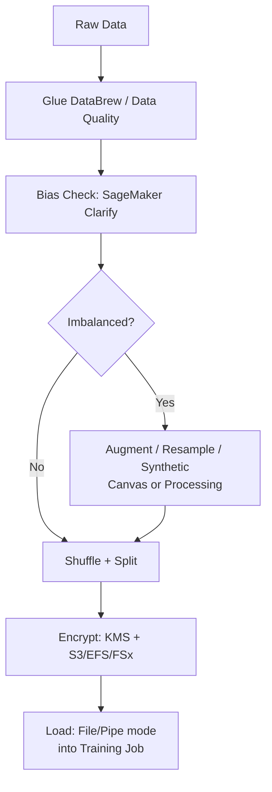

# MLA-C01 Study Notes: Task 1.3 – Ensure Data Integrity and Prepare Data for Modeling

**Goal**: Ensure high-quality, unbiased, secure, and properly formatted data before model training. Focus on pre-training steps only (bias metrics, balancing, encryption/compliance, quality checks, loading).

## 1. Pre-Training Bias Metrics & Detection (SageMaker Clarify)
SageMaker Clarify detects bias in **raw data** (model-agnostic) before training. Key pre-training metrics:

| Metric | Full Name | What It Measures | Data Types | Ideal Value |
|--------|-----------|------------------|------------|-------------|
| CI | Class Imbalance | Ratio of majority vs minority class samples | Numeric, Text, Image | Close to 1 (balanced) |
| DPL | Difference in Proportions of Labels | Difference in positive label rates across sensitive groups (e.g., gender, age) | Numeric, Text, Image | Close to 0 |
| Others (CDDL, KL, JS, LP, TVD, KS) | Various divergence/distance metrics | Distribution differences between groups | All | Near 0 |

**Sources of bias to identify**:
- Selection bias (non-representative sampling)
- Measurement bias (flawed data collection)
- Historical/label bias

**Clarify workflow**:
1. Analyze training dataset → compute pre-training metrics.
2. Generate bias reports + feature importance.
3. Monitor post-training & in production against baselines.
4. Export governance reports for compliance teams.

**Exam Tip**: Clarify works on tabular, text, and image data. It is **not** for generating synthetic data.

## 2. Strategies to Address Class Imbalance (CI)
Imbalanced classes cause models to ignore minority classes → high bias toward majority.

| Strategy | Description | Best For | AWS Tool/Method |
|----------|-------------|----------|-----------------|
| Resampling | Oversample minority / undersample majority | Numeric, Text | SageMaker Data Wrangler / Canvas transforms; custom Python |
| Synthetic Data Generation | Create new samples (e.g., SMOTE-like) **without** using original data points | All (esp. Image/Text) | SageMaker Ground Truth + custom; external libs in processing jobs |
| Data Augmentation | Artificially expand **existing** data (rotate, flip, crop, synonym replace) | Image, Text | SageMaker Image Classification built-in (`augmentation_type` hyperparameter); Canvas |
| Re-weighting / Cost-sensitive | Assign higher loss weight to minority class | All | Algorithm hyperparameters |

**Augmented vs Synthetic**:
- **Augmented** = transforms of real samples (still rooted in original distribution).
- **Synthetic** = completely new generated samples (no direct original dependency).

**Image-specific**:
- SageMaker Image Classification (ResNet, transfer learning supported).
- Preferred input: **RecordIO** (or raw .jpg/.png).
- Use `augmentation_type` hyperparameter for on-the-fly flips/crops.

**Time-series note**: Do **not** randomly shuffle if order matters (use RNN/LSTM). Instead, **re-sample** to regular intervals (up-sample or down-sample) via Data Wrangler/Canvas.

**Exam Trap**: Randomization/shuffling is almost always required **except** ordered data (time-series, sequential). Always split **after** shuffling: Train / Validation / Test.

## 3. Data Quality Validation
**Tools**:
- **AWS Glue DataBrew**: Visual data profiling, cleaning, quality rules (no-code).
- **AWS Glue Data Quality**: Uses Data Quality Definition Language (DQDL). Two entry points:
  1. AWS Glue Data Catalog
  2. AWS Glue ETL jobs
- Measures completeness, uniqueness, validity, consistency. Set rules → monitor → alert.

**SageMaker Canvas / Data Wrangler**: Built-in transforms (impute, encode, normalize, featurize). Some in-place, others create new columns. Supports custom PySpark/Pandas.

**Exam Tip**: DataBrew = visual + profiling; Glue Data Quality = programmable rules + monitoring.

## 4. Encryption, Anonymization, Masking & Compliance
**Encryption techniques** (data-at-rest & in-transit):
- S3 server-side encryption with **AWS KMS** (SSE-KMS).
- Pass KMS key to SageMaker (notebooks, training jobs, processing, endpoints, batch transform) → encrypts EBS volumes.
- TLS for data in transit.
- Secrets Manager for credentials (e.g., Redshift).

**Anonymization / Masking / Redaction**:
- AWS Glue → detect & redact PII/PHI.
- DataBrew transforms for masking.
- SageMaker Processing jobs with custom code.

**Compliance implications**:
| Requirement | Examples | AWS Actions |
|-------------|----------|-------------|
| PII | Names, SSN, email | Detect + redact/mask; KMS encrypt |
| PHI | Health records (HIPAA) | Same + BAA; restrict access |
| Data Residency | GDPR, data must stay in region | Use region-specific buckets + VPC endpoints; avoid cross-region replication |

**Secure export pattern** (Redshift → S3 for training):
- SageMaker Canvas import + prep flow **or**
- Glue Spark job → query → write to S3.
- Store Redshift creds in Secrets Manager.

**Exam Trap**: Always encrypt SageMaker storage volumes with customer-managed KMS keys when data is sensitive. Notebook + training job + endpoint all need the key.

## 5. Preparing Data to Reduce Prediction Bias & Loading for Training
**Preparation steps to reduce bias**:
1. Shuffle (randomize) → prevents order bias.
2. Stratified split (preserve class ratios) into train/val/test.
3. Augment / balance.
4. Normalize / one-hot encode / handle missing values.

**Data loading into training resources**:
SageMaker training job input modes & storage:

| Storage | Use Case | Input Mode | Notes |
|---------|----------|------------|-------|
| Amazon S3 | Default, most common | File or Pipe | Pipe + RecordIO = fastest streaming |
| Amazon EFS | Shared, large datasets, multiple jobs | File | POSIX, concurrent access |
| Amazon FSx for Lustre | High-perf, HPC-style, massive throughput | File | Lowest latency for large ML jobs |

**Modes**:
- **File mode**: Download full dataset to EBS first (slower startup).
- **Pipe mode**: Stream RecordIO/protobuf → faster, lower disk.
- **FastFile mode**: Hybrid (S3 mount-like).

**Recommended formats**:
- Tabular: CSV, Parquet, RecordIO-protobuf.
- Images: RecordIO or individual files listed in manifest.
- High-level (scikit/Keras): NumPy arrays after preprocessing.
- SageMaker built-in algos: Expect specific channels + content-type.

**Inference Pipeline tip**: Reuse scikit-learn / SparkML featurizers inside a SageMaker Inference Pipeline so real-time / batch predictions receive raw data and apply the exact same transforms.

## 6. Quick Comparison of Key Services

| Need | Primary Service | Alternative |
|------|-----------------|-------------|
| Bias metrics | SageMaker Clarify | Custom |
| Visual cleaning | DataBrew / Canvas | Data Wrangler |
| Quality rules | Glue Data Quality | Deequ (open-source) |
| Labeling | Ground Truth | - |
| Secure storage | S3 + KMS | EFS/FSx + KMS |
| Fast loading | FSx for Lustre + Pipe | EFS |

## Exam Tips & Traps
- **Bias vs Variance**: High bias = underfit (too simple); high variance = overfit. Balance via proper data prep + regularization (covered more in Domain 2).
- Always prefer **Pipe mode + RecordIO** for large image/text datasets.
- Never randomize pure time-series if temporal order is the signal.
- Clarify pre-training metrics are **model-agnostic**; post-training are model-dependent.
- Compliance = encryption + redaction + residency. KMS key must be passed explicitly to SageMaker resources.
- Softmax / Sigmoid / ReLU / Tanh appear in output transformation questions (bridge to Domain 2) – know when each is used (multi-class, binary, hidden layers).
- Trap: “Synthetic data uses original samples” → **False** (that is augmentation).
- Trap: File mode is always best → **False** (Pipe is faster for streaming).

**Memory Hook**: “Clarify → Balance → Encrypt → Load (CBEL)”.
