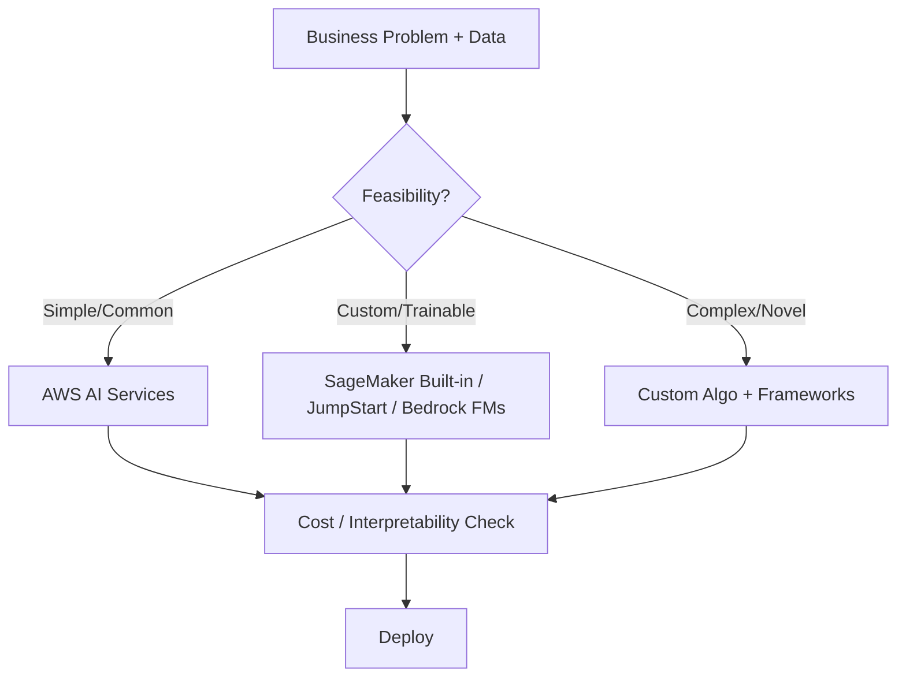

# Task 2.1: Choose a Modeling Approach – MLA-C01 Study Notes

## Overview
Selecting the right modeling approach involves matching business problems to algorithms, foundation models, or pre-built AI services based on data characteristics, complexity, interpretability needs, cost, and feasibility. Assess data availability/quality and problem type (classification, regression, clustering, forecasting, generation) first. Prefer managed AI services for common tasks; use SageMaker built-ins/JumpStart for custom needs; build custom only when necessary.

**ML Stack Layers (bottom to top):**
- Infrastructure + frameworks (EC2, containers, TensorFlow/PyTorch)
- ML services (SageMaker for build/train/deploy)
- AI services (pre-trained APIs: Rekognition, Comprehend, Bedrock, etc.)

## Core ML Algorithms & Use Cases
Know supervised vs unsupervised, and classic algorithms. Match to problem type and data.

| Algorithm | Type | Best For | Key Traits / Exam Notes |
|-----------|------|----------|-------------------------|
| Linear Regression | Supervised | Continuous prediction (price, demand) | Interpretable (weights); assumes linear relationships |
| Logistic / Multinomial Logistic Regression | Supervised | Binary / multi-class classification | Probabilities via sigmoid; good baseline |
| Decision Trees / Random Forests | Supervised | Classification & regression; tabular | High interpretability (rules); RF reduces overfitting via ensemble |
| SVM | Supervised | Classification (clear margins) | Effective in high dimensions; kernel trick for non-linear |
| K-Nearest Neighbors (KNN) | Supervised | Classification / regression | Instance-based; sensitive to scale & k |
| K-Means | Unsupervised | Clustering | Needs k; distance-based; initialize carefully |
| PCA | Unsupervised | Dimensionality reduction | Captures variance; preprocessing step |
| Latent Dirichlet Allocation (LDA) | Unsupervised | Topic modeling (text) | Probabilistic topics |
| Word2Vec | Unsupervised / Embedding | Word embeddings / semantic similarity | Captures context |
| Seq2Seq | Supervised (seq) | Translation, summarization | Encoder-decoder; often with attention |

**Gradient Descent**: Core optimizer (batch/mini-batch/stochastic). Minimizes loss by updating weights.

**Exam Trap**: Do not pick complex models (deep nets) when simple linear/logistic or trees suffice and interpretability is required.

## Deep Learning Fundamentals
- **Artificial Neuron**: Inputs × weights + bias → activation function → output.
- **Activation Functions**: ReLU (common, avoids vanishing), Sigmoid/Tanh (output layers or gates), Softmax (multi-class).
- **Weights & Bias**: Learned parameters; initialized carefully to aid convergence.
- **CNNs**: Convolutional + pooling layers. Primary use = **image classification / object detection**. Hierarchical feature extraction.
- **RNNs**: Maintain hidden state for sequences. Use cases = translation, sentiment, audio, time-series (order matters).

**Vanishing Gradient Problem** (long sequences): Gradients shrink → early layers stop learning.
- **Solution 1 – LSTM**: Gates (input/forget/output) control memory. Multiple internal networks → powerful but slower/more compute to train.
- **Solution 2 – GRU**: Simplified gates; fewer parameters → faster training, often comparable performance.

**Exam Tip**: LSTM when accuracy on long dependencies is critical and training time is available; GRU when speed/cost matters. Both are RNN variants.

## Model Interpretability
Higher interpretability = easier to explain predictions, but often trades off with raw performance (complex models capture non-linearities better).

- **Intrinsic** (inherently interpretable): Low-complexity models.
  - Linear/Logistic Regression (coefficients = importance)
  - Decision Trees (if-then rules)
- **Post-hoc** (after training, often model-agnostic):
  - Local (single prediction) vs Global (overall behavior)
  - Examples: SHAP (Shapley values), feature importance, partial dependence
  - Works on neural nets and black-box models

**SageMaker Clarify**: Implements scalable SHAP for bias detection and prediction explanations. Use during selection/evaluation for compliance or trust needs.

**Trade-off Decision**: Regulated domains (finance/healthcare) → favor intrinsic or Clarify-augmented models. Pure performance → deep models + post-hoc.

## AWS AI Services (Pre-built, API-driven)
Use these for rapid solutions to common problems—no training required (except Forecast/Personalize/Fraud Detector which accept your data). Fully managed, pay-per-use.

| Service | Core Function | Key Use Cases | Notes / Differentiator |
|---------|---------------|---------------|------------------------|
| Amazon Lex | Chatbots / Conversational | Call-center bots, FAQs, Alexa-like | NLU + dialog |
| Amazon Polly | Text-to-Speech | Audio generation, accessibility | SSML (shout/whisper); **lexicons** for custom pronunciation of acronyms/terms |
| Amazon Transcribe | Speech-to-Text (ASR) | Call/meeting transcription, subtitles | Reverse of Polly |
| Amazon Translate | Neural Machine Translation | Mass document/website translation | Real-time or batch |
| Amazon Textract | OCR + Document Understanding | Forms, handwriting, tables extraction | Feeds NLP pipelines |
| Amazon Comprehend | NLP | Sentiment, entities, key phrases, PII, topics; Comprehend Medical | Ideal for social media crawlers + OpenSearch indexing |
| Amazon Rekognition | Image/Video Analysis | Object/scene detection, faces, celebs, custom labels | Custom Labels + Ground Truth for your objects |
| Amazon Forecast | Time-series Forecasting | Demand, inventory, traffic | Bring historical data; uses RNNs etc. |
| Amazon Personalize | Recommendations | “Customers also bought”, personalized rankings | Real-time personalization |
| Amazon Fraud Detector | Fraud Detection | Payments, fake accounts | Managed ML models |
| Amazon Bedrock | Generative AI | Text/image generation, chat, summarization | Choose FMs from multiple providers; customize (fine-tune/RAG); fully managed |

**Comparisons**:
- Polly (TTS) ↔ Transcribe (STT)
- Textract (extract structure) vs Comprehend (understand meaning/sentiment)
- Rekognition (vision) vs custom CV in SageMaker
- Bedrock (FMs + tools) vs training your own LLM (expensive)

**Exam Trap**: Polly mispronounces terms → use **pronunciation lexicons**, not a different service. Sentiment on social posts → Comprehend (not Translate or plain Textract).

## SageMaker for Custom Modeling
Fully managed platform to build, train, tune, deploy. Uses **Docker containers** for code, dependencies, algorithms, and environments (not primarily for horizontal scaling—that is handled by the service). Pre-built AWS containers exist for popular frameworks and algorithms; you can bring custom images. SageMaker orchestrates lifecycle on managed infra.

**Key Capabilities for Model Selection**:
- **Built-in Algorithms**: Linear Learner, XGBoost, Image Classification, Object Detection, Seq2Seq, BlazingText (Word2Vec), LDA, K-Means, PCA, DeepAR (forecasting), etc. Choose based on data type and problem.
- **SageMaker JumpStart**: Pre-trained models, solution templates, and one-click examples (vision, NLP, tabular). Fastest path for many problems; includes foundation-model style assets.
- **Hyperparameter Tuning**: Automatic multi-job search.
- **SageMaker Neo**: Compile once, optimize for cloud or edge targets.
- **Ground Truth**: Data labeling (integrates with Rekognition Custom Labels).
- **Augmented AI (A2I)**: Human review loops for low-confidence predictions (Rekognition/Textract/custom).
- Cost selection: Prefer built-ins/JumpStart/Spot training over from-scratch; match instance types to algorithm (GPU for deep learning).

**Bedrock vs SageMaker JumpStart**: Bedrock = pure FM API + customization for genAI apps. JumpStart = broader pre-trained + classical ML templates inside SageMaker ecosystem.

## Decision Framework & Skills Application
1. **Assess Data & Complexity**: Enough labeled data? Tabular/image/text/time-series? Feasible with ML?
2. **Match Problem**:
   - Common (sentiment, OCR, translate, detect objects) → AI service
   - Need customization / your data → SageMaker built-in, JumpStart, or Bedrock FM
   - Full control / novel → Custom container + framework
3. **Constraints**: Interpretability (Clarify/trees) | Cost (built-in > custom; serverless inference) | Latency/edge (Neo)
4. **Select & Validate**: Compare metrics + business KPIs; check bias.

## Exam Tips & Traps
- **Memorize pairings**: CNN=images, RNN/LSTM/GRU=sequences, trees=interpretability, K-Means=clustering, PCA=reduction.
- Vanishing gradient → LSTM (accurate) or GRU (faster). Never “just add layers”.
- Interpretability question → intrinsic for simple, post-hoc/SHAP/Clarify for complex.
- AI service scenario (chat, speech, fraud, recommend, forecast, genAI) → pick exact match; watch for lexicon (Polly), Custom Labels (Rekognition), medical (Comprehend Medical).
- SageMaker containers = packaging environment/code, **not** the scaling mechanism.
- Cost-aware: JumpStart/built-in/Bedrock usually cheaper & faster than training large models from scratch.
- Always consider feasibility first—insufficient data → no ML or use pre-trained/transfer.
- Trap: Choosing deep learning when logistic regression or XGBoost solves it with better explainability and lower cost.

**Quick Win Pattern**: Business need → AI service if exists → else JumpStart/built-in → else custom. Layer Clarify for trust. Total focus: match tool to problem constraints.