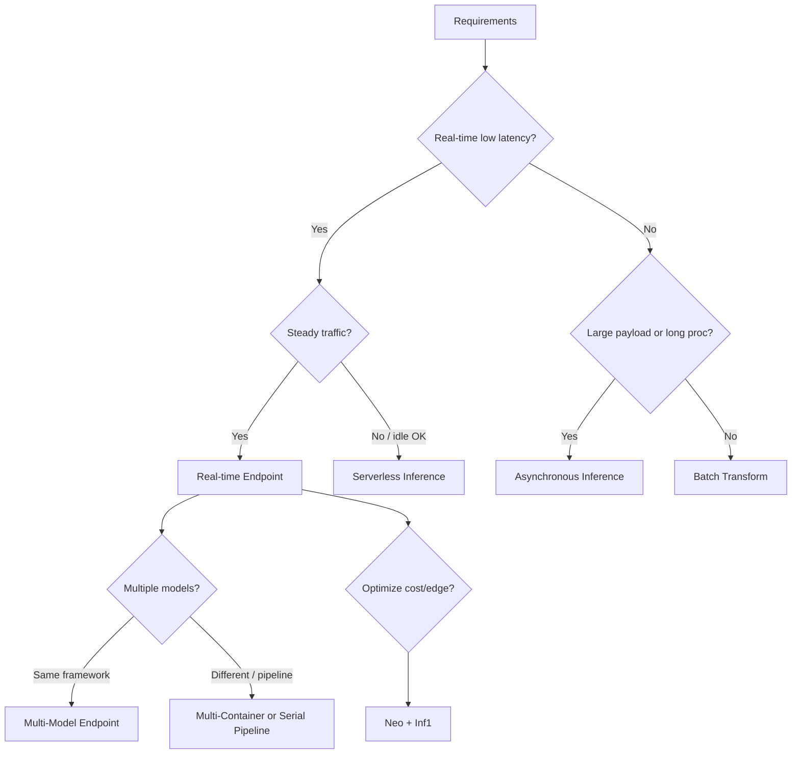

# Study Notes: MLA-C01 Task 3.1 – Select Deployment Infrastructure Based on Existing Architecture and Requirements

## Overview
Task 3.1 focuses on choosing the right infrastructure to host and serve ML models after training. Key decisions balance **latency, cost, throughput, payload size, traffic patterns**, and existing architecture (containers, orchestrators, compute). SageMaker is the primary service, but alternatives (ECS/EKS, Lambda, EMR, Batch) appear when requirements demand them.

Core exam concepts: inference modes, endpoint types, multi-model/multi-container options, compute selection (CPU/GPU/Inferentia), containers, edge optimization (Neo), and basic MLOps deployment practices (versioning, rollback, A/B).

## 1. Inference Modes & SageMaker Hosting Options
After training, a model (framework + config + artifacts) is deployed for **inference** (generating predictions on new data).

| Option | Use Case | Latency | Payload | Traffic Pattern | Cold Starts | Key Limits / Notes |
|--------|----------|---------|---------|-----------------|-------------|--------------------|
| **Real-time Endpoint** | Persistent, low-latency, one prediction at a time | Milliseconds | Small–medium | Steady or spiky | No | Always-on instances; auto-scaling |
| **Serverless Inference** | Idle periods between spurts; cost-sensitive | Seconds (cold start) | Small–medium | Intermittent | Yes (tolerable) | No instance management; scales to zero |
| **Asynchronous Inference** | Large payloads, long processing, near-real-time | Seconds–minutes | Up to 1 GB | Queued | Minimal | SNS/SQS notifications; good for large inputs |
| **Batch Transform** | Entire dataset offline | Minutes–hours | Very large | One-shot / scheduled | N/A | No endpoint; processes S3 input → S3 output |

**Exam Tip**: Match the option to the requirement exactly.  
- “Idle periods + tolerate cold starts” → Serverless.  
- “1 GB payload + long processing” → Asynchronous.  
- “Entire dataset / offline” → Batch Transform.  
- “Persistent real-time, one-at-a-time” → Real-time endpoint.

**SageMaker Inference Recommender** automates load testing and instance-type recommendations to reduce deployment time and right-size cost/performance.

## 2. Multi-Model, Multi-Container & Pipeline Deployments
- **Multi-Model Endpoints (MME)**: Host many models (same framework) behind one endpoint. Models load dynamically from S3. Ideal for cost savings when models share similar resource needs.
- **Multi-Container Endpoints**: Different frameworks/containers behind one endpoint. Useful when models need distinct runtimes.
- **Serial Inference Pipelines**: Chain pre-processing → model → post-processing containers on the **same** instance. Lower latency than separate calls; fully managed.

**Comparison**:
- MME = many similar models, shared container → highest density/cost efficiency.
- Multi-container = heterogeneous frameworks.
- Serial pipeline = sequential steps with shared compute.

**A/B Testing / Variants**: Deploy multiple model variants behind a **single** SageMaker endpoint and assign traffic percentages (e.g., 90/10). SageMaker handles load balancing. Prefer this over multiple API Gateway endpoints (higher operational overhead).

**Exam Trap**: Choosing separate endpoints + API Gateway for A/B is possible but more work; single endpoint with variants is the low-effort, preferred answer.

## 3. Compute Selection (Training vs Inference)
Distinguish **training** (heavy, parallelizable) from **inference** (latency-sensitive, often lighter).

- **CPU**: General-purpose, cheaper; sufficient for scikit-learn, XGBoost, lighter models.
- **GPU**: Parallel matrix ops; deep learning training/inference (images, NLP).
- **AWS Inferentia (Inf1) + SageMaker Neo**: Custom chip for high-performance, low-cost inference. Compile once with Neo → run on Inf1 (or edge).
- **Trainium / other accelerators**: Appear in advanced scenarios; focus on GPU vs Inferentia for exam.

**Scaling**:
- Vertical: larger instance (more cores/GPU). Simple but limited.
- Horizontal: more instances. Requires framework support for distributed training (data/model parallelism). Increase mini-batch size and often learning rate when scaling.

**Right-sizing tip**: Use Inference Recommender or load tests. For MXNet/TensorFlow/PyTorch inference acceleration + cost optimization → Inferentia + Neo.

**Environments**:
- Test/dev: smaller instances, spot, serverless.
- Prod: right-sized real-time or auto-scaling, often on-demand or mixed.

## 4. Containers & Custom Code
SageMaker uses Docker containers for training and inference.
- **AWS-provided**: Pre-built for TensorFlow, PyTorch, scikit-learn, MXNet, XGBoost, etc.
- **Custom**: Bring your own (BYOC) when you need specialized libraries or code. Must follow SageMaker container contract (entry points, model packing).

**Frameworks to know** (exam expects recognition):
- Real frameworks: TensorFlow, PyTorch, MXNet, scikit-learn.
- Not pure frameworks (high-level APIs): Keras, Gluon.

## 5. Edge & Optimization
**SageMaker Neo**: Compile model once → optimize for target hardware (cloud CPUs/GPUs, edge devices, Inferentia). Reduces footprint and latency; enables “train in cloud, run anywhere.”

Use cases: IoT, mobile, cost-sensitive real-time inference on Inf1.

## 6. Orchestration & Deployment Targets
**Orchestrators**:
- **SageMaker Pipelines**: Native MLOps, CI/CD, model registry integration.
- **Apache Airflow** (MWAA): General-purpose when existing Airflow estate or complex non-ML dependencies exist.

**Deployment Targets** (choose based on architecture):
| Target | Best For | Pros | Cons |
|--------|----------|------|------|
| SageMaker Endpoints | Managed ML inference | Auto-scaling, multi-model, monitoring, A/B | SageMaker-centric |
| Amazon EKS / Kubernetes | Existing K8s estate, complex microservices | Full control, multi-cloud patterns | Operational overhead |
| Amazon ECS | Containerized apps, simpler than K8s | Managed orchestration | Less ML-specific features |
| AWS Lambda | Lightweight, sporadic inference | Serverless, pay-per-use | Cold starts, size/time limits, no GPU |
| AWS Batch | Large batch jobs | Managed queues, Spot/Fargate/EC2 | Not real-time |

**AWS Batch components**: Compute environments (Fargate or EC2 ± GPU, on-demand/Spot), job queues (priority), job definitions.

## 7. Integration with Other Services
- **Amazon EMR + Spark**: Use Spark MLlib for in-cluster training/inference on big data, **or** SageMaker Spark Library to call SageMaker algorithms (K-Means, PCA, XGBoost) and host endpoints **outside** the EMR cluster (avoids oversizing cluster).
- **EMR Studio**: Managed Jupyter for interactive Spark/ML work.
- Prefer SageMaker Spark Library when you want managed endpoints and do not want to size EMR for peak training.

## 8. MLOps, Versioning & Guardrails (Deployment Best Practices)
- **SageMaker Model Registry**: Version models, approve for deployment, trigger CI/CD.
- **Deployment Guardrails**: Blue/green or canary traffic shifting with automatic rollback on CloudWatch alarms (latency, error rate).
- **Versioning & Rollback**: Always version models and endpoints; keep previous variant for instant rollback.
- CI/CD: SageMaker supports third-party Git repos + Pipelines for automated build/train/deploy.

**Exam Tip**: When asked about safe production updates → deployment guardrails + Model Registry. For A/B → single endpoint variants.

## 9. Performance / Cost / Latency Trade-offs (Decision Framework)
1. Traffic pattern? Steady → Real-time; spiky/idle → Serverless; large/queued → Async; offline → Batch.
2. Payload size / processing time? > few MB or long-running → Async or Batch.
3. Cost sensitivity? Prefer Serverless, Spot, Inferentia, multi-model.
4. Latency SLA? Sub-100 ms → Real-time on appropriate instance (GPU/Inf1).
5. Existing architecture? Heavy K8s → EKS; pure serverless → Lambda (if fits); big-data Spark → EMR + SageMaker hybrid.
6. Edge? Neo compilation.
7. Multiple models/frameworks? MME or multi-container / serial pipeline.

**Common Traps**:
- Using real-time endpoints for pure batch workloads (unnecessary cost).
- Ignoring cold starts when “tolerate cold starts” is stated.
- Choosing multiple independent endpoints for A/B instead of traffic-splitting variants.
- Oversizing EMR clusters instead of offloading to SageMaker endpoints.
- Forgetting Neo when Inferentia or edge is mentioned.
- Treating Keras/Gluon as full frameworks equal to TF/PyTorch.

## Quick Decision Mermaid

## Final Exam Reminders
- Always justify choice with latency, cost, payload, and traffic.
- SageMaker is default unless architecture forces ECS/EKS/Lambda/Batch/EMR.
- Containers + Neo + Inferentia are frequent correct answers for optimization.
- Versioning, Model Registry, and guardrails cover “best practices / rollback.”
- Practice matching the four inference options to short scenario descriptions—they appear frequently.

These notes cover all knowledge and skills listed for Task 3.1 at the associate level. Focus on decision tables and the exact wording of requirements in questions. Good luck!