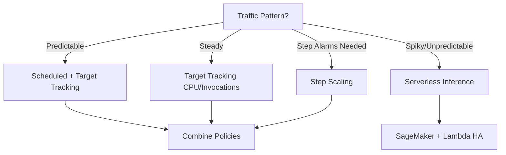
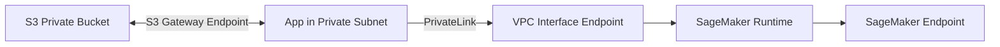

# MLA-C01 Study Notes: Task 3.2 – Create and Script Infrastructure Based on Existing Architecture and Requirements

**Domain 3 Focus**: Build maintainable, scalable, cost-effective ML infrastructure using IaC, containers, auto-scaling, and secure networking. Aligns with SageMaker hosting, endpoints, and AWS compute services. ~Exam weight: Core for deployment questions.

## 1. On-Demand vs. Provisioned Resources
**Key Concept**: Choose based on traffic predictability and cost.

| Aspect              | On-Demand (e.g., Serverless Inference) | Provisioned (e.g., Real-time Endpoints) |
|---------------------|---------------------------------------|-----------------------------------------|
| **Billing**        | Pay-per-use (invocations + duration) | Per-instance hour (even idle)          |
| **Scaling**        | Fully managed by AWS (auto)          | You define policies                    |
| **Cold Starts**    | Possible                             | None (warm instances)                  |
| **Use Case**       | Unpredictable/spiky traffic, low duty cycle | Steady/high throughput, low latency   |
| **Integrations**   | Lambda for HA/fault tolerance        | Multi-AZ, custom instances             |

**Exam Tip**: Serverless Inference = SageMaker manages scaling + Lambda backend. Use when "unpredictable traffic" or "no scaling policies wanted". Trap: Inferentia/G5 accelerate *provisioned* instances but do **not** auto-handle surges alone (can fail under load).

**Cost Optimization**: Managed Spot Instances for *training* (not inference). Dynamically add Spot via EC2 or SageMaker for non-critical workloads. Lambda behind endpoints for bursty post-processing.

## 2. SageMaker Endpoint Auto-Scaling Policies
SageMaker Hosting offers ~100 instance types. Auto-scale in/out (or up/down via variants).

### Three Scaling Policies (Combine for Resilience)
1. **Target Tracking** (Recommended default): Set CloudWatch metric target (e.g., CPU 70%, InvocationsPerInstance). SageMaker adjusts instances automatically.
2. **Step Scaling**: You create/manage CloudWatch alarms → triggers EC2 Auto Scaling steps (add/remove N instances on breach).
3. **Scheduled Scaling**: Recurring cron-like schedule for anticipated demand (e.g., scale out 9 AM–5 PM).

**Scale Up vs. Scale Out**:
- **Out**: Add instances (horizontal).
- **Up**: Larger/more powerful instance (vertical) → Create *new production variant* + shift traffic (blue/green). Accelerators (G5, Inf1/Inferentia) handle higher RPS on single host.

**Multi-Model Endpoints (MME)**: Auto-scale model replicas based on traffic. Ideal for many models on shared infra.

**Metrics to Choose** (CloudWatch – build custom dashboards):
- ModelLatency
- CPUUtilization
- InvocationsPerInstance
- (Optional) ExplanationsPerInstance / DiskUtilization

**Mermaid: Auto-Scaling Decision Flow**

**Exam Tips/Traps**:
- Always prefer **Target Tracking** unless alarms/schedules specified.
- "Scale existing endpoint up" = new variant + traffic shift (not ModifyEndpointConfig alone).
- Inferentia ≠ auto-scaling solution (cost/perf only). Failures possible on surge.
- Monitor via CloudWatch; custom metrics possible but stick to built-ins for exam.

## 3. Infrastructure as Code (IaC) Options & Automation
Automate provisioning for repeatability, version control, and stack communication. Goal: Maintainable ML solutions (notebooks → train → deploy).

| Feature                  | AWS CloudFormation                  | AWS CDK                              | AWS SAM                             |
|--------------------------|-------------------------------------|--------------------------------------|-------------------------------------|
| **Language**            | JSON/YAML                          | Python/TS/Java/etc. (constructs)    | YAML (serverless focus)            |
| **Abstraction**         | Low (explicit resources)           | High (reusable constructs)          | Medium (Lambda/Step Functions)     |
| **Use Case**            | Complex stacks, cross-stack refs   | App-like code, rapid iteration      | Serverless pipelines (Lambda + SF + DynamoDB) |
| **CI/CD Integration**   | Native + CodePipeline              | Synth → CFN                         | Package & deploy                   |
| **Version Control**     | Commit templates to CodeCommit/S3/GitHub | Same + code reviews                | Same                               |
| **Tradeoff**            | Verbose but precise                | Faster dev, learning curve          | Limited to serverless              |

**Best Practices**:
- **Stacks Communication**: Exports/Imports or nested stacks in CFN/CDK. Pass endpoint ARNs, VPC IDs between training/deploy stacks.
- **CI/CD**: Commit IaC → trigger pipeline (CodePipeline) on new version. Test → deploy.
- **SageMaker SDK**: `sagemaker.Session()`, `Model.deploy()`, `Predictor` for hosting. Combine with CDK for full infra.
- Optimize runtime: Efficient data ingestion/transformation code; Canvas ready-to-use models (Rekognition/Textract/Comprehend powered) or BYOM.

**Exam Tip**: CFN for pure infra definitions; CDK when "code-first" or multi-language. SAM only for serverless. Trap: Forgetting cross-stack references breaks communication.

## 4. Containerization Concepts & AWS Services
SageMaker is container-native (training/inference images). BYOC = Bring Your Own Container.

| Service     | Purpose                              | SageMaker Fit                          | When to Choose                     |
|-------------|--------------------------------------|----------------------------------------|------------------------------------|
| **Amazon ECR** | Store/version Docker images         | Push custom images for training/hosting | Always (private registry)         |
| **Amazon ECS** | Orchestrate containers (tasks/services) | Simpler ML serving, Fargate option    | Lightweight, no K8s needed        |
| **Amazon EKS** | Managed Kubernetes                   | Complex multi-container, custom schedulers | Existing K8s skills, advanced networking |
| **SageMaker BYOC** | Custom images on managed endpoints | Full control over framework/runtime   | Non-standard libs or optimized code |

**Workflow**: Build image → Push ECR → Reference in SageMaker Estimator/Model (or ECS/EKS task). Maintain via CI (rebuild on code change).

**Exam Tip**: SageMaker prefers its containers; BYOC for "custom algorithms". ECS simpler than EKS. Trap: Public Docker Hub = security risk → always ECR + VPC.

## 5. Configuring SageMaker Endpoints in VPC (Security Best Practice)
Keep traffic private (no internet).

**Architecture**:
- App/Notebook in private subnet → **VPC Interface Endpoint** (PrivateLink) → SageMaker API/Runtime → Endpoint.
- Each endpoint = ENI(s) with private IPs in your subnets.
- No IGW/NAT/VPN/Direct Connect required.
- Also apply to Studio Classic / Notebook instances.

**CloudFormation/CDK**: Define `AWS::EC2::VPCEndpoint` for `com.amazonaws.region.sagemaker.api` + `runtime` + S3 gateway endpoint.

**Exam Question Pattern** (from transcript):
- **Correct**: Host notebooks in private subnet + VPC endpoints for SageMaker + S3 (private bucket access).
- **Incorrect Trap**: Outbound NACL blocking public internet → Breaks SageMaker control-plane APIs (needed for create/train/deploy). (NACLs covered deeper in Domain 4.)

**Mermaid: Secure VPC Connection**

## 6. Putting It Together: Best Practices Checklist
- **Scalable**: Auto-scaling policies + Serverless/MME + Spot where possible.
- **Maintainable**: IaC (CFN/CDK) + versioned containers (ECR) + CI/CD + SageMaker SDK.
- **Cost-Effective**: Target tracking metrics, Spot training, Serverless inference, right-size instances.
- **Secure**: VPC endpoints everywhere; private subnets for notebooks/endpoints.
- Deploy flow: SDK/Model.deploy() or IaC → EndpointConfig → Endpoint (with variants for A/B or scale-up).

**Final Exam Traps**:
- Mixing scale-up (variant) vs scale-out (instances).
- Choosing Inferentia for pure scaling (no).
- NACL over VPC endpoints.
- Forgetting metrics = InvocationsPerInstance / Latency / CPU.
- IaC without cross-stack or versioning.

**Quick Memory Aid**: "TSSC" – Target/Step/Scheduled/Combine scaling; "CFN/CDK/SAM" for IaC; "ECR+PrivateLink" for containers & security.
