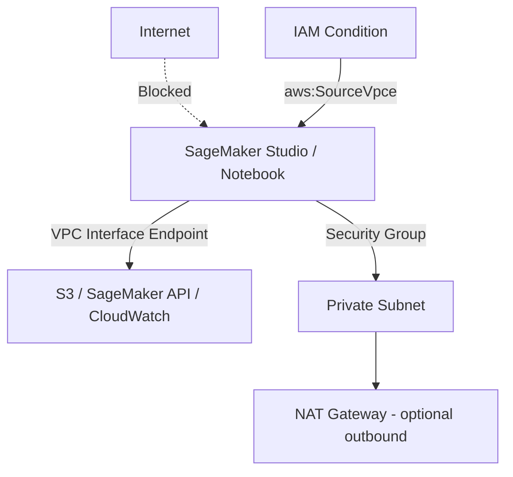

# MLA-C01 Study Notes: Task 4.3 – Secure AWS Resources

## Overview
Security is a foundational design consideration for any ML architecture on AWS. You must control how people, pipelines, applications, notebooks, and models access AWS services and data. Core exam themes include the Shared Responsibility Model, AWS account fundamentals, least-privilege IAM, network isolation of SageMaker resources, encryption (at rest & in transit), logging/auditing, and CI/CD security hygiene. Always start with “no permissions” and explicitly grant only what is required.

## 1. IAM Foundations for ML Workloads
IAM identities (users, groups, roles) begin with **zero permissions**. Permissions are added via policies.

| Policy Type | Attached To | Common ML Use | Key Difference |
|-------------|-------------|----------------|----------------|
| Identity-based | User / Group / Role | SageMaker execution role, data-scientist group | “Who can do what” |
| Resource-based | Resource (S3 bucket, KMS key, etc.) | S3 bucket policy restricting Studio domain | “Who can access this resource” |
| Bucket policy | S3 bucket | Limit Studio domain or VPC endpoint access | Special resource-based policy |

**SageMaker Execution Role**  
SageMaker assumes an IAM role to call other AWS services (S3, ECR, CloudWatch, etc.). You must attach a least-privilege policy that allows only the required actions, resources, and condition keys.  

**SageMaker Role Manager**  
GUI/tool that generates tailored IAM roles for common ML personas (data scientist, MLOps engineer) and enforces least privilege automatically—preferred over hand-crafted policies for the exam.

**Exam Tip**  
Know when to choose a **role** (temporary credentials, service-to-service) vs a **user** (long-term human access) vs a **group** (permission sets for many users). Combine them: put users in groups, attach policies to groups, and let applications assume roles.

**Trap**  
Root-user credentials must never be used for daily work. Enable MFA on the root user and lock the credentials away. Apply MFA Delete on versioned S3 buckets that store model artifacts.

## 2. Network Isolation of SageMaker Resources
SageMaker Studio, notebook instances, training jobs, and endpoints can run inside a **private VPC** with **no direct internet access**.

**Key Controls**
- Launch Studio domain or notebook instance inside a VPC.
- Disable “Direct Internet Access”.
- Create Interface VPC Endpoints for:
  - `com.amazonaws.region.sagemaker.api`
  - `com.amazonaws.region.sagemaker.runtime`
  - `com.amazonaws.region.s3` (Gateway endpoint)
  - CloudWatch, ECR, KMS, etc.
- Attach **endpoint policies** and **IAM condition keys** (`aws:SourceVpce`, `aws:SourceIp`) so that only traffic originating from the approved VPC endpoints can reach SageMaker or S3.
- Security groups act as virtual firewalls; network ACLs provide subnet-level stateless filtering.

**Comparison**  
- **VPC Endpoint** vs **NAT Gateway**: Endpoints keep traffic inside the AWS network (no internet, lower cost, higher security). NAT is required only when a service lacks an endpoint or you need true internet egress.
- **AWS Network Firewall** / **Gateway Load Balancer** can be inserted for deep packet inspection and FQDN filtering of outbound traffic.

**Exam Tip**  
A common question pattern: “How do you ensure Studio notebooks never leave the AWS backbone?” → VPC + Interface Endpoints + disable direct internet + IAM condition on `aws:SourceVpce`.

## 3. Least-Privilege Access to ML Artifacts
Apply least privilege at every layer of the ML lifecycle (data → training → model registry → endpoint).

- **S3**: Bucket policies + prefix-level conditions; enable versioning + MFA Delete for model artifacts.
- **EFS / EBS**: Encrypt with customer-managed KMS keys; Studio uses EFS for home directories and EBS for the underlying instance.
- **SageMaker Model Registry**: IAM permissions control who can register, approve, or deploy model packages.
- **Notebook root access**: Enabled by default (data scientists need to install packages). Mitigate by:
  - Placing notebooks in a VPC that contains sensitive data.
  - Using IAM policies that restrict which users can open which notebook instances.
  - Prefer Studio’s per-user container isolation over shared classic notebooks.

**CI/CD Pipeline Security**
- Use CodePipeline/CodeBuild roles with minimal permissions.
- Store secrets in Secrets Manager or SSM Parameter Store (never in plaintext environment variables).
- Rotate credentials; enable MFA on CodeCommit repositories.
- Scan container images in ECR before deployment.

## 4. Data Protection – At Rest & In Transit
| Location | Default Encryption | Customer Control | Exam Note |
|----------|--------------------|------------------|-----------|
| S3 (model artifacts, data) | SSE-S3 | SSE-KMS (CMK) | Enable versioning + MFA Delete |
| Studio EFS | AWS-managed | CMK via KMS | Encrypt home directories |
| Notebook EBS | AWS-managed | CMK | Specify KMS key at launch |
| Training inter-node traffic | None | Enable `EnableInterContainerTrafficEncryption` | Uses TLS tunnel inside VPC |
| API calls | TLS 1.2+ / SigV4 | Always on | HTTPS only |

**In-Transit Patterns**
- Public internet → HTTPS + SigV4.
- VPN / Direct Connect / VPC peering → encrypt at application layer or use IPsec.
- Distributed training → SageMaker can automatically encrypt traffic between nodes when a private VPC is configured.

**Trap**  
KMS key policies are resource-based; you must grant both the SageMaker execution role **and** the KMS key policy permission to use the key, otherwise encryption fails.

## 5. Monitoring, Auditing & Compliance
- **CloudTrail**: API-level audit of every SageMaker, IAM, S3 call. Deliver logs to a dedicated, encrypted, MFA-protected S3 bucket.
- **CloudWatch Logs & Metrics**: Notebook lifecycle, training job status, endpoint invocations. Install CloudWatch agent for OS-level SSH login detection.
- **GuardDuty**: Threat detection on VPC Flow Logs, CloudTrail, DNS.
- **AWS Config / Security Hub**: Continuous compliance checks.
- **AWS Artifact**: Download third-party audit reports (FedRAMP, HIPAA, SOC, etc.). SageMaker is in-scope for many compliance programs.
- **Well-Architected Framework – Security Pillar**: Review regularly; use the ML Lens for ML-specific guidance.

**Automated Remediation Example** (exam-style)
Detect SSH login → CloudWatch Logs subscription → Lambda tags instance `FOR_DELETION` → EventBridge rule → second Lambda terminates instance. Demonstrates defense-in-depth even though SageMaker notebooks themselves should avoid long-lived SSH.

## 6. Troubleshooting Security Issues
1. **AccessDenied** on SageMaker job → check execution-role trust policy and attached permissions; verify KMS key policy.
2. Notebook cannot reach S3 → confirm VPC endpoint, security-group egress, and bucket policy conditions.
3. Studio domain creation fails → ensure service-linked roles and subnet route tables are correct.
4. Unexpected root-user activity → CloudTrail + GuardDuty; rotate keys immediately.

## Exam Tips & Traps Summary
- **Always** prefer IAM roles over long-term access keys.
- SageMaker Role Manager is the fastest path to least privilege—mention it.
- Disable direct internet access + VPC endpoints = gold-standard network isolation answer.
- Encryption questions almost always expect a customer-managed KMS key for sensitive ML data.
- Versioning + MFA Delete on the model-artifact bucket is a frequent “best practice” choice.
- Distinguish classic Notebook Instances (root access on by default) from Studio (container isolation).
- Shared Responsibility: AWS secures the infrastructure; you secure data, IAM, network config, and encryption keys.
- CI/CD: never embed credentials; use IAM roles for service-to-service calls and Secrets Manager for third-party tokens.
- Compliance evidence lives in AWS Artifact—do not invent other sources.

## Quick Reference Checklist
- [ ] Root user locked + MFA
- [ ] Least-privilege SageMaker execution roles (Role Manager)
- [ ] Studio/Notebooks in private VPC, no direct internet
- [ ] Interface endpoints + endpoint policies
- [ ] KMS CMKs for S3, EFS, EBS, inter-node traffic
- [ ] S3 versioning + MFA Delete
- [ ] CloudTrail + CloudWatch + GuardDuty enabled
- [ ] Model Registry + CodeCommit protected by MFA
- [ ] Network Firewall / NAT only when absolutely required

Master these controls and you will be able to design, implement, and troubleshoot secure ML environments that satisfy both the exam and real-world production requirements.
