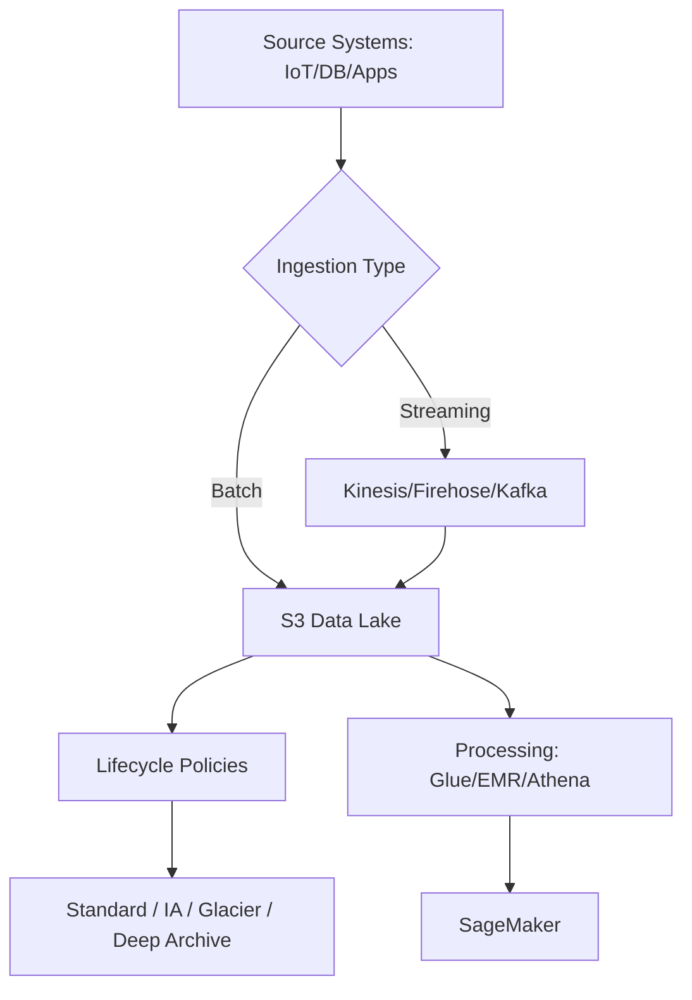

# Task 1.1 – Ingest and Store Data

## Overview
Task 1.1 focuses on the early ML engineering lifecycle stages: collecting, storing, and initially ingesting data for downstream processing/training. Key goals are selecting appropriate formats, storage services, and ingestion paths based on data structure (structured/semi-structured/unstructured), access patterns, volume, velocity (batch vs. streaming), cost, performance, and scalability. Data originates from source systems (DBs, IoT, apps); MLEs consume but may not control them. Emphasize centralized, highly available repositories that integrate with SageMaker, Glue, EMR, and Athena.

Core questions to ask:
- What is the data format and structure?
- Batch or streaming?
- Access patterns (sequential, random, SQL, real-time)?
- Need to merge sources?
- Cost/performance/scalability tradeoffs?

## Data Formats
Choose formats based on access patterns, compression needs, schema evolution, and query efficiency. Columnar formats excel for analytics; row-based for transactional.

| Format       | Type          | Strengths                              | Weaknesses                     | Best For                     | Compression/Splittable |
|--------------|---------------|----------------------------------------|--------------------------------|------------------------------|------------------------|
| CSV         | Row-based    | Simple, human-readable, universal     | No schema, slow scans, large  | Simple exports, small data  | GZIP/BZIP2; limited   |
| JSON        | Semi-struct. | Flexible schema, nested data          | Verbose, slower parsing       | APIs, logs, flexible data   | GZIP; yes             |
| Apache Parquet | Columnar   | Efficient compression, predicate pushdown, schema evolution | Write overhead                | Analytics, S3 + Athena/EMR  | Excellent; yes        |
| Apache ORC  | Columnar     | High compression, fast reads (Hive)   | Less ecosystem than Parquet   | Hadoop/Hive workloads       | Excellent; yes        |
| Apache Avro | Row-based    | Compact, schema evolution, binary     | Not ideal for columnar queries| Streaming, Kafka serialization | Good; yes            |
| RecordIO    | Binary       | SageMaker-optimized (Pipe mode)       | Proprietary                   | SageMaker training input    | N/A                   |

**Tips**: Prefer Parquet/ORC for S3 data lakes (faster queries, lower cost via S3 Select). Use splittable + compressed formats for parallel processing. Validated formats enforce schema; non-validated are flexible but error-prone. RecordIO accelerates SageMaker Pipe mode (faster start, less disk, lower cost).

## AWS Storage Options and Tradeoffs
Select based on durability, availability, access latency, integration, and cost. S3 is the default for ML data lakes (unprocessed/raw data).

| Service              | Type          | Use Cases                              | Tradeoffs                          | ML Integration                  | Lifecycle/Cost Notes |
|----------------------|---------------|----------------------------------------|------------------------------------|---------------------------------|----------------------|
| Amazon S3           | Object       | Data lakes, unprocessed/raw, centralized HA repo | Eventual consistency (rare); no native FS | Glue, EMR, SageMaker, Athena, DMS | Classes: Standard (immediate), IA, Glacier (hours), Deep Archive (12h); lifecycle policies essential |
| Amazon EFS          | File (NFS)   | Shared FS, scalable concurrent access | Higher cost than S3; throughput limits | SageMaker training jobs        | Pay for provisioned; good for multi-AZ |
| Amazon FSx (NetApp ONTAP) | File     | High-perf enterprise FS, multiprotocol | Costly; managed complexity        | Specialized high-IOPS workloads | Performance tiers   |
| Amazon EBS          | Block        | EC2-attached volumes for processing   | Instance-bound; not shared easily | Training instances             | Provisioned IOPS (io2) for high perf; EBS-optimized instances separate traffic |
| Amazon RDS/DynamoDB | Relational/NoSQL | Structured source extraction         | Not primary ML store              | Query then export to S3        | DynamoDB: PartiQL limited SQL |

**Comparisons**:
- **S3 vs EFS**: S3 for unstructured/object lakes + pipeline integration (Glue/EMR/SageMaker); EFS for POSIX file sharing/scalability. Prefer S3 for "centralized highly available repository" + "pipeline" keywords.
- **S3 vs Redshift/DynamoDB**: S3 + Athena for ad-hoc SQL on raw data (no ETL). Redshift for warehouse SQL but overkill/costly for unprocessed. DynamoDB lacks easy SQL without PartiQL.
- **One-Zone classes**: Avoid for HA (single AZ); use multi-AZ Standard.

**Cost-effective pattern**: S3 Standard for hot processed data (immediate access, 6 months) → lifecycle to Glacier; unprocessed → Glacier Deep Archive (12h access, 6 years).

## Extracting Data from Storage
- **S3**: S3 Select (SQL filter on CSV/JSON/Parquet; supports GZIP/BZIP2 + SSE) reduces data transfer/cost/latency. Transfer Acceleration for fast global uploads/downloads.
- **EBS**: Match volume size/IOPS to workload; use Provisioned IOPS + EBS-optimized instances (separates network/EBS traffic).
- **EFS/RDS/DynamoDB**: Mount/export/query then stage to S3. Use AWS DMS for DB → S3 (full load + CDC; default CSV, prefer Parquet for compact/fast queries).
- **SageMaker Pipe mode**: Streams from S3 (faster than File mode).

## Streaming Data Sources
For real-time/near-real-time:
- **Amazon Kinesis Data Streams / Data Firehose**: Ingest high-volume streams. Firehose → S3/Redshift/OpenSearch (auto-scales; stages to S3 then COPY for Redshift).
- **Amazon Managed Service for Apache Flink**: Real-time SQL/processing + transformations (use with Lambda for GZIP→JSON, enrich/filter). RANDOM_CUT_FOREST for anomaly detection (lower ops than SageMaker RCF).
- **Amazon MSK (Kafka)**: Managed Kafka for compatible apps.
- **Integrations**: Kinesis → Redshift streaming ingestion (near real-time analytics). DMS → S3 (Parquet). Avoid Firehose direct to Redshift streaming (unsupported); Firehose stages via S3.

**Trap**: Athena is not real-time (batch on S3). KCL is for Kinesis Data Streams consumers only (not Firehose).

## Ingesting into SageMaker
- **Data Wrangler (in Canvas or Studio)**: Import, engineer features, visualize → export to S3 or Feature Store.
- **Feature Store**: Ingest via SDK, Data Wrangler, or EMR Spark connector (batch). Create feature groups; join across groups in Canvas → S3. Supports online/offline stores.
- Records added based on use case/storage config. Prefer for reusable, consistent features.

## Merging Data from Multiple Sources
- Programming (Pandas/Spark) for small/custom.
- **AWS Glue** (ETL jobs, Python/Spark): Cleansing, aggregation, normalization, schema evolution; streaming ETL for CSV→Parquet.
- **Amazon EMR + Spark**: Distributed processing, HDFS temp storage, MapReduce; partitioning/caching/parallelism for large volumes.
- **Step Functions**: Orchestrate workflows.

Pattern: Multi-source → Glue/EMR → S3 (Parquet) → Feature Store/SageMaker.

## Troubleshooting Capacity, Scalability & Decisions
- **Issues**: Throughput limits (EBS network contention → use optimized instances); Firehose buffering; EMR cluster sizing; S3 request rates.
- **Solutions**: Scale with auto-scaling (Firehose/Flink); partition data; choose Provisioned IOPS; monitor via CloudWatch.
- **Initial decisions**: Cost (lifecycle + classes), performance (columnar + Select + Pipe), structure (object vs file vs block). Reduce ops: Prefer Glue over EMR+Data Pipeline; Flink over custom SageMaker for streaming anomalies.
- **Redshift near real-time**: Kinesis Data Streams + streaming ingestion (not Spectrum—Spectrum queries S3 in-place; not for loading). Firehose → S3 → COPY works but higher latency.

## Exam Tips and Traps
- **Keywords**: "Unprocessed/centralized/HA/pipeline" → S3 data lake. "Immediate access" → Standard (not One-Zone/Glacier). "Real-time insights" → Flink/Kinesis (not Athena). "Reduce ops/cost" → Glue/Flink managed > EMR/SageMaker custom. "Near real-time Redshift" → Kinesis streaming ingestion.
- **Traps**: 
  - Firehose destinations limited (no direct Redshift streaming load; stages via S3).
  - S3 Select formats only (CSV/JSON/Parquet).
  - Prefer Parquet over CSV post-DMS for queries/storage.
  - EFS not ideal for pure lakes (use S3).
  - KCL ≠ Firehose consumer.
  - Spectrum ≠ data mover.
- **Remember**: Always stage raw to S3 first for ML pipelines. Use lifecycle for cost. Columnar + compression for scale. Test integrations (SageMaker Pipe, Feature Store Spark connector).
- Practice: Match service to velocity (streaming vs batch) and query needs (Athena vs Redshift vs Flink SQL).

These notes cover all knowledge/skills for Task 1.1 at associate level. Focus on decision frameworks over deep implementation. Total focus areas align directly with exam scenarios on storage choice, format optimization, streaming paths, and SageMaker ingestion.