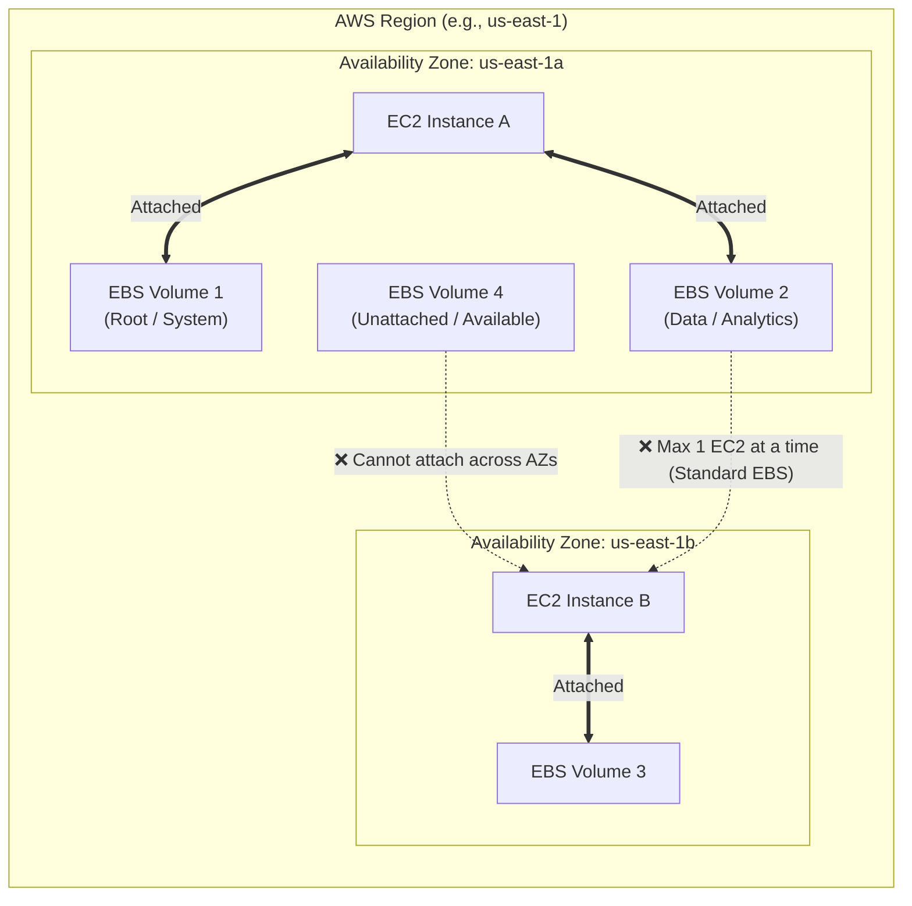
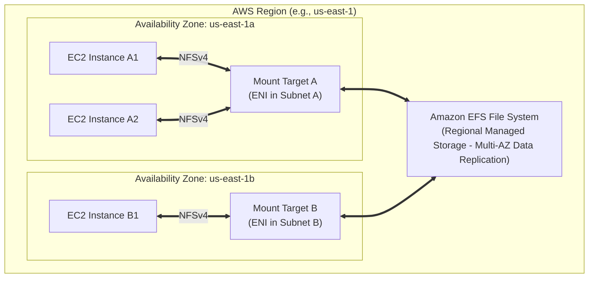
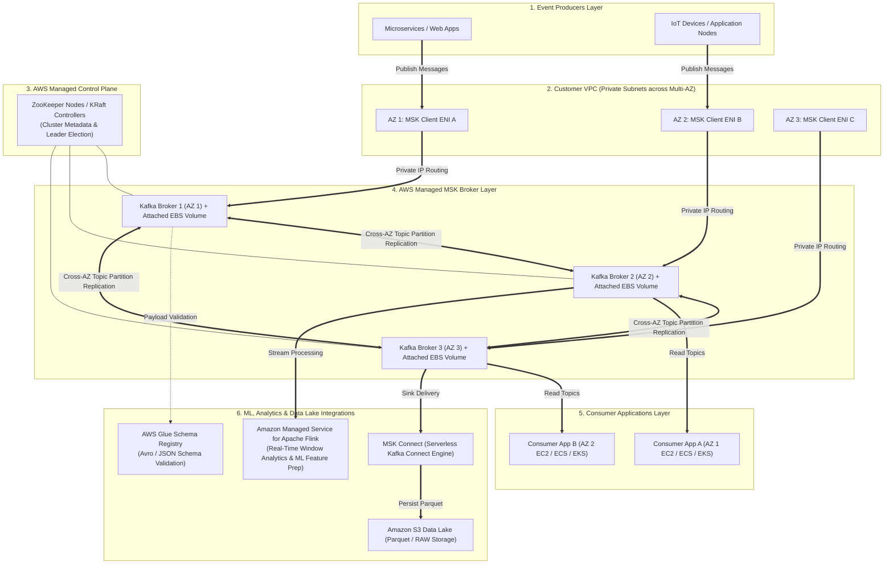

# 1 - Data Ingestion and Storage -  Amazon EC2 Instance Storage

## Amazon Elastic Block Store (EBS) Volume

### EBS properties
- Network drive attached to instance
- Persist data
- 1 EBS to 1 EC2 at 1 time (But 1 EC2 can have >1 EBS)
- Bound to 1 special AZ
- Can be detached from an EC2 to attach to another one
- Like **"USB stick"** for network

- Have provisioned capacity in GBs and IOPS (Input/Output Operations Per Second)

### EBS - Delete on Termination attribute

- Determines whether an attached Amazon EBS volume is automatically deleted or preserved when its associated EC2 instance is **terminated**.

| Volume Role | Default Setting | What Happens on Instance Termination? |
| --- | --- | --- |
| **Root Volume** (`/dev/sda1` or `/dev/xvda`) | **`True`** (Delete) | The volume is **automatically deleted** along with the instance. |
| **Additional Data Volumes** (`/dev/sdb`, `/dev/sdc`, etc.) | **`False`** (Preserve) | The volume **persists**. It detaches from the terminated instance and remains in the `available` state within that Availability Zone. |

> **Note:** Stopping/Starting an instance does **not** trigger this attribute. The `DeleteOnTermination` flag is evaluated strictly when an instance transitions to the **Terminated** state.

- Usage:
 1. Preventing Accidental Data Loss (Root Volume `False`)

    * **Scenario:** Production database or critical application running directly on an EC2 instance.
    * **Action:** Change the Root Volume's `DeleteOnTermination` to **`False`**. If a developer or automated script terminates the instance, the root disk with configuration files and logs remains intact.

2. Cost Optimization & Preventing "Orphaned" Volumes (Data Volume `True`)

    * **Scenario:** Auto Scaling Groups (ASGs) or stateless worker nodes processing batch tasks.
    * **Action:** Set `DeleteOnTermination` to **`True`** on all attached data volumes. When ASG scales down and terminates instances, attached volumes are cleaned up automatically. Leaving this set to `False` creates orphaned volumes that continuously incur AWS storage fees.

### Modifying EBS Volumes
- No need to detach a volume or restart EC2 to modify
- Volume size: increase only
- Volume type: Gp2(old gen) -> Gp3(new gen) or specify desired IOPS/throughput performance
> Gp3 decouples IOPS and throughput from storage capacity, yielding up to 20% cost savings per GB while allowing custom performance provisioning
- Performance: increase / decrease
- Once you initiate a volume modification, you must wait for the volume to reach the optimizing or completed state, and there is a mandatory 6-hour waiting period before you can modify the same EBS volume again

## Amazon Elastic File System (EFS)

### EFS properties
- Unlike EBS (single-AZ block storage), EFS is a regional service that synchronously replicates data across multiple AZs
- **Concurrent access**: Thousands of compute instances (EC2, SageMaker Studio, ECS, EKS) across different AZs can read and write to the same shared EFS file system simultaneously
- Example ML usage:
    - SageMaker Studio: Default storage for Jupyter env and scripts
    - Distributed ML Training: training datasets / features, concurrent to training clusters
    - Persistent model assets: Accessed by multiple EC2
- Other usage: web serving, data sharing, Wordpress
- Compatible with Linux based AMI EC2 ONLY
- Scales automatically, pay-per-use, no limit on capacity (but expensive, ~3x gp2)

### EFS Performance Modes

| Performance Mode | Per-Operation Latency | Throughput / IOPS Scale | Exam Use Case Trigger |
| --- | --- | --- | --- |
| **General Purpose** *(Default)* | Lowest latency | Standard scale | Latency-sensitive workloads: shared SageMaker home directories, web apps, small-file operations. |
| **Max I/O** | Slightly higher per-op latency | Scaled for massive parallel operations | High-parallelism workloads: hundreds of compute nodes concurrently reading/writing large training datasets. |

### EFS Throughput Mode

| Throughput Mode | How Performance is Determined | Best Exam Scenario |
| --- | --- | --- |
| **Elastic** *(Recommended)* | Dynamically scales throughput up or down based on real-time application read/write demand. | Spiky, unpredictable workloads (e.g., ad-hoc model training or variable inference traffic) where you pay per read/write. |
| **Provisioned** | You explicitly lock in a fixed throughput capacity (e.g., 500 MB/s) regardless of dataset size. | Small training datasets (e.g., a 10 GB file) that require extremely high read throughput (e.g., 500 MB/s) during model training runs. |
| **Bursting** *(Default)* | Throughput scales proportionally with the total gigabytes stored in EFS. | Large, steadily growing storage repos where baseline throughput increases naturally with dataset size. |

### EFS Storage Access Tiers

* **Standard:** Designed for active, frequently accessed data with no retrieval fees.
* **Infrequent Access (EFS-IA):** Lower monthly storage cost + per-GB retrieval fee. Ideal for files accessed only a few times a month.
* **Archive:** Optimized for cold data accessed rarely (a few times per year). Reduces storage costs by ~50% compared to EFS-IA.

### EFS Deployment & Redundancy Models

* **Regional (Standard):** Replicates data synchronously across **Multi-AZs**. Recommended for production workloads requiring high availability.
* **One Zone:** Stores data in a **single AZ** (~47% cheaper than Regional Standard). Ideal for non-critical, dev/test, or easily reproducible data.
* *Default Protection:* AWS Backup is automatically enabled on creation.
* *Tiering Support:* Fully compatible with IA and Archive tiers (e.g., EFS One Zone-IA).

### Example of EFS Automated Lifecycle Policies

* **Access Tracking:** Automatically transitions files to IA or Archive tiers after remaining unaccessed for a set number of days ($N$ days: 1, 7, 14, 30, 60, 90, 180, 270, or 365).
* **Return Policy:** Can automatically transition files back to the **Standard Tier** upon being read to prevent recurring retrieval fees.
* **Cost Efficiency:** Combining One Zone deployment with IA/Archive lifecycle policies can achieve **over 90% total cost savings** relative to EFS Standard.

## EBS vs EFS

| Feature | Amazon EBS (Elastic Block Storage) | Amazon EFS (Elastic File System) |
| --- | --- | --- |
| **Storage Level** | **Block Storage** (like a virtual hard drive attached to an instance). | **File Storage** (POSIX-compliant network file system shared via NFSv4). |
| **Availability / Scope** | **AZ-Locked:** Volume exists inside a single Availability Zone. | **Regional (Multi-AZ):** Automatically replicates data across multiple AZs. |
| **Instance Connectivity** | **1 Instance at a time** *(1:1 ratio)*. *(Exception: `io1`/`io2` Multi-Attach on Linux).* | **100s of Instances concurrently** across multiple AZs *(N:N ratio)*. |
| **Supported OS** | **Linux & Windows** | **Linux Only** (Requires POSIX/NFSv4 support). |
| **Cross-AZ Migration** | **Manual:** Take an EBS Snapshot -> Restore snapshot as a new volume in the target AZ. | **Native:** Mount Targets exist in each AZ; instances access the same shared storage seamlessly. |
| **Performance Tuning** | • **`gp2`:** IOPS scale automatically with disk size. • **`gp3` / `io1` / `io2`:** IOPS and throughput can be provisioned **independently** of volume size. | • **Performance Modes:** General Purpose vs. Max I/O. • **Throughput Modes:** Elastic, Provisioned, or Bursting. |
| **Cost Profile** | **Lower baseline price per GB.** | **Higher baseline price per GB** (offset by using **EFS Storage Tiers** like Infrequent Access & Archive). |
| **Termination & Backups** | • **Root Volumes:** `DeleteOnTermination = true` by default. • **Snapshots:** Creating snapshots consumes disk I/O (avoid running during peak traffic). | • Managed independently of EC2 instances. • Managed automatically via **EFS Lifecycle Management** and AWS Backup. |

#### Choose **Amazon EBS** when:

* **`IF`** an application requires **low-latency block storage** or runs a single database instance (e.g., PostgreSQL, MySQL, SQL Server) -> **Use EBS**.
* **`IF`** you need to provision fixed IOPS independently of storage size without upgrading to a larger disk -> **Choose `gp3` or `io1`/`io2**`.
* **`IF`** a question asks how to move storage to another AZ -> **Take an EBS Snapshot and restore it in the new AZ**.
* **`IF`** you need to prevent root disk deletion on instance termination -> **Set `DeleteOnTermination = false**`.

#### Choose **Amazon EFS** when:

* **`IF`** multiple EC2 instances or SageMaker Studio notebooks across different AZs need to **read/write to the same shared directory concurrently** (e.g., WordPress content, shared web assets, shared ML scripts) -> **Use EFS**.
* **`IF`** the client environment is exclusively **Linux-based** requiring a POSIX file system -> **Use EFS**.
* **`IF`** a question asks how to cut costs on a shared network file system -> **Enable EFS Lifecycle Management** to transition untouched files to **EFS-IA (Infrequent Access) or Archive tiers**.

## Amazon FSx
- **3rd Party** file systems
- Fully managed service

### FSx for Lustre
- Paralle distributed file system for large scale computing
- Machine Learning High Performance Computing (HPC)
- Seamless integration with S3: 
    - Read S3 directly or Write computation output to S3, through FSx
- Can be used from On-prem server through VPN or Direct Connect
- Scracth (Temporary) vs Persistent (Replicated)

### FSx for Windows
- Windows file system share drive
- Support Microsoft's Distributed File Sytem (DFS) Namespaces
- Can be mounted on **Linux EC2**
- Can be used from On-prem server through VPN or Direct Connect
- Data backup daily to S3

### FSx for NetApp ONTAP
- Point-in-time instantaneous cloning
- Helpful for testing new workloads
- Low cost
- Use when you need simultaneous access via **NFS, SMB, and iSCSI** to the same dataset.

### FSx for OpenZFS
- Point-in-time instantaneous cloning
- Helpful for testing new workloads
- Low latency
- Use when working with high-performance Linux applications, containerized workloads (Amazon EKS/ECS), database storage, and rapid dev/test environments.

| IF the Scenario Mentions... | THEN Choose... |
| --- | --- |
| **Feeding GPU nodes for ML model training directly from S3** | **FSx for Lustre** |
| **Windows SMB share with Active Directory integration & Windows ACLs** | **FSx for Windows File Server** |
| **Simultaneous SMB + NFS + iSCSI access or NetApp SnapMirror** | **FSx for NetApp ONTAP** |
| **Linux NFS requiring <0.5 ms latency and instant data cloning** | **FSx for OpenZFS** |

## Amazon Kinesis Data Streams
- Event-Driven Architecture serivce

### Asynchronous Decoupling

Producers publish state changes (e.g., user clicks, IoT telemetry, database mutations) directly to the stream as immutable events. The producer does not need to know which downstream microservices will consume the data or wait for them to finish processing.

### Multi-Consumer Fan-Out Pattern

A single stream can be read concurrently by multiple independent microservices without interfering with one another or causing data contention:

* **Consumer A (AWS Lambda):** Triggers real-time security alerts.
* **Consumer B (Kinesis Data Firehose):** Streams raw events to Amazon S3 for long-term data lake storage.
* **Consumer C (Managed Service for Apache Flink):** Performs continuous real-time sliding window analytics.

### Event Replayability & Persistence (Event Sourcing)

In classic messaging queues, an event is deleted once consumed. Kinesis retains events for **24 hours up to 365 days**. This allows microservices to:

* Replay past events after deploying bug fixes.
* Rebuild application state from scratch (Event Sourcing pattern).
* Onboard new downstream services that need historical context.

### Strict Ordered Processing

By assigning a `Partition Key` (e.g., `Account_ID` or `Order_ID`), Kinesis guarantees that all events with the same key are routed to the same shard and delivered to consumers in the exact order they occurred (e.g., `AccountCreated` $\rightarrow$ `DepositMade` $\rightarrow$ `WithdrawalRequested`).

### Capacity modes
1. Provision mode: 
    - pay per "shard" provisioned per hour
    - scale manually increase/decrease number of shard
2. On-demand mode
    - Provision capacity instead
    - scale automatically based on observed throughput peak during last 30 days
    - pay as you go (stream per hour / data in/out)

## Amazon Data Firehose (Formerly Kinesis Data Firehose)
- Serverless delivery stream service, fully managed
- Streams data directly into **Amazon S3, Amazon Redshift, Amazon OpenSearch, Snowflake, Splunk, Datadog, or custom HTTP endpoints**
- Can invoke an AWS Lambda function to clean, transform, or enrich records in-flight
- Converts incoming JSON payloads directly into columnar formats (Apache Parquet or Apache AWS Glue Schema) to optimize downstream query speeds in Amazon Athena or Redshift Spectrum
- **Near real-time** with buffering (compared with real time EDA from Kinesis Data Streams)
- Cannot replay

## Troubleshooting Kinesis Data Streaming

| High-Priority Scenario | Key Metric / Symptom | Root Cause | Exam Resolution (`IF ... THEN ...`) |
| --- | --- | --- | --- |
| **Consumer Processing Lag** | `IteratorAge` or `MillisBehindLatest` steadily rising | Consumer application (Lambda, KCL, EC2) is processing records slower than the ingestion rate. | Scale out consumer instances, increase stream shard count, or optimize consumer code. |
| **Write Throttling ("Hot Shards")** | `ProvisionedThroughputExceededException` (HTTP 400) on Writes | A low-cardinality Partition Key is routing disproportionate traffic to a single shard. | Switch to a high-cardinality Partition Key (hash/UUID), use Exponential Backoff, or split (reshard) the hot shard. |
| **Multi-Consumer Read Contention** | `ReadProvisionedThroughputExceeded` across multiple reader apps | Multiple standard consumers are competing for the default **2 MB/sec per shard** read limit. | Enable **Enhanced Fan-Out (EFO)** to provision dedicated 2 MB/sec HTTP/2 push pipes per consumer. |
| **KCL Checkpointing Failures** | Expired shard iterators or KCL workers failing during failover | Throttling on the internal **Amazon DynamoDB table** used by KCL for shard leases and checkpoints. | Increase provisioned RCU/WCU or enable **On-Demand mode** on the KCL DynamoDB tracking table. |
| **Streaming Data Lake Ingestion** | Ingesting, buffering, and converting continuous data into S3/Redshift without custom code | Need serverless stream delivery, batching, and format transformation (JSON $\rightarrow$ Parquet) | Route stream data through **Amazon Data Firehose** connected to AWS Glue Data Catalog schemas. |

## Amazon Kinesis Data Analytics
- For SQL Applications:
    - Apply SQL opeartions to stream as it goes through

- With Lambda:
    - Allows lots of flexibility for post-processing (code logic)

### Managed Service for Apache Flink
- Flink = underhood engine for Kinesis Data Analytics (Processing data streams)
- Formerly Kinesis Data Analytics for Apache **Flink** or for Java
- Now also supports **Python** and **Scala**

## Amazon Managed Streaming for Apache Kafka (Amazon MSK)
- Alternative to Kinesis
- Fully managed Kafka on AWS (EDA)
- Dual-VPC Networking: Brokers reside in an AWS-managed VPC and expose **Elastic Network Interfaces (ENIs)** inside your private subnets across multiple AZs.
- Uses EBS for broker storage
- Supports **MSK Tiered Storage** to offload historical topic data to low-cost storage automatically

### MSK integrations
- **AWS Glue Schema Registry:** Validates payloads (Apache Avro / JSON) produced to MSK topics. Prevents malformed or corrupted records from entering downstream ML feature stores or data lakes.
- **MSK Connect:** Serverless Kafka Connect engine used to stream topic data directly into **Amazon S3** (for ML data lakes) or **Amazon OpenSearch** without writing custom consumer code.
- **Amazon Managed Service for Apache Flink:** Reads MSK topics in real time for stream windowing, anomaly detection, and live feature engineering.

### Amazon MSK vs. Amazon Kinesis Data Streams

| Architectural Dimension | Amazon MSK | Amazon Kinesis Data Streams |
| --- | --- | --- |
| **Ecosystem / Protocol** | Open-source **Apache Kafka API** & client libraries. | AWS-native proprietary API / SDKs. |
| **Best For** | Existing Kafka workloads, multi-cloud setups, or Kafka ecosystem tools (Kafka Connect, Schema Registry). | AWS-native event streaming, serverless integrations, and quick setups. |
| **Capacity Management** | Provisioned Brokers (m5/g1 instances) or **MSK Serverless**. | On-Demand or Provisioned Shards. |
| **Data Retention** | Configurable / Unlimited (via Tiered Storage). | 24 hours to 365 days. |
| **Data Ingestion Sink** | **MSK Connect** $\rightarrow$ S3 / OpenSearch. | **Amazon Data Firehose** $\rightarrow$ S3 / Redshift / OpenSearch. |

| IF the Scenario Mentions... | THEN Choose... |
| --- | --- |
| **Migrating an existing Apache Kafka or Kafka Connect pipeline to AWS with zero code changes** | **Amazon MSK** |
| **Enforcing schema validation on streaming data payloads before ML processing** | **AWS Glue Schema Registry** with MSK |
| **Streaming Kafka topic records directly into an S3 data lake without writing consumer code** | **MSK Connect** |
| **Unpredictable or spike-heavy streaming traffic requiring zero cluster sizing** | **MSK Serverless** or **Kinesis Data Streams (On-Demand)** |
| **Offloading historical Kafka topic data to lower cost storage without expanding EBS volumes** | **MSK Tiered Storage** |

### MSK Monitoring
1. CloudWatch Metrics
    - Cluster and broker metrics
    - Topic level metrics
2. Prometheus, open-source monitoring
    - Port on broker to export cluster, broker and topic level metrics
3. Broker log delivery
    - Either CloudWatch logs, S3 or Kinesis Data Streams