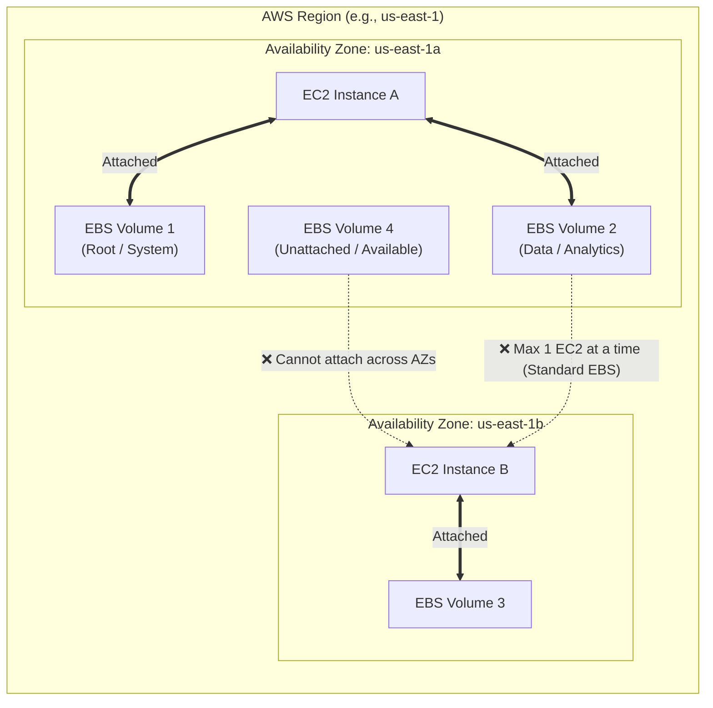
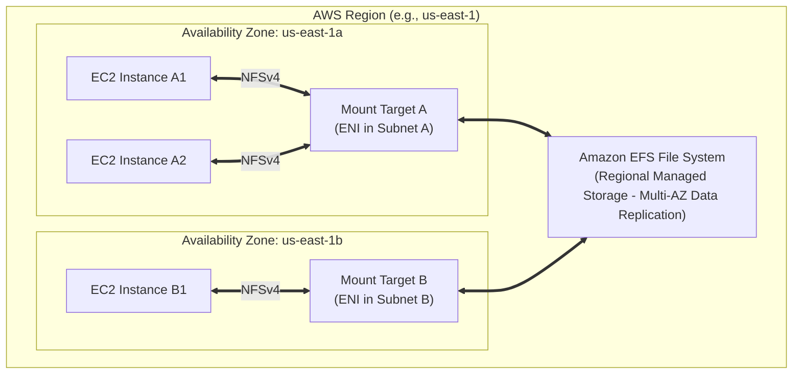

# 1 - Data Ingestion and Storage -  Amazon EC2 Instance Storage

## Amazon Elastic Block Store (EBS) Volume

### EBS properties
- Network drive attached to instance
- Persist data
- 1 EBS to 1 EC2 at 1 time (But 1 EC2 can have >1 EBS)
- Bound to 1 special AZ
- Can be detached from an EC2 to attach to another one
- Like **"USB stick"** for network

- Have provisioned capacity in GBs and IOPS (Input/Output Operations Per Second)

### EBS - Delete on Termination attribute

- Determines whether an attached Amazon EBS volume is automatically deleted or preserved when its associated EC2 instance is **terminated**.

| Volume Role | Default Setting | What Happens on Instance Termination? |
| --- | --- | --- |
| **Root Volume** (`/dev/sda1` or `/dev/xvda`) | **`True`** (Delete) | The volume is **automatically deleted** along with the instance. |
| **Additional Data Volumes** (`/dev/sdb`, `/dev/sdc`, etc.) | **`False`** (Preserve) | The volume **persists**. It detaches from the terminated instance and remains in the `available` state within that Availability Zone. |

> **Note:** Stopping/Starting an instance does **not** trigger this attribute. The `DeleteOnTermination` flag is evaluated strictly when an instance transitions to the **Terminated** state.

- Usage:
 1. Preventing Accidental Data Loss (Root Volume `False`)

    * **Scenario:** Production database or critical application running directly on an EC2 instance.
    * **Action:** Change the Root Volume's `DeleteOnTermination` to **`False`**. If a developer or automated script terminates the instance, the root disk with configuration files and logs remains intact.

2. Cost Optimization & Preventing "Orphaned" Volumes (Data Volume `True`)

    * **Scenario:** Auto Scaling Groups (ASGs) or stateless worker nodes processing batch tasks.
    * **Action:** Set `DeleteOnTermination` to **`True`** on all attached data volumes. When ASG scales down and terminates instances, attached volumes are cleaned up automatically. Leaving this set to `False` creates orphaned volumes that continuously incur AWS storage fees.

### Modifying EBS Volumes
- No need to detach a volume or restart EC2 to modify
- Volume size: increase only
- Volume type: Gp2(old gen) -> Gp3(new gen) or specify desired IOPS/throughput performance
> Gp3 decouples IOPS and throughput from storage capacity, yielding up to 20% cost savings per GB while allowing custom performance provisioning
- Performance: increase / decrease
- Once you initiate a volume modification, you must wait for the volume to reach the optimizing or completed state, and there is a mandatory 6-hour waiting period before you can modify the same EBS volume again

## Amazon Elastic File System (EFS)

### EFS properties
- Unlike EBS (single-AZ block storage), EFS is a regional service that synchronously replicates data across multiple AZs
- **Concurrent access**: Thousands of compute instances (EC2, SageMaker Studio, ECS, EKS) across different AZs can read and write to the same shared EFS file system simultaneously
- Example ML usage:
    - SageMaker Studio: Default storage for Jupyter env and scripts
    - Distributed ML Training: training datasets / features, concurrent to training clusters
    - Persistent model assets: Accessed by multiple EC2
- Other usage: web serving, data sharing, Wordpress
- Compatible with Linux based AMI EC2 ONLY
- Scales automatically, pay-per-use, no limit on capacity (but expensive, ~3x gp2)

### EFS Performance Modes

| Performance Mode | Per-Operation Latency | Throughput / IOPS Scale | Exam Use Case Trigger |
| --- | --- | --- | --- |
| **General Purpose** *(Default)* | Lowest latency | Standard scale | Latency-sensitive workloads: shared SageMaker home directories, web apps, small-file operations. |
| **Max I/O** | Slightly higher per-op latency | Scaled for massive parallel operations | High-parallelism workloads: hundreds of compute nodes concurrently reading/writing large training datasets. |

### EFS Throughput Mode

| Throughput Mode | How Performance is Determined | Best Exam Scenario |
| --- | --- | --- |
| **Elastic** *(Recommended)* | Dynamically scales throughput up or down based on real-time application read/write demand. | Spiky, unpredictable workloads (e.g., ad-hoc model training or variable inference traffic) where you pay per read/write. |
| **Provisioned** | You explicitly lock in a fixed throughput capacity (e.g., 500 MB/s) regardless of dataset size. | Small training datasets (e.g., a 10 GB file) that require extremely high read throughput (e.g., 500 MB/s) during model training runs. |
| **Bursting** *(Default)* | Throughput scales proportionally with the total gigabytes stored in EFS. | Large, steadily growing storage repos where baseline throughput increases naturally with dataset size. |

### EFS Storage Access Tiers

* **Standard:** Designed for active, frequently accessed data with no retrieval fees.
* **Infrequent Access (EFS-IA):** Lower monthly storage cost + per-GB retrieval fee. Ideal for files accessed only a few times a month.
* **Archive:** Optimized for cold data accessed rarely (a few times per year). Reduces storage costs by ~50% compared to EFS-IA.

### EFS Deployment & Redundancy Models

* **Regional (Standard):** Replicates data synchronously across **Multi-AZs**. Recommended for production workloads requiring high availability.
* **One Zone:** Stores data in a **single AZ** (~47% cheaper than Regional Standard). Ideal for non-critical, dev/test, or easily reproducible data.
* *Default Protection:* AWS Backup is automatically enabled on creation.
* *Tiering Support:* Fully compatible with IA and Archive tiers (e.g., EFS One Zone-IA).

### Example of EFS Automated Lifecycle Policies

* **Access Tracking:** Automatically transitions files to IA or Archive tiers after remaining unaccessed for a set number of days ($N$ days: 1, 7, 14, 30, 60, 90, 180, 270, or 365).
* **Return Policy:** Can automatically transition files back to the **Standard Tier** upon being read to prevent recurring retrieval fees.
* **Cost Efficiency:** Combining One Zone deployment with IA/Archive lifecycle policies can achieve **over 90% total cost savings** relative to EFS Standard.

## EBS vs EFS

| Feature | Amazon EBS (Elastic Block Storage) | Amazon EFS (Elastic File System) |
| --- | --- | --- |
| **Storage Level** | **Block Storage** (like a virtual hard drive attached to an instance). | **File Storage** (POSIX-compliant network file system shared via NFSv4). |
| **Availability / Scope** | **AZ-Locked:** Volume exists inside a single Availability Zone. | **Regional (Multi-AZ):** Automatically replicates data across multiple AZs. |
| **Instance Connectivity** | **1 Instance at a time** *(1:1 ratio)*. *(Exception: `io1`/`io2` Multi-Attach on Linux).* | **100s of Instances concurrently** across multiple AZs *(N:N ratio)*. |
| **Supported OS** | **Linux & Windows** | **Linux Only** (Requires POSIX/NFSv4 support). |
| **Cross-AZ Migration** | **Manual:** Take an EBS Snapshot $\rightarrow$ Restore snapshot as a new volume in the target AZ. | **Native:** Mount Targets exist in each AZ; instances access the same shared storage seamlessly. |
| **Performance Tuning** | • **`gp2`:** IOPS scale automatically with disk size. • **`gp3` / `io1` / `io2`:** IOPS and throughput can be provisioned **independently** of volume size. | • **Performance Modes:** General Purpose vs. Max I/O. • **Throughput Modes:** Elastic, Provisioned, or Bursting. |
| **Cost Profile** | **Lower baseline price per GB.** | **Higher baseline price per GB** (offset by using **EFS Storage Tiers** like Infrequent Access & Archive). |
| **Termination & Backups** | • **Root Volumes:** `DeleteOnTermination = true` by default. • **Snapshots:** Creating snapshots consumes disk I/O (avoid running during peak traffic). | • Managed independently of EC2 instances. • Managed automatically via **EFS Lifecycle Management** and AWS Backup. |

---

### Key Exam Decision Patterns (`IF ... THEN ...`)

#### Choose **Amazon EBS** when:

* **`IF`** an application requires **low-latency block storage** or runs a single database instance (e.g., PostgreSQL, MySQL, SQL Server) $\rightarrow$ **Use EBS**.
* **`IF`** you need to provision fixed IOPS independently of storage size without upgrading to a larger disk $\rightarrow$ **Choose `gp3` or `io1`/`io2**`.
* **`IF`** a question asks how to move storage to another AZ $\rightarrow$ **Take an EBS Snapshot and restore it in the new AZ**.
* **`IF`** you need to prevent root disk deletion on instance termination $\rightarrow$ **Set `DeleteOnTermination = false**`.

#### Choose **Amazon EFS** when:

* **`IF`** multiple EC2 instances or SageMaker Studio notebooks across different AZs need to **read/write to the same shared directory concurrently** (e.g., WordPress content, shared web assets, shared ML scripts) $\rightarrow$ **Use EFS**.
* **`IF`** the client environment is exclusively **Linux-based** requiring a POSIX file system $\rightarrow$ **Use EFS**.
* **`IF`** a question asks how to cut costs on a shared network file system $\rightarrow$ **Enable EFS Lifecycle Management** to transition untouched files to **EFS-IA (Infrequent Access) or Archive tiers**.

## Amazon FSx

## Amazon Kinesis Data Streams

## Amazon Data Firehose

## Amazon Kinesis Data Analytics

## Amazon Managed Streaming for Apache Kafka (Amazon MSK)