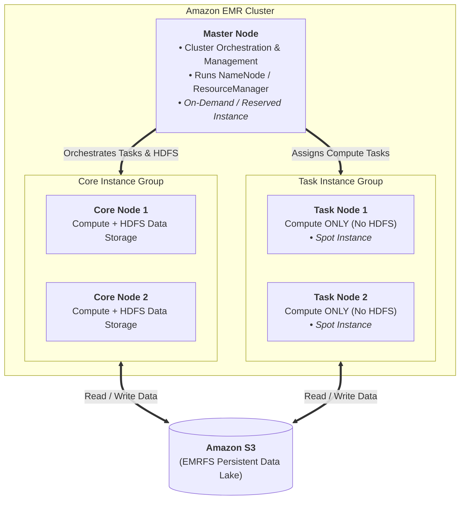

# Data Transformation, Integrity and Feature Engineering - Elastic MapReduce (EMR)

### EMR Structure

### EMR Usage

### EMR - AWS Integration

### EMR Storage

### EMR promises

### EMR Serverless

### EMR on EKS

### Apache Spark