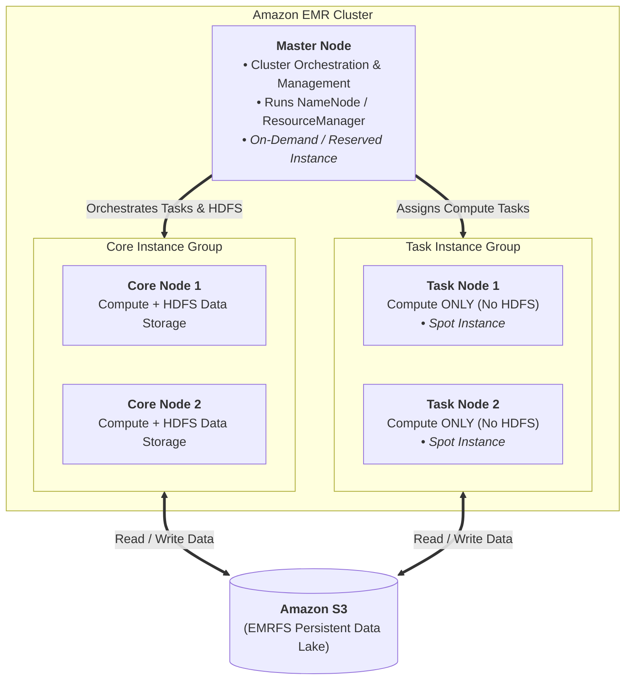
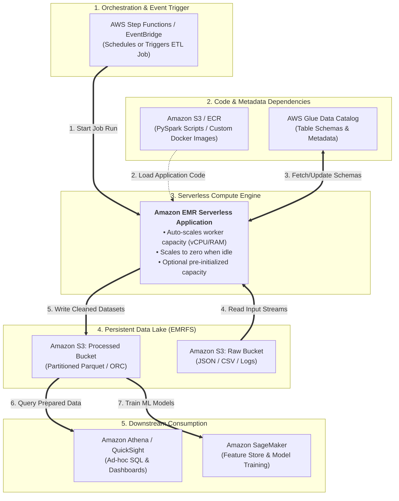
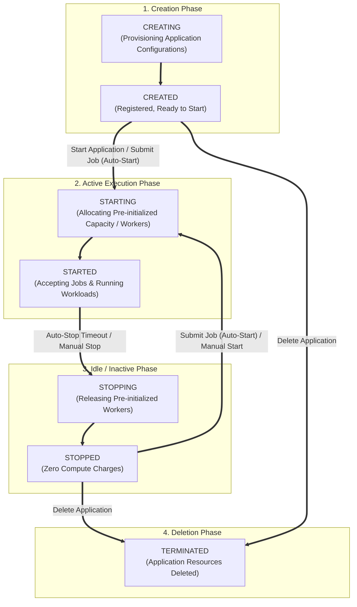

# 1 - Data Transformation, Integrity and Feature Engineering - Elastic MapReduce (EMR)

## EMR

### EMR Nodes
- Master nodes: for orchestration
- Core Node: Compute + fast storage (HDFS), lose data if terminated
- Task Node: Compute only, no risk of losing data. Can utilize EC2 **spot instances**

### EMR Usage
- Short task: task nodes with spot instances
- Long task: Reserved instances on long running clusters
- EMR can be serverless => scale nodes automatically (by AWS)

### EMR - AWS Integration

| AWS Component | Integration Role & Function | Exam Trigger / Scenario |
| :--- | :--- | :--- |
| **Amazon EC2** | Provides underlying compute infrastructure for Master, Core, and Task nodes (Instance Groups or Instance Fleets). | • **Master/Core:** Use On-Demand/Reserved Instances (avoids HDFS/cluster loss). • **Task:** Use **Spot Instances** for compute scaling at lowest cost. |
| **Amazon S3** | Serves as persistent, decoupled storage via **EMRFS** (EMR File System), input/output data lake, and log storage. | • **Decoupling Compute & Storage:** Data persists in S3 when transient EMR clusters terminate. • EMRFS enables direct S3 reads/writes without HDFS overhead. |
| **Amazon VPC** | Launches EMR nodes into private subnets with Security Groups controlling inter-node and client traffic. | • Security Configurations enforce deployment in private subnets without public IPs. • Uses **VPC Endpoints** for secure, private access to S3/KMS without crossing public internet. |
| **Amazon CloudWatch** | Collects metrics (`IsIdle`, `ContainerPendingRatio`, `HDFSUtilization`) and logs for monitoring and autoscaling. | • **Managed Scaling / Auto Scaling:** Uses metrics like `ContainerPendingRatio` to scale Task nodes up/down automatically. |
| **AWS IAM** | Enforces access control via **EMR Service Role** (cluster provisioning), **EC2 Instance Profile** (application S3/Glue access), and **Auto Scaling Role**. | • **EC2 Instance Profile** dictates S3 bucket read/write permissions for Spark/Hive jobs. • Uses IAM runtime roles for fine-grained user access. |
| **AWS CloudTrail** | Audits and records EMR API calls (`RunJobFlow`, `TerminateJobFlows`, `AddJobFlowSteps`). | • Auditing administrative and automated cluster lifecycle events for governance and security compliance. |
| **AWS Data Pipeline / Step Functions** | Workflow orchestration to automate creation of transient EMR clusters, submit processing steps, and terminate upon completion. | • **Transient Clusters:** Automates spin-up $\rightarrow$ job step execution $\rightarrow$ spin-down workflow to eliminate idle cluster costs. |
| **AWS Glue Data Catalog** | Replaces default local Hive Metastore with an external, persistent metastore shared across EMR, Athena, and Redshift. | • Directing `hive.metastore.client.factory.class` to Glue Data Catalog keeps table metadata persistent across cluster terminations. |
| **AWS Lake Formation** | Centralizes fine-grained access control (column-level, row-level, cell-level security) for S3 data queried by EMR Spark. | • Enforcing row/column-level data masking and security policies on Spark jobs without modifying application code. |
| **AWS KMS** | Manages encryption keys used by EMR **Security Configurations** for data at rest and in transit. | • **At Rest:** S3 SSE-KMS / SSE-S3 and local EBS disk encryption (LUKS). • **In Transit:** TLS encryption for node-to-node communication. |
| **Amazon DynamoDB** | EMR DynamoDB Connector allows running distributed Hive/Spark queries directly against DynamoDB tables. | • Performing bulk ETL, dataset extraction, or heavy analytical processing on DynamoDB data without consuming production throughput. |

### EMR Storage

| Storage Type | Mechanism / Underlying Tech | Data Persistence | Best Used For |
| --- | --- | --- | --- |
| **EMRFS** *(EMR File System)* | Implementation of HDFS interface for **Amazon S3** (`s3://`) | **Persistent** (independent of cluster lifetime) | Primary input/output datasets, long-term ML data lakes, and sharing data across multiple clusters. |
| **HDFS** *(Hadoop Distributed File System)* | Distributed file system spread across Master & Core nodes | **Ephemeral** (deleted when cluster is terminated) | Caching active processing data, intermediate job outputs, and temporary Spark processing state. |
| **EBS for HDFS** | Amazon EBS volumes attached to Core nodes | **Ephemeral** (tied to cluster instance lifecycle) | Expanding HDFS storage capacity for large processing jobs without scaling up EC2 instance sizes. |
| **Local File System** | Instance store or boot EBS volume attached to individual EC2 nodes | **Ephemeral** (cleared on instance termination) | Node OS files, system logs, and local Spark shuffle data. |

### EMR promises
- Charges by hour + EC2 instance charges
- Self-healing, auto create new EC2 for tasks
- Add task node freely without risk of losing data
- Resize running cluster's node freely

### EMR Serverless

- Autoscaling => no need to estimate how many workers needed for workloads
- Submit queries / scripts via job run requests
- Serverless
- Support open sourced framework like Spark, Hive, Presto

### EMR Serverless Application Lifecycle

| IF the Scenario Mentions... | THEN Choose... |
| --- | --- |
| **Eliminating startup latency for near-real-time batch jobs on EMR Serverless** | Use **Pre-Initialized Capacity** and keep the application in `STARTED` state. |
| **Eliminating extra costs caused by forgotten pre-initialized warm workers** | Enable **Auto-Stop configuration** with an aggressive idle timeout (e.g., 5 mins). |
| **Running periodic batch ETL jobs every night at midnight at lowest cost** | Rely on **Auto-Start** (submitting job starts app) and **Auto-Stop** (shuts app down after completion to $0). |

### EMR on EKS

| Architectural Feature | EMR on EC2 | EMR Serverless | EMR on EKS |
| --- | --- | --- | --- |
| **Compute Basis** | Dedicated EC2 Instances (Master, Core, Task nodes) | Managed Serverless Workers (vCPU / Memory) | Shared Kubernetes Pods on EKS Worker Nodes |
| **Primary Use Case** | Legacy Hadoop migrations, deep node customization, 24/7 heavy analytics | Ephemeral, unpredictable batch Spark/Hive pipelines | Consolidation of Spark jobs onto shared company-wide Kubernetes infrastructure |
| **Startup Latency** | **Slow:** Minutes to spin up EC2 clusters | **Fast:** Seconds (faster with warm pools) | **Fast:** Near-instant if EKS node capacity exists |
| **Multi-Tenancy** | Cluster-level isolation | Application-level isolation | **Namespace & Pod-level isolation** via K8s |
| **Autoscaling Engine** | EMR Managed Scaling | Built-in Auto-Scaler | **Karpenter** or **Cluster Autoscaler** |

- Use EKS when:
    - Consolidating Spark processing onto a shared company Kubernetes infrastructure alongside microservices (**existing K8S structure**)
    - Running multiple Spark jobs with conflicting library/python dependencies or different Spark versions on the same compute pool (**different container dependencies**)
    - Minimizing job startup times for Spark ETL jobs by reusing existing warm Kubernetes compute
    - Executing Spark jobs with pod-level IAM access controls (IRSA) for strict security isolation

### Apache Spark

