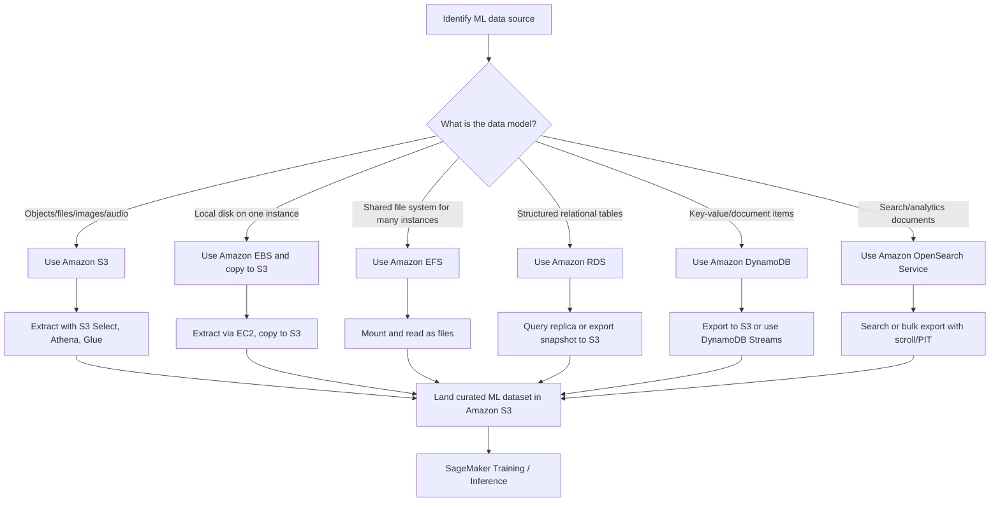

# Task 1.1: Data Preparation for ML and AI - Collect and store data

## Skill 1.1.1: Extract data from data sources (for example, Amazon S3, Amazon EBS, Amazon EFS, Amazon RDS, Amazon DynamoDB, Amazon OpenSearch Service).

### Purpose of this skill

Before an ML model can be trained, the data it needs must be extracted from its original source and placed into a storage layer suitable for ML workflows. The source may be a database, an object store, a shared file system, a block volume, or a search index.

The important exam and practical concept is that each data source has a distinct access model, performance profile, consistency model, and typical extraction pattern. The correct choice is based on how the data is produced, how it will be read by the ML pipeline, and how to avoid disrupting production systems.

---

## Data source categories and extraction patterns

| AWS Service | Data Model | Access Pattern | Typical Extraction Methods | Common ML Use Cases |
|---|---|---|---|---|
| **Amazon S3** | Object storage | Highly scalable, HTTP-based object reads/writes | S3 GET, S3 Select, Amazon Athena, AWS Glue, direct SageMaker access | Primary data lake for images, text, audio, CSV, JSON, Parquet, ORC |
| **Amazon EBS** | Block storage attached to one instance | Low-latency local disk access | Read from attached EC2 instance, copy to S3, snapshot | Temporary high-IOPS scratch data, local datasets on a single instance |
| **Amazon EFS** | Fully managed shared POSIX file system | Shared file access across many instances simultaneously | Mount on EC2/SageMaker and read as a normal file path | Distributed training jobs that need shared data |
| **Amazon RDS** | Managed relational database | SQL queries, transactional reads | SQL SELECT, read replicas, snapshot export to S3, AWS DMS, AWS Glue JDBC | Structured tabular data, labels, customer records, transaction history |
| **Amazon DynamoDB** | NoSQL key-value/document store | Low-latency item lookups by key | Query, Scan, DynamoDB export to S3, DynamoDB Streams | User interactions, product catalog, real-time event records |
| **Amazon OpenSearch Service** | Search and analytics engine | Full-text search, aggregations, vector similarity search | Search queries, scroll/PIT bulk export, OpenSearch SQL, AWS Glue | Logs, text documents, support tickets, product reviews, embeddings |

---

## Extraction behavior by service

### Amazon S3

Amazon S3 is the most common source and landing zone for ML data.

Key characteristics:

- Stores objects in buckets and prefixes.
- Scales to very large datasets without capacity management.
- Supports multiple formats: CSV, JSON, Parquet, ORC, images, audio, video.
- Can store unstructured and semi-structured data.
- Integrates natively with SageMaker, Athena, Glue, and many other AWS services.

Extraction considerations:

- Use prefixes as partitions, such as `s3://bucket/feature/date=2024-01-01/`.
- For large analytical reads, prefer columnar formats such as Apache Parquet or ORC.
- Use S3 Select or Athena to filter data before loading it into an ML job.
- S3 event notifications can trigger automated ingestion when new objects arrive.
- Storage classes affect retrieval time and cost; understand the difference between S3 Standard, S3 Intelligent-Tiering, and S3 Glacier.

### Amazon EBS

Amazon EBS is block storage attached to a single EC2 instance in a single Availability Zone.

Key characteristics:

- Behaves like a local disk.
- Provides low-latency, high-IOPS access.
- Not designed as a multi-instance shared dataset store.
- Data is available only to the instance it is attached to, with some restricted multi-attach exceptions.

Extraction considerations:

- Read directly from the attached EC2 instance.
- For ML training in SageMaker, you typically copy data from EBS to S3 first.
- EBS is more suitable for temporary scratch data or intermediate processing than as a permanent ML data source.
- Snapshots can be used for backup or to create a new volume, but they are not a direct analytics source.

### Amazon EFS

Amazon EFS is a shared, managed file system that can be mounted concurrently by many instances.

Key characteristics:

- Provides a shared POSIX-compliant file namespace.
- Accessible across multiple Availability Zones in a Region.
- Suitable for distributed workloads that need the same file paths.
- Can be mounted by SageMaker training jobs and EC2 instances.

Extraction considerations:

- Mount EFS and read files as if they are local.
- Use EFS when multiple training instances need simultaneous access to the same data.
- EFS is not ideal for extremely high-throughput HPC-style training; Amazon FSx for Lustre is often better for very high-performance shared file workloads.
- The extraction model is file-based, not query-based.

### Amazon RDS

Amazon RDS is a managed relational database service supporting engines such as PostgreSQL, MySQL, SQL Server, Oracle, and MariaDB.

Key characteristics:

- Structured data with schemas, tables, rows, and columns.
- SQL query access.
- ACID transactions.
- Supports read replicas and automated backups.

Extraction considerations:

- Use a read replica or snapshot export to avoid impacting the production database.
- For large one-time training dataset creation, export an RDS snapshot to Amazon S3.
- For continuous extraction, AWS Database Migration Service or AWS Glue JDBC connections can be used.
- RDS for PostgreSQL can also support the pgvector extension for vector similarity search on embeddings stored alongside relational data.
- Schema discovery and metadata can be recorded in the AWS Glue Data Catalog.

### Amazon DynamoDB

Amazon DynamoDB is a fully managed NoSQL key-value and document database.

Key characteristics:

- Fast, low-latency access by primary key.
- Stores items with attributes.
- Supports secondary indexes.
- Does not naturally behave like a SQL analytics engine.

Extraction considerations:

- Use `Query` for efficient access by key.
- Avoid full-table `Scan` for large training datasets; it consumes read capacity and can be slow.
- Prefer DynamoDB export to S3 for large analytical extraction jobs.
- Use DynamoDB Streams to capture ongoing changes for near-real-time ML features.
- Export to S3 allows Athena, Glue, or SageMaker to read the data without loading the production table.

### Amazon OpenSearch Service

Amazon OpenSearch Service is a managed search and analytics service based on OpenSearch/Elasticsearch.

Key characteristics:

- Stores JSON documents.
- Designed for full-text search, log analytics, and vector similarity search.
- Supports kNN queries for embeddings.
- Data is indexed for fast search retrieval.

Extraction considerations:

- Use search queries to retrieve relevant documents.
- For bulk export, use scroll or point-in-time APIs rather than standard deep pagination.
- Can be a source of text documents, logs, support tickets, and customer interactions.
- For ML applications that require vector search, documents and embeddings can be queried by similarity.
- OpenSearch is generally a source or index, not the final durable system of record.

---

## Extraction decision flow

---

## Scenario-based examples

### Scenario 1: Large relational dataset extraction

A fraud detection team needs to extract 4 TB of historical transaction data from a production Amazon RDS for PostgreSQL database. The extraction must not impact production transaction performance.

**What is the most appropriate extraction approach?**

- A. Run a large `SELECT *` query directly on the primary production database.
- B. Mount the RDS database as a shared file system using Amazon EFS.
- C. Export an RDS snapshot to Amazon S3 and process it with AWS Glue or Amazon Athena.
- D. Store the RDS data in Amazon EBS and attach the same volume to SageMaker training instances.

**Correct answer: C**

**Explanation:**  
Exporting an RDS snapshot to Amazon S3 creates a point-in-time copy without adding query load to the production database. The exported data can then be processed with AWS Glue or Amazon Athena. Option A would affect production performance. Option B is incorrect because RDS is a database service, not a file system. Option D is incorrect because EBS volumes are block storage and are not designed for this use.

---

### Scenario 2: Large DynamoDB extraction

A retail company stores millions of product interaction records in Amazon DynamoDB. The ML team needs to build a recommender system using all historical interaction data.

**Which extraction method is best for this analytics workload?**

- A. Run a full DynamoDB `Scan` operation during peak traffic hours.
- B. Use DynamoDB export to Amazon S3 and then transform the data with AWS Glue.
- C. Mount DynamoDB as an Amazon EFS file system.
- D. Query DynamoDB using OpenSearch Service SQL.

**Correct answer: B**

**Explanation:**  
DynamoDB export to S3 is purpose-built for large analytics exports and does not consume provisioned read capacity. A full `Scan` can be slow, costly, and consume capacity. DynamoDB cannot be mounted as a file system. OpenSearch Service does not directly query DynamoDB in this manner.

---

### Scenario 3: Distributed training shared file access

A machine learning engineer is running a distributed SageMaker training job across multiple instances. All instances need to read the same training files from a shared file namespace.

**Which AWS service should be used?**

- A. Amazon EBS
- B. Amazon RDS
- C. Amazon EFS
- D. Amazon DynamoDB

**Correct answer: C**

**Explanation:**  
Amazon EFS provides a shared POSIX file system that can be mounted on multiple instances concurrently. EBS is block storage attached to a single instance. RDS and DynamoDB are database services, not shared file systems.

---

### Scenario 4: Bulk export from OpenSearch Service

An ML team has a large OpenSearch Service domain containing 10 million support ticket documents. They need to export all documents to build a text classification dataset.

**Which approach is most appropriate for bulk extraction?**

- A. Use standard search queries with deep page numbers from 0 to 10,000.
- B. Use scroll or point-in-time APIs to export the documents.
- C. Use Amazon S3 Select to query the OpenSearch index.
- D. Attach the OpenSearch domain to Amazon EFS and read it as a file system.

**Correct answer: B**

**Explanation:**  
OpenSearch bulk export should use scroll or point-in-time APIs. Deep pagination with normal search queries has a maximum result window and becomes inefficient for large datasets. S3 Select cannot read OpenSearch indexes. EFS cannot attach to OpenSearch.

---

## Exam tips and traps

### Tips

- **Match the service to the access pattern.**  
  If the question says "many instances need the same shared file namespace," think EFS.  
  If the question says "single instance needs low-latency block storage," think EBS.  
  If the question says "object storage for images, audio, or large training data," think S3.

- **Protect production systems during extraction.**  
  For RDS, use read replicas or snapshot export to S3.  
  For DynamoDB, use export to S3 for large jobs.  
  Avoid running heavy analytical queries directly on production transactional databases.

- **S3 is the central data lake for ML.**  
  In most ML pipelines, extracted data is landed in S3 before training. EBS, EFS, RDS, and DynamoDB usually act as sources or intermediate stores.

- **Know the difference between row-oriented and columnar formats.**  
  CSV and JSON are row-oriented.  
  Parquet and ORC are columnar.  
  For repeated analytical reads of a few columns across many rows, choose Parquet or ORC.

- **Understand Amazon OpenSearch Service for vector search.**  
  If a question involves embeddings and similarity search, OpenSearch Service is a common answer.  
  RDS for PostgreSQL with pgvector is also a valid option when embeddings need to remain alongside existing relational data.

- **Use AWS Glue for large-scale extraction and transformation.**  
  AWS Glue can read from RDS, DynamoDB, and OpenSearch, and write curated data to S3.

### Traps

- **Assuming EBS can be shared across many instances.**  
  EBS is typically single-instance attached. For shared access, use EFS or FSx.

- **Using DynamoDB `Scan` for large analytics extraction.**  
  `Scan` reads the entire table and consumes read capacity. For large ML datasets, export to S3 is better.

- **Trying to mount a database as a file system.**  
  RDS, DynamoDB, and OpenSearch are not file systems. Extract data using queries or exports.

- **Using standard deep pagination for OpenSearch bulk export.**  
  OpenSearch has a result window limit. Use scroll or point-in-time for large exports.

- **Choosing CSV/JSON for columnar analytical workloads.**  
  Row-oriented formats require scanning all columns. If the query reads only a few columns across many rows, use Parquet or ORC.

- **Ignoring production impact.**  
  Extracting directly from a production database can degrade performance. Use read replicas, snapshots, or exports.

- **Confusing S3 Select with a database service.**  
  S3 Select can filter object data using SQL-like syntax, but S3 is not a relational database. Use appropriate services for structured querying.