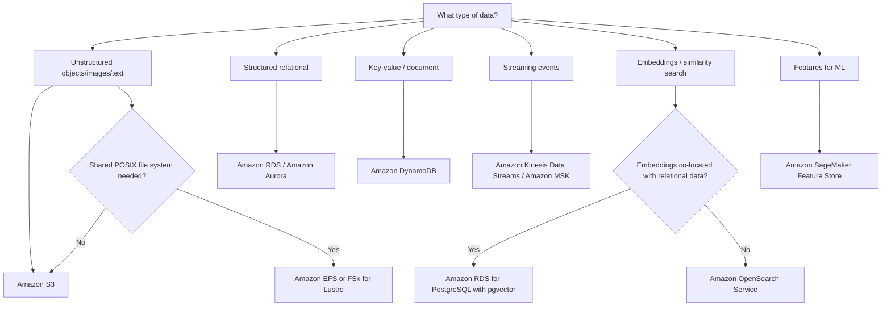
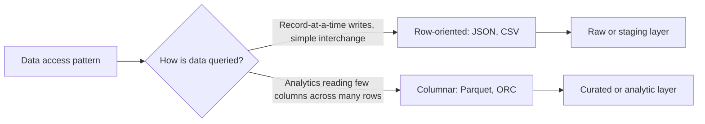

# Task 1.1: Data Preparation for ML and AI - Collect and store data
## Skill 1.1.2: Make storage decisions and configure storage services based on cost, performance, data structure, and data compliance.

## Overview

This skill asks you to select and configure the right AWS storage service for machine learning and AI workloads. The correct choice is not a default; it depends on four often competing factors:

- **Cost** – how much data you store, how often you access it, and what retrieval penalties you accept
- **Performance** – latency, throughput, IOPS, concurrency, and how quickly training or inference needs to read data
- **Data structure** – whether the data is object, file, block, relational, key-value, streaming, embedding, or feature data
- **Data compliance** – encryption, data residency, retention, deletion, and access control requirements

The exam expects you to recognize which AWS service fits a given workload and how to configure it properly.

---

## Storage Decision Framework

Start by classifying the data and the access pattern. Then layer cost and compliance requirements on top.

A common mistake is to use one service because it is familiar. In ML workloads, you often combine services:

- Raw images and audio in **S3**
- Metadata about those files in **DynamoDB** or **RDS**
- Embeddings in **OpenSearch Service** or **RDS for PostgreSQL with pgvector**
- Real-time features in **SageMaker Feature Store**

---

## Service Selection by Data Structure and Access Pattern

| Workload / Data Type | Recommended AWS Service | Why |
|---|---|---|
| Large unstructured dataset for training | Amazon S3 | Durable, scalable, low cost, native SageMaker integration |
| Shared file namespace across many training instances | Amazon EFS | POSIX file system mountable by many instances concurrently |
| High-throughput, low-latency distributed training | Amazon FSx for Lustre | Optimized for HPC/ML, high IOPS and throughput, S3 integration |
| Local block storage for a single instance | Amazon EBS | Raw block device attached to one instance |
| Structured relational data needing SQL joins | Amazon RDS or Amazon Aurora | Relational engine, ACID transactions, rich query capability |
| Low-latency key-value or document lookup | Amazon DynamoDB | Millisecond reads, serverless, seamless scaling |
| Continuous streaming events | Amazon Kinesis Data Streams or Amazon MSK | Ordered, durable stream ingestion |
| Full-text search and analytics | Amazon OpenSearch Service | Search, log analytics, and vector search |
| Embedding similarity search alongside relational records | Amazon RDS for PostgreSQL with pgvector | Vector search without moving relational data |
| Embedding similarity search at scale | Amazon OpenSearch Service | Purpose-built k-NN search, adjustable similarity metrics |
| Features shared between training and inference | Amazon SageMaker Feature Store | Single feature definition, online and offline stores |

---

## Configuring Core Storage Services

### Amazon S3

**Use for:** object storage for datasets, images, audio, video, model artifacts, raw and curated data lakes.

**Configuration decisions:**

| Decision | Options / Best Practice |
|---|---|
| Storage class | S3 Standard, Intelligent-Tiering, Standard-IA, One Zone-IA, Glacier Instant Retrieval, Glacier Flexible Retrieval, Glacier Deep Archive |
| Access frequency | Frequent → Standard; unknown → Intelligent-Tiering; infrequent → IA; archive → Glacier |
| Lifecycle policies | Transition objects to lower-cost classes after a specified number of days |
| Performance | Use multipart upload, parallel reads, and prefix distribution for many objects if older guidance requires it |
| Compliance | Versioning, S3 Object Lock for write-once-read-many retention, MFA Delete |
| Security | SSE-S3, SSE-KMS, SSE-C, client-side encryption; VPC endpoints; bucket policies; pre-signed URLs |

**Key exam point:** S3 is the default landing zone for ML data because of its durability, scalability, and native integration with SageMaker, Glue, and Athena.

---

### Amazon EBS

**Use for:** block storage attached to a single EC2 or SageMaker instance. Good for temporary local storage, operating system volumes, and high-IOPS local processing before moving data to S3.

**Volume types by performance and cost:**

| Volume Type | Performance | Use Case |
|---|---|---|
| gp3 | Baseline 3,000 IOPS, 125 MiB/s, can scale independently | General-purpose boot and dev workloads |
| gp2 | Baseline scales with volume size | Older general-purpose SSD |
| io1 / io2 | Provisioned high IOPS | High-performance databases, transactional workloads |
| st1 | HDD, high throughput sequential | Large sequential data processing |
| sc1 | HDD, low cost sequential | Infrequent large reads |

**Key limitation:** EBS volumes are typically attached to one instance at a time. They are not a shared file system. Use EFS or FSx when multiple training instances need concurrent access.

---

### Amazon EFS

**Use for:** shared POSIX file system that many EC2 or SageMaker instances can mount at the same time.

**Configuration decisions:**

- **Performance mode:**
  - General Purpose is best for low latency and most workloads.
  - Max I/O is for thousands of concurrent clients and high aggregate throughput.
- **Throughput mode:**
  - Bursting scales throughput with stored data.
  - Provisioned provides fixed throughput independent of storage size.
- **Lifecycle management:** move infrequently accessed files to EFS Infrequent Access to reduce cost.
- **Encryption:** encrypt at rest with KMS and in transit with TLS.

**Key exam point:** Use EFS for distributed training that needs a shared file namespace but does not require the extreme performance of FSx for Lustre.

---

### Amazon FSx for Lustre

**Use for:** high-performance, parallel storage for machine learning and high-performance computing. It is ideal for distributed deep learning training on many GPU instances.

**Configuration decisions:**

- **Deployment type:**
  - Scratch: low cost, suitable for temporary processing, no replication.
  - Persistent: higher durability and availability for longer-term workloads.
- **S3 integration:** can load data directly from S3 and write results back.
- **Performance:** sub-millisecond latency, millions of IOPS, high throughput.

**Key exam point:** If a question describes multiple instances needing low-latency, high-throughput shared access to a large dataset for training, FSx for Lustre is likely the answer.

---

### Amazon RDS

**Use for:** structured relational data, especially when you need SQL joins, transactions, or embedding similarity search with pgvector.

**Configuration decisions:**

- **Engine:** PostgreSQL, MySQL, MariaDB, Oracle, SQL Server, Db2
- **Availability:** Multi-AZ for failover; read replicas for read-heavy workloads
- **Storage:** gp2/gp3 for general purpose, io1/io2 for provisioned IOPS
- **pgvector extension:** on RDS for PostgreSQL, enables vector storage and similarity search alongside relational records
- **Compliance:** encryption at rest with KMS, TLS in transit, VPC deployment, automated backups

**Key exam point:** If embeddings already sit alongside relational records in PostgreSQL and the application needs vector similarity search without moving data, choose **RDS for PostgreSQL with pgvector**.

---

### Amazon DynamoDB

**Use for:** low-latency key-value and document lookups, especially for real-time feature stores, metadata, and high-throughput write workloads.

**Configuration decisions:**

| Decision | Options |
|---|---|
| Capacity mode | On-demand for unpredictable traffic; Provisioned with auto scaling for predictable traffic |
| Latency | Single-digit millisecond reads; DAX for microsecond read caching |
| Data expiration | TTL for automatic item deletion |
| Change data capture | DynamoDB Streams to trigger downstream actions |
| Global scale | Global Tables for multi-region replication |
| Compliance | Encryption at rest, VPC endpoints, IAM, Point-in-Time Recovery |

**Key exam point:** Choose DynamoDB for fast lookup by key. For relational queries, choose RDS or Aurora.

---

### Amazon OpenSearch Service

**Use for:** search, log analytics, and vector similarity search.

**Configuration decisions:**

- **Node types:** data nodes, dedicated master nodes, UltraWarm for warm data
- **Storage tiering:** hot data on data nodes; warm data on UltraWarm; cold storage for archival
- **Vector search:** k-NN with cosine similarity, Euclidean distance, or inner product
- **Scaling:** OpenSearch Serverless for automatic scaling based on workload

**Key exam point:** For retrieval-augmented generation or semantic search, OpenSearch Service is a purpose-built vector store. It is a strong choice when search or analytics is the main work.

---

### Amazon SageMaker Feature Store

**Use for:** unifying feature definitions between training and inference.

**Components:**

| Store | Purpose |
|---|---|
| Online store | Low-latency lookup of the most recent feature value for inference |
| Offline store | Historical feature data in S3 for training and batch predictions |

**Key exam point:** Feature Store solves training-serving skew by using the same feature definitions for both training and inference. A general-purpose database does not provide this consistency on its own.

---

## Choosing Data Formats

The file format should match the access pattern.

| Format | Orientation | Best For | Cost / Performance Impact |
|---|---|---|---|
| CSV | Row | Simple interchange, small datasets | Scans all columns, high query cost for analytics |
| JSON | Row / document | Nested or semi-structured records, streaming | Entire document parsed to read one field |
| Apache Parquet | Column | Analytic queries on large datasets | Column pruning reduces scanned data and cost |
| ORC | Column | Analytic queries, often in Hadoop ecosystem | Similar to Parquet, columnar compression |

**Key exam point:** A curated dataset that is queried repeatedly and reads only a small number of columns across many rows should be stored in **Apache Parquet or ORC**.

---

## Cost, Performance, and Compliance Deep Dive

### Cost Considerations

| Service | Cost Levers |
|---|---|
| S3 | Storage class, lifecycle rules, compression, columnar formats to reduce scan |
| EBS | Volume type: gp3 is cheaper than io2 for moderate IOPS; HDD for sequential throughput |
| EFS | Lifecycle to IA; choose bursting vs provisioned based on throughput need |
| FSx for Lustre | Scratch for temporary data; persistent for long-term storage |
| RDS | Instance class, storage type, reserved instances for steady workloads |
| DynamoDB | On-demand for variable loads; provisioned for stable workloads to reduce cost |
| OpenSearch | UltraWarm for infrequently accessed data; serverless for variable workloads |

**S3 storage class decision table:**

| S3 Storage Class | Use Case | Cost Characteristics |
|---|---|---|
| S3 Standard | Frequently accessed data | Highest storage cost, no retrieval fee |
| Intelligent-Tiering | Unknown or changing access patterns | Small monitoring fee, automatic tiering |
| Standard-IA | Infrequent but fast access | Low storage cost, per-GB retrieval fee |
| One Zone-IA | Recreatable infrequent data | Lower cost, no multi-AZ durability |
| Glacier Instant Retrieval | Rarely accessed but fast retrieval | Low storage cost, higher retrieval |
| Glacier Flexible Retrieval | Archive with minutes to hours retrieval | Very low storage cost, higher retrieval |
| Glacier Deep Archive | Long-term archive | Lowest storage cost, highest retrieval latency |

### Performance Considerations

| Performance Need | Recommended Service |
|---|---|
| High-throughput shared file access for distributed training | FSx for Lustre |
| Shared POSIX file system for moderate concurrency | EFS |
| Low-latency key-value lookup for real-time inference | DynamoDB or SageMaker Feature Store online store |
| Microsecond read caching | DynamoDB Accelerator DAX |
| Streaming ingestion with ordered records | Kinesis Data Streams or MSK |
| Large scale search and vector similarity | OpenSearch Service |

**Key exam point:** If a stream consumer is falling behind, diagnose whether the bottleneck is consumer capacity or a downstream write target. Scaling consumers does not help if the sink is the constraint.

### Data Compliance Considerations

| Compliance Requirement | Configuration Action |
|---|---|
| Encryption at rest | Enable SSE-KMS or service-managed encryption on S3, EBS, EFS, RDS, DynamoDB, OpenSearch |
| Encryption in transit | Enforce TLS for endpoints; enable in-transit encryption for EFS |
| Data residency | Store in the required region; use VPC endpoints and avoid cross-region replication unless required |
| Retention and WORM | S3 Object Lock, versioning, MFA Delete; RDS automated backups; DynamoDB PITR |
| Access control | IAM policies, S3 bucket policies, VPC endpoints, security groups |
| Auditing | AWS CloudTrail, S3 access logs, OpenSearch audit logs |

**Key exam point:** Compliance can override cost and performance. For example, even if S3 Standard is faster and simpler, a compliance rule may require data to be stored in a specific region with Object Lock enabled.

---

## Vector Stores and Feature Stores

These two purpose-built stores are easy to confuse.

| Store Type | Question It Answers | AWS Service |
|---|---|---|
| Vector store | Given an embedding, what items are most similar? | OpenSearch Service, RDS pgvector, S3 vector storage for batch |
| Feature store | Given an entity, what are its current and historical features? | SageMaker Feature Store |

**Vector store decision guide:**

| Scenario | Recommended Service |
|---|---|
| Embeddings already in PostgreSQL with relational data | RDS for PostgreSQL with pgvector |
| Large-scale similarity search and full-text search | OpenSearch Service |
| Large vector sets with less frequent querying | S3-based vector storage or batch job |
| Real-time retrieval augmented generation | OpenSearch Service |

**Feature store key point:** A feature store prevents training-serving skew by sharing one feature definition between training and inference.

---

## Scenario-Based Examples

### Scenario 1: Shared High-Performance Training Data

A distributed training job runs across 20 GPU instances. All instances must read the same large dataset simultaneously with low latency and high throughput. The team needs a shared POSIX file system.

**Which storage service should be used?**

- A. Amazon EBS
- B. Amazon S3
- C. Amazon FSx for Lustre
- D. Amazon RDS

**Answer:** C. Amazon FSx for Lustre

**Explanation:** FSx for Lustre is designed for HPC and ML workloads requiring high throughput and low-latency shared file access across many instances. EBS is single-instance, S3 is object storage, and RDS is a relational database.

---

### Scenario 2: Embedding Search with Relational Data

A startup stores product metadata in Amazon RDS for PostgreSQL. The machine learning team creates embeddings from product descriptions and wants to find similar products using cosine similarity. The embeddings should remain alongside the existing product records.

**Which option should be used?**

- A. Amazon DynamoDB
- B. Amazon OpenSearch Service only
- C. Amazon RDS for PostgreSQL with pgvector
- D. Amazon EFS

**Answer:** C. Amazon RDS for PostgreSQL with pgvector

**Explanation:** pgvector allows vector similarity search inside PostgreSQL without moving relational data to a separate vector database.

---

### Scenario 3: Compliance-Driven Archive

A financial company must retain transaction records for seven years. After 90 days, records are rarely accessed. Compliance requires the data to be immutable and protected from deletion.

**Which configuration meets these requirements?**

- A. Amazon S3 Standard with lifecycle to S3 One Zone-IA
- B. Amazon S3 Standard-IA with versioning
- C. Amazon S3 Standard with lifecycle to Glacier Deep Archive and S3 Object Lock
- D. Amazon EBS with Object Lock

**Answer:** C. Amazon S3 Standard with lifecycle to Glacier Deep Archive and S3 Object Lock

**Explanation:** Glacier Deep Archive supports long-term low-cost retention. S3 Object Lock enforces immutability and prevents deletion. One Zone-IA does not provide the same durability and immutability.

---

### Scenario 4: Streaming Ingestion Backlog

A stream consumer processes records from Amazon Kinesis Data Streams and writes them to a downstream database. The database is already at its maximum write capacity. The consumer is falling farther behind each hour.

**What will adding more consumer capacity accomplish?**

- A. Clear the backlog because the consumer is the bottleneck
- B. Very little because the downstream write target is the bottleneck
- C. Change the order of stream records
- D. Reduce the size of each record

**Answer:** B. Very little because the downstream write target is the bottleneck

**Explanation:** The downstream database is the binding constraint. Adding consumer capacity only increases pressure on the already saturated write target. The fix is to scale or optimize the downstream target.

---

## Exam Tips and Traps

### Tips

- **Classify data first:** object, file, block, relational, key-value, streaming, embedding, or feature. Match the service to that category.
- **Use S3 as the default dataset repository** for ML unless there is a specific reason for another service.
- **Use EFS for shared file access at moderate performance.** Use FSx for Lustre when the workload is high-performance distributed training.
- **Use RDS pgvector when embeddings live with relational data.** Use OpenSearch Service for dedicated large-scale search.
- **Use columnar formats like Parquet or ORC** for analytic workloads that read a few columns across many rows.
- **Use SageMaker Feature Store** when training and inference must share the same feature definitions.
- **Layer compliance after performance and cost:** encryption, retention, residency, and access control can change the final choice.

### Traps

- **EBS is not shared.** If multiple instances need the same file namespace, EBS is wrong.
- **S3 is not a POSIX file system.** It is object storage. Do not use it as a local shared file system for distributed training without a file gateway or mount solution.
- **Glacier is for archive, not frequent access.** Retrieval latency and cost make it wrong for active training data.
- **DynamoDB is not a relational database.** Do not choose it for complex joins or transactional SQL workloads.
- **OpenSearch Service is not a relational database.** It is for search, analytics, and vector similarity.
- **Feature Store does not provide vector similarity search.** A feature store manages feature values, not embedding nearest neighbors.
- **A streaming backlog may indicate a downstream bottleneck.** Adding consumer capacity alone often fails.
- **Compliance can override cost.** A low-cost storage class may not satisfy data residency or retention requirements.

---

## Summary Checklist

When answering storage decision questions on the MLA-C02 exam, follow this mental checklist:

1. **Identify the data structure and access pattern.**
2. **Select the service category that matches the data.**
3. **Refine the service based on performance requirements.**
4. **Apply cost optimizations such as storage classes and lifecycle policies.**
5. **Ensure compliance requirements are met through encryption, retention, and access controls.**
6. **Choose the correct file format for analytical workloads.**
7. **Avoid service-selection traps based on familiarity or defaults.**