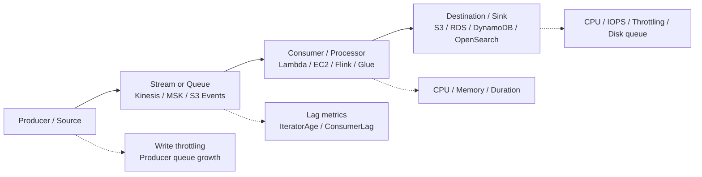
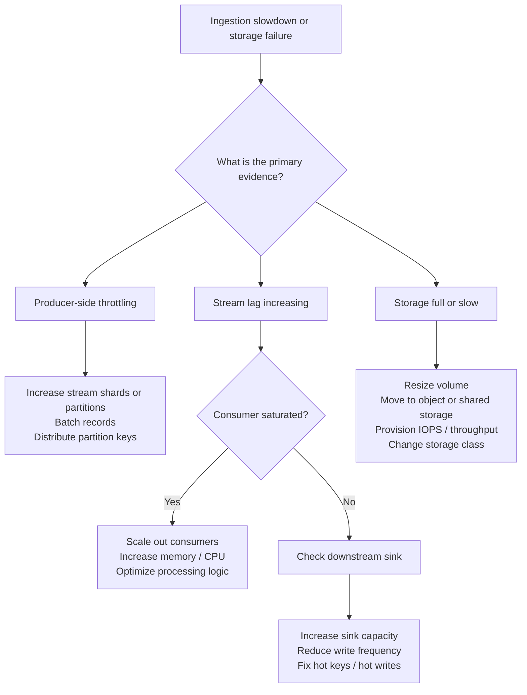

# Task 1.1: Data Preparation for ML and AI - Collect and store data
## Skill 1.1.3: Troubleshoot and debug data ingestion and storage issues that involve capacity and scalability.

This skill is about diagnosing **why data is not moving fast enough, not landing correctly, or not being stored at the scale required**, then applying the right fix at the correct layer. The AWS MLA-C02 exam tests your ability to distinguish between:

- A **capacity limit** — the service or resource has an absolute ceiling.
- A **scalability limit** — the design cannot comfortably grow with data volume or request rate.
- A **downstream bottleneck** — the next service in the chain cannot absorb records fast enough.
- A **data layout problem** — data is stored in a way that makes reads, writes, or ingestion inefficient.

---

## 1. Core concepts

### Capacity vs. scalability vs. throughput

| Term | Meaning | Example |
|---|---|---|
| **Capacity** | Maximum amount of a resource: storage size, connections, shards, partitions, IOPS. | An EBS volume has 500 GB capacity and 3,000 IOPS. |
| **Throughput** | Rate at which data can be read or written. | An Amazon Kinesis shard can ingest up to 1 MB/sec. |
| **Scalability** | Ability to grow capacity or throughput without redesign. | DynamoDB on-demand mode scales read/write capacity automatically. |
| **Bottleneck** | The tightest constraint in an end-to-end path. | A consumer can process 10 MB/sec, but the sink database can only absorb 3 MB/sec. |
| **Latency** | Time taken for one record or request. | EFS burst credits exhausted can increase file read latency. |

A key exam theme: **do not treat the first symptom as the root cause**. A streaming backlog often looks like a consumer problem but is actually a slow destination database.

---

## 2. High-level ingestion and storage troubleshooting model

The fix depends on which layer is actually saturated.

---

## 3. Troubleshooting decision path

---

## 4. Streaming ingestion issues

Streaming systems continually expose whether the pipeline can keep up. The most important symptoms and fixes are below.

### 4.1 Amazon Kinesis Data Streams

Amazon Kinesis Data Streams is organized into **shards**. Each shard provides fixed capacity.

| Kinesis shard capacity | Limit |
|---|---|
| Write throughput | 1 MB/sec or 1,000 records/sec, whichever comes first |
| Read throughput — standard consumers | 2 MB/sec shared by all standard consumers |
| Read throughput — enhanced fan-out consumer | 2 MB/sec per registered consumer |
| Maximum record size | 1 MiB |

Common Kinesis symptoms:

| Symptom | Likely cause | Fix |
|---|---|---|
| `WriteProvisionedThroughputExceeded` | Producers exceed shard write capacity | Increase shard count, batch records, distribute partition keys |
| `ReadProvisionedThroughputExceeded` | Consumers exceed shared read capacity | Use enhanced fan-out, scale consumers appropriately |
| `IteratorAgeMilliseconds` keeps rising | Consumer cannot keep up or sink is slow | Check consumer CPU/memory first, then check destination |
| Hot shard: one shard is busy while others are idle | Uneven partition key distribution | Redesign partition key, add salt/hash, use resharding |
| Backlog grows after scaling consumers | Destination database or API is throttling | Scale or optimize the downstream sink |

**Exam trap:** Adding more consumers increases read capacity only if the consumers themselves are the bottleneck. If the downstream sink is already saturated, extra consumers simply wait longer.

### 4.2 Amazon Managed Streaming for Apache Kafka (Amazon MSK)

Kafka capacity is based on **partitions**, **broker throughput**, and **broker storage**.

| Kafka concept | Capacity note |
|---|---|
| Partition | Unit of parallelism for a topic |
| Hot partition | One partition receives most records, limiting throughput |
| Consumer lag | How far behind consumers are from the latest offset |
| Broker disk | Must store replicas of log segments |
| Broker throughput | Limited by instance network and EBS volume throughput |

Common MSK symptoms:

| Symptom | Likely cause | Fix |
|---|---|---|
| Consumer lag is high | Consumers are slow or downstream sink is slow | Scale consumers, tune batch size, investigate sink |
| One partition has very high load | Poor partition key distribution | Redesign key strategy or use more partitions |
| Broker disk fills up | Retention policy too long or data volume grows | Reduce retention, tier older data to S3, add brokers |
| Producer requests fail or time out | Broker throughput or network limit | Add brokers, increase instance size, tune producers |

**Key distinction:** In Kafka, you cannot get more parallel reads than the number of partitions. Scaling consumers beyond partition count does not help a single partition’s processing.

### 4.3 Streaming pipeline bottleneck summary

| Layer | Common metric | Meaning | Common fix |
|---|---|---|---|
| Producer | `WriteProvisionedThroughputExceeded`, producer queue size | Source cannot write into stream | Add shards/partitions or batch writes |
| Stream | `IteratorAgeMilliseconds`, consumer lag | Consumers are behind | Scale consumers or find downstream blocker |
| Consumer | CPU, memory, duration, error rate | Processing capacity shortfall | Scale out, optimize code, right-size instances |
| Sink | CPU, IOPS, `ThrottledRequests`, queue depth | Destination cannot accept data | Scale database, increase write throughput, reduce hot keys |

---

## 5. Batch ingestion and transformation issues

Batch ingestion is often more about **processing scale** than continuous throughput. AWS Glue and Amazon EMR jobs can fail or slow down because of how data is laid out.

| Symptom | Likely cause | Fix |
|---|---|---|
| Job slows as data grows | Reads more data than needed | Use columnar format such as Parquet or ORC; prune partitions |
| Many small files cause slow job startup | Object overhead and listing cost | Compact small files, use fewer but larger Parquet/ORC files |
| S3 `503 SlowDown` during batch job | Too many rapid requests to same S3 prefix | Distribute prefixes, increase retry with exponential backoff, reduce concurrency |
| One executor has high CPU/memory | Data skew in a join or group-by key | Redesign join key, use salting, broadcast small tables |
| Executor out of memory / disk spill | Partition count too low or data skew | Increase partitions, tune memory, reduce shuffle volume |
| Job has high latency reading many columns | Row-oriented JSON/CSV scans all columns | Convert to Parquet or ORC |

---

## 6. Storage service capacity and scalability issues

Different AWS storage services signal capacity problems in different ways.

### 6.1 Amazon S3

S3 is effectively unlimited in total storage, but it still has request-rate and access-latency considerations.

| Symptom | Cause | Fix |
|---|---|---|
| `503 SlowDown` or high retry rates | Bursting beyond per-prefix request capacity or very abrupt rate increase | Distribute keys across prefixes, reduce concurrency, use exponential backoff |
| Slow ML training reads | Large number of small objects | Combine into larger Parquet/ORC files |
| Job waits long for data | Objects in Glacier or Deep Archive need retrieval | Restore objects or move active ML data to S3 Standard |
| Inefficient SQL/analytics queries | Data stored as row-oriented JSON/CSV | Convert curated layer to Parquet/ORC |

**Exam point:** S3 has no provisioning dial, but request patterns and storage classes still create capacity-like symptoms.

### 6.2 Amazon Elastic Block Store (Amazon EBS)

EBS provides raw block storage to a single instance. Common issues:

| Symptom | Cause | Fix |
|---|---|---|
| Disk fills up | Volume capacity reached | Resize volume, delete old data, move large datasets to S3/EFS |
| `BurstBalance` reaches zero on `gp2` | Baseline IOPS exhausted | Switch to `gp3`, `io1/io2`, or provision more IOPS |
| High `VolumeQueueLength` | IOPS or throughput limit | Increase volume performance or move to higher-performing storage |
| Training job reads slowly | EBS attached as local single-instance disk | For distributed access, use EFS, FSx for Lustre, or S3 |

### 6.3 Amazon Elastic File System (Amazon EFS)

EFS provides shared file storage across many instances.

| Symptom | Cause | Fix |
|---|---|---|
| `BurstCreditBalance` is zero or low | Bursting throughput exhausted | Enable provisioned throughput or use elastic throughput |
| `PercentIOLimit` is high | General Purpose mode cannot handle high concurrent I/O | Switch to Max I/O performance mode |
| High metadata operation latency | Many small files or directory operations | Reduce number of files or restructure dataset |
| EC2 instances across training cluster need shared dataset | EBS cannot be shared | Use EFS or Amazon FSx for Lustre |

### 6.4 Amazon RDS

RDS databases often become bottlenecks in ML data pipelines.

| Symptom | Cause | Fix |
|---|---|---|
| `FreeStorageSpace` is low | Database volume filling | Enable storage autoscaling, remove old data, archive to S3 |
| `CPUUtilization` consistently high | Read or write load exceeds instance class | Scale instance type, add read replicas for read-heavy workloads |
| `WriteIOPS` or `ReadIOPS` saturated | Storage performance limit | Increase allocated IOPS or switch to higher-performance instance |
| `DatabaseConnections` maxed out | Too many simultaneous clients | Use connection pooling, scale up, or distribute reads |
| Data load cannot keep up with stream consumer | RDS is the downstream bottleneck | Optimize writes, batch inserts, tune indexes, or choose a different sink |

### 6.5 Amazon DynamoDB

DynamoDB capacity is controlled by **read capacity units (RCUs)** and **write capacity units (WCUs)**, or by **on-demand mode**.

| DynamoDB symptom | Cause | Fix |
|---|---|---|
| `WriteThrottleEvents` or `ReadThrottleEvents` | Provisioned capacity exceeded | Increase WCU/RCU or switch to on-demand |
| Throttling even with high table capacity | Hot partition key | Redesign partition key to distribute writes, use sharding |
| `ThrottledRequests` during a sudden burst | On-demand scaling cannot absorb extreme spike instantly | Smooth traffic, use DynamoDB Accelerator, review access pattern |
| Batch job writes slowly | Low write capacity or large items | Increase WCUs, optimize item size, batch writes correctly |

**Important:** A single DynamoDB partition has hard throughput limits. Even if the table has ample total capacity, one hot partition key can still produce throttling.

### 6.6 Amazon OpenSearch Service

OpenSearch is commonly used for search and vector similarity workloads.

| Symptom | Cause | Fix |
|---|---|---|
| `JVMMemoryPressure` high | Too many queries or shards do not fit in memory | Increase instance memory, reduce shard count |
| `ThreadpoolWriteQueue` or `ThreadpoolSearchQueue` high | Ingest or query load exceeds node capacity | Scale nodes, separate ingest and search workloads |
| `DiskQueueDepth` high | EBS volume throughput or IOPS saturated | Increase volume size/IOPS, add nodes |
| Shard size too small or too large | Poor shard design | Target approximately 10–50 GiB per shard |
| Vector search slows as dataset grows | Insufficient memory or poorly sized cluster | Use scalable instance types, tune shard count |

---

## 7. Scenario-based examples

### Scenario 1: Kinesis backlog caused by downstream database

A machine learning engineer ingests real-time clickstream data through Amazon Kinesis Data Streams. CloudWatch shows `IteratorAgeMilliseconds` increasing every hour. The Lambda consumer's CPU and memory usage are only 40%. Amazon RDS for MySQL, which the consumer writes into, shows CPU utilization above 95%.

**What should the engineer do?**

- **A.** Increase the number of Lambda concurrently processing records
- **B.** Increase the number of Kinesis shards
- **C.** Scale up the RDS instance or optimize the write pattern
- **D.** Enable enhanced fan-out on the Kinesis stream

**Correct answer:** **C**

**Explanation:**  
The consumer is not saturated, but the downstream RDS database is. Adding Lambda capacity or shards would only increase pressure on RDS. The correct action is to remove the destination bottleneck by scaling RDS or making writes more efficient.

---

### Scenario 2: DynamoDB hot partition

A DynamoDB table is provisioned with 20,000 write capacity units. The application still experiences `WriteThrottleEvents`. Monitoring shows that a small number of partition keys receive most write traffic.

**What is the likely root cause?**

- **A.** DynamoDB auto scaling is disabled
- **B.** The table has too many WCUs
- **C.** A hot partition key is exceeding per-partition throughput
- **D.** The table is in on-demand mode

**Correct answer:** **C**

**Explanation:**  
Thermal throttling occurs when most writes target one partition key. Even high table-level WCU capacity cannot fully protect against a single partition’s hard limit. The fix is to redesign or salt the partition key.

---

### Scenario 3: EFS throughput exhaustion during training

A distributed SageMaker training job reads a dataset from Amazon EFS. During training, throughput drops significantly. The CloudWatch metric `BurstCreditBalance` is at zero.

**Which action addresses the issue?**

- **A.** Move data to Amazon S3 because EFS cannot support distributed reads
- **B.** Enable EFS provisioned throughput or Elastic throughput
- **C.** Resize the EFS file system
- **D.** Switch EFS to the Max I/O performance mode

**Correct answer:** **B**

**Explanation:**  
The zero burst credit balance indicates that the EFS bursting throughput model has been exhausted. Provisioned or Elastic throughput provides consistent performance independent of file system size or credits.

---

### Scenario 4: Batch job slows because of many small files

An AWS Glue job reads millions of small JSON files from Amazon S3. The job takes hours even though the dataset is only 100 GB. Most executor time is spent opening files and listing directories.

**What is the best design change?**

- **A.** Increase the number of DPUs
- **B.** Convert the dataset into large Apache Parquet files
- **C.** Move JSON files to Amazon EFS
- **D.** Enable S3 Transfer Acceleration

**Correct answer:** **B**

**Explanation:**  
Millions of small files cause metadata and request overhead. Converting the raw JSON into larger columnar Parquet files reduces the number of objects and improves analytical read performance.

---

## 8. Exam tips and traps

| Tip / Trap | Why it matters |
|---|---|
| **Find the bottleneck before scaling** | The exam often gives a symptom that looks like a consumer issue but is actually a slow sink. |
| **Do not add consumers when the destination is throttled** | Extra consumers only increase pressure on the already saturated destination. |
| **Know Kinesis shard limits** | Each shard provides 1 MB/sec write and 2 MB/sec read. Many capacity questions depend on this. |
| **Hot shard vs. hot partition** | Hot shards affect Kinesis. Hot partitions affect DynamoDB. Do not confuse the two. |
| **EFS burst credits** | Zero `BurstCreditBalance` means the file system has exhausted bursting capacity. |
| **DynamoDB per-partition limits** | Table-level WCU/RCU can be high while a single partition still throttles. |
| **S3 is not always the bottleneck** | S3 scales massively, but many small files, deep archive classes, and per-prefix request bursts can still create issues. |
| **Format choice can mimic capacity issues** | Row-oriented JSON/CSV scans more data and slows jobs. Columnar Parquet/ORC often fixes apparent capacity problems without more compute. |
| **EBS is single-instance** | For distributed training jobs, shared file systems like EFS or FSx for Lustre are usually better. |
| **On-demand vs. provisioned** | On-demand DynamoDB and Kinesis remove upfront capacity planning but may cost more for predictable high throughput. |

---

## 9. Final summary

When troubleshooting ingestion and storage capacity or scalability issues for ML and AI workloads:

1. Identify **where** the pipeline is constrained: source, stream, consumer, or destination.
2. Check the correct CloudWatch metric for that layer.
3. Determine whether the problem is **capacity**, **scalability**, **hot-key distribution**, or **data layout**.
4. Apply the targeted fix: add shards/partitions, scale consumers, optimize the sink, redistribute keys, resize storage, or convert data formats.
5. Avoid adding resources to a layer that is not the bottleneck.

The exam rewards the ability to reason about systems rather than memorize isolated service limits. Always ask: **What is the binding constraint?**