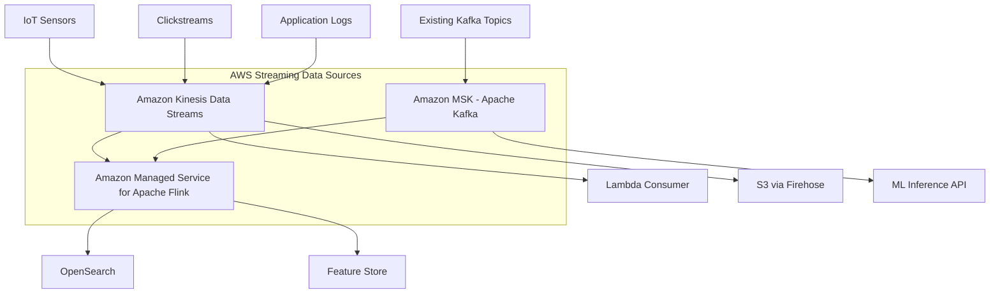
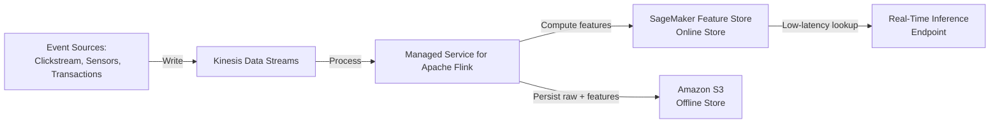
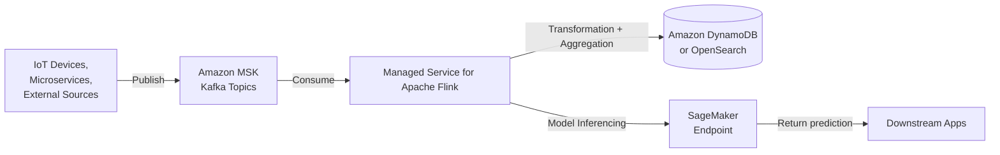

# Task 1.1: Data Preparation for ML and AI - Collect and store data

## Skill 1.1.4: Use AWS streaming data sources to ingest data (for example, by using Amazon Kinesis, Apache Flink, Apache Kafka)

---

## Overview

Streaming ingestion is the capacity to collect, process, and deliver data in real-time or near-real-time, as events happen, rather than waiting for batch processing windows. For machine learning and AI workloads, this is crucial when:

- **Real-time inference** requires fresh features (e.g., fraud detection, recommendation engines)
- **Continuous training** models need to learn from evolving data streams
- **Event-driven architectures** produce data continuously (e.g., clickstreams, IoT sensors, log events)
- **Time-sensitive AI applications** process data with minimal latency (e.g., anomaly detection, LLM applications consuming live text streams)

Understanding AWS streaming services—Amazon Kinesis, Amazon Managed Service for Apache Flink, and Amazon MSK—is essential for designing ingestion pipelines that are scalable, resilient, and suitable for ML workloads.

---

## Why Streaming Matters for ML/AI

Traditional batch processing collects data into files (e.g., Parquet in Amazon S3) and runs ETL jobs on a schedule. While appropriate for many training workflows, batch processing introduces **data latency** and cannot support:

- Feature computation in real time
- Incremental model updates
- Immediate response to events (e.g., blocking a fraudulent transaction)

Streaming ingestion bridges the gap between data generation and data consumption. It enables ML systems to react to changes in data distributions, maintain fresh online feature stores, and power low-latency inference pipelines.

---

## Core AWS Streaming Services

### 1. Amazon Kinesis Data Streams

Amazon Kinesis Data Streams is a massively scalable, durable, and low-latency streaming service. It ingests continuous streams of records and allows multiple consumers to process them in real time.

| Characteristic | Description |
| --- | --- |
| **Data unit** | Record (up to 1 MB) |
| **Shard** | A uniquely identified sequence of records; each shard provides 1 MB/sec write and 2 MB/sec read |
| **Retention** | 1 to 365 days; default 24 hours |
| **Consumption model** | Pull-based using KCL (Kinesis Client Library) or AWS Lambda consumers |
| **Ordering** | Preserved within a shard; not across shards unless partition key is carefully chosen |
| **Typical use** | Stream processing, real-time ML feature pipelines, log ingestion, event sourcing |

#### When to Choose Kinesis Data Streams
- You need a native AWS, fully managed streaming solution
- Multiple consumers must independently read the same stream
- You want integration with many AWS services (Lambda, Firehose, Managed Flink, Glue Streaming)

---

### 2. Amazon Managed Service for Apache Flink (formerly Kinesis Data Analytics)

Amazon Managed Service for Apache Flink runs Apache Flink applications on AWS infrastructure. Apache Flink is an open-source, distributed processing engine for **stateful computations** over unbounded and bounded data streams.

| Characteristic | Description |
| --- | --- |
| **Processing model** | Event-at-a-time or micro-batching within Flink |
| **State management** | Exactly-once semantics, checkpointing, and savepoints (built into Flink) |
| **Key capabilities** | Windowing, event-time processing, complex event processing, CEP, SQL and DataStream APIs |
| **Integration** | Connectors for Kinesis Data Streams, MSK (Kafka), S3, OpenSearch, DynamoDB, and more |
| **Typical use** | Complex transformations on streaming data (e.g., aggregating events over sliding windows, joining multiple streams, running ML inferencing on streaming records) |

#### When to Choose Managed Service for Apache Flink
- You need sophisticated stream processing with windowing, joins, and state
- You want SQL-based or Java/Scala-based stream processing on managed infrastructure
- You need exactly-once processing guarantees

---

### 3. Amazon Managed Streaming for Apache Kafka (Amazon MSK)

Amazon MSK provides fully managed Apache Kafka clusters, including Kafka Connect and Kafka Streams. Kafka is a highly popular open-source distributed event streaming platform used by many organizations already.

| Characteristic | Description |
| --- | --- |
| **Data unit** | Record (key, value, timestamp) |
| **Topic** | A category/feed name under which records are published |
| **Partition** | A topic's shard; provides parallelism and ordering within a partition |
| **Retention** | Configurable (e.g., days to years) |
| **Consumption model** | Pull-based using consumer groups |
| **Typical use** | Replacing self-managed Kafka, hybrid cloud streaming, using Kafka ecosystem tools (Kafka Connect, Kafka Streams, Schema Registry) |

#### When to Choose Amazon MSK
- Your organization is already standardized on Kafka
- You need to reuse Kafka clients, tools, and connectors
- You require Kafka-specific features (e.g., consumer group rebalancing, Kafka ecosystem)

---

## Comparing the Three Services

### Service Selection Quick Reference

| Need | Best Service Choice |
| --- | --- |
| Simple, native AWS streaming with low operational overhead | **Kinesis Data Streams** |
| Complex transformations (windowed aggregates, multi-stream joins, stateful processing) | **Managed Service for Apache Flink** |
| Existing Kafka integration and ecosystem | **Amazon MSK** |
| Stream data into an ML feature store in real time | **Kinesis Data Streams + Managed Flink** (or a custom stream processor) |
| Replacing on-premises Kafka without re-architecting | **Amazon MSK** |

---

## Streaming Ingestion for ML/AI: Architecture Patterns

### Pattern 1: Real-Time Feature Engineering

**Explanation:**
- Events are ingested into Kinesis Data Streams.
- A Flink application reads events, applies transformations, aggregates over windows (e.g., "average transaction amount over last 10 minutes"), and writes the computed features to SageMaker Feature Store's online store.
- The online feature store serves features to real-time inference endpoints (e.g., SageMaker Endpoint) with low latency.
- Raw events and computed features may also be archived to S3 for offline training, ensuring **training-serving consistency**.

---

### Pattern 2: High-Volume Stream Processing with Kafka

**Explanation:**
- Existing Kafka producers publish to MSK topics.
- A Flink application consumes from MSK, performs event-time processing, and calls a SageMaker endpoint to obtain predictions on the fly.
- Predictions and enriched events are written to DynamoDB or OpenSearch for later retrieval.

---

## Capacity and Scalability for Streaming

### Shards in Kinesis Data Streams

- Each shard supports:
  - **Write throughput:** 1 MB/sec or 1,000 records/sec
  - **Read throughput:** 2 MB/sec per shard (or 5 read transactions/sec for standard consumers)
- **Total stream capacity** = sum of shard capacities.
- **Scaling** = adding or removing shards. You can split shards (to increase capacity) or merge shards (to reduce cost).

#### Problem: Consumer Falling Behind
A common issue in streaming pipelines: a consumer (e.g., Lambda or a processing job) falls further behind the incoming record rate. Root cause analysis:

| Symptom | Root Cause | Remedy |
| --- | --- | --- |
| Iterator age / consumer lag grows over time | Insufficient consumer parallelism or throughput | Add more consumer instances/threads, use enhanced fan-out (Kinesis Data Streams) |
| Consumer reads are fast but downstream storage write is slow | Bottleneck is the sink (e.g., DynamoDB provisioned throughput, OpenSearch cluster overloaded) | Scale up or optimize the sink; do not add consumer capacity |
| Kinesis Data Streams IteratorAge metric increases while Lambda invocations are throttled | Lambda reserved concurrency limits | Raise Lambda concurrency, provision more shards |

> **Exam Tip:** Always identify the **bottleneck** in the pipeline before recommending scaling. In a scenario where the sink (e.g., DynamoDB table, S3 bucket, OpenSearch) is at its limit, adding consumer capacity only shifts the backlog and does not resolve the issue.

---

### Partitions in MSK (Kafka)

- Partitions define parallelism in Kafka. Each partition is an ordered, immutable sequence of records.
- **Throughput** scales with partition count.
- **Consumer groups** balance partitions among consumers. Maximum parallelism = number of partitions in the topic.
- **Replication factor** controls durability and availability across broker nodes.

---

## Streaming Consumer Types (Kinesis Data Streams)

| Consumer Type | Description |
| --- | --- |
| **Shared (standard) consumer** | All consumers share read throughput (2 MB/sec per shard across all consumers) |
| **Enhanced fan-out (EFO) consumer** | Each consumer gets dedicated 2 MB/sec per shard read throughput; lower latency (~70 ms) vs ~200 ms for standard |
| **Lambda consumers** | Automatically poll the stream and invoke function synchronously; no need to manage KCL |
| **Kinesis Client Library (KCL)** | A library for building custom consumers with checkpointing, resharding support, and load balancing |

For ML real-time inference pipelines that demand strict latency SLAs, **Enhanced Fan-Out** or **Lambda consumers** are preferred because they reduce end-to-end latency.

---

## Integrating Multiple Streams with AWS Glue Streaming

AWS Glue Streaming ETL jobs (built on Spark Structured Streaming) can also consume from Kinesis Data Streams or MSK. This is useful for organizations that prefer serverless Spark for stream processing rather than managing Flink jobs. Glue Streaming jobs can:

- Read from Kinesis or Kafka (MSK or self-managed)
- Perform SQL transformations on streaming DataFrames
- Write to S3, OpenSearch, DynamoDB, etc.

**When to choose Glue Streaming over Managed Flink?**
- You are already using Spark and prefer its DataFrame APIs.
- You want a serverless, visual ETL tool for streaming.
- You need simpler stateful operations; Flink is more mature for complex event time and state management.

---

## Scenario-Based Exam Examples

### Scenario 1: Fraud Detection in Real Time

**Problem:**  
A financial institution processes credit card transactions and needs to detect fraudulent activity within 10 seconds of a transaction. The system receives 10,000 transactions per second. Each transaction must be enriched with features like "average transaction amount by card in last 5 minutes" before being sent to a fraud detection model.

**Question:**  
Which AWS streaming architecture will best meet the latency and throughput requirements while allowing real-time feature computation?

**Options:**
- A. Ingest transactions into Kinesis Data Streams, process with an AWS Lambda consumer that writes raw events to S3, then a nightly batch job computes features and trains a model.
- B. Ingest transactions into Kinesis Data Streams, use Amazon Managed Service for Apache Flink with a sliding window aggregation to compute features per card, and publish features to a low-latency store (e.g., SageMaker Feature Store online store) for model inferencing.
- C. Ingest transactions into Amazon MSK, use Kafka Connect to move records to S3, then use Amazon Athena to query features on-demand.
- D. Ingest transactions into Amazon S3 using multipart upload, run a Spark job every 5 minutes to compute features.

**Correct Answer: B**

**Explanation:**
- **B** provides real-time feature computation with event-time windows (Flink) and low-latency feature storage for immediate inference. Kinesis Data Streams handles the high ingest rate through sharding. Flink's windowing aggregations compute features over sliding windows in near-real time. Publishing to an online feature store (or DynamoDB) allows the fraud detection model endpoint to retrieve features in milliseconds.
- **A** is a batch pipeline with latency of hours; fails the 10-second SLA.
- **C** moves data to S3 via Kafka Connect (still batch-oriented for analytics) and Athena is not designed for low-latency feature lookups.
- **D** uses file-based ingestion with periodic batch processing; not a streaming solution.

---

### Scenario 2: Scaling an Overloaded Stream Processor

**Problem:**  
A real-time log processing system ingests into Kinesis Data Streams with 10 shards. A Flink application reads from the stream and writes enriched records to DynamoDB. The DynamoDB table's provisioned write capacity is 400 WCU. Users report a growing backlog in the stream. Metrics show Kinesis IteratorAge is accumulating, but the Flink application CPU utilization is low (20%). DynamoDB WriteThrottleEvents is high.

**Question:**  
What is the most effective action to eliminate the backlog?

**Options:**
- A. Add more shards to Kinesis Data Streams.
- B. Increase the Flink application's parallelism.
- C. Increase the DynamoDB table's provisioned write capacity.
- D. Use Enhanced Fan-Out consumers.

**Correct Answer: C**

**Explanation:**
- The root cause is the DynamoDB write throttling. High WriteThrottleEvents and low Flink CPU indicate the processing logic is not busy; it is blocked on writes. Increasing DynamoDB WCU removes the bottleneck.
- **A** does not address the sink bottleneck.
- **B** adds processing capacity that will also be throttled by DynamoDB.
- **D** improves read throughput but does not solve downstream write limitation.

---

### Scenario 3: Choosing Between Kinesis and MSK

**Problem:**  
A company has a large existing on-premises Kafka deployment. They want to migrate to AWS without rewriting their Kafka producers and consumers. They also want to use Kafka Streams for stateful processing.

**Question:**  
Which AWS service should they use to minimize migration effort and preserve the Kafka ecosystem?

**Options:**
- A. Amazon Kinesis Data Streams with the Kinesis Client Library
- B. Amazon Managed Streaming for Apache Kafka (Amazon MSK)
- C. Amazon Managed Service for Apache Flink
- D. AWS Glue Streaming ETL

**Correct Answer: B**

**Explanation:**
- MSK is a fully managed Apache Kafka service compatible with existing Kafka clients, tools, connectors, and Kafka Streams. It minimizes migration effort because no application code changes are required.
- Kinesis Data Streams uses a different API and would require rewriting producers/consumers.
- Managed Flink is a stream processing engine, not a Kafka replacement.
- AWS Glue Streaming is a Spark-based ETL tool, not a Kafka platform.

---

## Exam Tips and Traps

### Tips

1. **Know the differences among streaming services:**
   - Kinesis Data Streams = raw stream storage (like Kafka).
   - Managed Flink = stream processing engine (stateful, windowing, joins).
   - MSK = managed Kafka (open source) for teams familiar with Kafka.

2. **Associate specific use cases:**
   - Real-time feature engineering → Kinesis Data Streams + Managed Flink (or Lambda) + SageMaker Feature Store.
   - Complex event processing, windowed aggregates → Managed Flink.
   - Migrating Kafka workloads → Amazon MSK.

3. **Shard math:**
   - Know the write capacity of a Kinesis shard: 1 MB/sec or 1,000 records/sec.
   - Read capacity: 2 MB/sec per shard; Enhanced Fan-Out provides 2 MB/sec per consumer per shard.
   - Be prepared to calculate required shards based on throughput.

4. **Lambda as a Kinesis consumer:**
   - Lambda automatically polls the stream, invokes function per batch, and manages checkpoints.
   - Parallelism is limited by Lambda concurrency; if insufficient, the event source mapping will lag.

5. **Flink semantics:**
   - Flink provides exactly-once processing guarantees.
   - Managed Flink integrates with Kinesis and Kafka via connectors.
   - Flink can be used for both batch and stream processing.

6. **Retention:**
   - Kinesis Data Streams default retention = 24 hours, max 365 days.
   - MSK retention is configurable per topic (often longer than Kinesis default).
   - These matter when consumers fail or need to replay old data.

### Traps

1. **"Streaming is always better than batch."**  
   Not true. Batch can be more cost-effective for offline training datasets. Choose based on latency requirements. The MLA-C02 exam expects you to justify streaming only when real-time or near-real-time processing is needed.

2. **Assuming Lambda can process unlimited records per shard.**  
   Each Kinesis shard can invoke Lambda at a certain rate. If Lambda concurrency is exhausted or the function is slow, lag accumulates. This is a classic exam trap: adding more shards may not help if the Lambda function itself is the bottleneck.

3. **Adding consumer capacity when the sink is blocked.**  
   Always identify the bottleneck. If downstream services (DynamoDB, OpenSearch, S3) are throttling, adding consumers worsens the backlog elsewhere. Fix the sink first.

4. **Confusing Kinesis Data Firehose with Kinesis Data Streams.**  
   - **Kinesis Data Streams** = streaming storage with consumer pull model.
   - **Kinesis Data Firehose** = fully managed delivery/ETL service that writes to S3, Redshift, OpenSearch, Splunk, etc. Firehose is not a stream you consume from; it is a sink service that buffers and delivers.
   - The exam may ask which to use: for custom processing, use Data Streams; for direct sink-based delivery, use Firehose.

5. **Not recognizing when MSK is preferred over Kinesis.**  
   If a scenario emphasizes existing Kafka tools, consumer groups, or Kafka Connect, choose MSK. If it mentions AWS-native integrations (Lambda, Firehose, Kinesis Data Analytics), choose Kinesis.

6. **Underestimating ordering guarantees.**  
   Ordering is only preserved within a shard (Kinesis) or within a partition (Kafka). If the use case requires global ordering (rare), you must use a single shard or partition, which limits scalability and is rarely practical.

---

## Summary Table

| Service | Use Case | Key Characteristics |
| --- | --- | --- |
| **Amazon Kinesis Data Streams** | Real-time data ingestion; multiple independent consumers; ML feature pipelines | Shards, 1 MB/sec write per shard, 24 h–365 d retention, Lambda/KCL/EFO consumers |
| **Amazon Managed Service for Apache Flink** | Stateful stream processing; windowing; joins; event-time processing | Exactly-once, checkpointing, connectors to Kinesis and Kafka, Java/Scala/SQL APIs |
| **Amazon MSK** | Managed Kafka; migrating existing Kafka workloads; Kafka ecosystem | Topics, partitions, consumer groups, Kafka Connect, Kafka Streams |
| **AWS Glue Streaming ETL** | Serverless Spark for streaming transformations | Spark Structured Streaming, SQL, visual ETL, integrates with Kinesis/MSK |

---

## Key Takeaways

- **Streaming ingestion is not about replacing batch; it's about latency reduction.** For real-time ML inference and feature freshness, streams are essential.
- **The three core AWS streaming services are Kinesis Data Streams, Managed Service for Apache Flink, and Amazon MSK.** Know when to use each.
- **Always diagnose the pipeline bottleneck** before recommending scaling. Sink bottlenecks are common and misdiagnosed.
- **Feature stores and streaming go hand-in-hand.** Real-time feature computation from streams into SageMaker Feature Store enables consistent training and inference.
- **Reach for patterns before products:** A streaming architecture for ML usually includes ingestion (streams), processing (Flink or Lambda), and feature storage (Feature Store online store) + offline archive (S3).