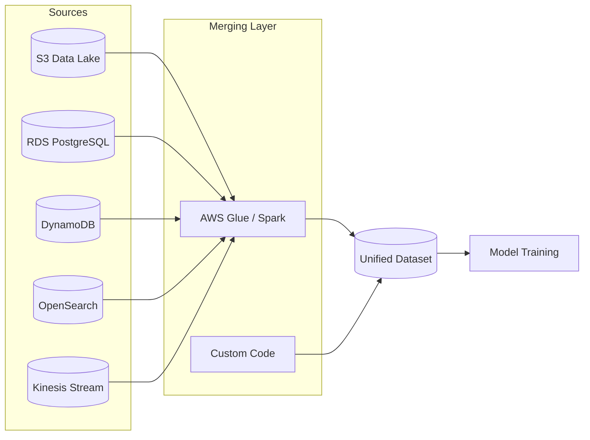
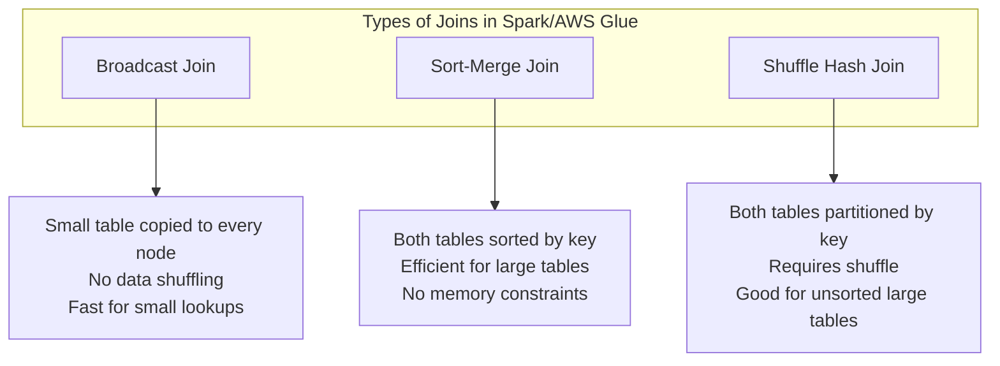
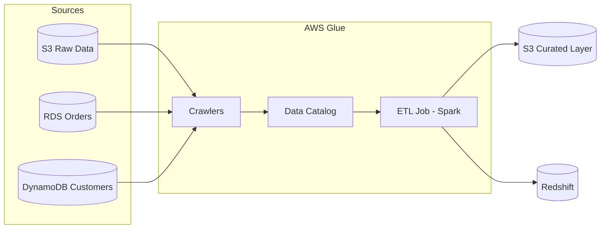
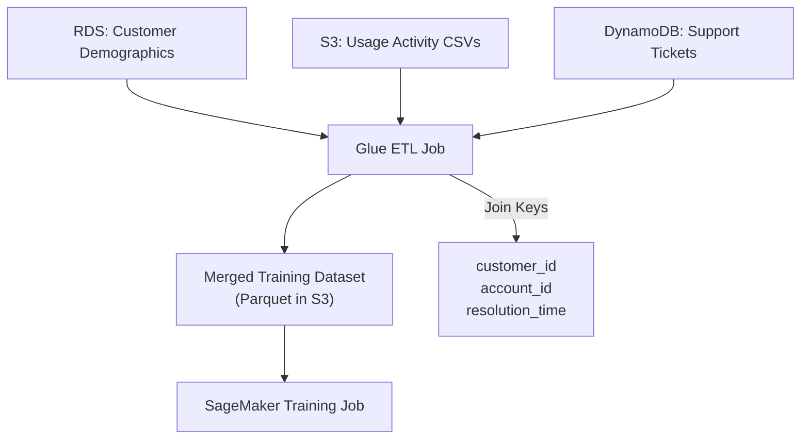
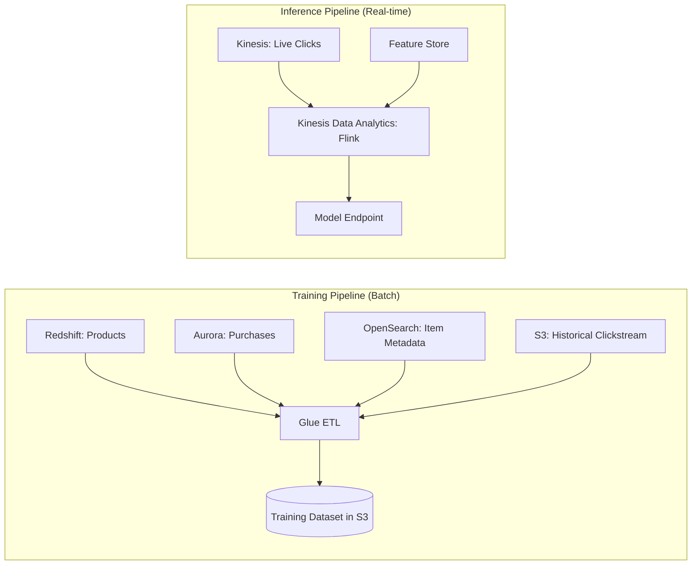
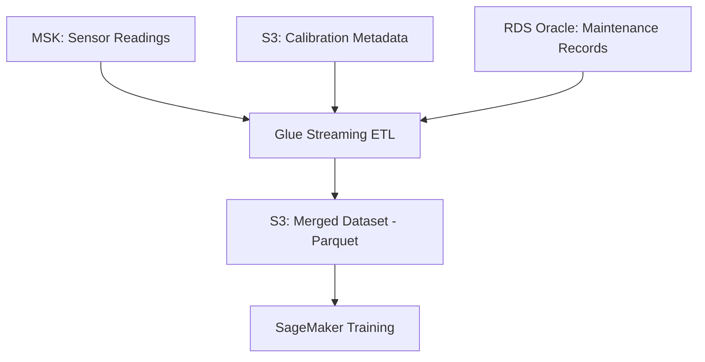

# Task 1.1: Data Preparation for ML and AI - Collect and store data

## Skill 1.1.6: Merge data from multiple sources (for example, by using programming techniques, AWS Glue, Apache Spark)

### Table of Contents

1. [Concept Overview](#concept-overview)
2. [Why Merging Data Matters for ML](#why-merging-data-matters-for-ml)
3. [Core Merging Techniques](#core-merging-techniques)
4. [AWS Services and Tools for Data Merging](#aws-services-and-tools-for-data-merging)
5. [Choosing the Right Tool for the Job](#choosing-the-right-tool-for-the-job)
6. [Scenario-Based Examples](#scenario-based-examples)
7. [Exam Tips and Traps](#exam-tips-and-traps)
8. [Summary](#summary)

---

### Concept Overview

Merging data from multiple sources is the process of combining disparate datasets into a unified, coherent dataset suitable for model training, validation, or inference. In the context of ML workloads on AWS, sources often include:

- **Data lakes** (Amazon S3)
- **Relational databases** (Amazon RDS, Amazon Aurora)
- **NoSQL databases** (Amazon DynamoDB)
- **Search indexes** (Amazon OpenSearch Service)
- **Streaming sources** (Amazon Kinesis Data Streams, Amazon MSK)
- **Data warehouses** (Amazon Redshift)

Merging is not simply concatenating rows. It involves:

| Merging Activity | Description | Example |
|---|---|---|
| **Joining** | Combining columns from different sources based on a common key. | Joining customer demographics from an RDS table with clickstream events from S3 using `customer_id`. |
| **Unioning** | Stacking rows with identical schemas from multiple partitions or sources. | Combining daily sales records from multiple regional databases into one dataset. |
| **Deduplication** | Removing duplicate records that appear across sources. | Same user registered in both the web and mobile app; deduplicate by email. |
| **Conflict Resolution** | Deciding which source wins when fields disagree. | Billing address differs between CRM and payment gateway; choose CRM as authoritative. |
| **Enrichment** | Adding computed or external data to enhance existing records. | Adding zip-code-level census income data to customer transaction records. |

### Why Merging Data Matters for ML

A machine learning model is only as good as the data it's trained on. Critical insights often span multiple systems:

- A customer churn model may need demographic data (RDS), transaction history (S3/Redshift), and support interactions (DynamoDB logs).
- A fraud detection model may need transaction records (DynamoDB), device fingerprints (S3), and historical fraud labels (RDS).
- A recommendation engine may need user profiles (RDS), item metadata (S3), and real-time clickstream data (Kinesis).

**Key challenges when merging:**

1. **Schema differences:** `customer_id` vs. `cust_id` vs. `customer_uuid` across systems.
2. **Data type mismatches:** `order_date` stored as `VARCHAR` in one system and `TIMESTAMP` in another.
3. **Missing keys:** Some records lack the join key entirely.
4. **Data quality issues:** Null values, inconsistent formatting, duplicate records.
5. **Volume:** Source systems may contain terabytes of data, making merging a distributed computing problem.

### Core Merging Techniques

#### 1. Join Techniques in Distributed Systems

When merging data using Apache Spark or AWS Glue, the choice of join strategy has significant performance implications:

| Join Type | Description | Use Case |
|---|---|---|
| **Broadcast Join** | Smaller dataset is copied to each worker node in memory. | When one side of the join is small enough to fit in memory (e.g., a lookup table of product categories). |
| **Sort-Merge Join** | Both datasets are sorted by the join key and merged. | When both datasets are large and cannot be broadcast. |
| **Shuffle Hash Join** | Both datasets are partitioned by the join key across worker nodes. | When both datasets are large and unsorted. |

**Key Principle:** Always broadcast the smaller dataset. In AWS Glue and Spark, you can hint the optimizer to broadcast small tables using broadcast hints. This avoids expensive shuffle operations.

#### 2. Data Federation vs. Data Integration

| Approach | Description | When to Use |
|---|---|---|
| **Data Federation** | Query across disparate sources without physically moving/merging data. | Ad-hoc analysis, real-time queries, when moving data is impractical or costly. |
| **Data Integration (ETL/ELT)** | Extract data from sources, transform/merge it, and load it into a target destination. | Model training, historical analysis, curated datasets. |

AWS Glue supports both:
- **Federation:** Via connectors to RDS, Redshift, DynamoDB, and Athena (with Lake Formation).
- **Integration:** Via Glue ETL jobs that pull data, merge/transform it with Spark, and write to S3 or databases.

### AWS Services and Tools for Data Merging

#### 1. AWS Glue

AWS Glue is a serverless data integration service that provides:

| Component | Description |
|---|---|
| **AWS Glue Data Catalog** | Persistent metadata repository. Stores table definitions, schemas, partition information. |
| **AWS Glue Crawlers** | Discover data schemas from S3, RDS, DynamoDB, and other sources automatically. Populate the Data Catalog. |
| **AWS Glue ETL Jobs** | Serverless Spark jobs that extract, transform, and load data. Can merge multiple sources. |
| **AWS Glue Workflows** | Orchestrate multiple Glue jobs and crawlers into a pipeline. |
| **AWS Glue Studio** | Visual interface for building ETL jobs without writing code. |

**Advantages of AWS Glue for merging:**
- Fully serverless - no cluster management.
- Auto-scaling based on workload.
- Built-in connectors for many AWS services.
- Pay-per-run pricing.

#### 2. Apache Spark (Amazon EMR, AWS Glue)

Apache Spark is the underlying engine for many data merging tasks. Key concepts:

| Spark Concept | Description | ML Relevance |
|---|---|---|
| **DataFrame** | Distributed collection of rows organized into columns. | Primary structure for merging and feature engineering. |
| **Transformations** | Lazy operations (e.g., `join`, `filter`, `groupBy`). | Define merge logic without immediate execution. |
| **Actions** | Trigger actual execution (e.g., `write`, `count`, `collect`). | Materialize the merged dataset. |
| **Partitioning** | How data is distributed across cluster nodes. | Critical for join performance. |

**Amazon EMR** provides managed Spark clusters for large-scale merging jobs when more control over the environment is needed than AWS Glue provides.

#### 3. Programming Techniques

When the merge logic is too complex for SQL or visual tools, custom code is used. Common approaches:

| Approach | Tool | Usage |
|---|---|---|
| **Pandas/NumPy (Python)** | EC2, SageMaker notebooks | Small to medium datasets (fits in memory). |
| **Dask** | EC2, SageMaker notebooks | Parallel DataFrame operations on large datasets. |
| **Apache Spark (PySpark/Scala)** | EMR, Glue | Large-scale distributed merges. |

### Choosing the Right Tool for the Job

| Scenario | Best Tool | Why |
|---|---|---|
| Small dataset (<100k rows), one-time merge | Pandas / Python code | Simple, fast to develop, no cluster overhead. |
| Medium dataset, periodic merge | AWS Glue | Serverless, scheduled, no cluster management. |
| Large dataset (TB+), complex transformations | Amazon EMR with Spark | More control over cluster configuration. |
| Ongoing, scheduled merges with dependencies | AWS Glue Workflows | Orchestrates crawlers, jobs, and dependencies. |
| Ad-hoc SQL-based merges | Amazon Athena | Query sources in place, no ETL needed. |
| Real-time merging from streaming sources | Kinesis Data Analytics (Apache Flink) | Process records as they arrive, join with reference data. |

### Scenario-Based Examples

#### Scenario 1: Customer Churn Model

>*A company wants to build a customer churn prediction model. Customer demographic data is in an RDS PostgreSQL database. Usage activity data is in S3 as daily CSV files. Support ticket data is in DynamoDB. You need to merge all three into a single training dataset.*

**Solution:**

1. **Schema alignment:** All three systems have a `customer_id` field, but RDS calls it `customer_id`, DynamoDB calls it `cust_id`, and S3 CSVs have `customer_identifier`. Map all to `customer_id`.
2. **Join strategy:** Support tickets (DynamoDB) are small (~5MB). Use a broadcast join for DynamoDB data.
3. **Data type handling:** RDS stores timestamps as `TIMESTAMP`, S3 CSVs store them as strings. Convert both to a consistent format.
4. **Conflict resolution:** The system of record for customer status is RDS. If DynamoDB has a different `status` field, RDS wins.
5. **Deduplication:** Some customers appear more than once in S3 usage data (daily rows). Aggregate to monthly features.
6. **Output format:** Write as Apache Parquet for efficient future reads.

---

#### Scenario 2: E-Commerce Recommendation Engine

>*An online retailer wants to build a recommendation model. Product catalog is in Redshift. Clickstream events are streaming into Kinesis Data Streams. User purchase history is in Aurora PostgreSQL. Item metadata is in OpenSearch. You need to merge these for model training.*

**Solution:**

This scenario involves **batch merging** (for training) and **real-time merging** (for inference).

For training:
- Extract product data from Redshift using Glue connector.
- Extract purchase history from Aurora using Glue connector.
- Export item metadata from OpenSearch.
- Merge all on `product_id` and `user_id`.
- Enrich clickstream data with product category, price, and user segment.

For inference:
- Live clickstream events are joined with precomputed features from SageMaker Feature Store using Kinesis Data Analytics (Apache Flink).

**Key exam point:** Recognize when batch ETL suffices for merging (training) vs. when streaming merge capabilities are needed (real-time inference).

---

#### Scenario 3: Sensor Data for Predictive Maintenance

>*An industrial company has IoT sensors sending data to Amazon MSK (managed Kafka). Calibration metadata for each sensor is in Amazon S3 as JSON files. Maintenance records are in an Oracle database running on RDS. You need to merge sensor readings with calibration data and maintenance history.*

**Solution:**

1. **Streaming + batch merge:** Sensor readings are streaming (MSK), while calibration and maintenance data are batch (S3, RDS).
2. **Glue Streaming ETL job:** Reads from MSK, joins with reference data (calibration, maintenance) loaded from S3 and RDS.
3. **Time alignment:** Maintenance records have timestamps; match them to sensor readings within the same time window.
4. **Missing data handling:** Some sensors may not have calibration data. Use a left join and flag missing values.
5. **Data volume:** Sensor readings are high-volume. Use appropriate partitioning in S3 (by sensor_id, date).

---

#### Scenario 4: Merging Multiple Data Lakes with Entity Resolution

>*A healthcare company has two separate data sources: patient records in an Aurora PostgreSQL database and lab results in S3 as Parquet files. Both have "patient-like" records, but the patient identifiers don't match (one uses patient_id, the other uses member_id). Both systems contain overlapping records with some discrepancies.*

**Solution:**

This is a classic **entity resolution** problem involving fuzzy matching and conflict resolution.

| Step | Action | Tool/Technique |
|---|---|---|
| 1. Establish keys | Determine that `patient_id` and `member_id` map to the same entity via a master patient index. | Glue ETL job with a mapping table. |
| 2. Normalize fields | Standardize date formats, gender values (`M/Male/M` → `M`), address formatting. | Glue transformations. |
| 3. Deduplicate | Identify records appearing in both systems. | Fuzzy matching (e.g., name + date of birth similarity score). |
| 4. Resolve conflicts | Define rules: Aurora is authoritative for demographics; S3 is authoritative for lab values. | Glue job logic: `COALESCE` with source priority. |
| 5. Flag unresolved | Mark records that couldn't be definitively merged for manual review. | Output to a `flagged_records` table in RDS. |

**Exam concept:** When sources have different keys, the first step is **not** to decide storage class or compute instances. It's to establish **entity resolution rules** and **conflict resolution priorities**.

### Exam Tips and Traps

#### ✅ Tips

| Tip | Explanation |
|---|---|
| **Start with the Data Catalog** | In AWS Glue, crawlers populate the Data Catalog, which serves as the central metadata repository. ETL jobs reference catalog tables, making schemas reusable and avoiding schema drift. |
| **Choose the right join type** | For merges involving a small lookup table and a large fact table, use a **broadcast join**. For two large tables, use a **sort-merge join** for efficiency. |
| **Handle schema drift** | When merging data from systems that evolve independently, use Glue crawlers to detect new columns and configure ETL jobs to handle missing or extra columns gracefully. |
| **Prefer columnar output** | After merging, write the unified dataset in **columnar format** (Parquet/ORC). This reduces subsequent query costs and improves training job read performance. |
| **Use the Glue Data Catalog for reuse** | Once you've merged and cataloged a dataset, downstream consumers (Athena, SageMaker, Redshift Spectrum) can reference it via the catalog without knowing the merge details. |
| **Think about partition strategy** | When merging large datasets, partition the output by high-cardinality, frequently-filtered columns (e.g., `date`, `region`). This dramatically reduces scan time for future jobs. |
| **Handle data drift and schema evolution** | Source systems change over time. Design merge jobs to handle new columns (schema evolution) without failing. Glue's dynamic frames can accommodate schema drift more gracefully than DataFrames. |

#### ⚠️ Traps

| Trap | Explanation |
|---|---|
| **Choosing storage class before resolving data quality** | If two sources disagree on a field, writing the merged output to a cheaper S3 storage class doesn't fix the data problem. Resolve conflicts first. |
| **Adding compute capacity to fix downstream bottlenecks** | If a merge job is slow because the target database (e.g., RDS) has low write throughput, adding more Spark nodes won't help. The bottleneck is the target. |
| **Using row-based formats for analytical workloads** | If you write the merged dataset as CSV or JSON, future analytic queries will scan entire rows. Use columnar formats (Parquet, ORC) for columnar access patterns. |
| **Confusing vector stores with feature stores** | Merging data into a vector store answers *similarity* questions (e.g., "which items are close to this embedding?"). Merging data into a feature store answers *identity* questions (e.g., "what are this entity's current features?"). Don't confuse the two. |
| **Ignoring conflict resolution** | If a customer's `status` is `active` in RDS but `inactive` in DynamoDB, simply merging rows will produce inconsistent records. Always define which system is authoritative. |
| **Ignoring data type differences** | `order_date` as `VARCHAR(10)` in one source and `TIMESTAMP` in another will cause join failures. Always normalize types before joining. |
| **Assuming "merge" means "append"** | Merging involves joining, deduplicating, and reconciling. Simply appending rows from source B to source A is not a proper merge. |
| **Broadcasting a large table** | Only broadcast small tables. Broadcasting a table larger than memory will cause `OOM` (out of memory) errors and job failures. |

### Summary

**Merging data from multiple sources** is a foundational skill for the AWS Certified Machine Learning - Associate exam. Key takeaways:

1. **Understand the tools:**
   - **AWS Glue** for serverless ETL and cataloging.
   - **Apache Spark (EMR)** for large-scale, complex merges.
   - **Custom code (Pandas/Dask)** for smaller, more ad-hoc merges.

2. **Master the techniques:**
   - Choose the right join type (broadcast, sort-merge, shuffle hash).
   - Normalize schemas and data types before merging.
   - Handle duplicate records and resolve conflicts based on defined authority rules.
   - Design partitions and output formats aligned with downstream access patterns.

3. **Think about the full pipeline:**
   - Crawl sources → populate catalog → merge → write to curated storage → train model.
   - Consider streaming merges for real-time inference, not just batch for training.

4. **Anticipate exam scenarios:**
   - Questions often test whether you can identify the right AWS service/tool for a given merge task.
   - They may present a scenario where the "obvious" solution (e.g., adding more nodes) doesn't fix the real problem (e.g., a slow write target).
   - Always consider data governance (who is authoritative when sources conflict) and performance (join strategy, output format) when choosing an architecture.

By mastering these merging concepts, you'll be well-prepared to design robust data pipelines for ML workloads on AWS and to tackle related exam questions with confidence.