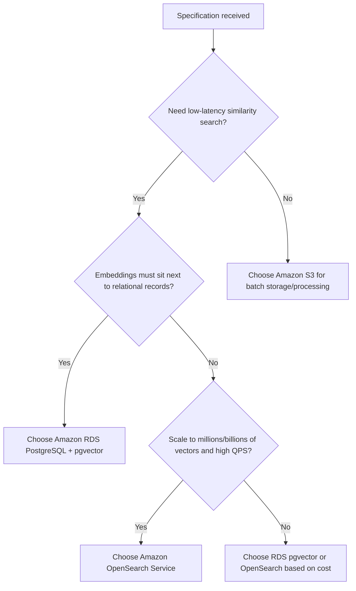

# Task 1.1: Data Preparation for ML and AI - Collect and store data.
## Skill 1.1.7: Configure scalable vector databases for AI applications (for example, OpenSearch Service, Amazon RDS with pgvector, Amazon S3) based on specifications.

---

## 1. Introduction

Modern AI applications—such as retrieval-augmented generation (RAG), semantic search, recommendation systems, and anomaly detection—often rely on **vector embeddings**. These embeddings are dense numerical representations of unstructured data (text, images, audio) that capture semantic meaning. To use embeddings effectively, you need a **scalable vector store** that can:

- Store millions or billions of vectors.
- Perform fast **similarity search** (finding nearest neighbors in high-dimensional space).
- Scale horizontally or vertically to meet latency, throughput, and cost requirements.
- Integrate with existing data pipelines and storage systems.

On AWS, you can choose among several services to act as a vector store, depending on your specifications. The three commonly referenced options in the exam are:

| Service | Nature | Typical role |
|---|---|---|
| **Amazon OpenSearch Service** | Managed search and analytics engine with k-NN plugin | Low-latency, high-throughput vector similarity search for production applications |
| **Amazon RDS for PostgreSQL with pgvector** | Managed relational database with a vector extension | Store embeddings alongside relational records, enabling SQL joins and moderate-scale vector search |
| **Amazon S3** | Object storage | Durable, low-cost storage for embeddings; used for batch processing, data lakes, and as a source for indexing |

This study note explains how to configure these options based on specifications, when to choose each, and what pitfalls to avoid.

---

## 2. Core Concepts

### 2.1 Embeddings and Vectors

- **Embedding**: A fixed-length array of floating-point numbers (e.g., 384, 768, 1536 dimensions) produced by an embedding model.
- **Vector**: The mathematical representation; each dimension captures a latent feature of the original data.
- **Similarity Metrics**:
  - **Euclidean distance (L2)**: Actual straight-line distance; smaller means more similar.
  - **Cosine similarity**: Measures the angle between vectors; often used for text and image embeddings; larger means more similar (range -1 to 1).
  - **Inner product (dot product)**: Often used for learned embeddings where magnitude matters.

The choice of metric must match the one used during model training. For example, if an embedding model was trained with cosine similarity, use cosine for retrieval.

### 2.2 Exact vs. Approximate Nearest Neighbor (ANN)

- **Exact k-NN**: Compares the query vector against **every** stored vector. Accurate but does not scale to millions of vectors because it requires high CPU/memory per query.
- **Approximate Nearest Neighbor (ANN)**: Uses specialized index structures (e.g., HNSW, IVF) to trade a small amount of accuracy for massive speed and scale.

For scalable AI applications, you almost always use **ANN** for similarity search.

---

## 3. AWS Services for Vector Storage

### 3.1 Amazon OpenSearch Service

**Amazon OpenSearch Service** is a fully managed search and analytics service that supports **vector search** through its built-in **k-NN plugin**.

#### How It Works
- You create an index where one field is mapped as a `knn_vector` with a specified dimension and similarity metric.
- You can configure an **algorithm**:
  - **HNSW (Hierarchical Navigable Small World)**: Graph-based ANN; high recall, fast queries, but uses more memory.
  - **IVF (Inverted File Index)**: Partition-based ANN; often more memory efficient with large datasets but can have lower recall.
- OpenSearch can also perform **exact k-NN** using `script_score`, but this is slower and not recommended for large-scale production use.

#### Configuration Considerations
| Parameter | Guidance |
|---|---|
| **Instance type** | Choose memory-optimized instances (e.g., `r` or `m` families) because vector search relies heavily on RAM. |
| **Number of shards** | Distribute vectors across primary shards to scale horizontally. Each shard holds a subset of vectors and handles queries in parallel. |
| **Replicas** | Use at least one replica for high availability and read scaling. |
| **Vector memory** | Ensure total RAM on data nodes is sufficient to hold the vector index. Oversubscription leads to disk-based swapping and latency spikes. |
| **Engine / version** | Use OpenSearch 1.0 or later; verify k-NN plugin is enabled. |
| **Approximate vs. exact** | Choose **approximate** (HNSW or IVF) for scalable search. Use exact only for debugging or very small datasets. |

#### Scaling
OpenSearch Service scales horizontally by **adding data nodes** and increasing shard count; it also supports **UltraWarm** for older logs, but vector search requires data in the **hot tier**. For high query rates, add dedicated **coordinator nodes** or replicas.

#### When to Choose
- You need **low-latency** (<100 ms) similarity search for production RAG or semantic search.
- You expect **high query volumes** and need horizontal scaling.
- You want a managed service that handles cluster operations, patching, and monitoring.

> **Example configuration**: A RAG application serving 1,000 queries per second over 50 million embeddings (768 dims). Choose an OpenSearch domain with 6 `r6g.2xlarge` data nodes, 6 primary shards, 1 replica, and the HNSW algorithm.

---

### 3.2 Amazon RDS for PostgreSQL with pgvector

**Amazon RDS for PostgreSQL** supports the **pgvector** extension, which adds a `vector` data type and similarity operators directly into the database.

#### How It Works
- You enable the `pgvector` extension in a PostgreSQL database.
- A column of type `vector` stores embeddings.
- You can create indexes for approximate search:
  - **IVFFlat**: Partitions vectors into clusters based on centroids. Requires specifying a `lists` parameter. Better when data is loaded before indexing; not ideal for frequent incremental inserts.
  - **HNSW**: Graph-based index; supports incremental updates and gives better recall, but uses more memory and build time.

#### Configuration Considerations
| Parameter | Guidance |
|---|---|
| **Instance type** | Use memory-optimized instances because index building and similarity search are memory-intensive. |
| **`maintenance_work_mem`** | Increase to speed up index creation. |
| **Index type** | Choose HNSW for high recall and incremental workloads; IVFFlat for large, static datasets with memory constraints. |
| **Read replicas** | Add read replicas to scale read-heavy vector search queries. |
| **Storage** | RDS supports up to 64 TiB; vector data is stored in regular tables. |
| **Monitoring** | Watch CPU, RAM, and storage; scale vertically if needed. |

#### When to Choose
- You already store relational data in PostgreSQL, and you want to **keep embeddings next to their metadata** (e.g., product descriptions, user profiles).
- You need **SQL joins** between vector search and relational filtering.
- Your vector count is in the **millions** and query throughput is moderate.
- You require ACID transactions and existing PostgreSQL tooling.

#### Limitations
- **Single writer** primary; scaling writes is vertical.
- Not designed for **billions of vectors** or extremely high query rates.
- Similarity search may require **sequential scans** if indexes are not used or configured.

> **Example configuration**: A fraud detection system stores transaction embeddings in RDS PostgreSQL alongside transaction details. Enable pgvector, use HNSW index on a `vector(256)` column, and add a read replica for model inference queries.

---

### 3.3 Amazon S3 for Vector Data

**Amazon S3** is object storage—it does **not** natively perform similarity search. However, S3 is often listed as a component of scalable vector architectures because it provides durable, low-cost storage for embeddings.

#### How It Is Used
- **Batch storage**: Store embeddings as Parquet, JSON, or CSV files in S3.
- **Data lake**: Keep large volumes of embeddings that are processed periodically (e.g., monthly clustering, deduplication, batch similarity computation).
- **Source for indexing**: S3 acts as the landing zone for raw embeddings before they are loaded into a vector database (OpenSearch or pgvector).
- **Metadata queries**: Use Athena or AWS Glue to query metadata, but **not** to compute vector distances.

#### Configuration Considerations
| Aspect | Guidance |
|---|---|
| **File format** | Use columnar formats like Parquet for efficient scanning and compression. |
| **Partitioning** | Partition by date, model version, or domain to reduce data scanned. |
| **Lifecycle policies** | Transition embeddings to colder storage classes (e.g., S3 Standard-IA -> Glacier) if they are rarely accessed. |
| **Processing** | Use SageMaker Processing, Amazon EMR, or AWS Glue to perform batch similarity computations. |
| **Integration** | S3 can be the source for OpenSearch ingestion pipelines or for bulk loading into pgvector. |

#### When to Choose (as part of a vector architecture)
- You need **cheap, durable storage** for billions of embeddings with **infrequent online querying**.
- You are building a **batch similarity pipeline** (e.g., weekly customer segmentation).
- You need an **audit trail / backup** of embeddings used for model retraining.

> **Example architecture**: A recommendation system stores millions of content embeddings as Parquet files in S3. A weekly SageMaker Processing job computes item-item similarities using Spark and writes results back to S3, which are then used for offline recommendations.

---

## 4. Choosing a Vector Store Based on Specifications

Use the following decision table and diagram to select the appropriate service.

### 4.1 Comparison Table

| Criteria | Amazon OpenSearch Service | Amazon RDS PostgreSQL + pgvector | Amazon S3 (with processing) |
|---|---|---|---|
| **Latency** | Very low (ms) | Low to moderate (10s of ms) | Not applicable (batch) |
| **Throughput** | Very high (horizontal scaling) | Moderate (vertical scaling, read replicas) | High batch throughput |
| **Vector count** | Millions to billions | Up to tens of millions (practical) | Billions (storage only) |
| **Metadata co-location** | Document store (JSON) | Relational tables (SQL joins) | Object storage (separate files) |
| **Similarity search** | Native, approximate (HNSW/IVF) | Extension, approximate (HNSW/IVFFlat) | Not native; requires compute job |
| **Operational complexity** | Managed cluster operations | Managed database, index tuning | Simple storage; build your own search logic |
| **Cost model** | Running cluster (compute + storage) | DB instance + storage + IOPS | Storage only; pay for processing when used |
| **Typical use case** | Production RAG, semantic search, high QPS | Embeddings alongside relational data, moderate scale | Offline batch analysis, data lake, archives |

### 4.2 Decision Flow

---

## 5. Configuration Best Practices

### 5.1 Amazon OpenSearch Service
- Use **HNSW** for most production workloads; it provides high recall and fast query performance.
- Set the **dimension** correctly when creating the index mapping; it cannot be changed without reindexing.
- Choose a **similarity metric** consistent with your embedding model.
- Start with **one shard per 10–20 million vectors** and adjust based on query latency and memory.
- Monitor **JVM heap pressure** and **indexing latency**. Vector index building is memory intensive.
- Use **dedicated master nodes** for clusters with many data nodes to prevent cluster management from competing with search.

### 5.2 Amazon RDS for PostgreSQL with pgvector
- Enable the extension only in the database that requires it.
- For **IVFFlat**, load data first, then create index; tune `lists` (usually around `sqrt(number_of_rows)`).
- For **HNSW**, tune `m` (connections per node) and `ef_construction`; higher values improve recall but increase memory.
- Increase `maintenance_work_mem` before building indexes.
- Use **read replicas** to offload search queries from the primary writer.
- Monitor storage growth; vector columns can consume large amounts of disk.

### 5.3 Amazon S3
- Store embeddings in **Parquet** with appropriate compression (e.g., Snappy or ZSTD) to reduce cost and scan time.
- Partition data by **model version** and **date** to allow parallel processing.
- Use **S3 Lifecycle policies** to move older embeddings to colder tiers.
- Integrate with **AWS Glue Data Catalog** for schema discovery and Athena for metadata queries.
- Pair S3 with OpenSearch or pgvector when online similarity search is required; S3 alone cannot answer nearest-neighbor queries.

---

## 6. Scenario-Based Examples

### Scenario 1: Retrieval-Augmented Generation (RAG) Chatbot

**Specifications**: A financial services company wants a customer support chatbot that retrieves relevant policy documents based on user questions. The system will serve 500 concurrent users, with expected latency under 200 ms. Embeddings are generated by Amazon Bedrock (768 dimensions). There are about 20 million document chunks.

**Solution**:
- **Choose Amazon OpenSearch Service**.
- Configure a domain with memory-optimized instances, HNSW algorithm, and cosine similarity.
- Use 3 primary shards and 1 replica to distribute load.
- Ingest embeddings from S3 via a bulk API.
- Reason: OpenSearch provides low-latency, scalable ANN search required for interactive RAG.

### Scenario 2: Fraud Detection with Relational Transactions

**Specifications**: A bank stores transaction records in PostgreSQL on Amazon RDS (Aurora PostgreSQL or RDS PostgreSQL). The fraud detection model produces a 128-dimension embedding for each transaction. Analysts need to find similar past transactions by joining embedding similarity with transaction attributes (amount, merchant, timestamp).

**Solution**:
- **Choose Amazon RDS for PostgreSQL with pgvector**.
- Enable the pgvector extension on the existing DB instance.
- Add a `vector(128)` column to the transactions table.
- Create an HNSW index for fast similarity search.
- Add a read replica for the data science team's queries.
- Reason: The requirement to **combine relational filtering and vector search** in a single query makes pgvector the most natural fit.

### Scenario 3: Monthly Customer Segmentation for Marketing

**Specifications**: A marketing team wants to group 200 million customer profiles (each represented by a 256-dimension embedding) into clusters every month. They do not need real-time search; batch results are stored for campaign targeting.

**Solution**:
- **Choose Amazon S3 as the storage layer**.
- Store embeddings as Parquet files in an S3 bucket, partitioned by month.
- Use **Amazon EMR** or **SageMaker Processing** to run a Spark job that computes K-means clustering on the embeddings.
- Write cluster assignments back to S3.
- Optionally, load only the cluster centroids and a subset of representative vectors into OpenSearch if a later online step requires fast retrieval.
- Reason: S3 provides cheap, durable storage, and batch processing is cost-effective for periodic workloads.

---

## 7. Exam Tips and Traps

### Tips

1. **Know the primary use case for each service**:
   - OpenSearch Service → low-latency, high-throughput vector search.
   - RDS pgvector → vector search co-located with relational data.
   - S3 → storage and batch processing, **not** vector search.

2. **Match similarity metric**: Always choose the metric (L2, cosine, inner product) that matches the embedding model's training. The exam may test this.

3. **Understand scaling limits**:
   - OpenSearch scales horizontally; RDS pgvector scales vertically and with read replicas; S3 scales infinitely for storage but needs compute for search.

4. **Remember that S3 cannot perform similarity search natively**. If a question asks for low-latency vector retrieval, do **not** choose S3.

5. **For pgvector**, the extension is available only in PostgreSQL, not in MySQL, Oracle, or SQL Server on RDS. The exam might include such distractor.

6. **OpenSearch Service includes the k-NN plugin**, but you must configure the vector field type and choose an ANN algorithm. Not all OpenSearch domains automatically optimize for vector search.

7. **Feature Store vs. Vector Store**: A vector store answers "what is similar?" A feature store answers "what are the feature values for this entity at a point in time?" Do not confuse them.

### Common Traps

- **Choosing OpenSearch for exact k-NN** at large scale. Exact search is slow and expensive; always use ANN for scalable applications.
- **Selecting pgvector for billions of vectors**. pgvector is powerful but not designed for extremely large vector datasets or very high concurrency; it would require excessive vertical scaling and may become a bottleneck.
- **Assuming S3 can serve real-time similarity queries**. S3 is object storage; it has no query engine for vector distances. Pair it with a compute service or a vector database.
- **Ignoring memory requirements** in OpenSearch. If vector data exceeds RAM, queries degrade. The exam may describe a scenario where the cluster runs out of memory, and the correct fix is to add nodes or reduce shard size.
- **Forgetting to enable pgvector**: The extension must be explicitly enabled. A question might show that vector queries fail because the extension is not enabled.
- **Using the wrong similarity metric**: If the model was trained with cosine similarity but the vector store uses inner product, results will be poor.
- **Confusing OpenSearch Service with Amazon Kendra** or **Amazon MemoryDB**. The exam focuses on OpenSearch Service, RDS pgvector, and S3 for this skill.

---

## 8. Quick Reference

| Service | Strengths | Weaknesses | Typical configuration highlights |
|---|---|---|---|
| **Amazon OpenSearch Service** | Low-latency ANN, horizontal scaling, managed cluster | Memory-intensive, cluster management overhead | HNSW index, memory-optimized nodes, replicas, correct metric |
| **Amazon RDS PostgreSQL + pgvector** | SQL joins with relational data, ACID, easy to enable | Vertical scaling limits, not for billions of vectors | HNSW or IVFFlat, increase `maintenance_work_mem`, read replicas |
| **Amazon S3** | Cheap, durable, infinite storage, batch processing | No native vector search, requires compute for similarity | Parquet format, partitioning, lifecycle policies, batch Spark jobs |

---

## 9. Summary

Configuring scalable vector databases on AWS requires matching the workload to the right service. **Amazon OpenSearch Service** is the go-to for production-grade, low-latency vector search at scale. **Amazon RDS with pgvector** is ideal when embeddings must live alongside relational data and you need SQL flexibility. **Amazon S3** is the foundation for durable embedding storage and batch processing, but it is **not** a vector search engine. Always consider the specifications: latency, throughput, data size, co-location needs, and cost. By understanding these services' strengths and limitations, you can design a scalable vector architecture that meets AI application requirements.