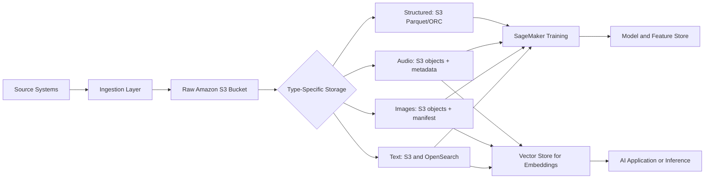

# Task 1.1: Data Preparation for ML and AI - Collect and store data.

## Skill 1.1.8: Ingest and store diverse data types (for example, text, images, audio) for AI and ML applications.

---

## 1. Skill Overview

Machine learning and AI applications rarely rely on only structured tabular data. In practice, a model may be trained on product descriptions, customer review text, product images, audio recordings, and clickstream events at the same time.

This skill focuses on:

- Choosing the correct **ingestion path** for different data types.
- Selecting the right **AWS storage service** based on how data will be read.
- Combining raw unstructured objects with structured metadata.
- Preparing data for downstream ML workflows such as SageMaker training, feature engineering, and vector retrieval.

The default answer is usually **Amazon S3** for raw text, images, and audio. The architectural challenge is what you store alongside the raw object so the data remains discoverable, labeled, versioned, and usable for training or inference.

---

## 2. Why Diverse Data Types Require Different Storage Patterns

| Data Type | Main Storage Need | Examples |
| --- | --- | --- |
| Text | Highly compressible, streamable, indexable | Product reviews, support tickets, chat messages |
| Images | Large binary objects, read in parallel | Defect photos, satellite imagery, product images |
| Audio | Large binary objects, often streamed | Call recordings, voice commands, machine sounds |
| Tabular/structured | Query by rows and columns | Customer records, sensor measurements |
| Embeddings | High-dimensional vectors, similarity search | Text embeddings, image embeddings, audio embeddings |

A common mistake is treating all data the same. Text may be stored in row-oriented JSON for streaming and later converted to columnar Parquet. Images and audio should remain as objects in S3 and be referenced by metadata, not embedded inside relational database rows.

---

## 3. Data Type Ingestion and Storage Matrix

| Data Type | Common Ingestion Path | Recommended Raw Store | Supporting Metadata/Catalog | ML Application Example |
| --- | --- | --- | --- | --- |
| Text | Kinesis Data Firehose, S3 batch upload, MSK | Amazon S3 | OpenSearch Service, AWS Glue Data Catalog | NLP, text classification, semantic search |
| Images | S3 multipart upload, AWS DataSync, S3 Event Notifications | Amazon S3 | DynamoDB, SageMaker Ground Truth manifest | Computer vision, object detection |
| Audio | Kinesis Data Streams, S3 upload, Kinesis Data Firehose | Amazon S3 | DynamoDB, Amazon OpenSearch Service | Speech analytics, audio classification |
| Structured data | AWS DMS, AWS Glue, Kinesis Data Streams | Amazon S3, Amazon RDS, DynamoDB | AWS Glue Data Catalog | Tabular ML, forecasting |
| Embeddings | Model processing output | OpenSearch Service, Amazon RDS for PostgreSQL with pgvector, S3 | Vector index, Feature Store | Retrieval, recommendation, RAG |

---

## 4. Core AWS Services for Ingesting and Storing Diverse Data

| AWS Service | Best Use | Data Type Strength |
| --- | --- | --- |
| **Amazon S3** | Durable object store; default raw data lake | Text, images, audio, Parquet/CSV/JSON |
| **Amazon OpenSearch Service** | Full-text search and vector similarity search | Text, embeddings |
| **Amazon DynamoDB** | Low-latency key-value lookups | Metadata, feature values |
| **Amazon RDS for PostgreSQL with pgvector** | Relational data plus vector similarity | Structured records, embeddings |
| **Amazon EFS** | Shared POSIX file system for many instances | Shared training files |
| **Amazon FSx for Lustre** | High-performance file system for training | Large image/audio datasets with parallel reads |
| **Amazon Kinesis Data Streams** | Real-time stream consumption | Streaming text, audio events |
| **Amazon Kinesis Data Firehose** | Near real-time delivery to S3/OpenSearch | Streaming text, clickstream |
| **AWS Glue** | Serverless ETL and Data Catalog | Structured/raw data discovery |
| **Amazon SageMaker Feature Store** | Consistent online and offline feature storage | Training and inference features |

---

## 5. Ingestion and Storage Architecture for ML

The architecture has three key layers:

1. **Raw layer** — S3 stores the original object without destructive transformation.
2. **Metadata/master data layer** — DynamoDB, RDS, or the Glue Data Catalog stores labels, schema, lineage, and relationships.
3. **Serving layer** — OpenSearch, pgvector, SageMaker Feature Store, or DynamoDB serves data to inference or retrieval systems.

---

## 6. Detailed Guidance by Data Type

### 6.1 Text Data

**Ingestion options:**

- **Batch:** Upload text files to S3, then use AWS Glue to catalog and transform.
- **Streaming:** Use Amazon Kinesis Data Firehose to deliver text records to S3 or OpenSearch.
- **Kafka-based:** Use Amazon MSK if the organization already uses Apache Kafka.

**Storage guidance:**

- Store raw text as JSON Lines, CSV, or plain text in S3.
- Index text in OpenSearch Service if full-text search is required.
- Convert structured text features to Parquet or ORC for repeated analytic reads.
- Use a Glue Data Catalog table so downstream jobs can discover the schema.

**ML use case example:**  
A customer support application ingests support tickets as JSON via Kinesis Data Firehose into an S3 bucket. A separate Glue job converts the raw JSON to Parquet for SageMaker training. OpenSearch indexes the same text for real-time ticket search.

---

### 6.2 Image Data

**Ingestion options:**

- Upload image files directly to S3.
- Use AWS DataSync to migrate large on-premises image datasets.
- Use S3 Event Notifications to trigger processing when new images arrive.

**Storage guidance:**

- Store each image as a separate S3 object to enable parallel reads during training.
- Keep labels and image object keys in DynamoDB or in a JSON Lines manifest.
- Use a SageMaker Ground Truth manifest for labeled image datasets.
- Do not store images as BLOBs inside RDS. This causes cost, latency, and size problems.

**Recommended S3 structure idea:**

| Prefix | Content |
| --- | --- |
| `s3://bucket/raw/images/` | Original images |
| `s3://bucket/manifests/` | JSON Lines manifest files |
| `s3://bucket/curated/` | Processed Parquet or metadata |
| `s3://bucket/labels/` | Label files or metadata exports |

**ML use case example:**  
A manufacturing company stores factory camera images in S3. A DynamoDB table records each image’s location, timestamp, machine ID, and defect label. SageMaker reads a manifest that points to the S3 images and uses the labels for training.

---

### 6.3 Audio Data

**Ingestion options:**

- Upload audio files to S3 in batch.
- Use Kinesis Data Streams for real-time audio event ingestion.
- Use Kinesis Data Firehose for direct delivery into S3.
- Use Amazon MSK if the pipeline is Kafka-based.

**Storage guidance:**

- Store raw audio files in S3.
- Keep session metadata, speaker IDs, timestamps, and labels in DynamoDB.
- Store transcriptions as text in S3 or index them in OpenSearch.
- For SageMaker training, use a manifest that references audio S3 URIs and their labels.

**ML use case example:**  
A call-center analytics system streams call audio events into Kinesis Data Streams. The raw audio is stored in S3. Metadata is stored in DynamoDB. After speech-to-text processing, the transcriptions are indexed in OpenSearch for keyword and vector search.

---

### 6.4 Structured/Tabular Data

Although this skill focuses on text, images, and audio, structured data is often joined with these types.

- Store structured records in S3 using **Parquet or ORC** for analytic workloads.
- Use DynamoDB for low-latency primary-key lookups.
- Use RDS for relational SQL queries.
- Use AWS Glue to crawl and catalog structured data in S3.

---

## 7. Format Selection for ML Data

| Format | Best For | Avoid For |
| --- | --- | --- |
| **CSV** | Simple tabular interchange, small datasets | Large analytic scans, nested data |
| **JSON / JSON Lines** | Streaming events, nested text, metadata, manifests | Heavy repeated columnar reads |
| **Apache Parquet / ORC** | Columnar analytics, high-performance training reads | Small record-at-a-time updates |
| **Native binary: JPEG, PNG, WAV, MP3** | Raw images and audio | Storing inside relational databases |

**Key exam logic:**  
If a query reads a small number of columns across many rows, a columnar format such as Parquet or ORC is better than CSV or JSON because it reduces the amount of data scanned.

---

## 8. Storage Service Selection by Access Pattern

| Access Pattern | Recommended Service |
| --- | --- |
| Store large raw objects for batch training | Amazon S3 |
| Shared POSIX file system across many training instances | Amazon EFS or FSx for Lustre |
| Low-latency key-value metadata lookup | Amazon DynamoDB |
| Relational queries and joins | Amazon RDS |
| Full-text search over text documents | Amazon OpenSearch Service |
| Vector similarity search | OpenSearch Service, RDS for PostgreSQL with pgvector, or S3 vector index |
| Consistent offline and online feature retrieval | Amazon SageMaker Feature Store |

---

## 9. Combining Multiple Data Types with Metadata

In real-world ML applications, one business object may include text, images, audio, and structured attributes.

For example, a product catalog item may have:

- A product title and description → text
- Multiple product photos → images
- A voice review from a customer → audio
- Price, category, stock level → structured data

**Best practice pattern:**

1. Store raw text, images, and audio in S3.
2. Store structured product attributes in DynamoDB or RDS.
3. Use a common identifier, such as `product_id`, to join all data.
4. Maintain a manifest or metadata table that references S3 object keys.
5. Use AWS Glue to create catalog tables for analyzable structured data.
6. Use SageMaker Feature Store for features that must remain consistent between training and inference.

---

## 10. Vector Storage for AI Applications

After text, images, or audio are converted into embeddings, the embeddings need to be stored where they can be searched by similarity.

| Vector Storage Option | When to Use |
| --- | --- |
| **Amazon OpenSearch Service** | Low-latency nearest-neighbor search for text and embeddings |
| **Amazon RDS for PostgreSQL with pgvector** | Embeddings should sit alongside existing relational records |
| **Amazon S3 with vector index** | Large vector sets that tolerate less frequent querying |

**Important distinction:**

- A **vector store** answers: *What is similar to this embedding?*
- A **feature store** answers: *What are the current and historical features for this entity?*

---

## 11. Cost, Performance, and Compliance Considerations

| Factor | Design Decision |
| --- | --- |
| **Cost** | Use S3 Lifecycle policies to transition old raw audio/images to lower-cost tiers. Use columnar formats to reduce scan costs. |
| **Performance** | Use S3 or FSx for high-throughput training reads. Use OpenSearch for low-latency text and vector queries. |
| **Structure** | Use S3 for unstructured objects; use RDS/DynamoDB for structured metadata; use Glue for cataloging. |
| **Compliance** | Use SSE-KMS encryption, S3 Object Lock for immutability, VPC endpoints, and region-specific buckets as required. |

---

## 12. Scenario-Based Examples

### Scenario 1: Large Image Dataset for Computer Vision

**Question:**  
A company has millions of product JPEG images and labels in an on-premises system. The team needs to train a SageMaker computer vision model. Which storage design is most appropriate?

**Options:**  
A. Store images as BLOBs in RDS for PostgreSQL  
B. Store images in Amazon S3 and store labels and S3 paths in DynamoDB or a manifest file  
C. Store images on EBS volumes attached to a training instance  
D. Store images in Amazon OpenSearch Service  

**Answer:**  
**B. Store images in Amazon S3 and store labels and S3 paths in DynamoDB or a manifest file.**

**Why:**  
S3 is the natural landing zone for large binary objects. It scales automatically, supports parallel reads, and integrates directly with SageMaker. Labels and object keys can be stored in DynamoDB or a manifest for training.

**Why not the others:**

- RDS BLOBs are expensive and slow for large binary files.
- EBS volumes are single-instance block storage and do not scale well for a large shared dataset.
- OpenSearch is a search engine, not a raw image store.

---

### Scenario 2: Streaming User Feedback Text

**Question:**  
A mobile application generates high-velocity user feedback and clickstream text. The team needs raw data stored for batch training and also wants real-time text search. Which solution best fits?

**Options:**  
A. Write directly to RDS from the mobile app  
B. Store all data in S3 and scan with Athena for every real-time search  
C. Use Kinesis Data Firehose to deliver records to S3 for raw storage and to OpenSearch for real-time text search  
D. Store records on EBS volumes attached to an EC2 instance  

**Answer:**  
**C. Use Kinesis Data Firehose to deliver records to S3 for raw storage and to OpenSearch for real-time text search.**

**Why:**  
Kinesis Data Firehose can land streaming records in S3 and OpenSearch without writing custom stream processors. S3 keeps the raw data for training; OpenSearch supports low-latency search.

**Why not the others:**

- Directly writing to RDS from mobile devices can overwhelm the database.
- Athena scans are not low-latency for real-time search.
- EBS is local block storage, not suitable for streaming ingestion or search.

---

### Scenario 3: Distributed Training with Shared Files

**Question:**  
A SageMaker training job runs across multiple instances and must read the same image and audio dataset through a POSIX-compliant file namespace. Which storage service meets this requirement?

**Options:**  
A. Amazon EBS  
B. Amazon DynamoDB  
C. Amazon EFS or Amazon FSx for Lustre  
D. Amazon RDS  

**Answer:**  
**C. Amazon EFS or Amazon FSx for Lustre.**

**Why:**  
EFS provides a shared POSIX file system that can be mounted by many instances at once. FSx for Lustre is a high-performance file system that is often used for distributed training jobs that need fast access to a shared dataset.

**Why not the others:**

- EBS is mounted by one instance at a time by default.
- DynamoDB is a key-value database, not a file system.
- RDS is a relational database, not a POSIX file store.

---

### Scenario 4: Semantic Search over Text Documents

**Question:**  
An application has already stored text documents and their embeddings alongside relational records in a PostgreSQL database. The team needs to add similarity search without moving the data. Which service should they use?

**Options:**  
A. Amazon OpenSearch Service  
B. Amazon DynamoDB  
C. Amazon EFS  
D. Amazon RDS for PostgreSQL with the pgvector extension  

**Answer:**  
**D. Amazon RDS for PostgreSQL with the pgvector extension.**

**Why:**  
The `pgvector` extension allows vector similarity search directly within PostgreSQL. Since the data already lives in RDS for PostgreSQL, adding `pgvector` avoids migrating or syncing data to a separate vector database.

**Why not the others:**

- OpenSearch Service requires moving or syncing the data.
- DynamoDB does not natively support PostgreSQL extensions.
- EFS is a shared file system, not a vector similarity search engine.

---

## 13. Exam Tips and Common Traps

### Exam Tips

1. **Default to Amazon S3 for raw text, images, and audio.**  
   S3 is the standard data lake landing zone for ML training data.

2. **Pair S3 with a metadata store.**  
   Use DynamoDB or a JSON Lines manifest to store labels, identifiers, and S3 object keys.

3. **Use columnar formats for analytic reads.**  
   If a query reads few columns across many rows, Parquet or ORC is the recommended format.

4. **Use Kinesis Data Firehose for near real-time delivery to S3 or OpenSearch.**  
   This is simpler than managing custom consumers when the destination is already supported.

5. **Use OpenSearch or pgvector for vector search.**  
   These are purpose-built for embeddings-based semantic search.

6. **Use SageMaker Feature Store when training and inference must use the same feature definition.**  
   This prevents training-serving skew.

7. **Use EFS or FSx for Lustre when multiple training instances need a shared POSIX file system.**

### Common Traps

1. **Choosing EBS for shared or distributed training access.**  
   EBS is generally single-instance block storage and is not a shared file system.

2. **Storing large images or audio files as BLOBs in RDS.**  
   This increases cost, slows queries, and complicates scaling.

3. **Choosing CSV or JSON for repeated columnar analytics.**  
   Row-oriented formats scan more data. Parquet or ORC reduces cost and latency.

4. **Confusing Kinesis Data Streams with Kinesis Data Firehose.**  
   Data Streams is for custom real-time consumers. Firehose is a delivery service to S3, OpenSearch, Redshift, and other destinations.

5. **Adding consumer capacity when the downstream write target is the bottleneck.**  
   Extra consumers only move the queue if the target is already throttling.

6. **Confusing vector stores with feature stores.**  
   A vector store is for similarity search. A feature store is for consistent feature values across training and inference.

7. **Treating S3 as a low-latency key-value store.**  
   S3 is highly durable and scalable, but DynamoDB is the service for low-latency item lookups.

---

## 14. Summary

To ingest and store diverse data types for AI and ML applications:

- Store raw **text, images, and audio** in **Amazon S3**.
- Use **DynamoDB** or **manifest files** for labels and metadata.
- Use **Kinesis Data Streams or Firehose** for streaming text and audio.
- Use **OpenSearch Service** for full-text and vector search.
- Use **Parquet or ORC** for curated tabular data to reduce scans.
- Use **EFS or FSx for Lustre** when many training instances require shared file access.
- Use **SageMaker Feature Store** for consistent feature serving between training and inference.
- Use **pgvector in RDS** when embeddings should remain alongside existing relational records.