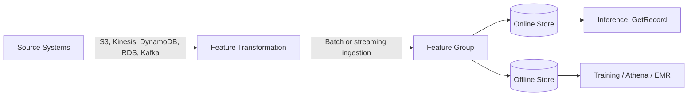
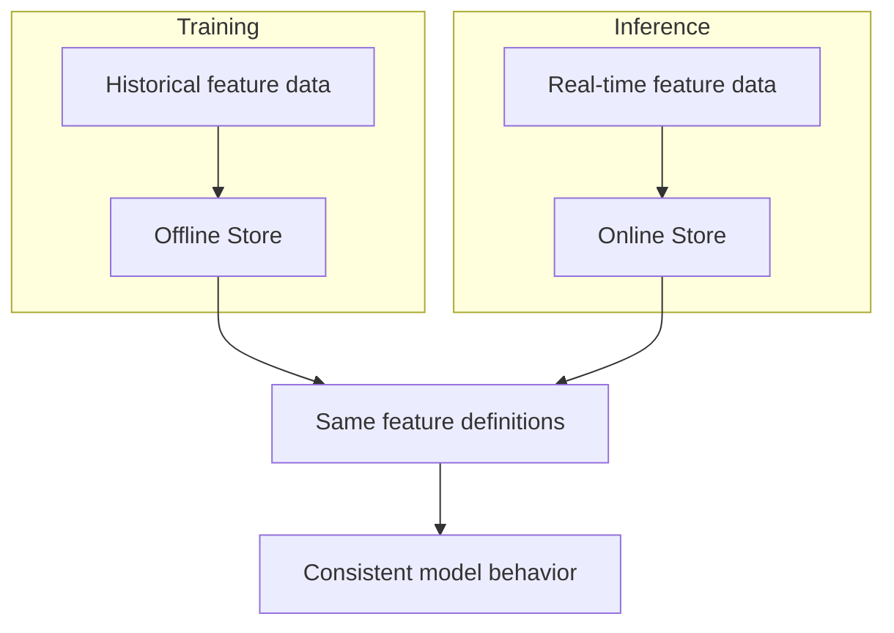

# Task 1.1: Data Preparation for ML and AI - Collect and store data

## Skill 1.1.9: Ingest data into SageMaker Feature Store

### Overview

Amazon SageMaker Feature Store is a purpose-built store for the features that a machine learning model consumes. Its primary value is that a single feature definition, stored once, can serve both model training and real-time inference. This reduces training-serving skew and helps teams reuse features consistently across models and use cases.

When ingesting data into SageMaker Feature Store, the key design task is to move features from a source system into a feature group with the correct identity and time semantics. Ingestion is not simply copying data; it requires deciding what identifies a record, what time belongs to each feature value, and whether the feature needs low-latency online access, historical offline access, or both.

---

### Core concepts of SageMaker Feature Store

SageMaker Feature Store organizes data into **feature groups**. A feature group is a logical collection of features, a schema, and the storage configuration for those features.

| Concept | Description |
| --- | --- |
| **Feature group** | A logical grouping of features that share a schema and storage configuration. |
| **Record identifier** | A unique identifier for each record or entity, such as `customer_id` or `transaction_id`. |
| **Event time** | The timestamp when the feature value was observed or became valid. This is critical for point-in-time-correct training data. |
| **Feature definition** | The name and data type of each feature in the group. Feature Store supports `String`, `Integral`, and `Fractional` feature types. |
| **Online store** | A low-latency, high-availability store used to retrieve the latest feature values for inference. |
| **Offline store** | A historical store, backed by Amazon S3, used for training, batch inference, and analytics. |

A feature group can be configured to use the online store, the offline store, or both. Most production ML use cases enable both, because they need low-latency feature retrieval for inference and historical data for training.

---

### Online store vs. offline store

Understanding the difference between the online store and the offline store is essential for the exam and for real-world ML design.

| Property | Online store | Offline store |
| --- | --- | --- |
| Primary purpose | Low-latency feature lookup at inference | Historical feature data for training and batch scoring |
| Data storage | Managed low-latency store optimized for keyed reads | Amazon S3, generally in columnar format such as Apache Parquet |
| Query latency | Milliseconds | Seconds to minutes depending on query engine |
| Typical reader | Inference endpoint using `GetRecord` | Amazon Athena, AWS Glue, Amazon EMR, SageMaker training jobs |
| Data history | Stores the latest feature values by record identifier | Stores the full history of feature values by event time |
| Access pattern | Point lookups by record identifier | Large scans, point-in-time joins, and historical analysis |
| Cost profile | Higher cost per GB and per I/O | Lower cost, based on S3 storage and query usage |

A common exam trap is to think that the online store is suitable for training. Training almost always requires historical data or a large number of rows, which is the job of the offline store.

---

### How ingestion into Feature Store works

The ingestion process can be represented as follows:

The key steps are:

1. **Define a feature group**
   - Choose a name for the feature group.
   - Specify the record identifier feature name.
   - Specify the event time feature name.
   - Define each feature and its data type.

2. **Configure storage**
   - Decide whether to enable the online store.
   - Optionally set a time-to-live, or TTL, for online store records to control cost.
   - The offline store is configured automatically and stores data in Amazon S3.

3. **Ingest data**
   - Ingest a single record or batch of records.
   - Or configure streaming ingestion from a source such as Amazon Kinesis Data Streams.

4. **Verify and query**
   - Use the online store for inference lookups.
   - Use Amazon Athena or other analytics services to query the offline store through the AWS Glue Data Catalog.

---

### Batch ingestion

Batch ingestion is used when features are available in bulk from sources such as Amazon S3, Amazon DynamoDB, Amazon RDS, or data warehouse exports.

Batch ingestion typically involves:

- Reading a dataset from Amazon S3 or another source.
- Transforming columns into the feature group schema.
- Writing records to the feature group using the Feature Store ingestion operation.

Once written, the record is available in both the online store and the offline store, assuming both are enabled.

Batch ingestion is appropriate when:

- Features change at regular intervals, such as daily or hourly.
- You are loading large historical datasets for model training.
- You are backfilling a feature group for the first time.
- You are merging data from multiple sources before ingestion.

Do not write directly to the offline store S3 path. Ingestion should go through the Feature Store so that the online store, offline store, and AWS Glue Data Catalog are updated consistently.

---

### Streaming ingestion

Streaming ingestion is used when feature values must be updated continuously or with very low delay. SageMaker Feature Store can ingest data from streaming sources such as Amazon Kinesis Data Streams.

Streaming ingestion is appropriate when:

- Features are derived from clickstreams, sensor data, or real-time transactions.
- A fraud detection model needs the most recent transaction behavior.
- A recommendation system needs recent user activity immediately.
- You want to avoid building and maintaining a separate batch job for each update.

In streaming ingestion, the source system emits records, and the Feature Store consumes those records into the feature group. Each record still requires a record identifier and an event time.

---

### Required fields and ingestion correctness

Every record written to a feature group must include:

| Requirement | Purpose |
| --- | --- |
| **Record identifier** | Determines which entity the feature values belong to. It must be available at inference time. |
| **Event time** | Establishes when the feature value was observed. It enables point-in-time-correct training queries. |
| **Feature values** | The actual values for the features defined in the feature group schema. |

#### Event time vs. ingestion time

A critical distinction in Feature Store is the difference between **event time** and **ingestion time**.

| Time type | Meaning | Use case |
| --- | --- | --- |
| Event time | When the feature value became valid or was observed | Training data that must reflect what was known at a specific historical moment |
| Ingestion time | When the record was written into Feature Store | Operational monitoring, but not suitable for point-in-time-correct training labels |

For training data, you should set event time to when the feature value was actually observed. If you set it to the ingestion time, you can introduce future information into the training dataset, which can cause data leakage and unrealistic model performance.

---

### Training-serving consistency

A major motivation for using SageMaker Feature Store is to prevent training-serving skew.

If the feature transformation logic is duplicated in a training pipeline and an inference pipeline, the two implementations can diverge over time. With Feature Store, the feature group schema acts as a shared contract. Training reads from the offline store, and inference reads from the online store, using the same feature definitions.

---

### Common ingestion patterns and suitable approaches

| Scenario | Recommended ingestion approach |
| --- | --- |
| Daily batch refresh for a customer churn model | Batch ingestion from Amazon S3 or Amazon Redshift Spectrum |
| Real-time fraud detection features | Streaming ingestion from Amazon Kinesis Data Streams |
| Backfilling years of historical features | Large batch ingestion into the offline store |
| Low-latency feature lookup for a recommendation endpoint | Enable online store and ingest updates as they occur |
| Training point-in-time features for a model | Query the offline store using event time |

---

### Scenario-based examples

#### Example 1

A retail company needs to serve customer features for a real-time product recommendation model. The features include `customer_id`, `total_orders_last_30_days`, `average_order_value`, and `last_purchase_category`. The data engineering team receives daily batch updates from an Amazon S3 data lake.

**Requirement:** The model endpoint must retrieve the latest feature values in single-digit milliseconds. The data science team also needs the full history of these features for model retraining.

**Solution:** Create a feature group with `customer_id` as the record identifier and an `event_time` field. Enable both the online store and the offline store. Ingest the daily batch updates into the feature group. The inference endpoint reads from the online store, while training jobs query the offline store.

---

#### Example 2

A financial services company is building a credit-risk model. The features are derived from multiple sources, including account data, payment history, and application information. The company wants to ensure that the model is trained on data that was actually available at the time of each historical credit decision.

**Question:** Which field is most important to prevent future information from leaking into the training set?

**Answer:** The event time. By setting the event time to when each feature value was known or observed, the team can perform point-in-time-correct queries from the offline store. If the event time is incorrectly set to the ingestion time, the training data can contain values that were not available when the historical decision was made.

---

#### Example 3

A machine learning team is ingesting features into SageMaker Feature Store. The online store returns features correctly, but the training dataset is missing historical values for some records.

**Question:** What should the team check?

**Answer:** They should check whether the features are being read from the offline store for training. The online store is designed for low-latency lookups and may contain only the latest values or values that have not expired by TTL. Historical training requires the offline store. They should also verify that the event time is being populated correctly on every ingested record.

---

### Exam tips and traps

| Tip or trap | Explanation |
| --- | --- |
| **Online store is not for training** | Use the offline store for large historical reads and training jobs. The online store is for low-latency inference lookups. |
| **Offline store is not for real-time inference** | The offline store is backed by S3 and queried through services such as Athena. It is not designed for millisecond retrieval. |
| **Always supply a record identifier** | Without a stable record identifier, the online store cannot perform keyed lookups, and records cannot be uniquely identified. |
| **Always supply an event time** | Event time enables point-in-time-correct training and historical ordering. Missing event time can cause ingestion failures or incorrect training data. |
| **Do not confuse event time with ingestion time** | Event time is when the feature was observed. Ingestion time is when it was written. Using ingestion time for training can leak future data. |
| **Do not write directly to the offline store S3 path** | Use Feature Store ingestion operations so that the online store, offline store, and AWS Glue Data Catalog remain consistent. |
| **Use the AWS Glue Data Catalog with the offline store** | Feature Store automatically creates an AWS Glue catalog table for the offline store. You can query it with Amazon Athena, AWS Glue jobs, or Amazon EMR. |
| **Use TTL carefully on the online store** | A TTL controls online store cost by automatically expiring old records. If a record expires before inference needs it, the lookup may fail or return incomplete data. |
| **Feature Store is not a vector database** | Feature Store answers identity-based questions about an entity’s feature values. A vector store answers similarity-based questions over embeddings. |
| **Schema changes require planning** | Record identifier and event time choices are fundamental. Plan the feature group schema around how the feature will be looked up during inference and how training data will be assembled. |

---

### Summary

Ingesting data into SageMaker Feature Store is a purpose-built pattern for maintaining consistent features across training and inference. The central design choices are:

- What identifies each record.
- What event time should be used for historical correctness.
- Whether the feature group needs online, offline, or both stores.
- Whether ingestion should be batch, streaming, or a combination of both.

Correct ingestion ensures that training data is historically accurate, inference lookups are fast, and the model sees the same feature definitions in production that it saw during training.