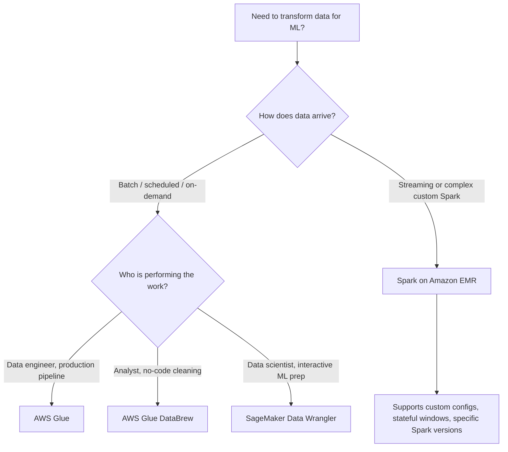

# Task 1.2: Data Preparation for ML and AI - Perform data transformation, feature engineering, and pre-processing

## Skill 1.2.1: Transform data by using AWS tools (for example, AWS Glue, AWS Glue DataBrew, Spark on Amazon EMR, SageMaker Data Wrangler)

## Overview

Data transformation is the process of converting raw data into a format suitable for machine learning or analytics. In AWS, the right transformation tool depends on:

- How the data arrives: batch, on-demand, interactive, or streaming.
- Who performs the work: data engineer, analyst, or data scientist.
- How much control is needed: serverless managed service vs. cluster-level control.
- What the transformed data feeds into: data lake, feature store, model training, or vector store.

This skill focuses on matching these requirements to four core AWS transformation services:

- **AWS Glue** – serverless batch ETL on Apache Spark.
- **AWS Glue DataBrew** – visual, no-code data cleaning and profiling.
- **Spark on Amazon EMR** – managed cluster-scale Spark for complex or streaming workloads.
- **Amazon SageMaker Data Wrangler** – interactive, ML-focused data preparation in SageMaker Canvas.

---

## Service Comparison at a Glance

| AWS Service | Primary Interface | Execution Style | Best For | Key Strengths | Limitations |
|---|---|---|---|---|---|
| **AWS Glue** | Code-based ETL jobs, visual editor | Serverless, scheduled / on-demand / event-driven | Large batch transformations, joining multiple datasets, production pipelines | Serverless Apache Spark, Data Catalog integration, crawlers for schema discovery | Less control over cluster and Spark configuration |
| **AWS Glue DataBrew** | Visual recipe builder, no code | Serverless batch, scheduled or interactive sessions | Data profiling, cleaning, normalization by analysts or non-programmers | Data profile jobs, reusable recipes, no coding required | Not suited for complex custom logic or streaming |
| **Spark on Amazon EMR** | Code: PySpark, Scala, Spark SQL | Managed clusters: EC2, EKS, or EMR Serverless | Custom Spark workloads, streaming, specific libraries/versions, high-scale processing | Full control over Spark config, ecosystem, and cluster resources | More management overhead unless using EMR Serverless |
| **Amazon SageMaker Data Wrangler** | Low-code visual data flow | Interactive, within SageMaker Canvas | Exploratory data preparation for ML, feature engineering, quick experimentation | ML-specific transforms, data insights, export to SageMaker Feature Store | Not intended as general production ETL scheduler |

---

## Deep Dive: AWS Transformation Tools

### 1. AWS Glue

**What it is:**

AWS Glue is a serverless extract, transform, and load (ETL) service built on Apache Spark. It removes the need to provision or manage clusters for most batch transformation jobs.

**Key capabilities:**

- Runs scheduled, on-demand, or event-driven ETL jobs.
- Uses crawlers to discover schemas and populate the AWS Glue Data Catalog.
- Supports transformations such as joins, filtering, aggregation, type casting, and partitioning.
- Outputs can be written to Amazon S3, Amazon Redshift, Amazon RDS, or other data stores.
- Integrates with AWS Step Functions, Amazon EventBridge, and other orchestration services.

**Best suited for:**

- Production batch pipelines that run on a schedule.
- Joining and transforming large datasets across multiple sources.
- Teams that want serverless operations without cluster management.
- Situations where schema discovery and cataloging are needed.

**What it is not:**

- It is not a visual no-code exploration tool.
- It is not designed for interactive, row-by-row data exploration.
- It is not a feature store.

**Exam clue phrases:**

- “Serverless scheduled ETL job”
- “Process daily files from S3 and convert to Parquet”
- “Crawl and catalog schema automatically”
- “Join transaction and customer datasets without managing servers”

---

### 2. AWS Glue DataBrew

**What it is:**

AWS Glue DataBrew is a visual data preparation tool that allows users to clean and normalize data without writing code. Transformations are assembled into reusable recipes.

**Key capabilities:**

- Provides a visual recipe builder with hundreds of pre-built transformations.
- Runs **profile jobs** to analyze data completeness, consistency, distributions, and missing values.
- Supports data cleaning tasks such as removing duplicates, handling missing values, formatting, and type conversion.
- Can be used by analysts and business users with no programming background.
- Outputs can be saved to Amazon S3, AWS Glue Data Catalog, or downstream systems.

**Best suited for:**

- Initial exploration and profiling of unfamiliar datasets.
- Business analysts who need to prepare data without code.
- Quick cleaning and normalization before feeding data into analytics or ML.
- Teams that need to understand data quality before writing complex ETL logic.

**What it is not:**

- It is not a streaming transformation tool.
- It is not built for complex custom code logic.
- It is not a data storage or feature store service.

**Exam clue phrases:**

- “Visual data preparation without code”
- “Run a data profile job to check missing values”
- “Analyst needs to clean data before training”
- “Reusable transformation recipe”

---

### 3. Spark on Amazon EMR

**What it is:**

Amazon EMR is a managed cluster platform that supports Apache Spark and other big data frameworks. It provides the most control over Spark configurations, libraries, and cluster resources.

**Key capabilities:**

- Supports Apache Spark, Hive, HBase, Flink, Presto, and more.
- Allows custom Spark versions, custom JARs, Python libraries, and cluster configurations.
- Supports both batch and streaming workloads, including Spark Structured Streaming.
- Can run on EC2 clusters, EKS, or as EMR Serverless.
- Ideal for complex transformations requiring stateful operations, sliding windows, or custom UDFs.

**Best suited for:**

- Workloads that exceed serverless AWS Glue limits or require custom Spark functionality.
- Streaming transformations that maintain state across records or time windows.
- Teams that need fine-grained control over cluster sizing, networking, and software versions.
- Existing Spark codebases that must run unchanged on a managed service.

**What it is not:**

- It is not a no-code visual tool.
- It is not automatically serverless unless using EMR Serverless.
- It involves more operational consideration than fully managed serverless services.

**Exam clue phrases:**

- “Custom Spark libraries or specific Spark version”
- “Streaming aggregation over a sliding window”
- “Existing PySpark code that must run without modification”
- “Cluster-level control and custom configuration”

---

### 4. Amazon SageMaker Data Wrangler

**What it is:**

Amazon SageMaker Data Wrangler is an interactive, low-code data preparation tool inside SageMaker Canvas. It is built specifically for ML workflows, allowing data scientists to explore, transform, and export features.

**Key capabilities:**

- Imports data from Amazon S3, Amazon Athena, Amazon Redshift, Snowflake, and other sources.
- Provides data quality insights, anomaly detection, and visual analysis.
- Supports ML-specific transformations such as one-hot encoding, imputation, normalization, and class balancing.
- Exports prepared data to Amazon S3, SageMaker Feature Store, or directly into SageMaker pipelines.
- Allows custom transforms using formulas or visual steps without writing full ETL code.

**Best suited for:**

- Data scientists exploring a dataset before model training.
- Interactive feature engineering and experimentation.
- Preparing features that need to be shared between training and inference.
- Teams that want to integrate data preparation directly into SageMaker workflows.

**What it is not:**

- It is not a general-purpose production ETL scheduler.
- It is not designed for high-throughput streaming transformations.
- It is not a visual profiling service in the same sense as DataBrew, though it provides data insights.

**Exam clue phrases:**

- “Interactive data preparation in SageMaker Canvas”
- “Export transformed features to SageMaker Feature Store”
- “Data scientist needs to explore and transform data before training”
- “Apply one-hot encoding and imputation visually”

---

## Tool Selection Decision Flow

---

## Scenario-Based Examples

### Scenario 1: Scheduled Data Lake ETL

**Requirement:**

A retail company stores daily sales CSV files in Amazon S3. The data engineering team needs to join sales records with customer data, clean missing values, convert the result to Parquet, and run the job every night without managing servers.

**Recommended tool:** **AWS Glue**

**Why:**

- Serverless Apache Spark handles scheduled batch jobs.
- Crawlers can discover schemas and update the Data Catalog.
- Supports joins and output to Parquet on S3.
- No cluster management is required.

---

### Scenario 2: No-Code Data Profiling and Cleaning

**Requirement:**

A business analyst receives a new dataset from a third-party vendor. The analyst must understand data quality, identify missing values, remove duplicates, and normalize column formats before sharing the data with the data science team.

**Recommended tool:** **AWS Glue DataBrew**

**Why:**

- Visual recipe builder requires no code.
- Profile jobs provide statistical summaries and data quality checks.
- The analyst can clean and normalize data quickly.
- Output can be saved to S3 for downstream use.

---

### Scenario 3: Complex Custom Spark Workload

**Requirement:**

A financial services company has an existing PySpark application that uses a specific Spark version, custom native libraries, and performs sliding-window aggregations over streaming market data. The team must run this workload on AWS without rewriting the code.

**Recommended tool:** **Spark on Amazon EMR**

**Why:**

- EMR provides full control over Spark version and custom libraries.
- Supports Spark Structured Streaming for stateful sliding-window operations.
- Existing PySpark code can run with minimal modification.
- EMR can handle cluster-scale processing and custom networking configurations.

---

### Scenario 4: Interactive ML Feature Preparation

**Requirement:**

A data scientist is building a customer churn model. She needs to explore a dataset from Amazon Athena, apply one-hot encoding to categorical columns, impute missing values, normalize numeric features, and export the prepared features to SageMaker Feature Store for use during training and inference.

**Recommended tool:** **Amazon SageMaker Data Wrangler**

**Why:**

- Provides interactive, low-code ML-focused transformations.
- Imports directly from Amazon Athena.
- Includes ML-specific transforms such as encoding, imputation, and normalization.
- Can export directly to SageMaker Feature Store.

---

## Sample Exam-Style Questions

### Question 1

A company needs to transform large daily datasets from Amazon S3, convert them to columnar format, and load them into Amazon Redshift. The process runs every night on a schedule. The team wants a serverless solution.

Which AWS service should they use?

**A.** AWS Glue DataBrew  
**B.** Amazon SageMaker Data Wrangler  
**C.** AWS Glue  
**D.** Spark on Amazon EMR  

**Correct Answer:** **C. AWS Glue**

**Explanation:**

AWS Glue provides serverless, scheduled ETL jobs built on Apache Spark. It can read from S3, transform data, convert formats, and load to Amazon Redshift without managing clusters.

**Why the others are incorrect:**

- **A. AWS Glue DataBrew** is visual data preparation, not primarily for scheduled production ETL pipelines.
- **B. SageMaker Data Wrangler** is interactive ML data preparation, not a nightly production scheduler.
- **D. Spark on Amazon EMR** can do this but requires cluster management unless using EMR Serverless; the requirement explicitly asks for serverless.

---

### Question 2

A team of analysts with no programming experience needs to inspect a new dataset for missing values, outliers, and column distributions before any transformation is written.

Which tool provides that capability automatically?

**A.** AWS Glue  
**B.** AWS Glue DataBrew  
**C.** Spark on Amazon EMR  
**D.** Amazon SageMaker Data Wrangler  

**Correct Answer:** **B. AWS Glue DataBrew**

**Explanation:**

AWS Glue DataBrew can run a **profile job** that automatically analyzes a dataset and produces column-level statistics, missing value summaries, distributions, and data quality insights without writing code.

**Why the others are incorrect:**

- **A. AWS Glue** is code-based ETL and does not produce automatic visual data profiles.
- **C. Spark on Amazon EMR** requires coding or notebook-based analysis.
- **D. SageMaker Data Wrangler** does provide data insights, but it is designed for ML-focused interactive work and is not primarily a no-code profiling tool for analysts.

---

### Question 3

A data engineering team needs to run a streaming transformation that maintains a continuously sliding average over the last five minutes of records. The team also requires a specific version of Apache Spark with custom native libraries.

Which option is most appropriate?

**A.** AWS Glue DataBrew  
**B.** SageMaker Data Wrangler  
**C.** AWS Glue  
**D.** Spark on Amazon EMR  

**Correct Answer:** **D. Spark on Amazon EMR**

**Explanation:**

Spark on Amazon EMR supports Spark Structured Streaming, which can maintain state across sliding windows. EMR also allows custom Spark versions and native libraries.

**Why the others are incorrect:**

- **A. AWS Glue DataBrew** is not a streaming service.
- **B. SageMaker Data Wrangler** is interactive batch-oriented ML preparation.
- **C. AWS Glue** is primarily batch ETL; while it has limited streaming, it does not give the level of control needed for custom libraries or complex sliding windows.

---

### Question 4

A data scientist wants to interactively explore data from Amazon S3, apply ML transforms such as one-hot encoding and missing-value imputation, and export the resulting features directly to SageMaker Feature Store.

Which tool should the data scientist use?

**A.** AWS Glue DataBrew  
**B.** AWS Glue  
**C.** Spark on Amazon EMR  
**D.** Amazon SageMaker Data Wrangler  

**Correct Answer:** **D. Amazon SageMaker Data Wrangler**

**Explanation:**

SageMaker Data Wrangler is a low-code interactive tool within SageMaker Canvas that supports ML-specific transforms and can export features directly to SageMaker Feature Store.

**Why the others are incorrect:**

- **A. DataBrew** can clean data but is not specialized for ML feature export to Feature Store.
- **B. AWS Glue** is batch ETL, not interactive exploration.
- **C. Spark on Amazon EMR** requires coding and is not directly integrated with SageMaker Feature Store in an interactive fashion.

---

## Exam Tips

1. **Match the tool to the job, not just the capability.**
   - AWS Glue can transform data, but if the requirement is visual no-code cleaning, choose DataBrew.
   - DataBrew can clean data, but if the requirement is ML-specific feature export, choose SageMaker Data Wrangler.

2. **Look for keywords in exam questions:**
   - “Serverless scheduled ETL” → AWS Glue.
   - “No-code visual profiling” → AWS Glue DataBrew.
   - “Custom Spark version / custom libraries / streaming sliding window” → Spark on Amazon EMR.
   - “Interactive ML preparation / export to Feature Store” → SageMaker Data Wrangler.

3. **Remember the operational ownership:**
   - AWS Glue and DataBrew are fully serverless and require minimal management.
   - SageMaker Data Wrangler is serverless interactive but not a production pipeline scheduler.
   - Amazon EMR gives maximum control but requires more configuration, unless using EMR Serverless.

4. **Data profiling is a DataBrew strength.**
   - If a question asks about automatically analyzing dataset quality before writing transformations, DataBrew profile jobs are the likely answer.

5. **Do not confuse transformation tools with storage or feature stores.**
   - These tools transform data; they do not store features.
   - SageMaker Data Wrangler can export to SageMaker Feature Store, but the Feature Store is a separate service.

---

## Common Traps and Pitfalls

| Trap | Why It’s Wrong | Correct Thinking |
|---|---|---|
| Choosing **AWS Glue** for no-code visual data cleaning | Glue is code-based ETL, not a visual recipe tool. | Use **AWS Glue DataBrew** for no-code cleaning and profiling. |
| Choosing **DataBrew** for complex Spark streaming | DataBrew is designed for visual batch preparation, not stateful streaming. | Use **Spark on Amazon EMR** for streaming sliding windows and custom Spark. |
| Choosing **SageMaker Data Wrangler** for scheduled production ETL | Data Wrangler is interactive and ML-focused, not a general ETL scheduler. | Use **AWS Glue** for scheduled, serverless production ETL. |
| Choosing **AWS Glue** when custom Spark libraries or versions are required | Glue is serverless but abstracts away Spark version control and custom cluster libraries. | Use **Spark on Amazon EMR** when specific Spark versions or custom native libraries are mandatory. |
| Assuming **DataBrew** and **Data Wrangler** are interchangeable | Both are visual, but DataBrew targets general data prep and profiling; Data Wrangler targets ML feature engineering and export to SageMaker Feature Store. | Use DataBrew for analyst-driven cleaning; use Data Wrangler for data scientist-driven ML preparation. |
| Choosing a cluster service when “serverless” is stated | EMR on EC2 is not serverless. | Prefer AWS Glue, DataBrew, or SageMaker Data Wrangler for explicitly serverless requirements. |

---

## Key Takeaways

- **AWS Glue** = serverless batch ETL for production pipelines.
- **AWS Glue DataBrew** = visual no-code data profiling and cleaning for analysts.
- **Spark on Amazon EMR** = managed cluster for complex custom Spark workloads and streaming.
- **SageMaker Data Wrangler** = interactive, ML-specific data preparation for data scientists.

When you see a transformation requirement on the exam, first identify who is doing the work, how the data arrives, and whether the solution must be serverless or highly customizable. These three signals will usually point to the correct AWS tool.