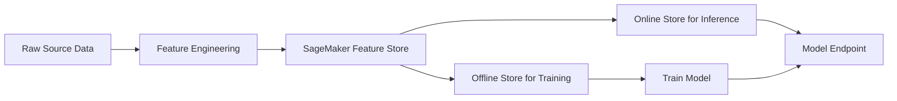
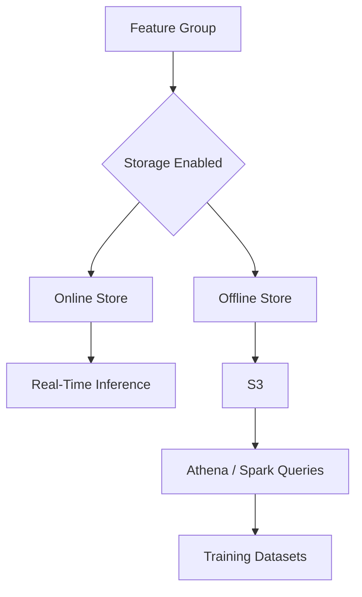
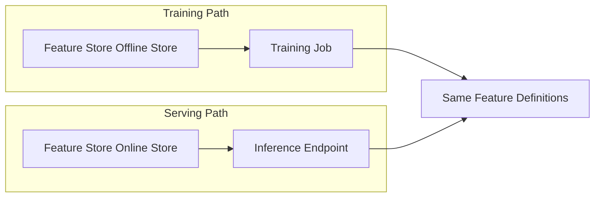

# Task 1.2: Data Preparation for ML and AI - Perform data transformation, feature engineering, and pre-processing

## Skill 1.2.2: Create and Manage Features by Using AWS Tools (for example, SageMaker Feature Store)

### 1. Skill Focus

This skill is about turning raw or lightly cleaned data into **consistent, reusable ML features**, and then managing those features in AWS so that training and inference use the **same feature definitions and values**.

The most important AWS service for this skill is **Amazon SageMaker Feature Store**. However, several AWS services help create features before they are stored and managed.

Core abilities to understand:

- What a feature is and why feature engineering matters.
- How AWS Glue, AWS Glue DataBrew, Amazon EMR, and SageMaker Data Wrangler help create features.
- How SageMaker Feature Store manages and serves features.
- The difference between online and offline feature storage.
- How a feature store reduces **training-serving skew**.
- When to use SageMaker Feature Store and when not to use it.

---

### 2. From Raw Data to Managed Features

Raw data is often not directly usable for machine learning. It may include:

- Categorical text values such as `tier = "gold"`.
- Skewed numeric values such as large transaction amounts.
- Compound fields such as `address = "123 Main St, Austin, TX"`.
- Multiple source tables that must be joined.
- Features that must be calculated over time, such as transaction count in the last 30 days.

Feature engineering transforms these into numeric, model-ready values. Feature management ensures those engineered values remain consistent over time.

---

### 3. AWS Tools for Creating Features

SageMaker Feature Store stores and manages features. It does not automatically create the right features. You still need to design and run transformations.

| AWS Tool | Typical Feature Engineering Role |
| --- | --- |
| **AWS Glue** | Runs serverless Apache Spark batch jobs to join, clean, encode, aggregate, and produce feature datasets. |
| **AWS Glue DataBrew** | Provides a visual, no-code environment for cleaning, binning, scaling, and preparing feature data. |
| **Amazon EMR** | Runs large-scale Spark transformations when the job requires cluster-level control or frameworks beyond AWS Glue. |
| **Amazon SageMaker Data Wrangler** | Provides interactive feature engineering and data analysis, and can export prepared features directly into SageMaker Feature Store. |
| **AWS Lambda** | Can preprocess streaming records one at a time before writing them into a feature store for low-latency inference. |
| **Amazon Kinesis Data Analytics / Apache Flink** | Handles stateful streaming feature computation across sliding or tumbling windows before ingestion. |

**Key point:**  
Use the transformation tool that matches the processing model:

- **Batch features:** AWS Glue, DataBrew, Data Wrangler, Amazon EMR.
- **Streaming features:** AWS Lambda for simple per-record work; a stream processing framework for windowed or stateful aggregations.

---

### 4. Amazon SageMaker Feature Store

SageMaker Feature Store is a managed repository for **storing, retrieving, sharing, and reusing ML features**.

It provides:

- A single source of truth for engineered features.
- Consistent feature retrieval for training and online inference.
- Feature discovery across teams and projects.
- Separation between low-latency serving and historical analytics.

#### 4.1 Key Concepts

| Concept | Description |
| --- | --- |
| **Feature Group** | A logical table or collection of feature records. It contains a schema of feature definitions and stored records. |
| **Feature Definition** | The column name and data type in a feature group, such as `customer_age` as `Fractional` or `customer_tier` as `String`. |
| **Record** | A single row in the feature group containing values for one entity at a given time. |
| **Record Identifier** | A unique ID for each entity, such as `customer_id`, `product_id`, or `transaction_id`. |
| **Event Time** | The time when the feature values were observed or generated. It enables time-aware retrieval and helps prevent label leakage. |
| **Online Store** | Low-latency, high-availability storage used for real-time inference. |
| **Offline Store** | Analytical storage used for training, batch inference, and historical feature analysis. |

#### 4.2 Online vs Offline Store

| Characteristic | Online Store | Offline Store |
| --- | --- | --- |
| **Purpose** | Real-time feature retrieval during inference | Training datasets, batch scoring, historical analysis |
| **Latency** | Very low, typically milliseconds | Higher latency through analytical queries |
| **Storage** | Managed low-latency store | Amazon S3 |
| **Query Style** | Key-value lookup by record identifier | SQL-style queries through Amazon Athena or Apache Spark |
| **Use Case Example** | Get features for `customer_id = 123` before calling model | Build training data for all customers over the last 6 months |
| **Best For** | Online inference and features needed by a deployed endpoint | Model training, experimentation, point-in-time feature analysis |

#### 4.3 Feature Group Storage Modes

A feature group can be configured as:

- **Online only:** Use when features are needed only for fast inference.
- **Offline only:** Use when features are needed only for training or analytics.
- **Online + offline:** Most common for ML models that train on historical data and serve online.

#### 4.4 Ingesting Features

Ingestion methods include:

- **Batch ingestion:** Write a large set of records from AWS Glue, Amazon EMR, SageMaker Data Wrangler, or another batch process.
- **Streaming ingestion:** Write individual records or small batches as they arrive, often from AWS Lambda or a streaming application.

When a feature group has both online and offline storage enabled, writes can be made available in both locations.

---

### 5. Training-Serving Consistency

One of the main reasons to use SageMaker Feature Store is to prevent **training-serving skew**.

Training-serving skew happens when:

1. A feature is created one way during training.
2. The same feature is created differently at inference.
3. The model receives values it was not trained on.

**Example:**

- Training data uses `log_avg_spend = log(avg_spend + 1)`.
- Inference code uses `log_avg_spend = log(avg_spend)`.
- The model receives slightly different numerical inputs and performs worse.

With SageMaker Feature Store, a feature is defined and stored once. Both training and inference read from the same repository, reducing the risk of mismatched definitions.

---

### 6. When to Use SageMaker Feature Store

Use SageMaker Feature Store when:

- The same features are used by multiple ML teams or models.
- Features are expensive to compute and should be reused.
- Online predictions need fast access to cached feature values.
- Training and inference must use identical feature definitions.
- You need to build time-aware historical training datasets using event time.

Be cautious when:

- The data is still raw and unprocessed; feature stores are not general-purpose data lakes.
- The primary need is full-text semantic search; vector stores or Amazon OpenSearch Service are more appropriate for embedding retrieval.
- The application needs arbitrary SQL filtering on online records; online Feature Store access is primarily by record identifier.

---

### 7. Scenario-Based Examples

#### Scenario 1: Reducing Training-Serving Skew

**Problem:**  
A retail company trains a churn model. During training, the data science team computes `customer_tenure_days`, `avg_monthly_spend`, and `support_contact_count_30d` in a Jupyter notebook. At inference, a separate engineering team reimplements the calculations with small differences. Model accuracy in production is much lower than during testing.

**Question:**  
Which AWS approach best reduces this consistency risk?

**Options:**

- **A.** Store the Jupyter notebook in Amazon S3 so both teams can access it.
- **B.** Use SageMaker Feature Store as the shared repository for engineered features.
- **C.** Run the training notebook daily with AWS Glue.
- **D.** Store raw customer events in Amazon RDS.

**Correct Answer:** **B**

**Explanation:**  
SageMaker Feature Store centralizes engineered features and serves them to both training and inference. Training can read from the offline store, while inference can read from the online store. This reduces feature definition differences and training-serving skew.

---

#### Scenario 2: Real-Time Fraud Detection

**Problem:**  
A fraud detection model must score a transaction in under 20 milliseconds. The model needs customer features such as `customer_age`, `avg_transaction_30d`, and `account_type` at inference time.

**Question:**  
Which SageMaker Feature Store component should the inference endpoint use?

**Options:**

- **A.** Offline store with Amazon Athena queries.
- **B.** Online store using the transaction or customer identifier.
- **C.** Feature group metadata search.
- **D.** An S3 export job.

**Correct Answer:** **B**

**Explanation:**  
Online feature retrieval uses record identifiers for low-latency lookups. The offline store and Athena are designed for batch analytics and training, not millisecond inference.

---

#### Scenario 3: Building a Time-Consistent Training Dataset

**Problem:**  
An ML team wants to train a model using a `customer_features` feature group. The model must use only feature values that were available as of the label date for each customer. Using future feature values would cause leakage.

**Question:**  
Which feature store capability helps address this?

**Options:**

- **A.** Online store key-value lookup.
- **B.** Event time filtering in the offline store.
- **C.** Embedding generation from Amazon Bedrock.
- **D.** Data profiling with AWS Glue DataBrew.

**Correct Answer:** **B**

**Explanation:**  
Each record in a feature group includes an event time. When querying the offline store, you can filter by event time so the training dataset uses only values that existed before the label date. This helps avoid future-looking features and label leakage.

---

### 8. Exam Tips and Traps

#### Exam Tips

- Treat SageMaker Feature Store as the **single source of truth** for engineered features.
- Remember the main benefit: **consistency between training and inference**.
- Know the difference between online and offline stores:
  - Online: fast lookup by ID for real-time inference.
  - Offline: S3-backed analytical store for training.
- Connect feature creation tools to Feature Store:
  - SageMaker Data Wrangler can prepare and export features directly.
  - AWS Glue and Amazon EMR can perform batch feature engineering.
  - AWS Lambda can stream individual feature records.
- Understand **record identifier** and **event time**:
  - Record identifier identifies the entity.
  - Event time supports time-aware retrieval and leakage prevention.
- If a question mentions millisecond retrieval, choose **online store**.
- If a question mentions historical training data, choose **offline store**.
- If a question mentions reusing features across models or teams, choose **SageMaker Feature Store**.

#### Common Traps

- **Choosing Feature Store for raw data ingestion:** Feature Store is for engineered features, not a replacement for a data lake.
- **Choosing offline store for real-time inference:** Offline store is analytical; online store is for low-latency inference.
- **Choosing online store for large historical training datasets:** Online store is for fast ID-based lookups, not large analytical scans.
- **Assuming Feature Store automatically creates features:** You must define feature groups and run transformations to populate them.
- **Using Feature Store as a vector database:** Feature Store can store embedding values, but semantic search is better handled by a vector store such as Amazon OpenSearch Service with kNN, not by Feature Store online lookups.
- **Re-fitting transformations at inference:** Even with a feature store, reimplementing or refitting scaling or encoding outside the stored pipeline can still cause skew.
- **Ignoring event time:** Without event time filtering, you may accidentally train on future data, causing leakage and overoptimistic evaluation.

---

### 9. Quick Summary

- **Feature creation tools:** AWS Glue, DataBrew, Amazon EMR, SageMaker Data Wrangler.
- **Feature management service:** Amazon SageMaker Feature Store.
- **Feature Group:** Table-like structure with feature definitions, record identifier, and event time.
- **Online store:** Low-latency, real-time inference retrieval by ID.
- **Offline store:** S3-backed, analytical retrieval for training and batch inference.
- **Main value in ML:** Shared, consistent features that reduce training-serving skew.
- **Main decision pattern:** Use online for fast inference, offline for training, and Feature Store when features must be shared and reused.