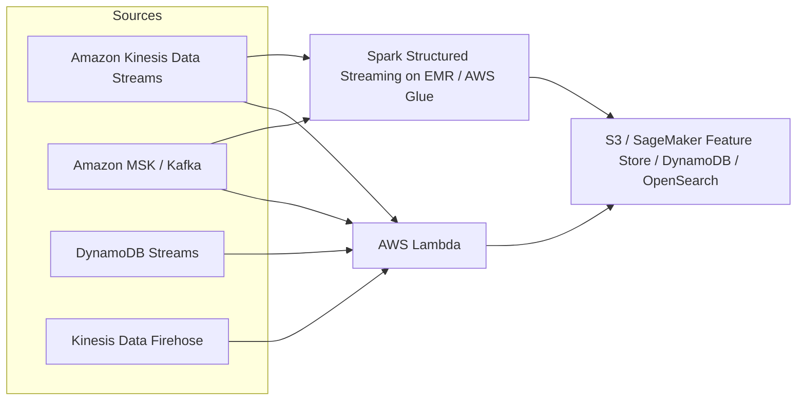
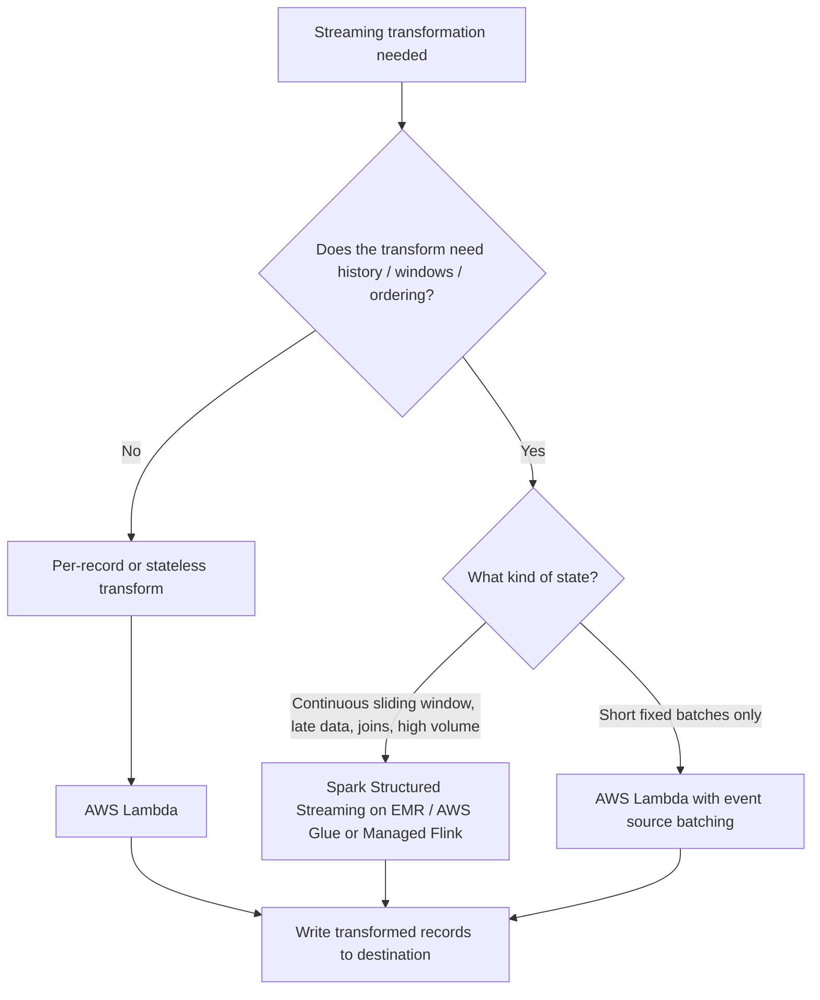

# Task 1.2: Data Preparation for ML and AI - Perform data transformation, feature engineering, and pre-processing

## Skill 1.2.3: Transform streaming data (for example, by using AWS Lambda, Spark)

Streaming data transformation is the continuous preparation of records that arrive in near real time. For machine learning, this means converting raw event data into clean, consistent features without waiting for a scheduled batch job.

The two AWS-tool examples in the exam guide are:

- **AWS Lambda** for event-driven, per-record transformations.
- **Apache Spark**, typically running on **Amazon EMR** or as **AWS Glue streaming jobs**, for stateful, windowed, or high-volume stream processing.

The key skill is not just knowing that both tools exist, but knowing when to use which one.

---

## 1. What You Are Responsible For

For the MLA-C02 exam, be able to:

- Recognize the difference between **batch transformation** and **streaming transformation**.
- Identify whether a streaming transformation is **stateless** or **stateful**.
- Match **AWS Lambda** to the correct streaming use cases.
- Match **Spark on Amazon EMR / AWS Glue** to the correct streaming use cases.
- Understand window types, especially:
  - fixed non-overlapping windows
  - continuous sliding windows
- Recognize how processing guarantees affect ML data pipelines.
- Avoid refitting feature engineering logic on live streaming data.

---

## 2. Core Concepts of Streaming Data Transformation

### 2.1 Streaming vs Batch Transformation

| Aspect | Batch Transformation | Streaming Transformation |
| --- | --- | --- |
| **Data scope** | Full dataset or large historical snapshot | Continuous, unbounded record stream |
| **Trigger** | Schedule or manual run | Event arrival or time window |
| **Latency** | Minutes to hours | Milliseconds to seconds |
| **State** | Often held inside a single job run | Must be maintained across events |
| **Typical ML use** | Training dataset preparation | Online feature engineering, real-time inference preprocessing |
| **Example AWS tools** | AWS Glue, DataBrew, SageMaker Data Wrangler | AWS Lambda, Spark on EMR, AWS Glue streaming |

### 2.2 Stateless vs Stateful Transformations

This distinction is the foundation of tool selection.

| Transformation Type | Definition | Examples | Best Fit |
| --- | --- | --- | --- |
| **Stateless** | Each record is transformed independently | Parsing fields, masking PII, filtering out bad records, unit conversion, applying a pre-trained scaler | AWS Lambda |
| **Stateful** | Transformation needs history, grouping, or ordering across records | Moving average, rolling count, session duration, deduplication, stream-to-stream join | Spark Structured Streaming / Managed service for Apache Flink |

A common trap is to think simply, "My data is streaming, so I should use Lambda."  
The more accurate rule is:

- **Single record, independent work:** Lambda.
- **Cross-record, windowed, ordered, or stateful work:** Spark or a dedicated stream processor.

### 2.3 Streaming Window Types

Windows define how much event history a stateful transformation sees.

| Window Type | Shape | Example |
| --- | --- | --- |
| **Tumbling window** | Fixed, non-overlapping | Aggregate every 5 minutes: 00:00–00:05, 00:05–00:10 |
| **Sliding window** | Continuous, overlapping | Rolling 30-minute average, updated every 1 minute |
| **Session window** | Variable length, separated by inactivity | Group a user’s activity into a single session |

AWS Lambda can perform useful work over short, fixed batches from a stream, but it is not built for long-running continuous sliding windows. Spark, with its windowed state, is designed for that requirement.

### 2.4 Event Time vs Processing Time

| Time Type | Definition | Importance for ML |
| --- | --- | --- |
| **Event time** | Time embedded in the event itself | Critical for accurate behavior modeling; supports late data handling |
| **Processing time** | Time when the system actually processes the event | Simpler, but delayed events can be placed in the wrong window |

Spark Structured Streaming can use **event time** and **watermarking** to handle late data. Lambda functions often work on arrival time, which is fine for simple transforms but weak for time-based stateful behavior.

### 2.5 Processing Guarantees

Different AWS streaming tools provide different delivery and processing guarantees.

| Pattern | Typical Guarantee | ML Impact |
| --- | --- | --- |
| **AWS Lambda reading from Kinesis Data Streams, DynamoDB Streams, or Amazon MSK** | At-least-once | Duplicate processing is possible after retries; transformation should be idempotent or deduplicate |
| **Spark Structured Streaming with checkpointing and transactional sinks** | Exactly-once possible in many cases | Better for building consistent trained feature datasets |
| **Amazon Kinesis Data Firehose with Lambda transform** | Near real-time, at-least-once delivery | Acceptable for simple delivery transforms; not for complex stateful logic |

---

## 3. AWS Services for Streaming Transformation

### AWS Service Comparison

| AWS Service | Category | Best For | Limitations to Know |
| --- | --- | --- | --- |
| **AWS Lambda** | Event-driven compute | Per-record transformations, masking, parsing, enrichment, Firehose record transform | At-least-once, limited local state, not ideal for continuous sliding windows |
| **Spark Structured Streaming on Amazon EMR** | Cluster-based stream processing | High-volume stateful aggregations, sliding windows, joins, late data handling | Requires cluster management or use of EMR Serverless |
| **AWS Glue streaming jobs** | Serverless Spark Structured Streaming | Serverless Spark streaming from Kinesis or Kafka | Less cluster control than EMR; streaming job cost and performance require monitoring |
| **Amazon Managed Service for Apache Flink / KDS Data Analytics** | Dedicated managed stream processing | Continuous sliding windows, event-time processing, complex stateful ML features | More specialized; not covered directly as a primary example in this skill |

AWS Glue streaming jobs use Spark Structured Streaming under the hood, so they belong in the Spark category.

---

## 4. AWS Lambda for Streaming Transformations

### How Lambda Fits Streaming

AWS Lambda can consume streaming data through an **event source mapping** from:

- Amazon Kinesis Data Streams
- Amazon DynamoDB Streams
- Amazon Managed Streaming for Apache Kafka (Amazon MSK)
- Amazon Kinesis Data Firehose for delivery-time transforms

Lambda reads records in batches and can transform them before writing to services such as Amazon S3, DynamoDB, OpenSearch Service, or SageMaker Feature Store.

### Good Lambda Use Cases

- Masking or redacting PII from customer events
- Parsing nested JSON fields into flat feature fields
- Filtering invalid or noise records
- Converting units or timestamps
- Applying a previously fitted scaler to a numeric feature
- Enriching a stream record by calling an ML endpoint or a metadata table
- Transforming data inside Kinesis Data Firehose before delivery to S3

### Lambda Limitations for Streaming

- Lambda is best for **stateless, record-by-record** logic.
- It provides **at-least-once** processing from stream sources.
- It can buffer short batches, but it is not suitable for continuous sliding-window state.
- It has limits on timeout, payload, and local storage.
- State that must survive across multiple invocations should live in an external store such as DynamoDB or another persistent layer.

Use Lambda when each event can be understood and transformed on its own.

---

## 5. Spark Structured Streaming on Amazon EMR / AWS Glue

### How Spark Fits Streaming

Apache Spark Structured Streaming processes streaming data as a continuously running job. It can read from:

- Amazon Kinesis Data Streams
- Amazon MSK
- Apache Kafka

It supports:

- Stateful aggregations
- Windowing
- Watermarking for late data
- Stream-to-stream joins
- Checkpointing for fault tolerance
- Exactly-once output in many configurations

AWS provides two common ways to run Spark streaming:

- **Amazon EMR** for cluster-based control
- **AWS Glue streaming jobs** for serverless Spark Structured Streaming

### Good Spark Use Cases

- Rolling averages over continuous sliding windows
- Keyed aggregations such as per-device or per-user counts
- Detecting sessions from user interactions
- Deduplicating events over time
- Joining multiple streams
- Creating ML training features across event histories
- Processing high-volume telemetry where Lambda would be inefficient or too limited

### Why Spark for Sliding Windows?

A sliding window requires state to be retained as old records leave the window and new records enter it. Spark Structured Streaming can maintain state over windowed aggregations and use **event-time watermarks** to decide how long to wait for late data before discarding state.

Lambda cannot natively maintain this long-running state across invocations without significant custom external storage, which usually makes it the wrong choice for true sliding-window use cases.

---

## 6. Choosing AWS Lambda vs Spark

### Decision Rule

| Requirement | Choose |
| --- | --- |
| Mask one field in every record | AWS Lambda |
| Parse, filter, or enrich each record independently | AWS Lambda |
| Transform records before Kinesis Data Firehose delivers them to S3 | AWS Lambda |
| Continuously calculate a 30-minute moving average | Spark Structured Streaming / Managed Flink |
| Join two real-time streams | Spark Structured Streaming / Managed Flink |
| Handle late-arriving events with watermarks | Spark Structured Streaming / Managed Flink |
| Produce high-volume per-key stateful features | Spark Structured Streaming on EMR / AWS Glue |

The wording in the exam matters:

- "Per record" or "each record independently" strongly suggests **Lambda**.
- "Sliding window", "late data", "state", or "high volume" strongly suggests **Spark** or a dedicated stream processor.

---

## 7. Streaming Transformations in ML Workflows

Streaming transformations are often part of a larger ML pipeline:

1. Raw events arrive through Kinesis Data Streams or Amazon MSK.
2. A streaming transformation cleans the event.
3. Feature engineering is applied:
   - Stateless scale or encoding for online inference
   - Stateful aggregates for online features
4. Transformed data is written to:
   - SageMaker Feature Store for low-latency online serving
   - S3 or a data lake for later training
   - DynamoDB or OpenSearch for real-time applications
5. An inference model consumes the transformed features.

### Critical ML Rule: Apply, Do Not Refit

If a scaler or normalizer was fitted on training data, its parameters must be stored and reused during streaming transformation.

For example:

- During training, a scaler learns the mean and standard deviation for a numerical feature.
- During streaming inference, the stream must apply that same mean and standard deviation.
- If you recompute the mean from a small live batch, the same raw value maps to a different transformed value.
- This causes **training-serving skew**.

The same principle applies to:

- Min-max scaling
- Standardization
- Encodings for categorical values
- Embedding model choice
- Chunking logic for text

---

## 8. Scenario-Based Examples

### Scenario 1: Per-Record PII Masking

A financial services company receives account activity events through Amazon Kinesis Data Streams. Before records can be stored in Amazon S3, the company must mask the customer’s name and account number in each record. No cross-record context is required.

**Which AWS service should perform this streaming transformation?**

**Correct answer:** AWS Lambda.

**Explanation:**  
Masking a field is stateless. Each record can be transformed independently as it arrives. Lambda can consume the Kinesis stream through an event source mapping, mask the sensitive fields, and write the cleaned record onward.

**Trap:**  
Do not choose Spark on EMR simply because the data is streaming. Spark adds operational overhead and is unnecessary for simple record-by-record masking.

---

### Scenario 2: Continuous Sliding Average

A logistics company receives millions of vehicle telemetry events from IoT devices. It needs a rolling 30-minute average fuel consumption per vehicle, updated every minute. Late-arriving events must still be included in the correct window.

**Which streaming transformation approach best fits this requirement?**

**Correct answer:** Spark Structured Streaming on Amazon EMR or AWS Glue, or a dedicated stream processor such as Amazon Managed Service for Apache Flink.

**Explanation:**  
The requirement is a continuous sliding window with state. The system must retain near-history, update averages frequently, and handle event-time late data. Spark Structured Streaming supports stateful windowed aggregations and watermarks for late data.

**Trap:**  
Do not choose AWS Lambda. Lambda is event-driven and not designed to maintain long-running sliding-window state across millions of events.

---

### Scenario 3: DataBrew for Streaming

A data analyst has created an AWS Glue DataBrew recipe that cleans a batch customer dataset. The company now wants to apply the same data-cleaning logic continuously to records in a Kinesis Data Stream.

**Is AWS Glue DataBrew the right tool for the streaming requirement?**

**Correct answer:** No.

**Explanation:**  
AWS Glue DataBrew is a visual data preparation tool for batch datasets. It is not designed for real-time streaming transformations. The streaming path should use AWS Lambda for simple per-record logic or Spark Structured Streaming for complex stateful logic.

---

### Scenario 4: Duplicate Processing with Lambda

A Lambda function reads from an Amazon Kinesis Data Stream and transforms records before writing them to a downstream system. The function fails partway through a batch. The Kinesis event source mapping retries the batch, causing some records to be processed more than once.

**What should the data transformation design account for?**

**Correct answer:** At-least-once processing and idempotency.

**Explanation:**  
Lambda stream event source mappings provide at-least-once delivery semantics. The transformation should be idempotent, or the downstream system should deduplicate based on a unique event identifier.

**Trap:**  
Do not assume exactly-once processing from Lambda and Kinesis Data Streams by default.

---

## 9. Exam Tips and Traps

### Exam Tips

- Use the phrase **"per record"** as a signal to choose **Lambda**.
- Use the phrase **"sliding window"** or **"late data"** as a signal to choose **Spark Structured Streaming** or a managed stream processor.
- Know that **AWS Glue DataBrew** and **SageMaker Data Wrangler** are primarily batch or interactive tools, not streaming tools.
- Know that **Amazon Kinesis Data Streams** is a source/transport layer. It does not transform data by itself.
- Remember that **Kinesis Data Firehose can invoke Lambda** to transform records before delivery, but this is still per-record and not deeply stateful.
- For streaming ML features, apply the exact same transformation logic used in training. Store fitted parameters from training and reuse them in the stream.
- Lambda and Kinesis together provide **at-least-once** processing. Design for idempotency if duplicates are unacceptable.

### Common Traps

| Trap | Correct Understanding |
| --- | --- |
| "Data is streaming, so use Lambda." | Lambda is only correct for stateless, per-record work. |
| "Lambda can easily maintain a rolling average." | Sliding-window state is a Spark/Flink-style requirement. |
| "Kinesis Data Streams transforms data." | Kinesis Data Streams ingests and transports data. Consumers such as Lambda or Spark perform transformation. |
| "DataBrew can clean a stream." | DataBrew cleans batch datasets visually. It is not for real-time stream processing. |
| "Refit the scaler on each streaming batch." | Always apply the scaler fitted on training data. Refitting causes training-serving skew. |
| "Lambda and Kinesis guarantee exactly-once processing." | Lambda stream processing is at-least-once. Duplicates must be handled. |

---

## 10. Quick Recall Summary

| Streaming Requirement | Recommended AWS Approach |
| --- | --- |
| Parse JSON fields in near real time | AWS Lambda |
| Mask PII per record | AWS Lambda |
| Filter out invalid events | AWS Lambda |
| Apply saved scaling or normalization | AWS Lambda |
| Transform Firehose records before S3 delivery | AWS Lambda with Kinesis Data Firehose |
| Rolling 15-minute average per device | Spark Structured Streaming on EMR / AWS Glue |
| Late-event handling with watermarks | Spark Structured Streaming / Managed Flink |
| Join two real-time streams | Spark Structured Streaming / Managed Flink |
| Deduplicate events over time | Spark Structured Streaming / Managed Flink |
| High-volume feature aggregation | Spark Structured Streaming on EMR / AWS Glue |

The core exam skill is to choose the correct tool based on the **shape of the requirement**: per-record versus stateful, fixed batch versus continuous sliding window.