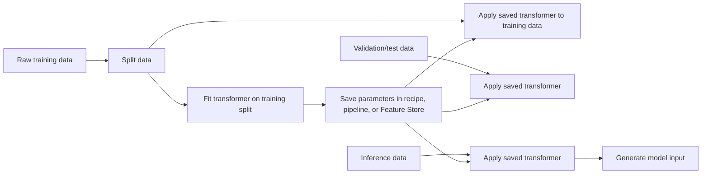

# Task 1.2: Data Preparation for ML and AI - Perform data transformation, feature engineering, and pre-processing

## Skill 1.2.4: Perform feature engineering (for example, scaling, standardization, feature splitting, binning, log transformation, normalization)

Feature engineering transforms raw columns into model-friendly numeric representations. For this exam skill, the focus is on tabular and traditional ML preparation: scaling, standardization, feature splitting, binning, log transformation, and normalization.

A central concept is that these transformations are part of the model input contract. A transformation fitted on training data must be applied unchanged later. You should not refit it on validation, test, or inference data.

---

### 1. Why feature engineering matters

Feature engineering helps because many ML algorithms are sensitive to scale, distribution, and input range.

| Reason | Explanation |
|---|---|
| **Distance-based algorithms** | Models such as k-nearest neighbors, k-means, and SVM compare distances. Large numeric ranges dominate smaller ranges. |
| **Gradient-based models** | Neural networks and linear models converge better when features have similar ranges and distributions. |
| **Linear model assumptions** | Standardized or log-transformed features can better express linear relationships. |
| **Interpretability** | Binning or feature splitting can make patterns easier to explain to business users. |
| **Consistency** | The same transformation must run in training and inference to prevent training-serving skew. |

---

### 2. Core feature engineering techniques

#### 2.1 Scaling and normalization

**Scaling** is the general process of changing the range or variance of a numeric feature.  
**Normalization** usually means rescaling values to a bounded range, commonly [0, 1].

Min-max normalization formula:

\[
x' = \frac{x - x_{\min}}{x_{\max} - x_{\min}}
\]

Use min-max normalization when:

- You need inputs on a bounded scale.
- You are using neural networks, k-means, k-nearest neighbors, or other distance-based algorithms.
- You are combining features that originally have very different ranges.

Caution:

- Min-max normalization is sensitive to outliers.
- If outliers exist, consider outlier removal, clipping, robust scaling, or binning before min-max normalization.

#### 2.2 Standardization

Standardization transforms values so the feature has mean 0 and standard deviation 1.

Standardization formula:

\[
z = \frac{x - \mu}{\sigma}
\]

Where:

- \(\mu\) is the mean of the training data.
- \(\sigma\) is the standard deviation of the training data.

Use standardization when:

- You are building linear regression, logistic regression, support vector machines, or principal component analysis.
- You want features centered around zero with comparable spread.
- You are not strictly required to have a bounded range.

Caution:

- Standardization does not produce a bounded range like [0, 1].
- It is still affected by extreme outliers because the mean and standard deviation are calculated from the data.

#### 2.3 Log transformation

Log transformation compresses a heavily right-skewed distribution by reducing the impact of very large values.

Typical log transform:

\[
y = \log(x)
\]

Or when zeros are present:

\[
y = \log(x + 1)
\]

Use log transformation when:

- A feature has a long tail, such as income, sales amount, count data, response time, or customer spend.
- You want to make a positive continuous variable behave more linearly.
- You are using a linear model or a model sensitive to skew.
- You want to reduce the influence of extreme values without removing records.

Caution:

- Log transformation requires positive values.
- Do not apply log directly to negative values.
- For zero-heavy features, use \(\log(x + 1)\), binning, or another approach.

#### 2.4 Binning / discretization

Binning converts a continuous feature into categorical bins or intervals.

Two common approaches:

| Approach | Description |
|---|---|
| **Equal-width binning** | Divides the value range into intervals of equal size. |
| **Equal-frequency / quantile binning** | Creates bins with approximately the same number of records in each bin. |

Use binning when:

- A continuous variable has a non-linear relationship with the target.
- You want to reduce the effect of outliers.
- You want to create interpretable groups such as age bands or income bands.
- You are working with noisy data and want to smooth volatility.

Caution:

- Binning loses detail.
- If the underlying relationship is already approximately linear, binning can hurt performance.
- Bin boundaries should be learned from training data only and then reused.

#### 2.5 Feature splitting

Feature splitting breaks a single compound field into multiple meaningful fields.

Common examples:

| Original feature | Split features |
|---|---|
| `timestamp` or `order_datetime` | Year, month, day, hour, day-of-week, is-weekend |
| `full_address` | Street, city, state, postal code, country |
| `customer_name` | First name, last name |
| `product_code` | Category prefix, numeric suffix |

Use feature splitting when:

- A timestamp contains hidden seasonality or intra-week patterns.
- A text-like field contains multiple structured parts.
- You need separate features for time, location, or category components.

Caution:

- Avoid creating features that leak the target.
- For example, using a timestamp that includes the target event time as a feature may leak future information during training.

---

### 3. Summary of feature engineering transforms

| Transformation | What it does | Typical use | Key caution |
|---|---:|---|---|
| **Min-max normalization** | Rescales values to [0, 1] | Neural networks, distance-based models | Sensitive to outliers |
| **Standardization** | Centers to mean 0 and standard deviation 1 | Linear models, PCA, SVM | Not bounded; affected by extreme values |
| **Log transformation** | Compresses right-skewed distributions | Skewed positive values such as income or counts | Cannot handle zero or negative values directly |
| **Binning** | Converts continuous values into groups | Non-linear relationships, interpretability | Loses detail |
| **Feature splitting** | Breaks one feature into multiple features | Timestamps, addresses, codes | Must avoid target leakage |

---

### 4. Choosing transformations by algorithm

| Algorithm / Model Type | Scaling or Standardization Needed? | Recommended Feature Engineering |
|---|---|---|
| Linear/logistic regression | High | Standardize or min-max scale; log-transform skewed inputs |
| SVM, k-nearest neighbors, k-means | High | Scale features to comparable ranges |
| Neural networks | High | Normalize or standardize for stable gradients |
| PCA | High | Standardize before dimensionality reduction |
| Tree-based models such as XGBoost, Random Forest | Low | Monotonic scaling often does not matter; binning may help interpretation or noise reduction |

Tree-based models are generally insensitive to monotonic transformations such as log or min-max scaling. Splitting points can adapt to the raw scale, so feature scaling is not required for the algorithm to work. However, reusing consistent features is still important for operational quality.

---

### 5. Fit-transform lifecycle and training-serving consistency

The most important operational concept for this skill is:

**Fit on training data. Save the parameters. Apply the same parameters to all future data.**

For a min-max scaler, the saved parameters are the minimum and maximum values from training.  
For a standard scaler, the saved parameters are the mean and standard deviation from training.  
For binning, the saved parameters are the bin boundaries.

If you refit a transform later:

- The same raw value maps to a different transformed value.
- The model receives inputs it was not trained on.
- This creates **training-serving skew**.

---

### 6. AWS tools for feature engineering

| AWS Service | Role in Feature Engineering |
|---|---|
| **Amazon SageMaker Data Wrangler** | Interactive visual feature engineering in SageMaker Canvas. Provides built-in transforms for scaling, normalization, binning, date splitting, and more. Can export recipes for reuse in SageMaker Pipelines or Feature Store. |
| **AWS Glue DataBrew** | Visual data preparation. Provides recipes for cleaning, profiling, and deriving columns without code. |
| **AWS Glue** | Serverless Spark ETL for scheduled or event-driven batch transformation. Suitable for large-scale feature engineering pipelines. |
| **Amazon EMR** | Managed Spark clusters for large-scale distributed transformation. Useful when you need cluster-level control or frameworks beyond AWS Glue. |
| **Amazon SageMaker Feature Store** | Stores engineered features for reuse. Ensures training and inference use the same feature definitions. |
| **AWS Lambda** | Event-driven compute for lightweight per-record transformations in streaming pipelines. |

---

### 7. Scenario-based examples

#### Scenario 1: Refitting a scaler at inference

A team trains a logistic regression churn model. During training, they fit a standard scaler on the training dataset. After deployment, the inference pipeline recalculates the mean and standard deviation from each daily batch before scoring.

What is the likely consequence?

**Answer:**  
The model will suffer from training-serving skew. The scaler must use the mean and standard deviation saved from training. Recalculating statistics on inference data changes how raw inputs are scaled, so the model sees different feature values than those used during training.

**Correct approach:**  
Export the transformation recipe from SageMaker Data Wrangler or store the transformed features in SageMaker Feature Store. Apply the saved transformation, not a newly fitted one.

---

#### Scenario 2: Right-skewed monetary feature

A financial services company builds a linear regression model to predict customer lifetime value. The raw feature `annual_spend` is positive but highly right-skewed. A small number of customers spend extremely large amounts.

Which feature engineering step should be considered first?

**Answer:**  
Apply a log transformation to `annual_spend`.

**Why:**  
Log transformation compresses the long tail, reduces the influence of extreme values, and can make the relationship with lifetime value more linear. After log transformation, the team may also standardize the resulting feature before feeding it into linear regression.

---

#### Scenario 3: Timestamp feature engineering

A demand forecasting model receives an `order_timestamp` column containing ISO-8601 datetime values. The raw timestamp is not useful as a single numeric value.

Which feature engineering technique should be applied?

**Answer:**  
Feature splitting.

**Explanation:**  
Split `order_timestamp` into components such as:

- Year
- Month
- Day
- Hour
- Day-of-week
- Is-weekend

This allows the model to capture seasonal, weekly, and hourly demand patterns. The split features should be created in the same way during training and inference.

---

#### Scenario 4: Binning for interpretability

A credit risk team uses a tree-based model. The dataset includes a continuous `income` variable with outliers and a non-linear relationship to default risk. The team also wants the final model to be explainable to business stakeholders.

Which transformation is most appropriate?

**Answer:**  
Binning `income` into defined ranges or income bands.

**Explanation:**  
Binning creates interpretable categories such as `low`, `medium`, and `high` income. It can reduce the influence of outliers and help the model capture non-linear relationships. Tree-based models do not require scaling, so binning is often more useful for interpretability than min-max normalization in this situation.

---

### 8. Exam tips and traps

- **Fit only on training data.**  
  Do not fit a scaler, standardizer, or binning boundaries on the entire dataset before splitting. This leaks test distribution and makes evaluation optimistic.

- **Avoid refitting on inference data.**  
  Saved transformation parameters must be reused. Use SageMaker Data Wrangler recipes, model pipelines, or SageMaker Feature Store.

- **Do not assume all algorithms need scaling.**  
  Tree-based models are generally invariant to monotonic scaling. Saying that XGBoost always needs standardization can be an exam trap.

- **Know the difference between normalization and standardization.**  
  Normalization usually means min-max scaling to a bounded range such as [0, 1]. Standardization means centering to mean 0 and standard deviation 1.

- **Log transformation is for positive, skewed data.**  
  Avoid applying log to zero or negative data without adjustment. Use \(\log(x + 1)\) or binning for non-positive values.

- **Binning loses information.**  
  Do not bin automatically. Use it when interpretability, outliers, or non-linear patterns justify the loss of detail.

- **Feature splitting is especially common with datetime data.**  
  Expect exam questions about extracting year, month, day, hour, and day-of-week from timestamps.

- **Choose the right AWS tool.**  
  SageMaker Data Wrangler is for interactive feature engineering and recipe export. AWS Glue is for large-scale batch ETL. SageMaker Feature Store is for storing and serving engineered features.

- **Embedding is not categorical encoding.**  
  For tabular categories, use encoding or binning. Embeddings are used to capture semantic meaning in text or images, not to scale numeric table columns.