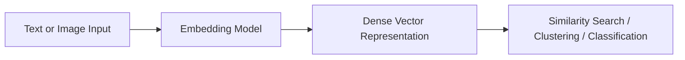
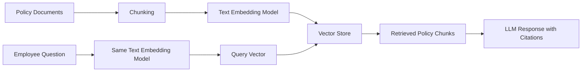

# Task 1.2: Data Preparation for ML and AI - Perform data transformation, feature engineering, and pre-processing.

## Skill 1.2.5: Configure and use embedding models to transform text and image data into numerical representations.

### Overview

Embedding models convert unstructured data such as text passages, sentences, words, or images into dense numerical vectors. These vectors capture semantic or visual meaning so that mathematical operations such as cosine similarity can be used to compare, search, cluster, or classify the original data.

In the AWS Certified Machine Learning - Associate exam, this skill focuses on understanding what embedding models do, when to use them, how to configure them in AWS services such as Amazon Bedrock, and how to store and use the resulting vectors for similarity search and retrieval-augmented generation (RAG).

---

### What Is an Embedding?

An embedding is a fixed-length vector of floating-point numbers that represents high-dimensional, unstructured data in a lower-dimensional, continuous vector space.

Key properties:

- Similar inputs produce similar vectors.
- Distance or angle between vectors reflects semantic or visual similarity.
- Embeddings are dense, unlike sparse one-hot encodings.
- The meaning is learned from large amounts of data by a neural network.

Example:

- The sentence "Where can I track my order?" and "How do I find my package status?" should produce vectors that are close together in embedding space.
- An image of a red sneaker and the text "red running shoe" can produce close vectors when using a multimodal embedding model.



---

### Why Embeddings Instead of Categorical Encoding?

A common exam trap is confusing categorical encoding with text embedding.

| Characteristic | Categorical Encoding | Embedding Model |
| --- | --- | --- |
| Input data | Tabular categories such as region or tier | Unstructured text or images |
| Output | Discrete numeric label or one-hot vector | Dense vector of continuous numbers |
| Semantic meaning | None | Captures meaning and context |
| Example AWS tool | SageMaker Data Wrangler, AWS Glue | Amazon Bedrock embedding models |
| Use case | Structured ML features | Semantic search, RAG, image search |

**Rule of thumb:**  
- Categories get encoded.  
- Meaning gets embedded.

---

### Text Embedding Models

A text embedding model takes a sequence of text tokens and outputs a fixed-length vector that represents the overall meaning of the input.

Common configuration considerations:

- Maximum input token length
- Output vector dimension
- Language support
- Whether the model is optimized for retrieval, semantic similarity, or clustering
- Whether the model supports dimension reduction

On AWS, Amazon Bedrock provides access to several text embedding models, including:

| Model | Modality | Typical Use Cases |
| --- | --- | --- |
| Amazon Titan Text Embeddings v2 | Text | RAG, semantic search, document similarity |
| Cohere Embed English | Text | English retrieval and semantic search |
| Cohere Embed Multilingual | Text | Multilingual retrieval and translation support |
| Amazon Titan Multimodal Embeddings | Text + Image | Cross-modal search, product recommendations |

---

### Image and Multimodal Embedding Models

Image embedding models convert an image into a numerical vector that captures visual features such as objects, colors, textures, layout, and style.

Multimodal embedding models can process both text and images and place them into a shared vector space. This means a text query such as "a modern living room with a blue sofa" can retrieve relevant images, and an image query can retrieve relevant text descriptions.

```mermaid
graph TB
    subgraph Inputs
        T[Text: "red sneakers"] --> MM[Multimodal Embedding Model]
        I[Image: red sneaker photo] --> MM
    end
    MM --> V[Shared Vector Space]
    V --> S[Comparison: text query matches image item]
```

Multimodal embeddings are valuable for:

- E-commerce visual search
- Product recommendation
- Media asset management
- Detecting duplicate or similar images
- RAG applications that include images and text

---

### AWS Services for Embedding Models

| AWS Service | Role |
| --- | --- |
| **Amazon Bedrock** | Managed API access to embedding models from Amazon and third-party providers |
| **Amazon SageMaker JumpStart** | Deploy and use open-source embedding models in SageMaker |
| **Amazon OpenSearch Service / OpenSearch Serverless** | Store and search embedding vectors using k-NN or approximate nearest neighbor search |
| **Amazon Aurora PostgreSQL with pgvector** | Store and query vectors in a relational database |
| **Amazon Bedrock Knowledge Bases** | Managed ingestion pipeline that chunks documents, creates embeddings, and writes them to a vector store |
| **Amazon Kendra** | Enterprise search service that can use semantic relevance without requiring custom embedding pipelines |

For the MLA-C02 exam, focus primarily on Amazon Bedrock for generating embeddings and on vector stores such as OpenSearch or Aurora with pgvector for storing and querying them.

---

### How to Configure and Use an Embedding Model

The conceptual workflow is consistent across AWS services:

1. **Enable model access** in Amazon Bedrock for the chosen embedding model.
2. **Prepare input data** by cleaning, chunking, or resizing images consistently.
3. **Send input to the model** using the Bedrock API.
4. **Receive the embedding vector** as output.
5. **Store the vector** in a vector database along with metadata.
6. **Use the vector** for similarity search, clustering, or as features for downstream ML tasks.

Important configuration points:

- Use the **same embedding model** for both documents and queries.
- Keep the **same chunking strategy** during ingestion and query time when possible.
- For images, preprocess consistently: same resolution, color mode, and format.
- Normalize embeddings if the selected similarity metric requires it.
- Do not reduce vector dimensions unless the model supports it and you have tested retrieval quality.

---

### Storing and Searching Embeddings

After embedding generation, vectors must be stored in a vector database or vector index. Similarity is typically measured using:

| Similarity Measure | Description | Use Case |
| --- | --- | --- |
| **Cosine similarity** | Measures angle between vectors, ignores magnitude | Most common for text and image embeddings |
| **Dot product** | Equivalent to cosine when vectors are normalized | Fast scoring in some engines |
| **Euclidean distance** | Measures straight-line distance | Less common for semantic embeddings |

Vector databases support:

- Approximate nearest neighbor search
- Metadata filtering
- Hybrid search with keyword and vector scores
- Scalable, low-latency retrieval

Metadata is essential for filterability and attribution. For example, RAG answers should cite the document title, page, or product ID stored alongside each vector.

---

### Scenario-Based Examples

#### Scenario 1: Internal Policy Search with RAG

A company wants employees to ask questions against frequently updated internal HR and compliance policies. The solution must answer with relevant policy excerpts and cite the source document.

**Best approach:**

- Chunk policy documents into coherent sections.
- Use a text embedding model through Amazon Bedrock to embed each chunk.
- Store vectors in an OpenSearch Serverless vector index.
- At query time, embed the employee question with the same model.
- Retrieve the most similar chunks using cosine similarity.
- Return the retrieved text to the large language model with source metadata.

**Why this works:**  
Knowledge remains in the vector store, so updates only require re-embedding changed chunks. No model fine-tuning is required when policies change.



---

#### Scenario 2: Product Visual Search

A retail company wants customers to upload a photo of a product and receive matching catalog items.

**Best approach:**

- Use a multimodal embedding model from Amazon Bedrock.
- Embed the image query and the product catalog text or images.
- Compare vectors in the shared vector space.
- Return products with the highest similarity.

**Why this works:**  
A multimodal model enables direct text-to-image and image-to-image retrieval without separate image classification models.

---

#### Scenario 3: Duplicate Image Detection

A media company wants to identify near-duplicate images in a large dataset.

**Best approach:**

- Embed each image with an image or multimodal embedding model.
- Store vectors in a vector database.
- Perform nearest-neighbor search for each vector.
- Flag pairs with high cosine similarity for review.

**Why this works:**  
Even images with different file sizes, crops, or compression can produce similar vectors when the embedding model captures visual semantics.

---

### Exam Tips and Common Traps

| Tip / Trap | Explanation |
| --- | --- |
| **Use embeddings for meaning, not encoding for text** | One-hot or label encoding of text does not capture semantic similarity. |
| **Match the embedding model between ingestion and query** | Mixing models or dimensions breaks similarity comparisons. |
| **Do not use regular tabular scaling on embeddings** | StandardScaler or MinMaxScaler is for tabular numeric features, not for embedding vectors. |
| **Use the same chunking and preprocessing** | Inconsistent chunking can reduce retrieval quality even with good embeddings. |
| **Choose multimodal model for text-image search** | A text-only model cannot embed images, and an image-only model cannot embed text queries. |
| **Embeddings are not fine-tuning** | Embedding a document for RAG does not change foundation model weights. |
| **Dimension reduction affects quality** | Lower vector dimensions save storage and improve speed but can reduce recall. Test before production. |
| **Metadata is not optional** | Metadata enables filtering, source citation, and access control. |
| **Embeddings can be stale if data changes** | Frequently changing knowledge should be re-embedded or updated in the vector store, not baked into a fine-tuned model. |
| **Vector database is separate from embedding model** | Amazon Bedrock creates vectors; OpenSearch or Aurora stores and queries them. |

---

### Quick Knowledge Check

**Question 1**  
A company wants to build a natural language search feature that lets users find help articles based on the meaning of the query, not exact keywords. Which transformation should be used on the articles and queries?

**A.** Convert each word to a categorical label  
**B.** Apply one-hot encoding to the article text  
**C.** Use an embedding model to convert text passages into numerical vectors  
**D.** Apply log transformation to term frequencies  

**Correct Answer:** **C**

**Explanation:**  
Embedding models capture semantic meaning of text. Categorical encoding and one-hot encoding do not preserve meaning, and log transformation addresses skewed numeric distributions, not text similarity.

---

**Question 2**  
A company is building a visual search feature where customers upload a picture of a product and the system returns similar products from the catalog. Which type of embedding model should be used?

**A.** Text-only embedding model  
**B.** Multimodal embedding model  
**C.** Tabular feature embedding model  
**D.** Principal component analysis model  

**Correct Answer:** **B**

**Explanation:**  
A multimodal embedding model can embed both images and text into the same vector space, allowing image-to-image and image-to-text similarity search. Text-only and tabular approaches do not handle visual input.

---

**Question 3**  
A team embeds all product documents with a text embedding model from Amazon Bedrock and stores the vectors in OpenSearch. At query time, they use a different embedding model for the customer question. What is the likely result?

**A.** The system works normally because all vectors are numerical.  
**B.** Similarity scores may be meaningless because the models project text into different vector spaces.  
**C.** The system will automatically retrain the query model.  
**D.** This improves retrieval accuracy.  

**Correct Answer:** **B**

**Explanation:**  
Different embedding models produce vectors in different semantic spaces. The same model must be used for both documents and queries to ensure that similar meanings map to nearby vectors.

---

### Summary

- Embedding models transform text and image data into dense numerical vectors.
- Similar inputs produce similar vectors, enabling semantic and visual similarity search.
- Amazon Bedrock provides managed access to text, image, and multimodal embedding models.
- Embedding vectors are stored in vector databases such as OpenSearch or Aurora with pgvector.
- The same embedding model, preprocessing, and chunking strategy must be used for ingestion and query time.
- Embedding models are the foundation for RAG, visual search, duplicate detection, and semantic retrieval.
