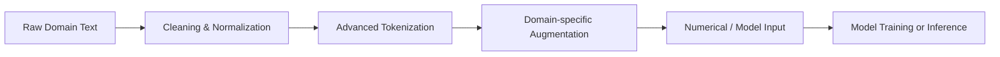
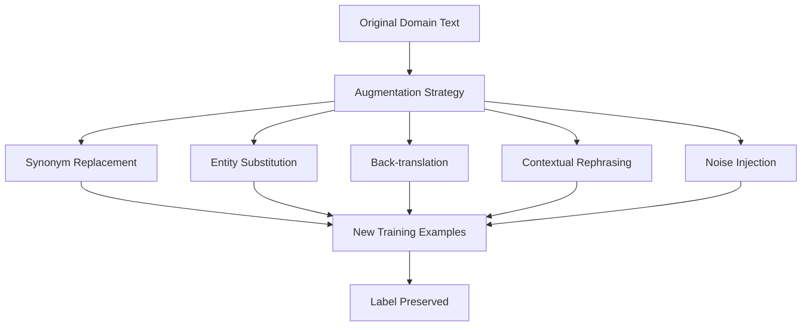
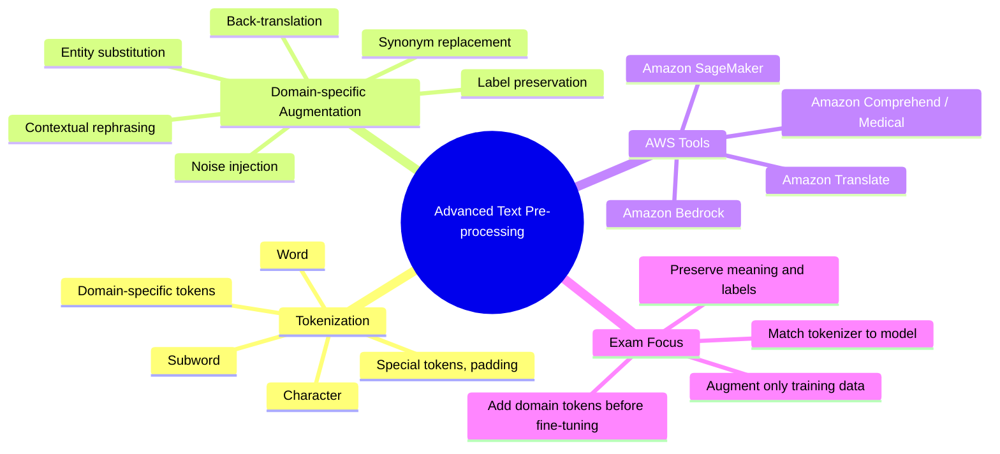

# Task 1.2: Data Preparation for ML and AI - Perform data transformation, feature engineering, and pre-processing

## Skill 1.2.6: Apply advanced text pre-processing techniques (for example, tokenization, domain-specific augmentation)

### Overview

Advanced text pre-processing prepares unstructured text so a machine learning model can understand it accurately. For traditional natural language processing models, this means converting raw text into structured numerical inputs. For generative AI and foundation models, it also means preserving specialized vocabulary, handling domain-specific language, and generating additional training examples without changing meaning.

Two techniques are especially important for this skill:

- **Tokenization** – splitting text into tokens (words, subwords, or characters) that models can process.
- **Domain-specific augmentation** – creating new text examples that preserve the specialized vocabulary and semantics of a particular field.

This skill is not about generic text cleaning; it focuses on **advanced** techniques that handle domain complexity, rare terms, and limited labeled data.

---

### 1. Why Advanced Text Pre-processing Matters

Generic text pre-processing, such as lowercasing or removing stop words, can destroy important domain information. For example, in a medical text:

- **"mg"** and **"Mg"** (milligram vs. magnesium) may be confused if text is lowercased.
- **"ER"** may mean *emergency room* or *estrogen receptor* depending on context.
- Removing stop words like **"not"** can flip sentiment or clinical meaning.

Advanced techniques focus on:

- Retaining domain-specific acronyms, symbols, and units.
- Using subword tokenization to handle rare or unseen terms.
- Augmenting training data without changing labels or meaning.



---

### 2. Tokenization

Tokenization is the process of splitting text into smaller units called **tokens**. The choice of tokenization method affects vocabulary size, handling of out-of-vocabulary terms, and model performance.

#### 2.1 Types of Tokenization

| Tokenization Type | Description | Pros | Cons | Common Use Case |
|-------------------|-------------|------|------|-----------------|
| **Word tokenization** | Splits text by spaces and punctuation into whole words. | Easy to understand; each token is a complete word. | Large vocabulary; cannot handle new or rare words; different forms of the same word are separate tokens. | Classical ML models such as Naive Bayes or TF-IDF. |
| **Character tokenization** | Splits text into individual characters. | Very small vocabulary; can handle any spelling or new word. | Long input sequences; each character has less meaning; harder for models to learn semantics. | Morphologically rich languages; spelling correction. |
| **Subword tokenization** | Splits words into frequent meaningful subunits, such as prefixes, suffixes, or character sequences. | Balances vocabulary size and handling of rare words; reduces out-of-vocabulary issues. | More complex to implement; rare words may still be split into many units. | Transformer models, foundation models, domain-specific fine-tuning. |

#### 2.2 Advanced Subword Tokenization Algorithms

Modern foundation models commonly use subword tokenization. Understanding these methods helps you decide when to add custom tokens.

| Algorithm | Description | Examples of Models |
|-----------|-------------|--------------------|
| **Byte Pair Encoding (BPE)** | Iteratively merges the most frequent character or character-sequence pairs in a corpus. | GPT models, RoBERTa |
| **WordPiece** | Similar to BPE but selects merges based on maximizing the likelihood of the training corpus. | BERT, DistilBERT |
| **SentencePiece** | Treats text as a sequence of Unicode characters and can be trained without pre-tokenization; often used with BPE or unigram. | T5, Llama |
| **Unigram language model** | Starts with a large set of subwords and prunes those that contribute least to the corpus likelihood. | Some multilingual models |

```mermaid
flowchart TD
    A[Raw word: "immunotherapy"] --> B{Subword tokenizer}
    B --> C["immuno" "therapy"]
    B --> D["immun" "o" "therapy"]
    B --> E["im" "muno" "therapy"]
    C --> F[Tokens preserved as subword pieces]
```

#### 2.3 Domain-Specific Tokenization

When working with specialized domains such as medicine, law, engineering, or finance, generic tokenizers may split important terms incorrectly.

**Example:**

A standard BPE tokenizer might split the drug name **"acetaminophen"** as:

```
"acet" + "amino" + "phen"
```

But if the clinical model does not understand these subword pieces as a single concept, performance may degrade.

**Best practice for domain-specific tokenization:**

- Start with the tokenizer from the pre-trained foundation model you intend to fine-tune.
- Identify high-frequency domain terms, abbreviations, and units that the tokenizer splits poorly.
- Add these as **special tokens** to the tokenizer vocabulary and resize the model’s embedding layer before fine-tuning.
- Use domain-specific text for tokenizer training only if you must train a new tokenizer from scratch, which is uncommon.

#### 2.4 Special Tokens, Padding, and Truncation

Advanced text pre-processing also includes:

- **Special tokens:** `[CLS]` for classification, `[SEP]` for separation, `[PAD]` for padding, `[MASK]` for masked language modeling, and `[UNK]` for unknown tokens.
- **Padding:** Adding `[PAD]` tokens so all sequences in a batch have equal length.
- **Truncation:** Cutting sequences longer than a model’s maximum input length.
- **Attention masks:** A binary mask that tells the model which tokens are real tokens and which are padding tokens.

These steps must match the tokenizer and model configuration used during training and inference.

---

### 3. Domain-Specific Augmentation

Domain-specific augmentation creates additional training examples that mimic the vocabulary, style, and variation of a specialized domain. This is particularly useful when labeled data is limited.

#### 3.1 Why Domain-Specific Augmentation?

- Increases the size and diversity of the training dataset.
- Reduces overfitting by introducing realistic variation.
- Preserves domain terminology and semantics that generic augmentation may destroy.
- Helps models generalize to new expressions without changing the label or intent.

#### 3.2 Common Domain-Specific Augmentation Techniques

| Technique | Description | Domain-Specific Example | Best For |
|-----------|-------------|-------------------------|----------|
| **Synonym replacement** | Replace words with domain-appropriate synonyms. | Replace "heart attack" with "myocardial infarction" in medical text. | Text classification, intent recognition. |
| **Entity substitution** | Replace domain-specific named entities with similar ones from a controlled vocabulary. | Replace a drug name like "metformin" with another diabetes drug. | Named entity recognition, relationship extraction. |
| **Back-translation** | Translate text to another language and back to create paraphrases. | Translate a legal clause to French and back to English to create a paraphrase while preserving legal terms. | Text classification, sentence similarity, intent detection. |
| **Contextual augmentation using foundation models** | Use a large language model to rephrase or generate variations while preserving meaning. | Prompt: "Rephrase this clinical note while keeping all medical facts and terms unchanged." | Domain-specific text generation, limited data scenarios. |
| **Rule-based noise injection** | Introduce realistic domain-specific noise, such as OCR errors, abbreviations, or misspellings. | Convert "complete blood count" to "CBC" or "cbc" in a clinical note. | Robustness to real-world input, document processing. |
| **Mask token augmentation** | Randomly mask domain-specific tokens and ask the model to predict or generate them. | Mask "hypertension" in a medical sentence and generate synonyms like "high blood pressure." | Pre-training, domain adaptation. |



#### 3.3 Critical Considerations for Domain-Specific Augmentation

- **Label preservation:** The augmentation must not change the label or intent of the original text. For example, adding "not" to a sentence changes its sentiment or clinical fact.
- **Controlled vocabulary:** Use domain-specific dictionaries, ontologies, or knowledge bases when replacing terms.
- **Validation data isolation:** Apply augmentation only to the training set. Validation and test sets should remain clean and representative of real data.
- **Bias avoidance:** Ensure augmentation does not introduce skewed distributions or unrepresentative pseudo-examples.
- **Realistic variation:** Simulate errors and variations that actually occur in the target domain, not arbitrary random changes.

---

### 4. AWS Services Relevant to Advanced Text Pre-processing

| AWS Service | Role in Text Pre-processing |
|-------------|-----------------------------|
| **Amazon Bedrock** | Access foundation models for contextual text augmentation, paraphrasing, and domain-specific text generation. Also provides embedding models that rely on tokenization. |
| **Amazon Translate** | Performs neural machine translation, which can be used for back-translation augmentation. |
| **Amazon Comprehend** | Provides syntax analysis that can tokenize text and identify parts of speech; detects entities and key phrases. **Amazon Comprehend Medical** can identify medical domain entities. |
| **Amazon SageMaker** | Runs custom text pre-processing jobs using SageMaker Processing; hosts custom tokenization or augmentation models if needed. |
| **AWS Glue Databrew / AWS Glue** | Performs batch text cleaning and normalization on tabular datasets containing text columns. |
| **Amazon SageMaker Data Wrangler** | Offers low-code text transformations, but custom tokenization may be done in a pull data flow. |

When fine-tuning a foundation model on Amazon Bedrock, you do not need to manage the tokenizer directly. However, understanding tokenization is still important because:

- You must provide training data in the format the model expects.
- Domain-specific augmentation may be applied before uploading data to Amazon Bedrock.
- You should not include examples that conflict with the model’s tokenizer or expected input length.

---

### 5. Scenario-Based Examples

#### Scenario 1

A healthcare organization is fine-tuning a foundation model on clinical notes. The notes contain many domain-specific abbreviations like "CBC" (complete blood count), "MRI" (magnetic resonance imaging), and "q.d." (once daily). The team notices that the model sometimes misinterprets these terms because the standard tokenizer splits them into meaningless subword pieces.

**What advanced text pre-processing technique should the team apply?**

- **A.** Remove all abbreviations from the notes.
- **B.** Use character-level tokenization instead of subword tokenization.
- **C.** Add the domain-specific abbreviations as custom tokens to the model’s tokenizer and resize the embedding layer.
- **D.** Lowercase all text so the tokenizer treats the abbreviations as single tokens.

**Correct Answer: C**

**Explanation:**  
Adding domain-specific abbreviations as custom tokens to the tokenizer allows the model to treat them as single, meaningful units instead of splitting them into subwords. The embedding layer must be resized to accommodate the new tokens before fine-tuning. Removing abbreviations would lose important clinical information, character-level tokenization would not preserve term semantics, and lowercasing alone does not change how subword tokenization splits the token.

---

#### Scenario 2

A financial services company has a small labeled dataset of customer emails about fraudulent transactions. The team wants to increase the size of the training set while preserving the original intent and domain-specific terms such as "ACH transfer," "wire fraud," and "chargeback."

**Which augmentation strategy best meets this requirement?**

- **A.** Randomly delete words from the emails.
- **B.** Use back-translation and synonym replacement with a financial domain dictionary.
- **C.** Replace all domain-specific terms with generic synonyms.
- **D.** Add random noise tokens to every email.

**Correct Answer: B**

**Explanation:**  
Back-translation creates paraphrases while typically preserving the overall message and label. Synonym replacement using a financial domain dictionary ensures that new variations are both realistic and domain-appropriate. Random deletion and random noise can change meaning or intent, and replacing domain terms with generic synonyms would lose critical financial information.

---

#### Scenario 3

A team is building a text classification model for a proprietary legal domain with many unique case citations and statutes. The base pre-trained model uses a WordPiece tokenizer. The team observes that case citations like "42 U.S.C. § 1983" are split into many subword tokens, hurting model performance.

**What is the most appropriate pre-processing approach?**

- **A.** Train a completely new tokenizer from scratch using only the legal domain corpus.
- **B.** Use the base model’s tokenizer as-is and do not modify it.
- **C.** Add the most frequent legal domain terms and citation patterns to the existing tokenizer and fine-tune the model.
- **D.** Convert all text to Unicode character sequences and use a character-level model.

**Correct Answer: C**

**Explanation:**  
Training a new tokenizer from scratch is expensive and may lose useful knowledge from the pre-trained model. The best approach is to extend the existing tokenizer with high-frequency domain-specific tokens and then fine-tune the model on the legal corpus. This preserves the base model’s learned representations while adapting to the domain. Using the tokenizer as-is fails to solve the splitting problem, and character-level modeling may not be necessary or optimal.

---

### 6. Exam Tips and Traps

- **Do not confuse tokenization with chunking.**  
  Tokenization splits text into tokens for a model’s input vocabulary. Chunking splits documents into retrievable pieces for RAG applications.

- **Use the tokenizer that matches the pre-trained model.**  
  When fine-tuning a foundation model, always start with the tokenizer from the original model. Creating a new tokenizer from scratch is rarely the right answer.

- **When adding domain tokens, remember to resize the embedding layer.**  
  If you add new tokens to a tokenizer, the model’s embedding matrix must be expanded before fine-tuning. The exam may test this conceptual detail.

- **Domain-specific augmentation must preserve labels.**  
  Any augmentation that changes the target label or intent is invalid for supervised training. Look for options that explicitly state label or meaning preservation.

- **Augment only the training set.**  
  Applying augmentation to validation or test data leaks information and produces misleading evaluation metrics.

- **Generic pre-processing can hurt domain models.**  
  Lowercasing, removing stop words, or stemming may destroy important domain distinctions. For generative AI and transformer fine-tuning, avoid unnecessary cleaning.

- **Word tokenization struggles with rare and unseen domain terms.**  
  Subword tokenization is generally preferred for domain-specific text because it can handle out-of-vocabulary words.

- **Back-translation is a strong augmentation but may alter domain terms.**  
  Use it carefully, especially when domain-specific vocabulary must remain exact. Consider combining it with domain dictionaries or post-processing validation.

- **Amazon Comprehend provides syntax analysis, not custom tokenizer training.**  
  Use it for basic tokenization and entity detection, but advanced domain-specific tokenization usually requires custom modifications in SageMaker or other compute environments.

- **In Amazon Bedrock, you do not manage the tokenizer directly.**  
  However, you must prepare training data according to the model’s expected format and consider whether domain-specific augmentation before upload will help.

---

### 7. Summary



- **Tokenization** determines how text becomes model input and directly affects vocabulary size and out-of-vocabulary handling.
- **Domain-specific augmentation** expands limited training data using realistic, label-preserving variations.
- The most advanced and exam-relevant technique is adding **domain-specific tokens** to a pre-trained tokenizer.
- Always consider whether the text pre-processing step is applied consistently across training and inference.
- For domain-specific tasks, treat specialized vocabulary as a first-class citizen: preserve, augment, and tokenize it intentionally.