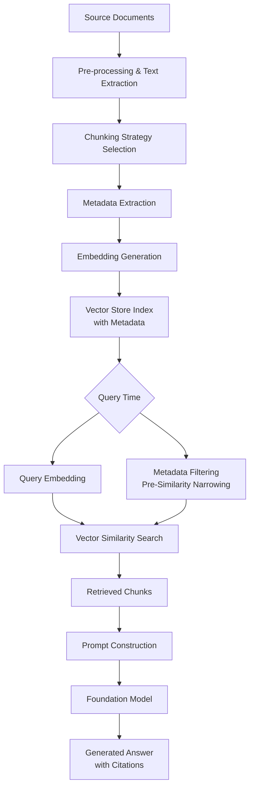
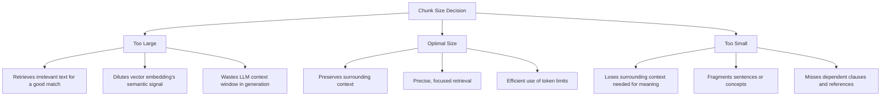
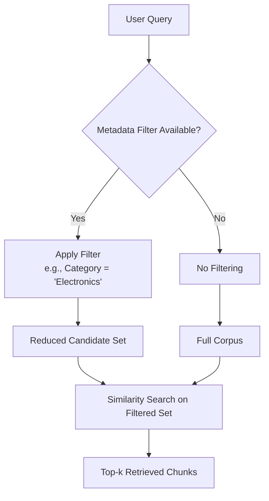
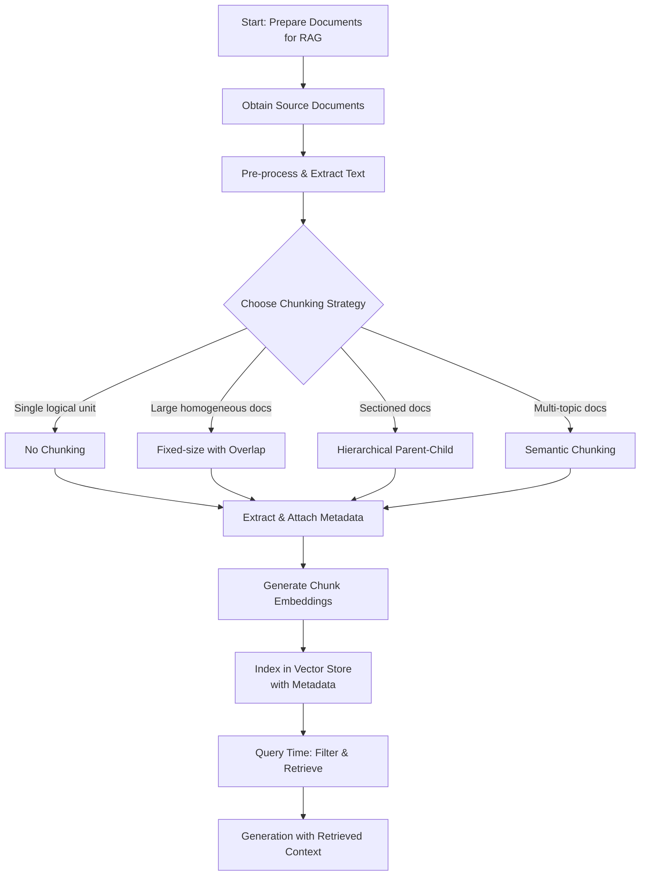

# Task 1.2: Data Preparation for ML and AI - Perform Data Transformation, Feature Engineering, and Pre-processing

## Skill 1.2.7: Prepare Documents for Retrieval Augmented Generation (RAG) Applications

---

## 1. Introduction to RAG Document Preparation

Retrieval Augmented Generation (RAG) is an architecture pattern that enhances foundation model responses with **external knowledge**. Instead of storing facts in model weights (as with fine-tuning), RAG retrieves relevant information from an indexed corpus at query time and injects that context into the prompt.

Document preparation is **the foundational step** in a RAG pipeline. If documents are poorly chunked or missing metadata, the entire downstream retrieval and generation quality degrades — regardless of how powerful the embedding model or foundation model may be.

The two most consequential preparation decisions are:

| Decision | Question It Answers |
| --- | --- |
| **Chunking strategy** | How should each document be split into retrievable units? |
| **Metadata extraction** | What descriptive attributes should be attached to each chunk to make it filterable and attributable? |

---

## 2. The RAG Ingestion Pipeline

The document preparation workflow fits into the larger RAG architecture. Understanding the full pipeline is essential for recognizing where chunking and metadata extraction sit relative to embedding generation and indexing.

**Key observations about this pipeline:**

- **Chunking and metadata extraction happen before embedding generation.** A chunk that is poorly defined cannot be rescued by a better embedding model.
- **Metadata enables two distinct retrieval functions:** pre-filtering before similarity search, and attribution/citation after generation.
- **The vector store holds the embeddings alongside the metadata**, not the original raw documents. The original documents are retained separately for provenance and reference.

---

## 3. Chunking Strategies

### 3.1 Why Chunking Matters

Chunking transforms large documents into smaller, self-contained units that can be:
- **Embedded** — each chunk becomes a vector representing its semantic content.
- **Retrieved** — the system returns the most relevant chunks for a given query.
- **Injected** — retrieved chunks are placed into the foundation model's context window.

The goal is to produce chunks that are:
1. **Semantically coherent** — each chunk represents a single main concept or topic.
2. **Contextually sufficient** — each chunk contains enough surrounding material for the meaning to be clear without the rest of the document.
3. **Appropriately granular** — chunks are sized to match the expected scope of user queries.

### 3.2 The Core Tradeoff: Chunk Size

The chunk size tradeoff is the single most important concept in RAG document preparation.

| Chunk Size | Threshold | Characteristics | Best For |
| --- | --- | --- | --- |
| **Small** | ~128–256 tokens | High precision, low context | Factual lookup, FAQ matching, specific details |
| **Medium** | ~512–768 tokens | Balanced | General Q&A, policy documents, support content |
| **Large** | ~1000–2000 tokens | High context, low precision | Summarization, wide-scope queries, technical prose with heavy cross-references |

**Exam-important principle:** If retrieval returns the correct sentence buried in a large amount of unrelated text, the fix is to **reduce chunk size** (or use semantic splitting) — not to increase it.

### 3.3 Chunking Strategies in Amazon Bedrock Knowledge Bases

Amazon Bedrock Knowledge Bases provides a managed ingestion path with specific chunking strategy options. Candidates must know each strategy, its mechanics, and its appropriate use case.

| Strategy | How It Works | When to Use | Tradeoffs |
| --- | --- | --- | --- |
| **Fixed-size chunking** | Splits text into chunks of a specified token count (e.g., 300 tokens), with a configurable overlap percentage | General-purpose use; large, homogeneous documents; predictable structure | Simple and efficient; may split sentences or logical units mid-way; requires overlap to mitigate boundary breaks |
| **No chunking** | Treats each file as a single indivisible chunk | Files that are already one logical unit (e.g., a single FAQ entry, a product spec sheet, a short policy) | No fragmentation; cannot retrieve subsections of a large document independently |
| **Hierarchical chunking** | Creates chunks at multiple granularity levels; smaller child chunks are used for retrieval, larger parent chunks provide context | Documents with clear parent–child structure (sections, subsections, chapters) | Preserves broader context; more complex storage and retrieval logic |
| **Semantic chunking** | Splits text at natural meaning boundaries (topic shifts, paragraph breaks) using an embedding model | Documents with clear semantic sections; diverse multi-topic documents | Produces semantically coherent chunks; may require more compute to determine boundaries |

### 3.4 Chunk Overlap

**Overlap** is the number of tokens shared between consecutive chunks in fixed-size chunking. It acts as a sliding window that preserves continuity at boundaries.

| Overlap Setting | Effect | When to Use |
| --- | --- | --- |
| **Zero overlap** | Hard boundary; a sentence spanning the boundary is split | No acceptable risk of split context; but generally discouraged for plain text |
| **Low overlap (5–10%)** | Minimal continuity | Predictable, homogeneous text where boundaries rarely split meaningful units |
| **Moderate overlap (15–25%)** | Prevents most sentence splits | Default for general-purpose RAG; recommended for dense technical content |
| **High overlap (>25%)** | Strong continuity, but increases storage and embedding cost | When split boundaries frequently occur mid-sentence or mid-paragraph |

**Exam-important principle:** Overlap addresses context fragmentation at boundaries but does not cure chunks that are fundamentally too small or too large. Increasing overlap is not a substitute for an appropriate chunk size.

### 3.5 Factors That Constrain Chunk Size

When choosing chunk parameters, two model-level constraints apply:

| Constraint | Meaning | Impact |
| --- | --- | --- |
| **Embedding model max input tokens** | Each embedding model (e.g., in Amazon Bedrock) has a maximum number of tokens it can encode per input | Chunks cannot exceed this limit or they must be truncated |
| **Foundation model context window** | The generative model can accept only a limited number of input tokens | Total tokens across all retrieved chunks must fit within this window, alongside the user query and system instructions |

The number of chunks retrieved (top-k) multiplied by the chunk size must remain within the foundation model's context window after accounting for overhead.

---

## 4. Metadata Extraction

### 4.1 What Is Metadata?

Metadata is **structured, descriptive information attached to each chunk** that describes its source, content type, and provenance. It is stored alongside the vector embedding in the vector store.

### 4.2 Why Metadata Matters

Metadata serves three distinct purposes in RAG systems:

| Purpose | Description | Example |
| --- | --- | --- |
| **Pre-filtering / Narrowing** | Filter the vector store to only a relevant subset before similarity search runs | Restrict retrieval to only product manuals, only documents last updated within 12 months, only documents for a specific product line |
| **Attribution / Citation** | Tell the application where an answer came from | Generate "Source: Product Manual — Model X, Page 42" |
| **Organizational Routing** | Route queries to the correct corpus or access control tier | Enforce that a user can only retrieve chunks from documents they are authorized to view |

### 4.3 Common Metadata Fields

| Metadata Field | Purpose | Typical Value |
| --- | --- | --- |
| **Source document** | Provenance and attribution | `product_manual_v2.pdf` |
| **Page number** | Locating the answer within the source | `42` |
| **Section heading** | Grouping and filtering by topic | `Returns and Refunds` |
| **Product name / SKU** | Product-specific filtering | `Wireless Headphones Model X` |
| **Category** | Domain or organizational level filtering | `Electronics`, `Policy` |
| **Last updated** | Time-based filtering to exclude stale content | `2024-11-15` |
| **Author** | Attribution and access control | `Legal Team` |
| **Document type** | Filtering by format or purpose | `FAQ`, `policy`, `manual`, `release notes` |
| **Access level** | Security filtering by user permission | `public`, `internal`, `restricted` |

### 4.4 Metadata Extraction Approach

Metadata can be obtained through two primary mechanisms:

| Approach | How It Works | Example |
| --- | --- | --- |
| **Structured extraction from document properties** | Read from the document's file metadata, chapter headings, or database fields | Extract page numbers from PDF structure, product name from document title |
| **NLP-based entity extraction** | Use a text analysis service to detect named entities, topics, or PII | Identify that a chunk belongs to "Returns" section based on heading content |

**Exam-important principle:** Metadata filtering happens **before** similarity search. The value of metadata is that it narrows the candidate set so the embedding comparison operates on a smaller, more relevant population — reducing false positives and retrieval noise.

### 4.5 The Role of Metadata in the Query Path

---

## 5. Pre-processing Documents for RAG

Before chunking, documents often require cleaning and transformation. While not the primary focus of this skill, pre-processing directly impacts chunk quality.

| Pre-processing Step | Purpose | Example |
| --- | --- | --- |
| **Text extraction** | Convert binary formats (PDF, DOCX) into raw text | Extract paragraphs from a PDF, including table structure if relevant |
| **Noise removal** | Strip headers, footers, watermarks, page numbers that add no semantic value | Remove repetitive boilerplate text from every page |
| **Table restructuring** | Flatten tables into readable text representations | Convert a table of product specs into "Spec: Bluetooth 5.0; Battery: 30h" |
| **Tokenization** | Break text into tokens as the embedding model expects them; ensure specialized vocabulary survives | Preserve domain abbreviations (e.g., "FN" for "fiber node" in telecom documents) |
| **Domain-specific augmentation** | Add synonyms or clarify ambiguous terms for the target domain | Expand acronyms on first use; replace shorthand with canonical terms |

**Exam-important principle:** Tokenization is a pre-processing concern; chunking operates on the tokenized text. Do not conflate the two.

---

## 6. AWS Services Involved in RAG Document Preparation

| AWS Service | Role in Document Preparation |
| --- | --- |
| **Amazon Bedrock Knowledge Bases** | Managed ingestion path that handles chunking, metadata extraction, embedding generation, and vector store loading with configurable strategies |
| **Amazon Bedrock** | Hosts the embedding models used to convert chunks into numerical vectors and the foundation models for generation |
| **Amazon OpenSearch Service** | Serves as the vector database for indexing chunk embeddings and metadata, and running filtered similarity searches |
| **AWS Glue** | For custom batch pipelines that pre-process an entire corpus before loading into the vector store (e.g., extracting text from S3 at scale) |
| **AWS Lambda** | For event-driven pre-processing of individual documents as they arrive in an S3 bucket (e.g., new policy uploaded triggers chunking and embedding) |
| **Amazon S3** | Object storage for the original documents and any intermediate chunked artifacts |

---

## 7. RAG vs. Fine-Tuning: Choosing the Right Path

A common source of exam confusion is whether a given scenario calls for RAG document preparation or fine-tuning data preparation. The distinction is fundamental:

| Characteristic | RAG Document Preparation | Fine-Tuning Data Preparation |
| --- | --- | --- |
| **Goal** | Make knowledge retrievable at query time | Teach the model a stable behavior or pattern |
| **Data Product** | Chunks + embeddings + metadata in a vector store | Labeled prompt-response pairs in JSONL |
| **Knowledge Update Cost** | Low — re-index only the changed documents | High — must re-run training on updated dataset |
| **Use Case** | Frequently changing facts (policies, catalogs, FAQs) | Consistent output format, tone, style |
| **AWS Service** | Amazon Bedrock Knowledge Bases, vector store | Amazon Bedrock fine-tuning job, Amazon SageMaker training |

**Decision rule:** If the knowledge changes often, RAG. If the behavior must be consistent, fine-tuning (or prompt engineering first).

---

## 8. Scenario-Based Knowledge Checks

### Scenario 1

A healthcare company builds a RAG application over clinical research papers. Their fixed-size chunking strategy (400 tokens) frequently splits important study findings across two adjacent chunks, causing the system to retrieve only one half of the result and lose critical context. Which adjustment would most directly address this issue?

**A.** Increase the overlap between adjacent chunks  
**B.** Remove metadata from the chunks  
**C.** Increase the chunk size to 2000 tokens  
**D.** Convert the chunks to categorical encodings instead of embeddings  

??? success "Answer & Explanation"

    **Correct Answer:** **A. Increase the overlap between adjacent chunks**

    **Explanation:**  
    Fixed-size chunking with insufficient overlap can split important sentences or study findings across chunk boundaries. Increasing the overlap ensures that content spanning a boundary is duplicated into both adjacent chunks, so the retrieval system can recover complete context.

    **Why the other options are incorrect:**
    - **B.** Metadata is orthogonal to chunk boundaries; removing it does not address fragmentation.
    - **C.** Increasing chunk size might help but also dilutes retrieval precision by pulling in more unrelated surrounding text; the most direct fix for boundary splits is overlap.
    - **D.** Embeddings, not categorical encodings, are required for semantic text retrieval.

### Scenario 2

A financial services company builds a RAG for internal policies. Policies are stored as long PDF documents. The team wants to ensure that when a user asks a question about "travel reimbursement," only chunks from the "Travel Policy" section are retrieved — not chunks from the "Expense Management" section that mention travel in passing. Which preparation action best enables this?

**A.** Use a larger fine-tuned embedding model  
**B.** Extract section headings as metadata and filter on them before similarity search  
**C.** Embed the entire PDF as a single chunk  
**D.** Fine-tune the foundation model on the policy documents  

??? success "Answer & Explanation"

    **Correct Answer:** **B. Extract section headings as metadata and filter on them before similarity search**

    **Explanation:**  
    Metadata extraction enables pre-filtering. By tagging each chunk with its section heading (e.g., `Section = "Travel Policy"`), the system can narrow the candidate set before vector similarity search, ensuring retrieval only from the relevant section.

    **Why the other options are incorrect:**
    - **A.** A larger embedding model might improve semantic matching but does not guarantee section-level restriction.
    - **C.** Embedding the entire PDF as one chunk would make retrieval overly broad and lose granularity — retrieving large amounts of irrelevant text with the answer.
    - **D.** Fine-tuning bakes knowledge into model weights and requires re-training when policies change, making it unsuitable for frequently revised policies.

### Scenario 3

An e-commerce company builds a product FAQ chatbot using RAG. Each product has a unique SKU, a product name, and a category. The application must attribute every generated answer to the correct product manual and page. Additionally, the system must only retrieve chunks for products in the category the user is currently browsing. Which two preparation steps are most critical?

**A.** Store the SKU, category, and page number as metadata on each chunk  
**B.** Fine-tune the embedding model for product-specific vocabulary  
**C.** Use hierarchical chunking with no metadata  
**D.** Convert the product name to a one-hot encoding before embedding  

??? success "Answer & Explanation"

    **Correct Answer:** **A. Store the SKU, category, and page number as metadata on each chunk**

    **Explanation:**  
    Metadata extraction is the precise mechanism for both filtering (restricting to a specific category) and attribution (citing product manual and page number). Storing SKU, category, and page number as metadata supports both requirements.

    **Why the other options are incorrect:**
    - **B.** Fine-tuning the embedding model would improve semantic matching but does not inherently provide filtering or attribution capabilities.
    - **C.** Hierarchical chunking addresses context preservation, not attribution or category-level filtering.
    - **D.** One-hot encoding is for categorical tabular features; it is not appropriate for unstructured text embedding and does not provide filtering.

### Scenario 4

A legal team uploads a large volume of case law documents to a RAG system. They notice that retrieval frequently returns a relevant excerpt buried within a 2000-token passage of unrelated legal reasoning, causing the foundation model to produce diluted, off-topic answers. Which chunking adjustment would best address this problem?

**A.** Increase the chunk size to preserve more context  
**B.** Disable chunking entirely and treat each document as a single chunk  
**C.** Reduce the chunk size or switch to semantic chunking to produce more focused passages  
**D.** Remove metadata from the chunks to reduce retrieval noise  

??? success "Answer & Explanation"

    **Correct Answer:** **C. Reduce the chunk size or switch to semantic chunking to produce more focused passages**

    **Explanation:**  
    When retrieved passages contain the target information buried in excessive unrelated text, the chunk is too large or semantically incoherent. Reducing chunk size (or splitting on semantic boundaries such as topic shifts or paragraph breaks) yields more focused, precise chunks.

    **Why the other options are incorrect:**
    - **A.** Increasing chunk size worsens the problem by pulling in even more surrounding irrelevant text.
    - **B.** Treating each large document as a single chunk eliminates granular retrieval entirely — every query would return the whole massive document.
    - **D.** Metadata does not alter the text content of a chunk; removing it would degrade filtering and attribution without addressing the size issue.

### Scenario 5

An organization wants its foundation model to answer questions about its internal policy documents, which are updated frequently. The company evaluates both fine-tuning and RAG approaches. Which preparation approach requires the **least rework** as policies change?

**A.** Build labeled prompt-response pairs and fine-tune the model on the policies  
**B.** Assemble the policies as unlabeled text for continued pre-training  
**C.** Split and embed the policy documents into a vector store for retrieval  
**D.** Assemble a prompt set covering the policies and distill a smaller model  

??? success "Answer & Explanation"

    **Correct Answer:** **C. Split and embed the policy documents into a vector store for retrieval**

    **Explanation:**  
    This is a classic RAG scenario. When source documents change frequently, storing chunked embeddings in a vector database allows dynamic updates — simply re-index the modified chunks without touching the foundation model. Fine-tuning, continued pre-training, and distillation all require re-training and are impractical for frequently changing knowledge.

    **Why the other options are incorrect:**
    - **A.** Fine-tuning bakes knowledge into model weights; every policy change requires recreating training data and re-running fine-tuning.
    - **B.** Continued pre-training is expensive and unsuitable for frequent updates.
    - **D.** Distillation compresses reasoning capabilities, not dynamic knowledge, and also requires re-distilling when data changes.

---

## 9. Exam Tips and Traps

### 9.1 Exam Tips

| Tip | Why It Matters |
| --- | --- |
| **Know the four chunking strategies in Bedrock Knowledge Bases** | Fixed-size, no chunking, hierarchical, and semantic are the options; exam questions may ask which to choose for a given scenario |
| **Master the chunk size tradeoff** | Too large = irrelevant retrieval; too small = lost context. Recognize which symptom maps to which fix |
| **Understand metadata's dual role** | Metadata enables both pre-filtering (narrowing before similarity search) and attribution (citation after generation) |
| **Chunking happens before embedding** | The sequence matters: pre-process → chunk → metadata → embed → index |
| **Overlap is a boundary fix, not a size fix** | Increasing overlap preserves context at boundaries but does not correct chunks that are fundamentally too small or too large |
| **RAG for knowledge, fine-tuning for behavior** | Changing knowledge → vector store; stable behavior → prompt engineering or fine-tuning |
| **Constraint awareness** | Chunks must fit within the embedding model's max token input; total retrieved chunks must fit within the foundation model's context window |

### 9.2 Common Traps

| Trap | The Mistake | What to Remember |
| --- | --- | --- |
| **Increasing chunk size to fix poor retrieval** | If retrieval returns too much irrelevant text, the instinct is to include more context | The correct direction is to reduce chunk size or use semantic chunking |
| **Removing metadata to improve retrieval** | Metadata is not the cause of retrieval noise | Metadata improves filtering and attribution; removing it does not change chunk content |
| **Treating chunking as tokenization** | Chunking splits documents into retrievable units; tokenization breaks text into tokens for embedding | Both are pre-processing steps but operate at different levels |
| **Using the same chunk size for all documents** | A product spec sheet and a 500-page manual need different chunking | Choose chunk parameters based on document size, structure, and expected query granularity |
| **Fine-tuning for changing knowledge** | Teams fine-tune the model on policy documents that change monthly | Use RAG; re-index only the changed documents |
| **Using RAG for stable tone/style** | Teams build a vector store to teach the model to match company voice | Tone and style are behaviors; use prompting first, then consider fine-tuning |
| **Embedding whole documents instead of chunks** | Treating a 300-page PDF as one chunk loses retrieval granularity | Split into chunks appropriate for the expected query type |
| **Extracting metadata after embedding** | Metadata must be attached to the chunk before being stored with the embedding | The vector store stores embeddings alongside metadata |
| **Ignoring embedding model token limits** | Chunks larger than the embedding model's max input tokens will be truncated | Always check the embedding model's maximum input token length |
| **Neglecting chunk overlap** | Split sentences across chunk boundaries cause retrieval to miss key facts | Use overlap (typically 15–25%) to preserve context at boundaries |

---

## 10. Visual Summary

---

## 11. Quick Recall Checklist

Use this checklist to verify readiness for this skill on the exam:

- [ ] I can name the four chunking strategies available in Amazon Bedrock Knowledge Bases.
- [ ] I can explain the tradeoff between chunk size and retrieval precision/recall.
- [ ] I know what chunk overlap does and when to use it.
- [ ] I can describe at least three metadata fields and their purpose.
- [ ] I can explain how metadata enables pre-filtering before similarity search.
- [ ] I know the correct order of RAG pipeline steps.
- [ ] I can distinguish between RAG and fine-tuning preparation artifacts.
- [ ] I know which AWS service manages the RAG ingestion path.
- [ ] I understand how embedding model token limits constrain chunk size.
- [ ] I can choose the correct chunking strategy for a given document type and use case.