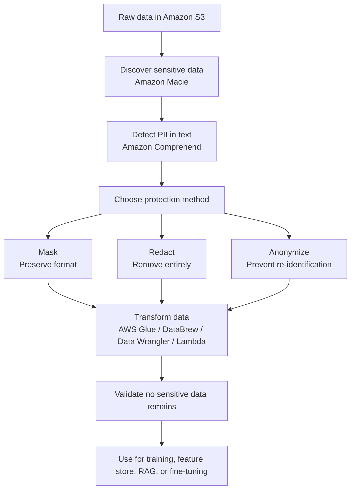

# Task 1.2: Data Preparation for ML and AI - Perform data transformation, feature engineering, and pre-processing

## Skill 1.2.8: Mask, redact, and anonymize data

---

## 1. Introduction

When preparing data for machine learning, generative AI, or analytics, sensitive data must be protected before it enters training datasets, feature stores, retrieval indexes, or foundation model customization jobs.

This skill covers three related but distinct data protection techniques:

- **Masking** – hides part of a value while preserving its format or pattern.
- **Redaction** – removes sensitive data entirely from the dataset.
- **Anonymization** – transforms data so an individual can no longer be identified from it.

On the exam, the distinctions matter. Masking, redaction, and anonymization are not interchangeable terms.

---

## 2. Core Definitions and Differences

| Technique | What it does | Example input | Example output | Reversible? | Use case |
|---|---|---|---|---|---|
| **Masking** | Hides some or all of a value while preserving length, format, or structure | `email: alice@example.com` | `a***e@example.com` or `xxxxx@example.com` | Sometimes, depending on technique | Keep data usable for testing, analytics, or training when full removal is not required |
| **Redaction** | Removes or replaces the sensitive value entirely with a blank, placeholder, or token | `DOB: 1990-03-21` | `DOB: [REDACTED]` | No, unless token mapping is kept separately | Remove values that are not needed for the ML task |
| **Anonymization** | Alters data sufficiently to prevent identifying an individual | Age `34` → Age bracket `30-40`; name `Alice` → `Person1234` | Differs from original | Designed to be irreversible | Share or train on data while reducing privacy risk |

A helpful exam simplification:

> **Masking protects the value.**  
> **Redaction removes the value.**  
> **Anonymization changes the data enough that individuals cannot be re-identified.**

---

## 3. Why This Matters for ML and AI

Sensitive data in ML can cause several problems:

- **Privacy violations and regulatory exposure** under frameworks such as GDPR, HIPAA, PCI DSS, or internal security policies.
- **Model leakage** – generative AI and language models can memorize or expose data that was present during training or fine-tuning.
- **Training-serving skew** – if sensitive data is transformed incorrectly or inconsistently, the model may see different feature distributions in training and inference.
- **Biased or unusable models** – sensitive attributes may introduce bias or cause models to rely on protected characteristics instead of legitimate predictive signals.

In the AWS MLA-C02 context, this skill often appears alongside:

- Data preparation for foundation model fine-tuning or continued pre-training
- RAG document ingestion
- Feature engineering pipelines
- S3 data governance
- Use of AWS Glue, DataBrew, SageMaker Data Wrangler, Lambda, and Amazon Comprehend

---

## 4. AWS Services for Discovering and Protecting Sensitive Data

### 4.1 Amazon Macie

Amazon Macie is primarily used for discovery:

- Automatically scans Amazon S3 buckets.
- Uses machine learning to find sensitive data such as PII, financial data, and credentials.
- Produces findings and reports.
- Helps identify where masking or redaction should be applied before training or analytics.

> Macie finds sensitive data. It does not by itself mask or redact values inside your transformation pipelines.

### 4.2 Amazon Comprehend

Amazon Comprehend has PII detection capabilities:

- Detects PII in text.
- Identifies PII types such as names, addresses, email addresses, phone numbers, Social Security numbers, bank account numbers, credit card numbers, and more.
- Supports English and Spanish text for PII detection.
- Can return character-level offsets and confidence scores.

Comprehend PII detection is commonly used as the first step before masking or redacting text data.

### 4.3 AWS Glue and AWS Glue DataBrew

These services perform the actual transformation:

- **AWS Glue** – serverless ETL jobs can run custom Spark-based masking or redaction logic at scale.
- **AWS Glue DataBrew** – visual data preparation that can apply recipe-based transformations, including replacing or hiding values, without writing code.
- DataBrew is suitable for analysts and data engineers who need no-code data protection steps.

### 4.4 Amazon SageMaker Data Wrangler

SageMaker Data Wrangler provides interactive data preparation for ML:

- Can import data from multiple sources.
- Can apply transformations in SageMaker Canvas or SageMaker Studio.
- Useful when building feature engineering pipelines where sensitive fields need to be removed or transformed before training.

### 4.5 AWS Lambda

AWS Lambda can be used in streaming architectures to transform records as they arrive:

- Suitable for per-record transformations.
- Can apply masking, redaction, or tokenization before the record reaches a downstream ML pipeline.
- Useful for event-driven, near-real-time processing.

---

## 5. Masking in Depth

Masking is often used when data must retain some analytical value or format.

### Common masking approaches

| Approach | Description | Example |
|---|---|---|
| **Partial masking** | Hides only part of the value | `4111-****-****-1234` |
| **Full masking** | Hides the entire value but may keep format | `****-****-****-****` |
| **Format-preserving masking** | Replaces with values that look structurally similar | `alice@example.com` → `wxyzq@example.com` |
| **Tokenization** | Replaces sensitive value with a generated token; mapping stored separately | `Customer_84721` |

### When masking is useful

- You need to preserve field length for validation.
- The downstream application expects a certain format.
- The sensitive value is not needed, but a placeholder must remain.
- You are sharing data with developers, QA teams, or third parties.

> Exam tip: Masking does not necessarily make data anonymous. If enough other attributes exist, a masked individual can sometimes still be re-identified.

---

## 6. Redaction in Depth

Redaction removes sensitive content entirely.

### Common redaction examples

| Original | Redacted |
|---|---|
| `Name: Alice Doe` | `Name: [REDACTED]` |
| `Address: 123 Main St` | `Address:` |
| `Credit card: 4111-1111-1111-1111` | `Credit card: XXX` |

### When redaction is appropriate

- The field is not useful for ML.
- The risk of retaining any portion of the value is too high.
- Regulatory rules require complete removal.
- You are preparing text for RAG or fine-tuning and do not want sensitive data to be retrievable or learned by the model.

> Redaction should happen before training or indexing, not after. If sensitive data remains in the training corpus, it can appear in model outputs.

---

## 7. Anonymization in Depth

Anonymization changes data so that an individual cannot be directly or indirectly identified.

### Common anonymization techniques

| Technique | What it does | Example |
|---|---|---|
| **Generalization** | Reduces precision by grouping values | `Age 34` → `30-40` |
| **Suppression** | Removes entire records or columns | Remove rare ZIP codes |
| **Pseudonymization** | Replaces identifiers with artificial identifiers | `Alice` → `ID_2041` |
| **Aggregation** | Summarizes groups of records | Average transaction value per region |
| **Perturbation / noise addition** | Adds small random noise to numeric values | Salary `50,000` → `50,200` |
| **K-anonymity** | Ensures each individual is indistinguishable from at least k-1 others | Group and suppress values until k threshold is met |

### Important distinction

- **Pseudonymization** replaces identifying values but can potentially be reversed with a mapping table.
- **True anonymization** is intended to be irreversible.

In many real-world ML workflows, organizations use a combination:

1. Redact direct identifiers such as name and email.
2. Generalize quasi-identifiers such as age and ZIP code.
3. Aggregate or suppress rare combinations.

---

## 8. Data Protection Workflow

A typical workflow includes discovery, detection, transformation, and validation.

This workflow has two important ideas:

1. **Discovery precedes transformation.** You must know where sensitive data exists.
2. **Protection precedes training or indexing.** Never train a model or build a retrieval index on unprotected sensitive data.

---

## 9. Data Protection for Generative AI and Foundation Models

This is especially important for MLA-C02 because foundation models can learn and later expose sensitive information.

### Fine-tuning preparation

Fine-tuning uses labeled prompt-response pairs. Before creating those pairs:

- Redact PII from both prompts and responses.
- Detect PII with Amazon Comprehend.
- Remove names, emails, phone numbers, account numbers, and addresses unless they are essential to the task.

### Continued pre-training / continuous pre-training

Continued pre-training uses large volumes of unlabeled domain text.

- Sensitive data must be removed before pre-training because the model can learn the data as part of its weights.
- Use Macie to scan source documents in S3.
- Use Comprehend to detect PII in text before ingestion.

### RAG preparation

For RAG, documents are chunked and embedded into a vector store.

- Any sensitive text in a chunk can later be retrieved and injected into a model prompt.
- Redaction or masking should happen before chunking and embedding.
- Metadata should also be checked for sensitive values.

### Key rule for the exam

> Redaction runs before any customization path, not after. Anything left in the training data can surface in model output.

---

## 10. Scenario-Based Exam Examples

### Scenario 1

A financial services company is building a customer support chatbot using RAG. Its support transcripts contain customer names, account numbers, and phone numbers. The company wants to ensure these values cannot appear in the chatbot's answers.

Which approach should the ML engineer take?

**A.** Fine-tune a foundation model on the support transcripts so the model learns to hide PII.  
**B.** Use Amazon Comprehend to detect PII in the transcripts and redact it before chunking and embedding.  
**C.** Store the raw transcripts in Amazon S3 and rely on Amazon Macie to mask data during retrieval.  
**D.** Embed the original transcripts first, then redact PII from the vector store after each query.

**Correct answer:** **B**

**Explanation:**  
Comprehend detects PII in the text. Redaction must occur before chunking and embedding. If the raw PII is embedded, it can still be retrieved into the prompt context. Macie discovers sensitive data in S3 but does not automatically redact values inside the retrieval pipeline. Fine-tuning does not guarantee that PII cannot surface in output.

---

### Scenario 2

An e-commerce company is preparing a dataset for model training. The data team needs to share it with external consultants without exposing customer email addresses, but the consultants need to know which records belong to the same customer.

Which data protection technique is most appropriate?

**A.** Redact all email addresses with empty values  
**B.** Anonymize the dataset by removing all customer-related fields  
**C.** Replace email addresses with generated customer tokens using a mapping table  
**D.** Leave email addresses unchanged and sign a non-disclosure agreement

**Correct answer:** **C**

**Explanation:**  
Tokenization is a form of masking that replaces a sensitive value with a token. The mapping table is kept securely by the data owner, so records can still be joined by customer without exposing the actual email. Redaction loses the ability to link records to the same customer. True anonymization may also remove linkage.

---

### Scenario 3

A healthcare analytics team wants to train a model on patient data while reducing re-identification risk. The dataset contains patient name, address, date of birth, age, diagnosis, and ZIP code.

Which combination best reduces re-identification risk?

**A.** Mask only the patient name and keep all other fields unchanged  
**B.** Redact name and address, then generalize date of birth and ZIP code  
**C.** Embed the patient records into a vector store  
**D.** Use Amazon Macie to discover sensitive data and then train directly on it

**Correct answer:** **B**

**Explanation:**  
Name and address are direct identifiers and should be redacted. Date of birth and ZIP code are quasi-identifiers that can be combined to re-identify individuals. Generalizing these fields reduces that risk. Masking only the name is insufficient. Macie alone only discovers sensitive data; it does not anonymize it.

---

## 11. Exam Tips and Traps

### Tips

- **Know the exact difference:**  
  - Masking = hide while preserving format.  
  - Redaction = remove.  
  - Anonymization = change data to prevent identification.

- **Remember the AWS services:**  
  - Amazon Macie = discovery in S3.  
  - Amazon Comprehend = PII detection in text.  
  - AWS Glue / DataBrew / SageMaker Data Wrangler / Lambda = transformation.

- **Apply protection before:**  
  - Feature engineering  
  - Training  
  - Fine-tuning  
  - Continued pre-training  
  - Chunking and embedding for RAG  

- **Macie is a discovery tool, not a transformation tool.**  
  It locates sensitive data, but masking or redaction still requires another service.

- **Amazon Comprehend PII supports English and Spanish.**  
  This detail can appear in exam questions.

### Traps

- Treating masked data as automatically anonymous.  
  If other attributes remain, a masked record can still be re-identified.

- Using redaction after RAG ingestion.  
  If PII is embedded, it can later be retrieved and used in generated responses.

- Relying only on Macie to protect data.  
  Macie finds sensitive data; it does not apply granular masking or redaction inside the ML pipeline.

- Choosing a format-preserving mask when the field is not needed at all.  
  If the ML task does not need the value, redaction is usually safer.

- Assuming fine-tuning naturally removes PII.  
  Foundation models can memorize and later expose sensitive content seen during training.

---

## 12. Quick Recall

- **Masking:** hides a value while keeping its shape or structure.
- **Redaction:** removes a value entirely.
- **Anonymization:** changes data so individuals cannot be identified.
- **Amazon Comprehend:** detects PII in text.
- **Amazon Macie:** discovers sensitive data in Amazon S3.
- **Apply protection before training, fine-tuning, RAG ingestion, or continued pre-training.**