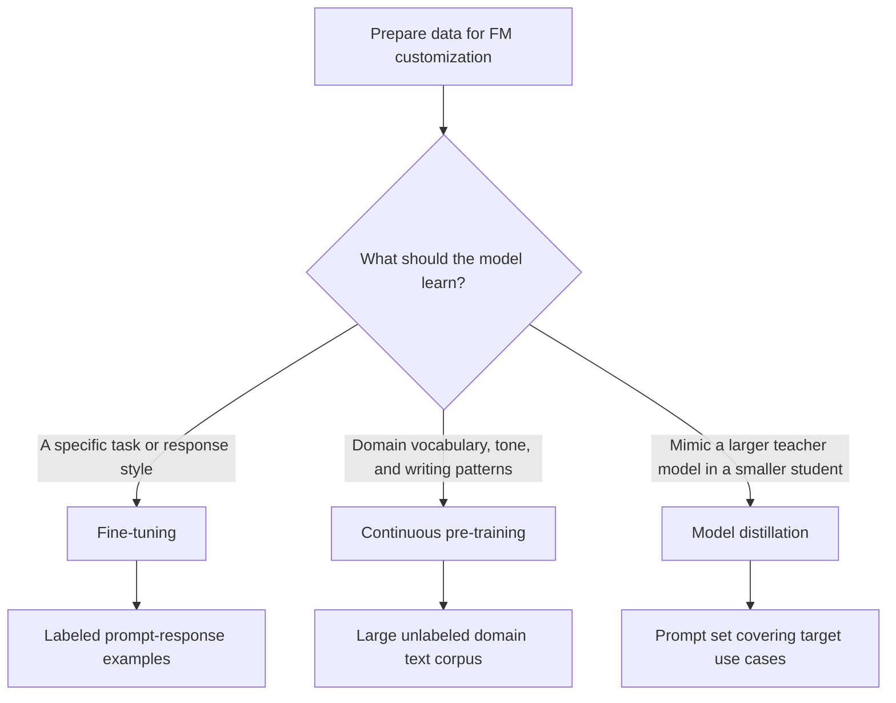
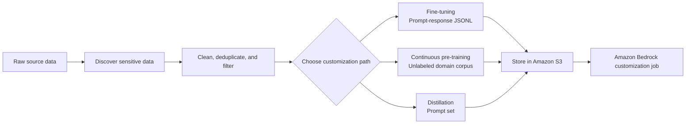
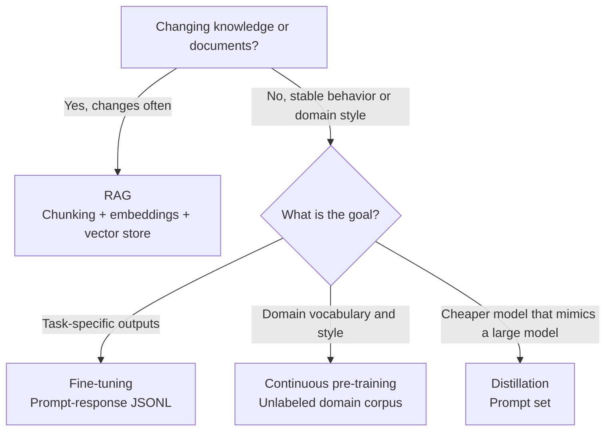

# Task 1.2: Data Preparation for ML and AI - Perform data transformation, feature engineering, and pre-processing

## Skill 1.2.9: Prepare data for FM fine-tuning, continuous pre-training, and model distillation

### 1. Mindset: Each customization path needs a different data artifact

Foundation model (FM) customization is not one workload. The data you prepare must match the customization method and what you want the model to learn.

| Customization path | Primary data artifact | Are labels or expected answers required? | Typical purpose |
| --- | --- | --- | --- |
| **Fine-tuning** | Prompt-response pairs | Yes | Teach task-specific behavior, output format, tone, or classification |
| **Continuous pre-training** | Large unlabeled domain corpus | No | Help the model absorb domain terminology, vocabulary, and text patterns |
| **Model distillation** | Prompt set | No for managed distillation; teacher generates responses | Train a smaller student model to imitate a larger teacher model |

A practical way to remember the difference:

- Fine-tuning data says: **“This is what a good answer looks like for this input.”**
- Continuous pre-training data says: **“This is what text from this domain looks like.”**
- Distillation data says: **“These are the prompts your smaller model must handle well.”**

---

### 2. Preparing data for fine-tuning

Fine-tuning, sometimes called supervised fine-tuning or instruction fine-tuning, uses labeled examples to update an FM for a specific task.

#### 2.1 What the dataset should contain

Each example is generally a structured record containing:

| Component | Description |
| --- | --- |
| **Prompt or instruction** | The input or task description |
| **Response or completion** | The target answer the model should generate |

The dataset is commonly prepared as **JSONL**, where each line is a valid record. The exact schema depends on the FM and the Amazon Bedrock customization API.

#### 2.2 Data quality practices for fine-tuning

- Use **representative examples** that reflect real production inputs.
- Keep the target responses **consistent in tone, format, and style**.
- Remove **duplicates, contradictions, and near-duplicate examples**.
- Balance the dataset across classes or topics where possible.
- Split into **training and validation** sets; never use validation examples for training.
- Keep the instruction format consistent throughout.
- Redact PII before training because sensitive data can appear in model outputs.

#### 2.3 Fine-tuning example scenario

A company wants an FM to classify customer support emails into one of 20 issue categories.

- Prompt: The customer email and an instruction such as “Classify this email.”
- Response: The correct category label.
- Dataset format: JSONL prompt-response records.
- Quality goal: Each category should have enough examples and consistent labels.

**Exam cue:** If a scenario says a team has historical examples with known correct answers and wants task-specific behavior, that points to fine-tuning data.

---

### 3. Preparing data for continuous pre-training

Continuous pre-training, also called continued pre-training, adapts an FM to a domain using **unlabeled text**.

#### 3.1 What the dataset should contain

| Data property | Requirement |
| --- | --- |
| **Labels** | Not required |
| **Content** | Large amounts of domain-specific documents |
| **Size** | Usually much larger than a fine-tuning dataset |
| **Cleanliness** | Deduplicated, filtered, and free of boilerplate or low-quality text |
| **Sensitive data** | Redacted or removed before training |

#### 3.2 Data preparation steps

- Collect domain-relevant documents.
- Remove irrelevant or repeated content.
- Filter out malformed text, HTML artifacts, and boilerplate.
- Anonymize or redact PII.
- Keep the corpus representative of the domain’s vocabulary, writing style, and structure.
- Do **not** convert this data into prompt-response pairs.

#### 3.3 Continuous pre-training example scenario

A legal technology company wants an FM to better understand contracts, case law language, and legal writing patterns. It has millions of public case documents and internal research notes.

- The correct preparation is a **large, unlabeled legal text corpus**.
- This is **not** fine-tuning, because there are no target answers.
- This is **not** RAG, because the goal is to change the model’s language understanding, not retrieve documents at runtime.

**Exam cue:** Unlabeled domain text used to improve vocabulary and writing style points to continuous pre-training.

---

### 4. Preparing data for model distillation

Model distillation trains a smaller student model to imitate a larger teacher model. The teacher model is usually more capable but more expensive or slower.

#### 4.1 What the dataset should contain

For managed Amazon Bedrock distillation, the input is mainly a **prompt dataset**:

- Prepare prompts that reflect real user questions and use cases.
- The challenging or edge-case prompts are valuable because they teach the student difficult behavior.
- The teacher model generates the responses.
- Those teacher outputs become the labels used to fine-tune the student model.

#### 4.2 Dataset characteristics

| Characteristic | Guidance |
| --- | --- |
| **Prompt diversity** | Cover common cases, edge cases, and desired task types |
| **Practical coverage** | Include the inputs users will likely submit in production |
| **Sensitive content** | Remove PII from prompts before distillation |
| **Output labels** | Not required when the managed distillation workflow generates teacher responses |

#### 4.3 Distillation example scenario

A company wants to reduce inference cost by replacing a large high-performance FM with a smaller model for internal IT support questions.

The team has production logs of employee questions but does not have teacher model outputs.

- Prepare a cleaned and deduplicated **prompt set** from those logs.
- Do not label each prompt with a manually written answer for managed distillation.
- The larger teacher model will produce the outputs, which are then used to train the smaller student.

**Exam cue:** If a scenario asks for a smaller model to imitate a larger model and the team has prompt data, choose a prompt set for distillation, not labeled response data.

---

### 5. Cross-cutting data preparation requirements

Regardless of the FM customization path, some data preparation requirements remain the same.

### 5.1 Sensitive data protection

Sensitive data must be addressed before customization.

| Approach | Description |
| --- | --- |
| **Masking** | Replaces a value but preserves its shape or format |
| **Redaction** | Removes the value entirely |
| **Anonymization** | Changes data so an individual can no longer be identified |

AWS services that help:

| AWS service | Role |
| --- | --- |
| **Amazon Macie** | Discovers sensitive data across Amazon S3 |
| **Amazon Comprehend** | Detects PII in English or Spanish text |
| **AWS Glue / AWS Glue DataBrew** | Cleans, transforms, and anonymizes data at scale |

**Important:** Redaction must happen before training, not after. Any data left in the training corpus can leak into model outputs.

---

### 6. FM customization compared with RAG

One of the top exam traps is confusing RAG preparation with FM customization data.

| Requirement | Correct approach | Data prepared |
| --- | --- | --- |
| Frequently changing factual knowledge | **RAG** | Chunked documents, embeddings, metadata |
| Stable task-specific behavior | **Fine-tuning** | Prompt-response JSONL |
| Domain language adaptation | **Continuous pre-training** | Large unlabeled domain corpus |
| Smaller model mimicking a larger model | **Distillation** | Prompt set |

**Why this matters:** RAG does not change model weights. Fine-tuning, continuous pre-training, and distillation do.

---

### 7. AWS services summary for FM data preparation

| AWS service | Role in preparing customization data |
| --- | --- |
| **Amazon S3** | Stores training datasets, validation sets, and prompts |
| **Amazon Bedrock** | Runs fine-tuning, continued pre-training, and distillation jobs |
| **AWS Glue** | ETL and cleanup of large training corpora |
| **AWS Glue DataBrew** | Visual cleaning and profiling without code |
| **Amazon Comprehend** | Detects PII for masking or redaction |
| **Amazon Macie** | Discovers sensitive data in S3 |
| **Amazon EMR** | Large-scale Spark processing for heavy corpus preparation |
| **Amazon SageMaker Data Wrangler** | Interactive preparation for tabular or structured data used in ML workflows |

---

### 8. Scenario-based exam practice

#### Question 1

A healthcare company wants an FM to understand the terminology, abbreviations, and writing style used in pathology reports. It has a large archive of unlabeled pathology documents.

Which data preparation approach should the company use?

- A. Split the documents into chunks and store embeddings in a vector database
- B. Prepare a prompt set for model distillation
- C. Assemble the unlabeled domain documents for continuous pre-training
- D. Create prompt-response pairs for fine-tuning

??? success "Answer & Explanation"

    **Correct Answer:** **C. Assemble the unlabeled domain documents for continuous pre-training**

    **Explanation:**  
    Continuous pre-training is used to adapt a foundation model to a domain’s vocabulary, abbreviations, tone, and writing patterns. It uses large amounts of unlabeled text. The pathology reports are not labeled and the goal is not retrieval or task-specific prompt-response behavior.

    **Why the other options are incorrect:**
    - A describes RAG, which is for retrieval-time knowledge, not changing model weights.
    - B is for training a smaller student model with prompts.
    - D is for task-specific labeled behavior.

---

#### Question 2

A team wants to create a smaller, lower-cost model that imitates a large teacher model for internal assistant requests. The team has historical user questions but does not have answers from the teacher model.

What should the team prepare for Amazon Bedrock model distillation?

- A. Prompt-response pairs written by support agents
- B. A cleaned prompt set covering production-like questions
- C. A large corpus of unlabeled company documents
- D. Chunked documents with metadata for a vector store

??? success "Answer & Explanation"

    **Correct Answer:** **B. A cleaned prompt set covering production-like questions**

    **Explanation:**  
    Managed model distillation uses a set of prompts. The teacher model generates the responses, which are then used to fine-tune the smaller student model. The team does not need to write the answers manually.

    **Why the other options are incorrect:**
    - A is a fine-tuning dataset, not the typical distillation input.
    - C is continuous pre-training data.
    - D is RAG preparation.

---

#### Question 3

A company wants a model to generate consistent product descriptions from structured product attributes. It has a curated dataset of attributes paired with approved descriptions.

Which customization approach does this dataset support?

- A. Continuous pre-training
- B. Retrieval Augmented Generation
- C. Supervised fine-tuning
- D. Model distillation with a prompt set

??? success "Answer & Explanation"

    **Correct Answer:** **C. Supervised fine-tuning**

    **Explanation:**  
    The dataset contains inputs and corresponding target outputs. That is the standard structure for supervised fine-tuning. The model learns to produce descriptions in the approved style and format.

    **Why the other options are incorrect:**
    - A uses unlabeled text, not prompt-response data.
    - B uses documents, chunks, embeddings, and metadata.
    - D uses prompts, not prewritten target responses.

---

### 9. Exam tips and traps

#### 9.1 Know the input data each path requires

| Path | Best-fit data | Wrong data for this path |
| --- | --- | --- |
| **Fine-tuning** | Labeled prompt-response examples | Unlabeled documents or prompt-only sets |
| **Continuous pre-training** | Large unlabeled domain corpus | Labeled prompt-response pairs |
| **Distillation** | Prompt set | Usually not manually labeled responses for managed distillation |

#### 9.2 Common traps

- **Trap:** Choosing continuous pre-training for a task-specific labeled dataset.  
  **Rule:** If you have target answers, the path is usually fine-tuning.

- **Trap:** Choosing fine-tuning for frequently changing factual knowledge.  
  **Rule:** Frequently changing knowledge should often be handled with RAG because retraining weights is expensive and can become stale.

- **Trap:** Preparing manually labeled prompt-response pairs for managed distillation.  
  **Rule:** Managed distillation typically needs prompts. The teacher model generates the targets.

- **Trap:** Ignoring PII because the customization job is internal.  
  **Rule:** PII in fine-tuning or pre-training data can leak through model outputs.

- **Trap:** Confusing embeddings with fine-tuning data.  
  **Rule:** Embeddings are used in RAG or semantic search, not as the primary fine-tuning artifact.

- **Trap:** Refitting transformations on validation data.  
  **Rule:** This creates training-serving skew. Use the same preparation rules and schemas across training, validation, and inference.

#### 9.3 Final recall

Remember the three data artifacts:

- **Fine-tuning:** prompt-response pairs
- **Continuous pre-training:** unlabeled domain text
- **Distillation:** prompt set

If the scenario involves dynamic knowledge, consider **RAG** before considering weight updates.