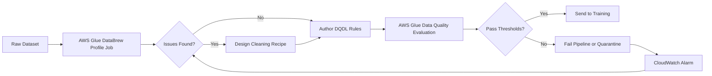

# Task 1.3: Data Preparation for ML and AI - Validate data quality and manage bias

## Skill 1.3.1: Validate data quality (for example, by using DataBrew, AWS Glue Data Quality)

---

## 1. Skill Overview

**Validate data quality** means checking that a dataset is fit for training before it reaches a machine learning model. This is not about manually looking at a few rows; it is about creating repeatable, declarative, and automated checks that detect missing values, duplicates, invalid ranges, inconsistent formats, and other defects.

For the AWS Certified Machine Learning - Associate exam, this skill focuses on:

- Understanding when to use **AWS Glue Data Quality** versus **AWS Glue DataBrew**.
- Knowing how profiling informs cleaning decisions.
- Recognizing that data quality validation is a gate before training, not an afterthought.
- Connecting data quality failures to alarms and pipeline stops.

---

## 2. Why Data Quality Validation Matters in ML

A machine-learning model can only learn patterns that exist in the training data. If the training data contains:

- Missing required fields
- Duplicate records
- Out-of-range numeric values
- Invalid categorical values
- Inconsistent date or text formats
- Orphans or broken references

Then the model may learn incorrect associations, overfit to noise, or fail silently in production.

### Core principle

> **Profile first, clean second, validate continuously.**

You cannot choose the right cleaning strategy until you know what is wrong. After cleaning, you should validate again to prove the dataset now meets the rules required for training.

---

## 3. Data Quality Dimensions to Validate

| Dimension | What It Detects | Example Issue |
|---|---|---|
| **Completeness** | Missing values in required columns | `customer_id` is null |
| **Uniqueness** | Duplicate records or duplicate primary keys | Same `transaction_id` appears twice |
| **Validity** | Values outside allowed ranges or allowed sets | `age = 240` or `country = "ZZ"` |
| **Consistency** | Same data represented differently | Dates stored as `2024-01-01` and `01/01/2024` |
| **Accuracy** | Data that is present but semantically wrong | Postal code does not match city |
| **Freshness** | Data is stale relative to expected update frequency | `last_updated` is older than 7 days |
| **Referential Integrity** | Orphaned keys or broken relationships | Order exists without a matching customer |
| **Schema Validity** | Required columns missing or data types changed | `email` column no longer exists |

For ML training, the most commonly tested dimensions are:

- **Completeness**
- **Uniqueness**
- **Validity ranges**
- **Column existence**
- **Consistency across formats**

---

## 4. AWS Services for Validating Data Quality

| AWS Service | Role in Data Quality Validation |
|---|---|
| **AWS Glue Data Quality** | Evaluates explicit, declarative rules written in the **Data Quality Definition Language (DQDL)**. It can run automatically on every dataset update, stop pipelines on failure, and publish metrics to Amazon CloudWatch. |
| **AWS Glue DataBrew** | Provides visual, no-code **data profiling**. A profile job surfaces missing values, value distributions, unexpected ranges, duplicates, and inconsistent formats. It helps you decide how to clean the dataset. |
| **Amazon CloudWatch** | Collects metrics and logs from validation jobs. It can trigger alarms when a data quality rule fails. |
| **AWS Glue Studio** | Visual interface where you can author Glue ETL jobs and attach AWS Glue Data Quality rules as part of the pipeline. |
| **Amazon SageMaker Data Wrangler** | Provides interactive data preparation and feature engineering. It can be used for profiling and cleaning, but for declarative rule-based validation on every run, AWS Glue Data Quality is the more direct service. |

---

## 5. AWS Glue Data Quality Deep Dive

AWS Glue Data Quality is the primary service for **automated, repeatable, rule-based data validation**.

### 5.1 Key Characteristics

- Uses **Data Quality Definition Language (DQDL)** to declare rules.
- Rules are evaluated against **thresholds**.
- Works with datasets in the AWS Glue Data Catalog.
- Can be embedded into AWS Glue ETL jobs.
- Can **recommend a starting ruleset** based on the dataset profile.
- Can fail the job or send an event when a rule threshold is not met.
- Publishes metrics to Amazon CloudWatch for monitoring.

### 5.2 Common Rule Concepts

| Rule Type | What It Checks | Example Conceptual Rule |
|---|---|---|
| **Completeness** | Required column is populated | `customer_id` should be complete at least 98% |
| **Uniqueness** | Primary key is not duplicated | `transaction_id` should be unique at least 99.5% |
| **ColumnValues** | Values are in allowed range or set | `age` must be between 0 and 120 |
| **ColumnExists** | Required schema column exists | `email` column must be present |
| **ColumnLength** | Text length is within expected limits | `comment` should not exceed 500 characters |
| **Combined rules** | Multiple conditions through logical operators | `amount` is non-negative and less than 10000 |

### 5.3 When to Use AWS Glue Data Quality

Use AWS Glue Data Quality when you need:

- A **pass/fail gate** before training.
- Rules to run **automatically on every ingestion**.
- A **declarative** and **auditable** data quality process.
- A **recommended ruleset** for a newly cataloged dataset.
- Integration with CloudWatch alarms and pipeline failure behavior.

---

## 6. AWS Glue DataBrew Deep Dive

AWS Glue DataBrew is primarily a **visual data profiling and cleaning tool**. It helps a data engineer or data scientist discover what is wrong before deciding what to clean.

### 6.1 Key Characteristics

- No server management.
- Visual, point-and-click interface.
- Creates **profile jobs** that inspect the dataset.
- Produces column-level statistics:
  - Missing value counts
  - Unique value counts
  - Minimum and maximum values
  - Mean and median values
  - Distribution histograms
  - Duplicate detection
  - Format inconsistency detection
- After profiling, you can build **recipes** to clean the data.
- Recipes can be scheduled and applied repeatedly.

### 6.2 What a DataBrew Profile Job Finds

| Profile Output | Purpose |
|---|---|
| Missing percentages | Decide whether to impute or drop missing data |
| Outlier values | Detect possible data entry errors |
| Value ranges | Identify invalid numeric or categorical values |
| Format inconsistencies | Find dates, phone numbers, or IDs stored in different formats |
| Duplicate records | Detect repeated rows or near duplicates |
| Column distributions | Understand skew and imbalance before modeling |

### 6.3 When to Use AWS Glue DataBrew

Use DataBrew when you need to:

- Explore a dataset visually.
- Create an initial profile report before any cleaning.
- Identify possible cleaning steps interactively.
- Build reusable cleaning recipes without writing code.
- Understand missing-value patterns, skew, and anomalies.

---

## 7. How Profiling and Rule Validation Work Together

The typical workflow combines profiling and validation:

---

## 8. Comparison: AWS Glue Data Quality vs AWS Glue DataBrew

| Feature | AWS Glue Data Quality | AWS Glue DataBrew |
|---|---|---|
| Primary purpose | Automated pass/fail rule validation | Visual profiling and interactive cleaning |
| Rule language | DQDL | Not required; visual recipes |
| Rule execution | Automatically on every run | Recipe jobs can be scheduled |
| Output | Rule pass/fail percentages, metrics | Profile reports, column statistics |
| Best use case | Ongoing data quality gate in ML pipeline | Initial discovery before cleaning |
| Failure action | Can stop pipeline, send alarms | Mostly used for inspection and correction |
| Interaction style | Author rules, then automate | Visual, interactive cleanup |

### Key takeaway

- **DataBrew** tells you what is wrong.
- **Glue Data Quality** enforces that the data meets your rules before training.
- In many pipelines, you use both: **profile with DataBrew** first, then **enforce rules with Glue Data Quality** every time the dataset refreshes.

---

## 9. Scenario-Based Examples

### Scenario 1: Nightly Data Quality Gate Before Retraining

A company retrains a product-demand model every night using a CSV file ingested into Amazon S3. The ML engineer must ensure that each new batch:

- Has `customer_id` populated at least 99% of the time.
- Has no duplicate `order_id` values.
- Has `price` values between 0 and 5000.

Which approach should the ML engineer use?

**Correct answer:**  
Use **AWS Glue Data Quality** with DQDL rules and attach the ruleset to the nightly AWS Glue ETL job. The rules can fail the job if thresholds are not met, and Amazon CloudWatch can notify the team.

**Why not DataBrew?**  
Although DataBrew can profile the data, it is not the best choice for declarative pass/fail enforcement on every batch. DataBrew profiles help you discover issues, but AWS Glue Data Quality is designed to evaluate explicit rules continuously.

---

### Scenario 2: Initial Data Exploration Before Cleaning

A data scientist receives a new customer-transactions dataset from a third-party vendor. The team has not yet decided how to handle missing values, duplicate records, or suspicious outliers.

Which AWS service should the data scientist use first?

**Correct answer:**  
Use **AWS Glue DataBrew** to run a **profile job**. The profile will show missing values, duplicate counts, value ranges, column distributions, and format inconsistencies.

**Why?**  
This is an exploratory task. You need to see what is wrong before choosing a cleaning strategy. DataBrew is designed for this exact visual profiling use case.

---

### Scenario 3: Recommended Data Quality Rules

A team catalogs a large dataset in the AWS Glue Data Catalog. They want to implement data-quality checks but do not know exactly which rules to start with.

Which AWS capability can help?

**Correct answer:**  
AWS Glue Data Quality can **recommend rules** based on the dataset schema and profile. The team can review and adjust these recommended rules before enforcing them in their pipeline.

**Why?**  
The service proposes a starting ruleset, but the team still owns and approves the rules. This accelerates rule creation while keeping the process declarative and auditable.

---

### Scenario 4: Distinguishing Bias from Data Quality

A dataset has balanced class labels but contains missing numeric values and duplicate transaction IDs. What is the correct first step?

**Correct answer:**  
Run data quality validation using services such as AWS Glue Data Quality or DataBrew. This issue is about **data quality**, not bias or class imbalance.

**Why?**  
Missing values and duplicate IDs are structural data defects. Bias and class imbalance are separate concerns. In the exam, avoid automatically selecting bias-mitigation tools when the issue is clearly a data quality defect.

---

## 10. Exam Tips and Traps

### 10.1 Keyword Mapping

| Exam Language | Likely Service or Concept |
|---|---|
| “Declarative rules” | AWS Glue Data Quality |
| “Repeatable validation on every run” | AWS Glue Data Quality |
| “Data Quality Definition Language” or “DQDL” | AWS Glue Data Quality |
| “Pass/fail gate before training” | AWS Glue Data Quality |
| “Visual profile” | AWS Glue DataBrew |
| “Missing values, outliers, distributions” | AWS Glue DataBrew profile job |
| “Interactive cleaning” | AWS Glue DataBrew recipe |
| “Recommended starting rules” | AWS Glue Data Quality |
| “CloudWatch alarm on validation failure” | AWS Glue Data Quality + CloudWatch |

### 10.2 Common Traps

| Trap | Correct Understanding |
|---|---|
| Choosing DataBrew when the question asks for declarative, repeatable pass/fail rules | DataBrew profiles and cleans; AWS Glue Data Quality enforces rules. |
| Thinking data cleaning should happen before profiling | Profiling must come first so you know what to clean. |
| Believing AWS Glue Data Quality must always infer rules itself | It can recommend rules, but you author and approve the declarative DQDL rules. |
| Selecting Amazon Bedrock Guardrails for tabular data quality | Bedrock Guardrails are for prompts and model responses, not for validating column completeness or value ranges. |
| Using manual sample inspection as the answer for large datasets | Manual inspection is not scalable for full dataset validation. |
| Confusing data quality with bias | Duplicate records, missing values, and invalid ranges are data quality issues. Bias is about representation and fairness. |
| Choosing Amazon Comprehend for general tabular data quality | Comprehend detects PII in text, but it is not a general data-quality rules engine. |

### 10.3 Key Point to Remember

> **AWS Glue Data Quality** = enforce explicit rules.  
> **AWS Glue DataBrew** = discover and clean data visually.  
> **CloudWatch** = monitor validation failures and alert the team.

---

## 11. Summary

For **Skill 1.3.1: Validate data quality**:

- Use **AWS Glue DataBrew** to profile and visually inspect dataset issues.
- Use **AWS Glue Data Quality** to create declarative, repeatable rules with DQDL.
- Validate dimensions such as completeness, uniqueness, value ranges, column existence, and consistency.
- Automate validation inside the data pipeline to stop training when quality is poor.
- Know the difference between profiling, cleaning, and enforcing quality gates.
- In exam scenarios, match the requirement to the correct service:  
  - Exploration → DataBrew  
  - Declarative repeatable validation → AWS Glue Data Quality  
  - Alarm or notification → Amazon CloudWatch