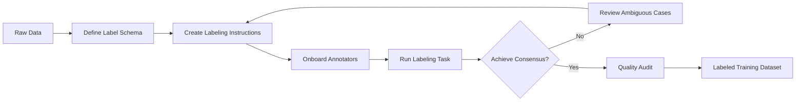
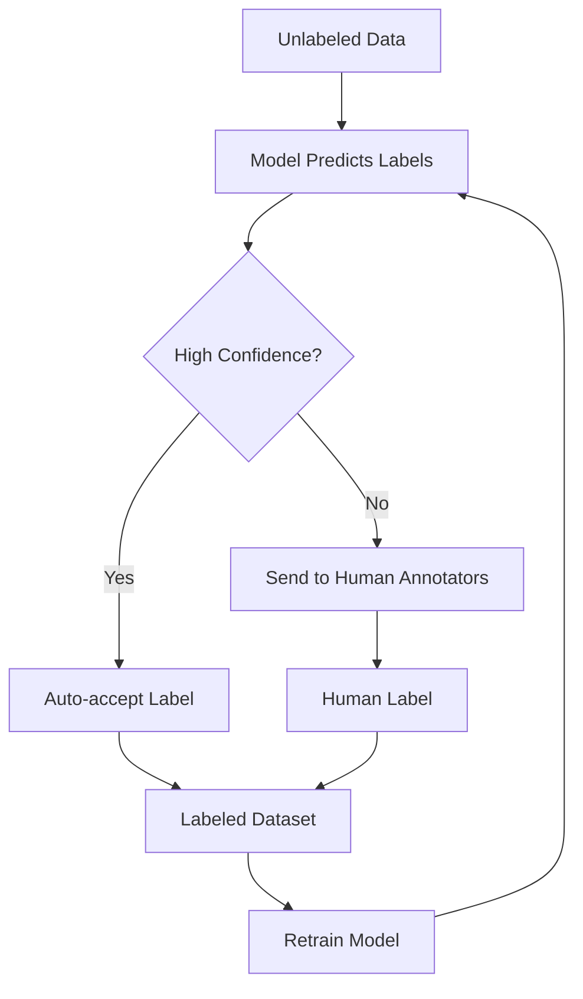
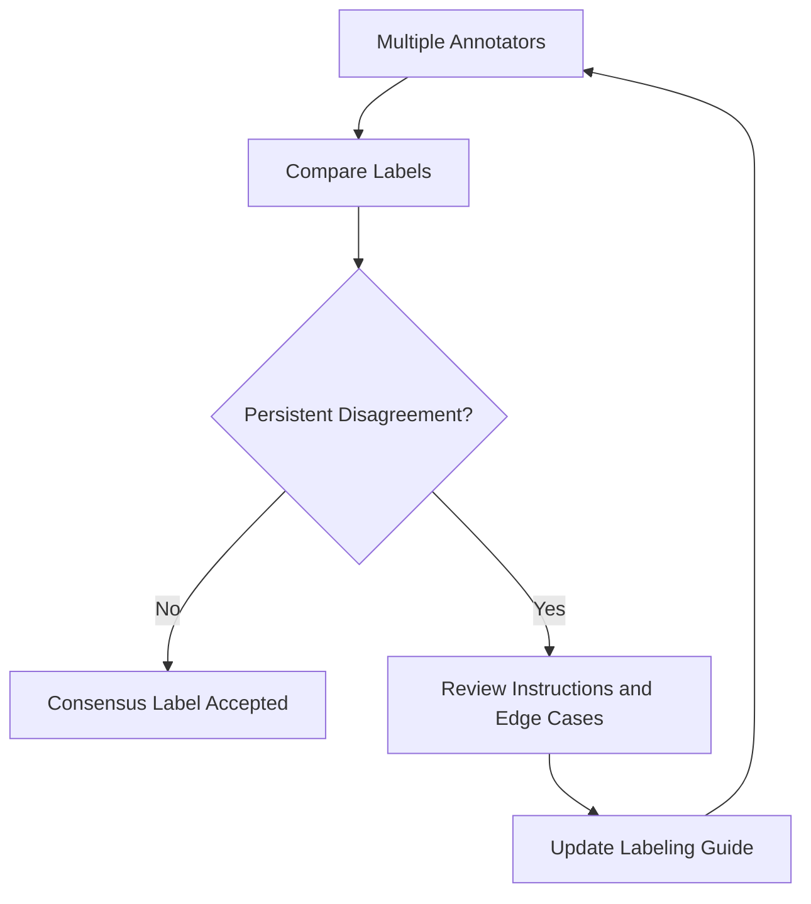

# Task 1.3: Data Preparation for ML and AI - Validate data quality and manage bias.
## Skill 1.3.2: Label and annotate data.

## Overview

Labeling and annotating data is the process of creating the ground truth that a supervised machine learning model learns from. It converts raw examples—text, images, video, audio, or tabular records—into training data by attaching meaningful labels or annotations.

This skill is foundational because **label quality sets a ceiling on model quality**. A model cannot learn distinctions that the labels fail to capture, no matter how powerful the model architecture or how much compute is used.

Key ideas for the exam:

- Human review is almost always required for high-quality labels, especially in complex or ambiguous cases.
- Labeling instructions must be precise and tested for clarity.
- Persistent annotator disagreement usually signals ambiguous instructions, not necessarily poor annotators.
- AWS services such as Amazon SageMaker Ground Truth support managed labeling workflows, human review loops, and ML-assisted labeling.

---

## Core Concepts

### Labeling vs. Annotation

The terms are often used interchangeably, but they have meaningful differences.

| Term | Definition | Example |
| --- | --- | --- |
| **Labeling** | Assigning a category, class, or outcome to a record | Tagging an email as spam or not spam; classifying an image as "cat" or "dog" |
| **Annotation** | Adding more detailed metadata or boundaries within a record | Drawing a bounding box around a tumor in an MRI; labeling each token in a sentence as a named entity |

In practice, an ML pipeline may require both: label an image as containing a pedestrian, then annotate the pedestrian's location with a bounding box.

### Why Label Quality Is the Ceiling

A supervised model learns the relationship between inputs and labels. If labels are noisy, inconsistent, or biased, the model learns those patterns.

> A small, carefully labeled dataset can outperform a much larger dataset that was labeled loosely.

This is a key exam concept: fixing the labeling process is often more valuable than simply collecting more raw data.

---

## Types of Labeling and Annotation Tasks

Different ML problems require different types of labels.

| Data Modality | Common Labeling Tasks | Example Use Cases |
| --- | --- | --- |
| **Text** | Text classification, named entity recognition, sentiment analysis, intent classification, prompt-response pair ranking | Chatbot intent detection, medical record extraction, content moderation |
| **Image** | Image classification, object detection, semantic segmentation, keypoint annotation | Autonomous driving, defect detection, facial landmark recognition |
| **Video** | Object tracking, action detection, frame-level classification | Security surveillance, sports analytics, autonomous vehicles |
| **Audio** | Transcription, speaker identification, audio event detection | Call center analytics, voice assistants |
| **3D Point Cloud** | Object detection, semantic segmentation, cuboid annotation | Robotics, LiDAR perception for autonomous vehicles |

For generative AI or foundation model customization, labeling may also include:

- Rating or ranking multiple model responses
- Labeling prompt-response pairs as helpful or harmful
- Annotating whether a response follows instructions
- Screening content for safety before training

---

## Labeling Workflow

A robust labeling workflow places human judgment where it adds the most value, while using automation where confidence is high.

### Where Human Review Belongs

Human review should be placed:

1. **At the start** — to define the label taxonomy and exemplar examples.
2. **During labeling** — to resolve ambiguous or low-confidence items.
3. **After automated pre-labeling** — to correct auto-generated labels.
4. **When inter-annotator agreement is low** — to refine definitions and instructions.

A common Amazon SageMaker Ground Truth pattern uses **ML-assisted active learning**:

This reduces labeling cost while preserving quality on difficult items.

---

## Writing High-Quality Labeling Instructions

Ambiguous instructions are the most common cause of poor label consistency. Good labeling instructions should include:

| Component | Purpose |
| --- | --- |
| **Clear label taxonomy** | Define each class so it is mutually exclusive and collectively exhaustive |
| **Positive examples** | Show clear examples of each label |
| **Negative examples** | Show examples that might look similar but belong to another label or should be skipped |
| **Edge-case rules** | Explain what to do with partial, occluded, truncated, or uncertain data |
| **Escalation process** | Tell annotators how to flag ambiguous cases instead of guessing |
| **Annotation format rules** | Define bounding box boundaries, entity start/end rules, token-level requirements |

### Example of Ambiguity

A team labels product reviews as `positive`, `neutral`, or `negative`. A review says:

> "The shipment was late, but the product works well."

Two annotators may disagree:

- Annotator A labels it `negative` because of shipment issues.
- Annotator B labels it `positive` because the product works.

This disagreement is not necessarily a worker problem. It reveals that the instructions did not define whether logistics issues count toward product sentiment.

The fix is to refine the instructions or split the label into `product sentiment` and `delivery sentiment`.

---

## Measuring Annotator Agreement

To trust labels, teams measure consistency between annotators. If agreement is low, labels are noisy.

| Metric | When to Use | Notes |
| --- | --- | --- |
| **Percent agreement** | Simple binary or low-stakes tasks | Easy to compute but does not adjust for chance |
| **Cohen's kappa** | Two annotators, categorical labels | Adjusts for random agreement |
| **Fleiss' kappa** | Multiple annotators, categorical labels | Generalizes Cohen's kappa |
| **Krippendorff's alpha** | Any number of annotators, any label type | More general; handles missing labels |
| **Intersection over Union (IoU)** | Object detection or segmentation | Measures spatial overlap of bounding boxes or masks |
| **Dice coefficient / F1** | Segmentation tasks | Common in medical imaging |

### Interpreting Disagreement

Persistent disagreement should be treated as a signal about the **labeling instructions or task design**, not primarily about individual annotators.

---

## AWS Services for Labeling and Annotation

| AWS Service | Role in Labeling |
| --- | --- |
| **Amazon SageMaker Ground Truth** | Managed data labeling service. Supports built-in task templates, active learning, and multiple workforce options. Handles text, image, video, 3D point cloud, and more. |
| **Amazon SageMaker Ground Truth Plus** | Managed service where AWS teams build and manage labeling projects for large-volume, custom labeling needs. |
| **Amazon Augmented AI (A2I)** | Adds human review loops to ML workflows. Useful for reviewing low-confidence predictions before they are accepted as labels or deployment results. |
| **SageMaker human review workflows** | Allow human review of predictions, including using Ground Truth-style worker portals. |

### Workforce Options in SageMaker Ground Truth

| Workforce | Description | Best Use Case |
| --- | --- | --- |
| **Internal workforce** | Employees or domain experts | Highly sensitive, specialized data |
| **Amazon Mechanical Turk** | Crowd-sourced workforce | Large-volume generic tasks |
| **Vendor workforce** | Third-party experts through AWS marketplace | Specialized tasks with moderate sensitivity |
| **Ground Truth Plus** | AWS-managed expert workforce | Large custom labeling programs |

---

## Bias and Fairness in Labeling

Labeling can introduce bias even before model training:

| Bias Type | Example | Mitigation |
| --- | --- | --- |
| **Annotator bias** | Labelers interpret ambiguous examples based on personal views | Use clear instructions, diverse annotators, and consensus |
| **Sampling bias** | Training data overrepresents one region or demographic | Audit label distribution across groups |
| **Confirmation bias** | Labelers expect a certain class and label borderline cases toward it | Use blinded labeling where possible |
| **Automation bias** | Auto-labeling model errors are accepted without review | Send low-confidence predictions to human review |

The exam typically asks about **systematic annotation issues** rather than individual worker failures.

---

## Best Practices Summary

- Define a clear label taxonomy before labeling begins.
- Write and pilot labeling instructions with a small dataset.
- Use multiple annotators for at least a sample of items.
- Measure inter-annotator agreement with appropriate metrics.
- Treat repeated disagreement as an instruction problem first.
- Review ambiguous cases before adding more data.
- Use active learning to focus human effort on low-confidence items.
- For imbalanced classes, ensure label instructions do not bias toward majority-class examples.
- For generative AI data, validate that prompt-response pairs are well formed and safe.

---

## Scenario-Based Exam Questions

### Scenario 1

A team uses Amazon SageMaker Ground Truth to label medical images for a tumor detection model. Two expert annotators consistently disagree on whether a small structural irregularity should be marked as a tumor. The team leader wants to remove the annotator with less medical experience.

Which action is the MOST likely to improve long-term label quality?

**Options:**

- **A.** Remove the annotator with less medical experience.
- **B.** Add more unlabeled medical images to the dataset.
- **C.** Revise the labeling instructions, define a minimum size threshold, and provide matched edge-case examples.
- **D.** Switch to fully automated labeling to remove human error.

**Correct Answer:** **C**

**Explanation:** Persistent disagreement between two trained experts usually indicates ambiguous instructions or unclear boundary definitions. Updating the labeling guide with objective criteria and edge-case examples resolves the root cause. Removing annotators or adding more raw data does not clarify the boundary. Fully automated labeling would likely perform even worse on ambiguous cases.

---

### Scenario 2

A company has 100,000 product reviews to label for sentiment analysis. They have a limited budget and cannot hire enough annotators to label every record. They train an initial model on 1,000 carefully labeled reviews.

Which strategy best reduces labeling cost while maintaining quality?

**Options:**

- **A.** Use the initial model to label the remaining reviews and accept all predictions as ground truth.
- **B.** Use active learning to send only low-confidence predictions to human annotators.
- **C.** Duplicate the existing 1,000 labeled reviews until the dataset size reaches 100,000.
- **D.** Use random sampling to select 5,000 reviews and have one annotator label them.

**Correct Answer:** **B**

**Explanation:** Active learning uses the model to identify the most uncertain examples. Those examples provide the most information when labeled by humans, reducing the amount of human labeling required while maintaining or improving quality.

---

### Scenario 3

A natural language processing team labels customer support chats with intents such as `refund`, `technical_support`, and `account_change`. Inter-annotator agreement is 65%, below the 80% target. The team decides to collect more chat transcripts.

What is the MOST accurate assessment of this decision?

**Options:**

- **A.** More data will resolve the ambiguity because annotators will see more examples.
- **B.** More data will not resolve the disagreement if the intent definitions remain ambiguous.
- **C.** More data will automatically increase inter-annotator agreement to the target.
- **D.** More data is the only way to improve label quality.

**Correct Answer:** **B**

**Explanation:** Low inter-annotator agreement is primarily a labeling instruction and task-design problem. Adding more raw transcripts does not clarify ambiguous intent boundaries. The team should review disagreed cases, refine the taxonomy, and update the instructions before scaling labeling.

---

## Exam Tips and Traps

- **Tip:** Treat persistent annotator disagreement as a clue about instruction ambiguity, not as proof that one annotator is unqualified.
- **Trap:** Do not choose "add more data" as the solution when the real problem is inconsistent labels. More poorly labeled data makes the model worse, not better.
- **Tip:** Remember that a small, carefully labeled dataset can outperform a large, loosely labeled one.
- **Trap:** Do not assume that fully automated labeling removes the need for human review. Auto-labeling is valuable, but low-confidence predictions should be reviewed.
- **Tip:** For exam questions, Amazon SageMaker Ground Truth is the default AWS service for managed labeling and annotation workflows.
- **Tip:** Know that active learning is used to reduce labeling effort by focusing human review on uncertain examples.
- **Trap:** Do not confuse data labeling with data cleaning. Labeling produces ground truth; cleaning repairs data quality.
- **Tip:** Inter-annotator agreement metrics such as Cohen's kappa and Fleiss' kappa adjust for chance, unlike simple percent agreement.
- **Tip:** For image tasks, IoU is a common metric to evaluate spatial annotation consistency.
- **Trap:** If a dataset has label imbalance, do not assume labelers should be evenly distributed across classes without measuring underlying label quality per class.