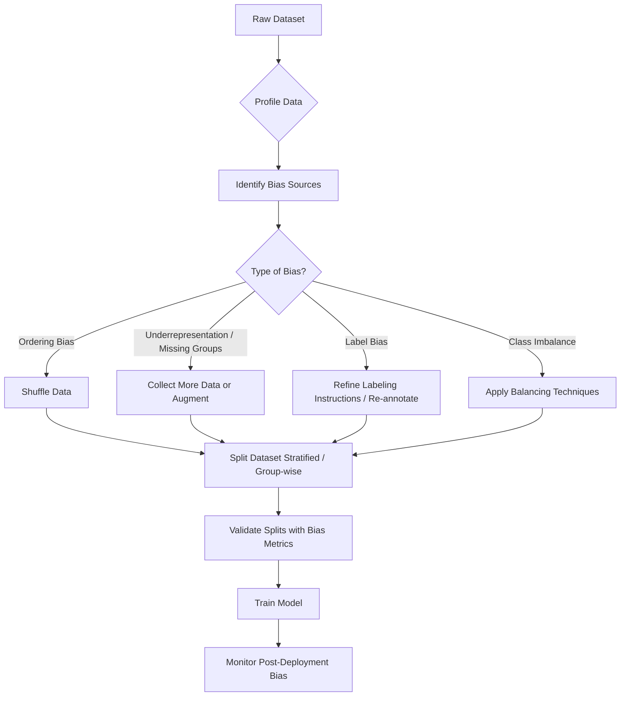

# Task 1.3: Data Preparation for ML and AI - Validate data quality and manage bias

## Skill 1.3.3: Identify and mitigate sources of bias in data by using AWS tools and techniques (for example, dataset splitting, shuffling, augmentation)

---

## Introduction

Bias in machine learning data is any systematic distortion in the collected data that causes a model to learn patterns that do not reflect the real-world population or task it is meant to solve. Bias can enter at many stages—collection, labeling, feature engineering, and even preprocessing—and must be identified and mitigated *before* training as well as monitored after deployment.

This skill focuses on the **data preparation phase** of bias management: recognizing where bias originates in a dataset and applying techniques such as **dataset splitting**, **shuffling**, and **augmentation** to reduce its impact. A crucial distinction is that bias and class imbalance are **not** the same problem, although they are often confused. Bias concerns *who or what* is represented in the data; class imbalance concerns the *outcome label* distribution.

---

## 1. Sources of Bias in Data

Understanding the source of bias is the first step. Each type of bias has a specific origin and therefore a specific mitigation strategy.

| Bias Type | Description | Example | Potential Mitigation |
|-----------|-------------|---------|----------------------|
| **Selection / Sampling bias** | Data is collected from a subset that does not represent the target population. | Training a credit model only on urban customers, excluding rural areas. | Collect more representative data; apply reweighting or augmentation for underrepresented groups. |
| **Measurement bias** | Data is measured or recorded inconsistently across groups. | Using different sensors or thresholds for different regions, leading to inconsistent feature values. | Standardize measurement protocols; validate data quality rules. |
| **Label bias** | Human annotators apply labels inconsistently or with systematic prejudice. | Labeling loan applicants from certain demographics as higher risk based on prior beliefs. | Improve labeling instructions; measure inter-annotator agreement; audit labels with fairness metrics. |
| **Historical bias** | Existing societal or historical inequalities are baked into the ground truth labels. | Using past hiring decisions as labels, which may reflect discrimination. | Review use case ethics; adjust labels or choose different target variable. |
| **Exclusion bias** | Relevant groups are entirely missing from the dataset. | A facial recognition dataset with no images of older adults. | Collect new data; use augmentation to create synthetic diversity if collection impossible. |
| **Ordering / Temporal bias** | Data is collected in a non-random order, causing model training to pick up sequence patterns. | Batches arriving grouped by region or date, leading mini-batch updates to overfit recent patterns. | Shuffle data before training. |

> **Key point:** Naming the specific bias defect **first** determines which mitigation technique is appropriate.

---

## 2. Core Mitigation Techniques

The exam expects you to know **what** each technique does, **when** to use it, and **what it cannot do**.

### 2.1 Dataset Splitting

Dataset splitting divides data into **training**, **validation**, and **test** sets. The goal is to ensure each split reflects the underlying population distribution and to detect bias before deployment.

**Common approaches:**

| Splitting Method | Description | Use Case | Limitation |
|------------------|-------------|----------|------------|
| **Random splitting** | Rows are assigned to splits randomly. | Large balanced datasets. | May produce splits without rare classes or underrepresented groups. |
| **Stratified splitting** | Proportions of a target label or group are maintained in every split. | Imbalanced classification; critical for rare classes. | Requires a label or group column; cannot address group absence entirely. |
| **Group-wise splitting** | All records belonging to a group (e.g., same patient ID) stay together in one split. | Prevents data leakage when multiple records per entity. | Reduces available training groups; must ensure enough groups in each split. |

**Why splitting matters for bias:**  
If an underrepresented group appears only in the test set, the model is never trained on it, and evaluation metrics will reflect poor generalization. Stratified splitting ensures that every split contains a proportional sample of each group, but it does **not** fix underrepresentation—it only reveals it.

**AWS context:**  
`Amazon SageMaker Data Wrangler` provides built-in data split transforms, including **stratified split** on a chosen column. This is an interactive way to preserve group proportions.

---

### 2.2 Shuffling

Shuffling randomizes the order of records in a dataset before training. It removes **ordering bias** that arises when data collection order correlates with a feature or label.

**What shuffling does:**

- Breaks temporal or spatial groupings (e.g., all records from one region arriving in a batch).
- Prevents mini-batch gradient descent from sequentially learning one pattern and then overwriting it with another.
- Ensures each training batch contains a mixture of patterns, improving convergence stability.

**What shuffling does NOT do:**

- It does **not** add or remove records.
- It does **not** change class or group proportions.
- It does **not** mitigate underrepresentation or class imbalance.
- It does **not** generate new variation for a missing group.

**Exam Trap:** A question may say "a dataset underrepresents a group; what should you do?" The correct answer is **not** shuffling, because shuffling only reorders existing data. Use augmentation or collect more data.

**AWS context:**  
Shuffling can be performed in `Amazon SageMaker Data Wrangler` using a transform or in `Amazon SageMaker` training jobs where data is automatically shuffled per epoch.

---

### 2.3 Augmentation

Augmentation creates additional **synthetic** or **modified** examples, typically for the **underrepresented group**, to increase diversity and reduce bias. It is also used to address class imbalance by generating more rare-class samples.

**Augmentation across data modalities:**

| Modality | Example Techniques | Purpose | AWS Tools / Notes |
|----------|--------------------|---------|-------------------|
| **Numeric / Tabular** | SMOTE (Synthetic Minority Over-sampling Technique), random oversampling, adding Gaussian noise, feature perturbation. | Increase rare-class samples; improve model sensitivity. | `SageMaker Data Wrangler` includes balancing transforms like SMOTE and random oversampling. |
| **Text** | Synonym replacement, back-translation (translate to another language and back), paraphrasing, random word insertion/deletion. | Add linguistic diversity for underrepresented intents or classes. | No single AWS service specifically for text augmentation; can be done using custom transformations in `Data Wrangler` or external NLP libraries. |
| **Image** | Rotation, flipping, cropping, brightness/contrast adjustment, color jitter, random erasing. | Improve robustness to variations in lighting, orientation, and scale; create diversity for rare classes. | `Amazon SageMaker Data Wrangler` can apply image augmentation transforms via built-in options or custom code. |

**Important rules for augmentation:**

- Apply augmentation **only to the training set**—never to validation or test data. Augmenting evaluation sets would artificially inflate performance and leak synthetic patterns.
- Augmentation should reflect **realistic** variations. For example, flipping a digit "6" vertically creates a "9", which may be semantically incorrect. Exercise domain knowledge.
- For tabular data, SMOTE generates synthetic samples by interpolating between neighboring minority class points in feature space. This can be effective but may amplify noise if rare-class samples are spread widely.
- Augmentation can **worsen** representation bias if the rare-class records all come from a narrow subgroup. Synthesizing more of the same narrow slice only deepens the imbalance of perspectives. In such cases, collecting new real data is preferable.

---

## 3. AWS Tools for Identifying and Mitigating Bias

AWS provides a range of services that support bias detection and mitigation during data preparation.

| AWS Service | Primary Role in Bias Mitigation | Key Features |
|-------------|----------------------------------|--------------|
| **Amazon SageMaker Data Wrangler** | Interactive data preparation and balancing. | Built-in transforms for SMOTE, resampling, shuffling, stratified splitting, and data profiling. Visualizations show distribution shifts after transformations. |
| **Amazon SageMaker Clarify** | Bias detection and explainability. | Provides **pre-training bias metrics** (e.g., class imbalance, difference in positive proportions) and **post-training bias metrics** (e.g., demographic parity difference). Can be run on tabular data. |
| **AWS Glue DataBrew** | Data profiling and cleaning. | Visual data profile surfaces missing values, skew, and anomalies; can apply transformations to normalize distributions. |
| **Amazon SageMaker Ground Truth** | Managed labeling workflows. | Helps reduce **label bias** by enabling clear labeling instructions, multiple annotators, and inter-annotator agreement tracking. |
| **Amazon Comprehend** | PII detection and text analysis. | Useful for cleaning unstructured text and removing sensitive attributes that could introduce privacy or bias issues. |

> **Note:** `Amazon SageMaker Clarify` is especially relevant to this skill because it quantifies bias using metrics such as **class imbalance** and **KL divergence** on protected group distributions. Although often associated with post-model explainability, it can be used on the training dataset to measure pre-existing bias before training.

---

## 4. Bias vs. Class Imbalance

Many exam questions confuse these two. They are distinct and require different remedies.

| Aspect | Class Imbalance | Bias (Representation Bias) |
|--------|-----------------|----------------------------|
| **Definition** | The **outcome label** distribution is skewed (e.g., 99% negative, 1% positive). | The **features/groups** in the data do not represent the target population. |
| **Example** | Fraud detection: very few fraud cases. | Loan dataset collected only from large cities, excluding rural applicants. |
| **Primary Concern** | Model may predict the majority class and still achieve high accuracy. | Model may perform poorly or unfairly on underrepresented groups. |
| **Evaluation Metrics** | Precision, Recall, F1-score, PR-AUC, confusion matrix. | Bias metrics (e.g., disparate impact, demographic parity difference, equal opportunity). |
| **Mitigation** | Oversampling, undersampling, class weighting, SMOTE, augmentation of rare class. | Collect broader data, augment underrepresented groups, reweight groups, use fairness constraints. |
| **Can they overlap?** | Yes—a dataset can be both imbalanced and biased. | Yes, but one does not imply the other. |

**Key exam insight:**  
A dataset can be **perfectly balanced** across outcome labels yet still **badly misrepresent** a group. Conversely, a dataset can represent every group faithfully and still be **heavily imbalanced** in labels. Do not use class imbalance remedies for representation bias or vice versa.

---

## 5. Workflow for Bias Identification and Mitigation

The following diagram shows a typical bias-mitigation flow during data preparation.

---

## 6. Scenario-Based Examples

### Scenario 1: Regional Underrepresentation

**Situation:**  
A company trains a demand-prediction model using sales data collected in batches grouped by region. One region, `Region X`, contributes only 2% of the records. The ML engineer notices that during training, the model updates heavily on dominant regions early in each epoch and then overfits to the last region. Which technique should be applied **first** to address the batch ordering issue?

**Options:**
- A. Augment `Region X` data with synthetic samples.
- B. Shuffle the records before training.
- C. Use stratified splitting on the region column.
- D. Convert the dataset to a columnar format.

**Correct Answer:** **B. Shuffle the records before training.**

**Explanation:**  
The scenario describes **ordering bias**: records are grouped by region, causing mini-batches to contain only one region. Shuffling randomizes the order, ensuring each batch contains a mixture of regions, which stabilizes training and prevents sequential overfitting. Stratified splitting (Option C) would help ensure region representation across splits but does not fix batch ordering. Augmentation (Option A) addresses underrepresentation, not order bias. Columnar format (Option D) is irrelevant.

---

### Scenario 2: Group Underrepresentation in Images

**Situation:**  
A facial-expression recognition dataset contains 10,000 images, but only 50 images of people wearing glasses. The model performs poorly on images with glasses. The team cannot collect more real data immediately. Which action is **most appropriate** to improve performance on this underrepresented group?

**Options:**
- A. Shuffle the dataset.
- B. Apply image augmentation to the glasses images (e.g., slight rotations, brightness changes) to create more training samples.
- C. Undersample the non-glasses images to balance the dataset.
- D. Use random splitting instead of stratified splitting.

**Correct Answer:** **B. Apply image augmentation to the glasses images.**

**Explanation:**  
The glasses group is underrepresented. Augmentation adds variation to existing glasses images without collecting new real data. This increases the model's exposure to the rare group. Shuffling does not add data. Undersampling non-glasses images would reduce the total dataset and potentially discard useful information. Random splitting may lead to no glasses images in training, worsening the problem.

---

### Scenario 3: Imbalanced Labels vs. Bias

**Situation:**  
A fraud detection dataset has 99% legitimate transactions and 1% fraudulent. A model trained on this data reports 99% overall accuracy. The ML engineer claims the model is excellent. What is the **most appropriate** response?

**Options:**
- A. "Accuracy is fine; no further action needed."
- B. "Use F1-score or PR-AUC to evaluate the model's performance on the fraud class."
- C. "Shuffle the dataset to balance the labels."
- D. "The dataset is biased because it has more legitimate transactions."

**Correct Answer:** **B. Use F1-score or PR-AUC to evaluate the model's performance on the fraud class.**

**Explanation:**  
High accuracy in imbalanced datasets is misleading because a model predicting all transactions as legitimate achieves 99% accuracy. Appropriate metrics for the minority class are Precision, Recall, F1-score, and PR-AUC. Shuffling does not change label proportions. Option D incorrectly labels class imbalance as representation bias; the imbalance is about the outcome label, not group representation.

---

### Scenario 4: Stratified Splitting for Rare Class

**Situation:**  
A medical dataset for a rare disease contains 1,000 patient records, of which only 30 are positive cases. The ML engineer randomly splits 80/20 into training and test sets. The test set contains only 2 positive cases, making evaluation unreliable. Which splitting strategy should be used instead?

**Options:**
- A. Shuffle the data before splitting.
- B. Use stratified splitting on the disease label to maintain the 3% positive rate in both sets.
- C. Use group-wise splitting on patient ID.
- D. Augment the positive cases before splitting.

**Correct Answer:** **B. Use stratified splitting on the disease label.**

**Explanation:**  
Stratified splitting ensures the ratio of positive and negative cases is preserved in training and test sets, giving a more reliable evaluation. Shuffling does not guarantee proportional representation. Group-wise splitting on patient ID prevents leakage but may still produce few positive cases. Augmenting before splitting could contaminate the test set if not done carefully (augmentation should be applied only to training data after the split).

---

## 7. Exam Tips and Traps

- **Shuffling does not fix underrepresentation or class imbalance.** If a group is missing or too small, shuffling merely rearranges existing records. Use augmentation or collect more data.
- **Stratified splitting does not create new data.** It only preserves existing proportions across splits. If a class is very rare, the test set will still have few examples, but at least evaluation will be more meaningful.
- **Augmentation must be applied only to the training set.** Applying augmentation before splitting or to validation/test data leaks synthetic patterns and inflates performance.
- **Do not confuse class imbalance with bias.** A balanced label distribution does not guarantee fair representation across demographic groups. Always check both the outcome label distribution and the feature/group distributions.
- **Bias detection is not a one-time event.** You must measure bias before training (pre-training metrics), after training (post-training metrics), and continuously after deployment.
- **Random splitting can be dangerous with imbalanced data.** Always prefer stratified splitting when you have a rare target class or an underrepresented group.
- **Shuffling should be part of every training pipeline** to avoid ordering bias, but it is not a substitute for proper splitting or augmentation.
- **Know which AWS tools to use:** `SageMaker Data Wrangler` for interactive balancing and shuffling/splitting transforms; `SageMaker Clarify` for pre- and post-training bias metrics; `AWS Glue DataBrew` for profiling distributions and detecting skew.
- **Bias metrics across modalities:** For multimodal data (numeric, text, image), you must apply bias checks in every modality. A dataset may look balanced in its tabular features but still have bias in text or images. Use modality-specific augmentation where needed.
- **Accuracy is misleading when one class dominates.** Always pair accuracy with metrics that focus on the minority class.
- **Duplicate rare-class records (e.g., simple oversampling) can deepen representation bias** if those records come from the same narrow subgroup. Prefer SMOTE or augmentation that adds variation, or collect more diverse real data.

---

## 8. Summary

- **Identify bias source first:** Ordering bias → shuffle; underrepresentation → augment or collect data; label bias → refine instructions; class imbalance → balancing techniques.
- **Dataset splitting:** Use stratified or group-wise splits to ensure each split reflects population and prevent leakage.
- **Shuffling:** Removes order-based artifacts but does not add data or fix proportions.
- **Augmentation:** Adds synthetic variation to underrepresented groups; apply only to training data; use modality-appropriate techniques.
- **AWS tools:** `SageMaker Data Wrangler`, `SageMaker Clarify`, `AWS Glue DataBrew`, and `SageMaker Ground Truth` support bias identification and mitigation.
- **Always measure bias with appropriate metrics** across all data modalities and throughout the ML lifecycle.