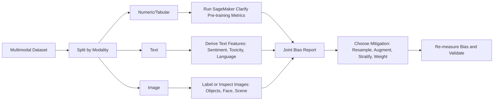

# Task 1.3: Data Preparation for ML and AI - Validate data quality and manage bias
## Skill 1.3.4: Optimize multimodal data distributions by applying bias metrics across numeric, text, and image assets

## 1. Skill Overview

This skill focuses on measuring and improving the distribution of multimodal training data before model training. A multimodal dataset may contain:

- **Numeric/tabular features**: age, income, transaction amount, temperature, sales counts
- **Text assets**: customer reviews, clinical notes, product descriptions, social media posts
- **Image assets**: product photos, medical images, satellite images, identity documents

Bias in any one modality can teach a model unwanted associations. The goal is not only to detect class imbalance in a label column, but to apply modality-aware bias metrics and distribution optimization techniques across every asset type in the dataset.

---

## 2. Why Multimodal Bias Requires Special Attention

A common mistake is to run bias checks only on the structured numeric columns and assume the entire dataset is fair. However:

- **Text** can carry group-specific sentiment, dialect, toxic content, or topic skew.
- **Images** can be imbalanced by object type, demographic appearance, lighting, pose, color distribution, or geographic environment.
- **Numeric columns** can have group-specific missingness, value distribution shifts, or label imbalance.

If these are not measured, the model may perform well on average but fail systematically for certain groups or content types.

> **Exam mindset:** Multimodal bias optimization means checking every modality separately and then looking at interactions between modalities.

---

## 3. Core Concepts

| Term | Meaning in this skill |
| --- | --- |
| **Facet** | A protected or grouping attribute, such as region, gender, age group, language, or product category |
| **Label** | The target or outcome the model is learning to predict |
| **Bias metric** | A statistical measure of imbalance or distributional difference across groups or classes |
| **Pre-training bias** | Bias measured in the training data before the model learns from it |
| **Post-training bias** | Bias measured in model predictions after training |
| **Representation bias** | A group is underrepresented or overrepresented relative to the intended population |
| **Class imbalance** | The outcome label distribution is skewed, such as 98% positive and 2% negative |

### Important distinction

- **Class imbalance** is about the target label.
- **Representation bias** is about who or what is present in the data.

A dataset can be perfectly balanced on the label but still fail to represent a geographic region, language, or demographic group.

---

## 4. Bias Metrics by Modality

### 4.1 Numeric/Tabular Data

For structured data, AWS services such as **Amazon SageMaker Clarify** and **Amazon SageMaker Data Wrangler** provide declarative bias analysis.

| Metric | What it measures | When it is useful |
| --- | --- | --- |
| **Class Imbalance (CI)** | How skewed the target label distribution is | Detecting when one label dominates |
| **Difference in Proportions of Labels (DPL)** | Difference in positive label rates between facets | Comparing groups such as region A vs region B |
| **Kullback-Leibler Divergence (KL)** | How much one group's label distribution diverges from another | Distributional difference across facets |
| **Jensen-Shannon Divergence (JS)** | Symmetric distributional difference | When directionality is not important |
| **Total Variation Distance (TVD)** | Maximum difference in label distribution between groups | Overall label distribution mismatch |
| **Kolmogorov-Smirnov (KS)** | Maximum difference between cumulative label distributions | Comparing richer numeric distributions or score-like labels |
| **Conditional Demographic Disparity in Labels (CDDL)** | Whether label outcomes are disproportionate across facets | Detecting conditional group-level disparity |

**Example:**  
A loan dataset has numeric features and a label `approved`. The facet might be `region`. A pre-training bias report using SageMaker Clarify may show a high DPL between two regions, meaning the percentage of approved customers differs significantly by region.

---

### 4.2 Text Data

Text does not have built-in numeric columns for bias metrics, so you must either:

- Derive structured features from text using **Amazon Comprehend**, or
- Analyze text statistics directly.

Common text bias dimensions:

| Bias concern | Example | Detection approach |
| --- | --- | --- |
| Sentiment skew | Product reviews from one region are more negative | Use Amazon Comprehend sentiment, then compare across region facets |
| Toxicity imbalance | Certain topics contain more toxic language | Use Amazon Comprehend toxicity detection |
| Language or dialect coverage | One language dominates the dataset | Count language codes; check for underrepresentation |
| Named entity imbalance | Some groups appear only in negative contexts | Perform entity analysis and context aggregation |
| Prompt-response malformation | Generated response does not answer prompt | Structural validation before content screening |
| Unsafe content | Training text includes hate speech or PII | Use **Amazon Bedrock Guardrails** and **Amazon Comprehend PII** |

AWS services:

- **Amazon Comprehend**: sentiment, toxicity, entity recognition, language detection, PII detection
- **Amazon Bedrock Guardrails**: content filters, denied topics, word filters, sensitive information filters
- **Amazon SageMaker Data Wrangler / SageMaker Clarify**: after text is converted into structured numeric features, these services can evaluate distributional bias

**Example:**  
A multilingual customer support dataset contains text tickets. Sentiment analysis finds that Spanish-language tickets are disproportionately classified as angry because the training text includes fewer samples of polite Spanish. This is a text modality distribution issue.

---

### 4.3 Image Data

For images, bias measurement often requires:

- Object and label distribution analysis
- Demographic face analysis where relevant
- Quality and environment variation review
- Human annotation or automated labeling with **Amazon Rekognition**

Common image bias dimensions:

| Bias concern | Example | Detection approach |
| --- | --- | --- |
| Object class imbalance | 95% of images contain cats, 5% contain dogs | Check label distribution |
| Demographic representation | Facial images contain mostly younger individuals | Use Rekognition face metadata or human annotator review |
| Lighting or capture condition skew | Medical images are mostly from one scanner type | Review metadata, brightness, contrast, source |
| Pose or angle bias | Traffic camera images mostly capture daylight front-facing vehicles | Analyze class/object variation |
| Domain variation | Product photos all have white backgrounds | Review environment/background distribution |
| Label leakage through images | Text embedded in images appears only in one class | Human audit or OCR-assisted review |

AWS services:

- **Amazon Rekognition**: object labels, scene detection, face attributes, moderation
- **Amazon SageMaker Ground Truth**: managed human labeling for image classification or bounding boxes
- **Amazon SageMaker Data Wrangler**: convert image metadata/labels into structured data for bias profiling
- **Amazon Bedrock Guardrails**: content safety for multimodal generative AI data

**Example:**  
A self-driving dataset has images of stop signs from only one country. The object class is balanced, but the geographic representation within the class is not. An image-level bias audit reveals underrepresentation of country-specific signage.

---

## 5. Optimizing Multimodal Data Distributions

### 5.1 Workflow

### 5.2 Steps to Optimize Distribution

1. **Inventory modalities and facets**  
   Identify all data types and the protected or business-critical groups.

2. **Apply appropriate bias metrics per modality**  
   - Numeric: SageMaker Clarify pre-training metrics  
   - Text: sentiment, toxicity, language, entity distribution  
   - Image: label, object, scene, face distribution  

3. **Convert unstructured output to structured features where necessary**  
   For example, derive sentiment scores or image label counts.

4. **Run joint analysis**  
   Check intersectional bias: bias may not appear in a single column but appears when combining region and age or language and object type.

5. **Mitigate the specific defect**  
   - Underrepresentation → augmentation or oversampling  
   - Dominant class → undersampling or class weighting  
   - Collection-order bias → shuffling  
   - Evaluation leakage across groups → stratified splitting  

6. **Re-measure**  
   Bias optimization is iterative. Re-run the bias report after mitigation.

---

## 6. Mitigation Techniques by Modality

| Technique | Numeric/Tabular | Text | Image |
| --- | --- | --- | --- |
| Shuffling | Breaks batch order bias | Breaks document order bias | Breaks frame sequence bias |
| Stratified splitting | Preserves group label ratio | Preserves language/topic ratio | Preserves object class ratio |
| Oversampling rare class | Duplicates minority rows | Copies minority-text examples | Duplicates rare image class |
| Undersampling common class | Removes majority rows | Removes repetitive text | Removes common image class |
| Augmentation | Synthetic tabular data | Paraphrasing, back-translation | Rotation, crop, color jitter, GAN-based variation |
| Class weighting | Class-level loss weighting | Class-level loss weighting | Class-level loss weighting |
| Targeted data collection | Add missing group records | Translate or collect new text | Collect new images from underrepresented condition |

> **Important:** Shuffling reorders existing records. It does **not** fix genuine underrepresentation.

---

## 7. AWS Services Summary

| AWS Service | Role in multimodal bias optimization |
| --- | --- |
| **Amazon SageMaker Clarify** | Pre-training bias metrics and reports for structured/tabular data; can use derived features from text/image |
| **Amazon SageMaker Data Wrangler** | Data transformation, data profiling, data bias report generation, quick model insights |
| **Amazon Comprehend** | Sentiment, toxicity, PII, language, and entity analysis for text bias measurement |
| **Amazon Rekognition** | Object, scene, and face analysis for image modality profiling |
| **Amazon SageMaker Ground Truth** | Human labeling for images or text when automated labels are insufficient |
| **Amazon Bedrock Guardrails** | Content safety screening for generative AI training data, including denied topics, word filters, and sensitive information filters |
| **Amazon CloudWatch** | Monitor bias jobs, data quality checks, and validation failures |

---

## 8. Exam Tips and Traps

### Tips

- **Use SageMaker Clarify** when a question asks about pre-training bias metrics for structured data.
- If the dataset includes **text and images**, choose the answer that includes modality-specific analysis, not just tabular bias checks.
- **Amazon Comprehend** is the go-to text service for sentiment, toxicity, and PII.
- **Amazon Rekognition** is the go-to for image object and face analysis.
- **Amazon Bedrock Guardrails** is the best fit for content safety screening before generative AI training.
- If a group is genuinely underrepresented, use **augmentation** or **targeted collection**.
- If the issue is only collection order, use **shuffling**.
- If you need to keep group proportions consistent across training and evaluation, use **stratified splitting**.
- Check **intersectional bias**, not just single-column group differences.

### Traps

- **Do not confuse shuffling with augmentation.** Shuffling cannot add missing group data.
- **Do not use overall accuracy** as the success metric when one class dominates. Prefer precision, recall, F1, or PR-AUC.
- **Do not assume a balanced label column means no bias.** Representation bias can still exist.
- **Do not apply the same bias metric blindly to all modalities.** Text and image assets often require derived features before bias analysis.
- **Do not treat class imbalance and representation bias as the same problem.** They require different remedies.
- **Do not over-weight duplicate records if they come from a narrow slice.** This can amplify hidden representation bias.
- **Do not stop bias measurement after model deployment only.** Pre-training data bias detection is mandatory.

---

## 9. Scenario-Based Exam Practice

### Scenario 1

A marketing team trains a multimodal model using customer demographic data, product review text, and product images. The model is supposed to predict product category. Before training, the MLOps engineer must check for data bias.

**Which approach best applies bias metrics across all modalities?**

- A. Run SageMaker Clarify only on the numeric demographic columns.
- B. Shuffle the entire dataset and retrain.
- C. Use Amazon Comprehend to derive text features and Amazon Rekognition to derive image labels, then run SageMaker Clarify on the combined structured representation with the sensitive facets.
- D. Use only class imbalance calculation on the product category label.

**Answer:** C

**Explanation:**  
SageMaker Clarify works well on structured data. Text and image assets need derived features or labels. Comprehend can extract sentiment, toxicity, or language; Rekognition can extract object labels. The combined structured dataset can then be analyzed by Clarify with protected facets.

---

### Scenario 2

An image classification dataset includes product images from several regions. One region is underrepresented. The team wants to optimize the image data distribution before training.

**Which choice specifically addresses the underrepresentation?**

- A. Shuffle the image order
- B. Augment the underrepresented region with controlled image transformations
- C. Convert images to a columnar format
- D. Split the data randomly

**Answer:** B

**Explanation:**  
Underrepresentation requires adding variation to the missing group. Image augmentation such as rotation, cropping, color adjustment, or synthetic image generation adds new training examples. Shuffling only changes order; it does not add representation.

---

### Scenario 3

A text classification dataset has customer feedback from English and Spanish users. The English group has balanced sentiment, but the Spanish group has very few positive examples. The model frequently misclassifies positive Spanish feedback as negative.

**Which data preparation action is most appropriate?**

- A. Remove Spanish examples to balance language groups
- B. Augment or collect more positive Spanish-language examples
- C. Undersample English positive examples only
- D. Use overall accuracy as the evaluation metric

**Answer:** B

**Explanation:**  
The defect is an underrepresentation of positive sentiment in the Spanish text subset. The best remedy is to add or generate positive Spanish text examples. Removing Spanish examples would make representation worse. Oversampling or targeted collection directly addresses the imbalance within the underrepresented text group.

---

## 10. Key Takeaways

- Multimodal bias optimization requires measuring bias in **each modality**: numeric, text, and image.
- Use **SageMaker Clarify** for structured data bias metrics.
- Use **Amazon Comprehend** for text sentiment, toxicity, and PII.
- Use **Amazon Rekognition** for image object, scene, and face analysis.
- Convert text and image signals into structured features when using Clarify.
- Apply mitigation based on the specific defect: shuffle, stratify, augment, over/undersample, or weight.
- Always re-measure bias after mitigation.
- Distinguish class imbalance from representation bias and use the correct metric for the problem.