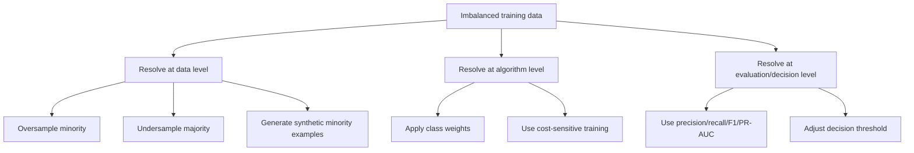
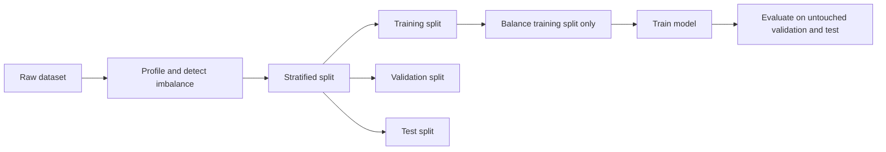

# Task 1.3: Data Preparation for ML and AI - Validate data quality and manage bias

## Skill 1.3.5: Resolve class imbalance in numeric, text, and image datasets

### 1. Core concept: What class imbalance is and why it matters

Class imbalance occurs when one target label appears far more often than another in the training dataset. For example:

- Fraud transactions: 99.8% legitimate, 0.2% fraudulent
- Medical diagnosis: 97% healthy, 3% disease-positive
- Defective parts: 99% normal, 1% defective
- Sentiment analysis: 95% positive reviews, 5% negative reviews

When a dataset is heavily imbalanced, a machine learning model can achieve high overall accuracy by simply predicting the majority class most of the time. This is called the **accuracy paradox**.

Example:

| Dataset composition | Model behavior | Overall accuracy | Minority-class performance |
|---|---:|---|---:|
| 98% normal, 2% fraud | Always predicts normal | 98% | Catches 0% of fraud |
| 95% positive reviews, 5% negative | Always predict positive | 95% | Completely fails on negative |

Therefore, class imbalance must be resolved or accounted for before evaluating a model using misleading metrics.

#### Class imbalance vs. representation bias

These two concepts are related but distinct.

| Concept | Definition | Example |
|---|---|---|
| Class imbalance | The label/outcome distribution is skewed | Few fraudulent transactions but many legitimate ones |
| Representation bias | Certain groups, regions, or demographics are under- or overrepresented | Fraud examples exist but all come from one country or payment channel |

A dataset can be balanced by label but still suffer from representation bias. For example, a medical dataset may have 50% disease-positive and 50% disease-negative samples, but if all positive cases come from one hospital, the model may learn hospital-specific artifacts instead of the disease itself.

---

### 2. Detecting class imbalance

Before fixing class imbalance, you must detect and measure it.

Common detection signals:

- Class distribution charts or frequency counts
- Confusion matrices showing imbalance in errors
- Precision, recall, F1 score, and precision-recall AUC
- Pre-training bias metrics such as SageMaker Clarify class imbalance scores

A model trained on imbalanced data may show:

| Metric | Possible misleading result |
|---|---|
| Accuracy | Very high despite poor minority-class performance |
| ROC-AUC | Can still look high because true negatives dominate |
| Precision | May be misleading if class threshold is poorly chosen |
| Recall for minority class | Usually the key failure metric |

For imbalanced datasets, the more reliable metrics are:

| Metric | What it measures | Why it helps |
|---|---|---|
| Precision | Correctness of positive predictions | Important when false positives are costly |
| Recall | Coverage of actual positives | Important when missing positives is costly |
| F1 score | Balance between precision and recall | Good overall metric when both matter |
| F-beta score | Weighted balance, where beta > 1 favors recall | Useful when minority class is critical |
| Precision-Recall AUC | Quality across thresholds | More informative than ROC-AUC for rare classes |

AWS services that help detect imbalance:

| AWS Service | Role |
|---|---|
| Amazon SageMaker Clarify | Computes pre-training bias metrics, including class imbalance and label imbalance |
| AWS Glue DataBrew | Profiles column distributions, including target class frequencies |
| Amazon SageMaker Data Wrangler | Visualizes class balance during data preparation |
| Amazon CloudWatch | Tracks data quality metrics and retraining signals over time |

---

### 3. General approaches to resolving class imbalance

There are three main groups of techniques:

#### Data-level techniques

| Technique | Description | Main risk |
|---|---|---|
| Random oversampling | Duplicate rare-class examples | Overfitting to exact rare examples |
| Random undersampling | Remove majority-class examples | Losing useful majority-class information |
| Synthetic data generation | Create new plausible rare-class examples | Synthetic examples may not represent real variation |
| Augmentation | Add transformed variants of rare examples | Label-destroying transformations |

#### Algorithm-level techniques

- Assign higher class weight to minority class so misclassification is penalized more.
- Use cost-sensitive learning where false negatives cost more than false positives.
- Adjust the decision threshold to favor the minority class when appropriate.

#### Evaluation-level techniques

- Use stratified splitting so training, validation, and test sets preserve class proportions.
- Use precision, recall, F1, PR-AUC rather than overall accuracy.
- Tune decision threshold based on business cost.

#### Critical rule: Split before balancing

One of the most important exam concepts is that class-balancing techniques must be applied only to the training split.

If you oversample or synthesize examples before splitting, identical or nearly identical records can leak into validation or test sets. This causes inflated evaluation results and gives a false sense of model quality.

---

### 4. Resolving class imbalance in numeric/tabular datasets

Numeric and tabular datasets are well suited to synthetic oversampling techniques because examples exist in a continuous feature space.

Common approaches:

| Technique | Description |
|---|---|
| Random oversampling | Duplicate minority-class rows |
| Random undersampling | Delete majority-class rows |
| SMOTE | Create synthetic minority examples by interpolating between neighboring minority samples |
| Tomek links | Remove majority samples that are very close to minority samples, improving class separation |
| Class weights | Penalize minority-class mistakes more heavily during training |
| Threshold adjustment | Choose a decision threshold that improves recall or F1 for the minority class |

#### When each numeric technique is useful

| Situation | Recommended approach |
|---|---|
| Dataset is large and majority class has abundant examples | Random undersampling |
| Dataset is small and minority class has too few examples | Oversampling or SMOTE |
| Need stronger generalization than simple duplication | SMOTE or other synthetic oversampling |
| Need to preserve original feature distributions | Class weights |
| Business cost favors finding rare positives | Threshold adjustment or cost-sensitive training |

#### Important considerations for numeric data

- SMOTE works on numeric feature spaces, not raw text or raw images.
- Outliers in the minority class can distort SMOTE-generated examples.
- Duplicating minority examples does not add new information; it only emphasizes existing cases.
- Undersampling can remove important majority-class boundary information.

AWS lens:

- Amazon SageMaker Data Wrangler provides data balancing transforms for tabular data, including SMOTE, random oversampling, random undersampling, and Tomek links.
- Amazon SageMaker Clarify reports class imbalance as a pre-training bias metric.

---

### 5. Resolving class imbalance in text datasets

Text class imbalance is common in sentiment analysis, topic classification, spam detection, and intent recognition.

Techniques for text data:

| Technique | Description |
|---|---|
| Minority oversampling by duplication | Repeat rare-class documents |
| Text augmentation | Create new rare-class examples through paraphrasing, synonym replacement, back translation, or word-level substitutions |
| Majority undersampling | Remove redundant or near-duplicate majority-class documents |
| Class weights | Penalize minority-class errors more heavily during training |
| Prompt-based paraphrase generation | Use foundation models to generate new rare-class examples while preserving meaning |

#### Important considerations for text data

- Duplicating the same rare-class sentences can cause overfitting to exact phrasing.
- Text augmentation must preserve the sentiment or class label. For example, replacing the word "good" with "not good" can flip sentiment.
- Back translation is a common augmentation method: translate a sentence to another language and back to the original language to create a paraphrased version.
- Undersampling is more effective when the majority class has many near-duplicate or redundant examples.

#### Example scenario

A product review dataset contains:

- 95% positive reviews
- 5% negative reviews

The model achieves 95% accuracy but fails to detect most negative reviews. A machine learning engineer should:

1. Use stratified splitting.
2. Use recall, F1, or PR-AUC as the key metric.
3. Augment the negative reviews with paraphrasing or back translation.
4. Consider class weights or majority undersampling.
5. Evaluate only on real, untouched validation and test examples.

---

### 6. Resolving class imbalance in image datasets

Image class imbalance occurs when one class has many more images than another. This is common in medical imaging, defect detection, satellite imaging, and wildlife monitoring.

Techniques for image data:

| Technique | Description |
|---|---|
| Image augmentation | Generate new variants of rare-class images using geometric or photometric transformations |
| Geometric transformations | Rotation, cropping, scaling, flipping, translation |
| Photometric transformations | Brightness, contrast, saturation, noise addition |
| Occlusion-based augmentation | Cutout, random erasing, masking parts of the image |
| Synthetic image generation | Use generative models such as GANs or diffusion models to create new rare-class images |
| Majority undersampling | Remove similar or redundant majority-class images |
| Class weights | Penalize minority-class image misclassification more heavily |

#### Important considerations for image data

- Augmentation must be label-preserving. For example:
  - Flipping a 6 may turn it into a 9.
  - Flipping a medical image may invert left/right laterality.
  - Certain color shifts may destroy diagnostic information.
- Augmentation only creates variation from what already exists. If the minority class represents only a narrow slice of reality, augmentation cannot fix a true representation gap.
- Synthetic image generation is powerful but requires enough seed examples and quality checks.

#### Example scenario

A manufacturing company has 100,000 images of good parts and 1,000 images of defective parts. The model achieves 99% accuracy but catches few defective parts.

Recommended response:

1. Use stratified splitting to preserve defect images in all splits.
2. Augment defect images with rotations, crops, brightness changes, and noise.
3. Consider class weights for the defective class.
4. Evaluate using recall, F1, and precision-recall AUC.
5. If defects all come from one production line, collect more data from other lines to avoid representation bias.

---

### 7. Choosing the right technique by data type

| Data type | Most common fixes | Use metric | AWS-related tool or service |
|---|---|---|---|
| Numeric/tabular | SMOTE, random oversampling, random undersampling, class weights | Precision, recall, F1, PR-AUC | SageMaker Data Wrangler, SageMaker Clarify |
| Text | Paraphrasing, back translation, synonym replacement, duplication, majority undersampling, class weights | Recall, F1, PR-AUC | SageMaker Data Wrangler for tabular views, augmentation jobs in SageMaker |
| Image | Geometric and photometric augmentation, synthetic image generation, majority undersampling, class weights | Recall, F1, PR-AUC | SageMaker Processing or training jobs for augmentation |

---

### 8. Scenario-based exam examples

#### Scenario 1: Numeric fraud detection

A bank has a transaction dataset with 1 million transactions, of which 0.1% are fraudulent. A data scientist trains a model and reports 99.9% accuracy.

**Question:** Which statement best explains the issue?

**Answer:** The model is likely predicting all transactions as non-fraudulent. Overall accuracy is misleading for imbalanced data. The team should use precision, recall, F1, or PR-AUC, and consider SMOTE, class weights, or threshold tuning.

---

#### Scenario 2: Text sentiment analysis

A review dataset has 97% positive reviews and 3% negative reviews. A team decides to use SMOTE to balance the dataset.

**Question:** Is SMOTE the best choice?

**Answer:** No. SMOTE is designed for numeric feature spaces. Raw text cannot be directly oversampled using SMOTE unless the text has already been converted into a numeric representation. Better options include text augmentation, paraphrasing, back translation, safe duplication, majority undersampling, or class weights.

---

#### Scenario 3: Image defect detection

A manufacturer has rare images of product defects. The team duplicates the defect images to balance the dataset.

**Question:** What is the main risk?

**Answer:** Duplicating the same defect images can cause the model to memorize exact defect appearances rather than learn the general concept. Image augmentation with rotations, crops, brightness changes, and other label-preserving transformations is a better approach.

---

#### Scenario 4: Oversampling before split

A team applies SMOTE to the full dataset before splitting into training and test sets.

**Question:** Why is this a problem?

**Answer:** Synthetic examples are generated from the entire dataset. If those examples are later placed in the test set, the test data is no longer a clean, untouched evaluation set. This causes data leakage and optimistic model evaluation results. The correct order is stratified splitting first, then balancing only the training set.

---

#### Scenario 5: Balanced labels but biased representation

A medical imaging dataset has 50% disease-positive and 50% disease-negative images. However, all positive images come from one hospital.

**Question:** What is the main data concern?

**Answer:** This is not primarily a class imbalance problem; it is a representation bias problem. The model may learn hospital-specific image properties instead of disease-relevant features. The team should collect positive examples from multiple hospitals or apply careful augmentation, but shuffling or simple class balancing cannot fix the underlying representation gap.

---

### 9. Exam tips and traps

- **Do not trust accuracy on imbalanced datasets.** A model can appear excellent by predicting the majority class.
- **Use PR-AUC over ROC-AUC for rare classes.** ROC-AUC can look optimistic because true negatives dominate the calculation.
- **Shuffling does not fix imbalance.** Shuffling only randomizes order. It does not add rare examples or remove majority examples.
- **SMOTE is for numeric/tabular data.** It is not directly applicable to raw text or raw images.
- **Split before balancing.** Oversampling, SMOTE, augmentation, or undersampling should only be applied to the training split.
- **Duplication is not the same as augmentation.** Duplication can cause overfitting; augmentation adds variation.
- **Undersampling can waste useful data.** Use it when the majority class is very large and redundant.
- **Class weights do not add data.** They tell the model to care more about the minority class during training.
- **Class imbalance and representation bias are not the same.** You can fix label balance and still have a biased dataset.
- **Augmentation must preserve the label.** Be careful with transformations that change meaning:
  - Flipping a 6 into a 9
  - Flipping left/right medical images
  - Changing sentiment in text augmentation
  - Changing a stop sign into a yield sign through heavy image distortion
- **Stratified splitting is important.** It preserves class proportions in each split and prevents rare classes from being absent.
- **The business metric matters.** If missing a rare event is very expensive, prioritize recall. If false alarms are expensive, prioritize precision.
- **SageMaker Clarify can detect class imbalance.** SageMaker Data Wrangler can help balance numeric tabular training data.