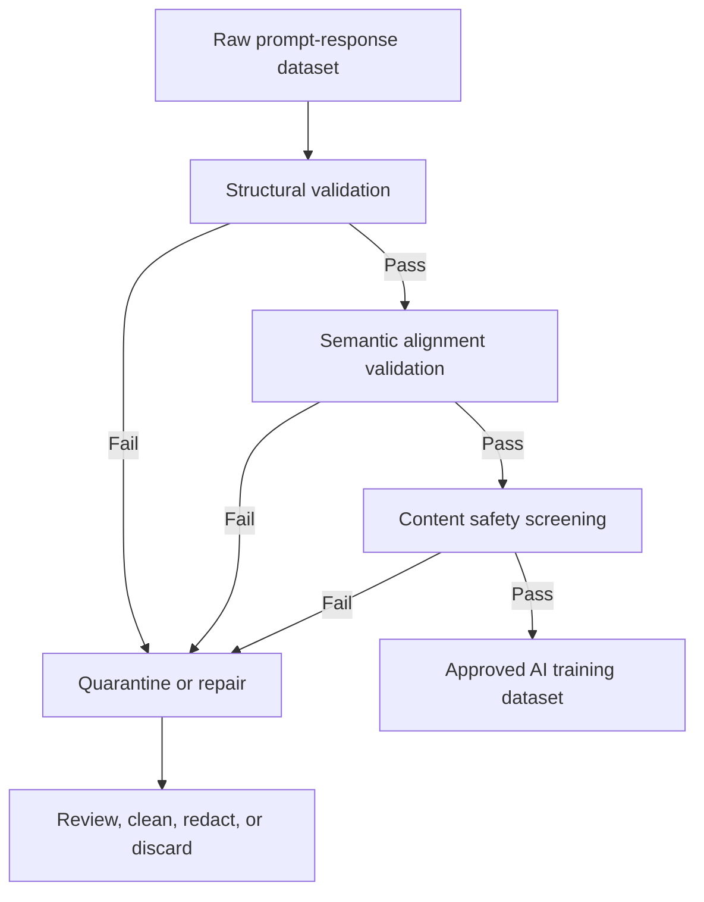

# Task 1.3: Data Preparation for ML and AI - Validate data quality and manage bias

## Skill 1.3.6: Validate AI training data integrity (for example, prompt-response pair validation, content safety screening)

---

## 1. Why AI Training Data Integrity Matters

For generative AI and supervised fine-tuning, the training dataset is often built from **prompt-response pairs**. These pairs teach the model how to respond to user inputs. If the data is malformed, inconsistent, private, offensive, or misaligned, the model can learn these defects and reproduce them at inference time.

**Key principle:**

> "Content that goes in can come back out in a model response."

Therefore, training data integrity is not only about schema completeness. It also includes:

- Checking that each prompt has a valid, corresponding response
- Ensuring the response genuinely answers the prompt
- Detecting duplicate or near-duplicate records
- Screening for toxic, sensitive, or denied content
- Removing personally identifiable information (PII)
- Confirming formatting and role structure are consistent

---

## 2. Prompt-Response Pair Validation

Prompt-response pair validation is both **structural** and **semantic**.

A well-formed pair should have:

| Component | Validation Question |
|---|---|
| Prompt presence | Is the prompt field present and non-empty? |
| Response presence | Is the response field present and non-empty? |
| Role structure | Are roles such as `user`, `assistant`, `system` correctly assigned? |
| Formatting | Are special tokens, separators, and turn boundaries consistent? |
| Alignment | Does the response actually answer the prompt? |
| Completeness | Are there any truncated responses or missing fields? |
| Uniqueness | Are there duplicate or near-duplicate pairs that could over-represent one pattern? |
| Safety | Does the prompt or response contain unsafe or policy-violating content? |

### 2.1 Structural Validation

Structural validation checks whether every record is complete and formatted correctly. This is similar to validating any dataset, but applied to generative AI data.

Common structural defects:

| Defect | Example | Risk |
|---|---|---|
| Missing response | `{"prompt": "What is the return policy?", "response": ""}` | Model learns not to answer |
| Missing prompt | `{"response": "Our return policy is 30 days."}` | Model learns meaningless output |
| Truncated response | `"response": "The warranty covers"` | Model learns incomplete text |
| Wrong field order | Prompt and response content swapped | Model learns reversed behavior |
| Repeated pairs | 500 identical question-answer copies | Overfitting and bias toward one pattern |
| Inconsistent role names | `"human"` / `"bot"` instead of expected format | Confuses model during fine-tuning |

**AWS tools for structural checks:**

- **AWS Glue Data Quality** can evaluate completeness, uniqueness, row count, and schema rules.
- **AWS Glue DataBrew** can profile the dataset and surface missing values, duplicates, or inconsistent formats.
- **Amazon SageMaker Data Wrangler** can be used interactively to clean and transform the pairs.

**Example rule concept without code:**

- Completeness of `prompt` must be greater than 99%
- Completeness of `response` must be greater than 99%
- Uniqueness of combined `prompt + response` must be greater than 95%
- `response` length must be between 1 and 2000 characters

### 2.2 Semantic Alignment Validation

A prompt and response can both be present and well-formatted, yet still misaligned.

**Example:**

- Prompt: "How do I reset my password?"
- Response: "Shipping takes 5–7 business days."

This pair is structurally valid but semantically invalid. The model would learn the wrong association.

**Approaches:**

| Approach | Description |
|---|---|
| Human review | Use human reviewers to judge whether the response answers the prompt |
| LLM-as-judge | Use a stronger model to score relevance and correctness of each pair |
| Embedding similarity | Compare prompt and response embeddings to detect suspiciously unrelated pairs |
| Rule-based checks | Check for expected keywords, answer length, or response category |

**When to use human review:**

- Responses require domain expertise
- There is ambiguity or disagreement in automated results
- The cost of an incorrect response is high, such as in healthcare or finance

**AWS service:**

- **Amazon SageMaker Ground Truth** can create human review workflows.
- **Amazon Augmented AI (A2I)** is more commonly used for inference-time human review, while Ground Truth is used for labeling and training data.

---

## 3. Content Safety Screening

Content safety screening prevents unsafe, offensive, private, or policy-violating content from entering the training dataset.

A generative model trained on toxic or sensitive content can:

- Reproduce toxic language
- Leak personally identifiable information
- Generate illegal or harmful instructions
- Produce brand-damaging responses
- Violate regulatory requirements

### 3.1 Safety Categories to Screen

| Safety Category | Examples |
|---|---|
| Toxicity / hate speech | Insults, slurs, harassment |
| Violence | Descriptions of harm, graphic content |
| Sexual content | Explicit adult content |
| Illegal activity | Instructions for illegal acts |
| PII | Emails, phone numbers, addresses, SSNs |
| Sensitive financial/health data | Account numbers, medical records |
| Denied topics | Topics banned by company policy |
| Offensive words | Profanity, slurs |
| Prompt injection / adversarial content | Instructions attempting to override model behavior |

### 3.2 AWS Tools for Content Safety

| AWS Service / Feature | Purpose |
|---|---|
| **Amazon Bedrock Guardrails** | Block or filter content using configurable policies |
| **Amazon Comprehend** | Detect PII entities in text |
| **AWS Glue Data Quality** | Validate schema, completeness, uniqueness, and allowed values |
| **Amazon SageMaker Ground Truth** | Human review for nuanced safety judgments |
| **Amazon CloudWatch** | Monitor validation job failures and content screening metrics |

**Amazon Bedrock Guardrails filters relevant to training data preparation:**

| Filter Type | What It Does |
|---|---|
| Content filters | Block harmful content across categories such as hate, violence, sexual content, and insults |
| Denied topics | Block topics that are not allowed by company policy |
| Word filters | Block specific words or profanity |
| Sensitive information filters | Block or mask PII and sensitive data |
| Contextual grounding filters | Validate that responses are grounded in the correct source material and relevant to the query |

**Important:**
- Bedrock Guardrails can be used to screen both prompts and responses.
- The filters are configurable; thresholds and categories can be adjusted.
- Screening should happen **before** the data is used for customization or fine-tuning.

---

## 4. End-to-End Validation Flow

---

## 5. Common AWS Solutions for Training Data Integrity

| Integrity Task | Recommended AWS Approach |
|---|---|
| Detect missing prompt/response fields | AWS Glue Data Quality completeness rules |
| Detect duplicate prompt-response pairs | AWS Glue Data Quality uniqueness rules |
| Profile data before cleaning | AWS Glue DataBrew profiling job |
| Clean malformed records | SageMaker Data Wrangler or AWS Glue DataBrew |
| Detect PII in text | Amazon Comprehend |
| Block toxic or denied content | Amazon Bedrock Guardrails |
| Review ambiguous semantic alignment | SageMaker Ground Truth human review |
| Monitor validation pipeline health | Amazon CloudWatch |

---

## 6. Scenario-Based Examples

### Scenario 1: Customer Service Fine-Tuning Dataset

A company is preparing a dataset of customer support interactions to fine-tune a generative AI assistant. The data contains the following:

- Several records with empty `response` fields
- Many duplicated questions with identical answers
- Some responses containing customer email addresses

**Question:**  
Which combination of AWS capabilities should the team use to improve data integrity before fine-tuning?

**Options:**

- **A.** Use AWS Glue Data Quality for completeness and uniqueness rules, and use Amazon Comprehend to detect PII
- **B.** Shuffle the dataset and increase the number of training epochs
- **C.** Use Amazon SageMaker Feature Store to store prompt-response pairs
- **D.** Convert the dataset to Apache Parquet format

**Correct Answer:** **A**

**Explanation:**  
Structural problems like missing responses are detected with completeness rules. Duplicate prompt-response pairs are detected with uniqueness rules. Customer email addresses are PII and should be detected using Amazon Comprehend or blocked using Bedrock Guardrails sensitive information filters.

**Why the other options are incorrect:**

- Shuffling does not repair missing fields, remove duplicates, or remove PII.
- Feature Store is for feature storage and reuse, not for validating content integrity.
- Columnar format improves storage and query performance, not data quality.

---

### Scenario 2: Safe Language for a Children’s Product

A company is building a generative AI feature for a children’s educational application. The fine-tuning dataset contains some responses with profanity and violent language.

**Question:**  
Which AWS service feature is most appropriate for screening this dataset before training?

**Options:**

- **A.** AWS Glue Data Quality rules
- **B.** Amazon Bedrock Guardrails word filters and content filters
- **C.** Amazon SageMaker Data Wrangler
- **D.** Shuffling the records

**Correct Answer:** **B**

**Explanation:**  
Bedrock Guardrails provides word filters to block profanity and content filters to block harmful content such as violence. These filters can be applied to training data before customization to reduce the likelihood of the model learning unsafe language.

**Why the other options are incorrect:**

- Glue Data Quality checks schema, completeness, and uniqueness, not toxic content.
- Data Wrangler cleans and transforms data but does not provide content safety policies.
- Shuffling only reorders rows and does not remove harmful language.

---

### Scenario 3: Responses That Do Not Answer the Prompt

A healthcare team is fine-tuning a medical question-answering model. After structural validation, they find that many records have both prompt and response fields filled, but some responses do not answer the prompt.

**Example defect:**

- Prompt: "What are the early symptoms of diabetes?"
- Response: "Schedule an appointment with your provider for lab work."

Although the response is safe and non-empty, it does not answer the question.

**Question:**  
What type of validation is needed to catch this issue?

**Options:**

- **A.** Semantic alignment validation
- **B.** Schema completeness validation
- **C.** Duplicate detection
- **D.** Column profiling

**Correct Answer:** **A**

**Explanation:**  
Semantic alignment validation checks whether the response actually answers the prompt. This can be done through human review, an LLM-as-judge, or embedding similarity.

**Why the other options are incorrect:**

- Completeness validation only checks if fields are populated.
- Duplicate detection only checks repeated records.
- Column profiling summarizes distributions and missing values but does not evaluate prompt-response meaning.

---

## 7. Exam Tips and Traps

### ✅ Tips

1. **Think of integrity checks in layers**
   - Structure → Semantic alignment → Safety screening
   - A complete dataset can still be semantically misaligned or unsafe.

2. **Use AWS Glue Data Quality for declarative rules**
   - Completeness, uniqueness, row count, schema, and allowed value ranges.
   - Rules are repeatable and evaluated on every pipeline run.

3. **Use Amazon Comprehend for PII**
   - It detects PII entities in text, such as names, emails, phone numbers, and addresses.
   - It supports both English and Spanish text.

4. **Use Bedrock Guardrails for content safety**
   - Word filters block profanity.
   - Content filters handle toxicity, violence, sexual content, and more.
   - Sensitive information filters can block or mask PII.
   - Denied topics enforce custom business policies.

5. **Remember that screening happens before training**
   - Unsafe content in the training set can later appear in model responses.

6. **Combine automated checks with human review**
   - Automated tools catch obvious structural and safety problems.
   - Human review is better for semantic alignment and nuanced policy decisions.

7. **Monitor failures with CloudWatch**
   - A silent validation failure can allow bad data into training.

---

### ❌ Traps

1. **Do not confuse shuffling with integrity repair**
   - Shuffling changes row order.
   - It does not fix missing fields, malformed pairs, PII, toxicity, or misalignment.

2. **Do not use class imbalance techniques for integrity problems**
   - Oversampling, undersampling, and class weighting fix label imbalance.
   - They do not fix malformed prompt-response pairs or unsafe content.

3. **Do not assume completeness rules detect unsafe content**
   - A field can be non-empty and still contain toxic or private data.
   - Safety screening is a separate step.

4. **Do not choose Amazon Macie for prompt-response PII screening**
   - Amazon Macie discovers PII in S3 objects for data security and compliance.
   - Amazon Comprehend is better for detecting PII entities directly in text records.

5. **Do not treat structural validity as semantic alignment**
   - Just because a response exists does not mean it answers the prompt.

6. **Do not ignore near-duplicates**
   - Near-duplicate prompt-response pairs can cause the model to overfit to a narrow pattern.

7. **Do not apply Bedrock Guardrails only at inference**
   - Exam questions may present an inference-only safety solution. The correct answer for data preparation should include screening the training dataset.

8. **Do not rely on overall accuracy for generative AI validation**
   - Accuracy is not the primary measure for prompt-response data quality.
   - Integrity is measured by completeness, alignment, safety, and consistency.

---

## 8. Quick Summary

| Question | Correct Mental Model |
|---|---|
| Is the record complete? | Use AWS Glue Data Quality completeness rules |
| Is the record duplicated? | Use uniqueness rules or deduplication |
| Is PII present? | Use Amazon Comprehend or Bedrock Guardrails sensitive info filters |
| Is the content toxic or denied? | Use Amazon Bedrock Guardrails content, word, and denied topic filters |
| Does the response answer the prompt? | Use human review, LLM-as-judge, or embedding similarity |
| Should I fix underrepresentation with shuffling? | No, shuffling only reorders existing records |
| When should safety screening happen? | Before training, not only after deployment |

---

## 9. Final Word

AI training data integrity for generative AI is a **multi-step validation process**:

1. Confirm that prompt-response pairs are structurally complete and unique.
2. Confirm that the response semantically answers the prompt.
3. Screen the content for privacy, toxicity, and policy violations.
4. Monitor the validation pipeline to catch failures.

The correct AWS solution usually combines **AWS Glue Data Quality**, **Amazon Comprehend**, **Amazon Bedrock Guardrails**, and **SageMaker Ground Truth**, depending on the specific defect being addressed.