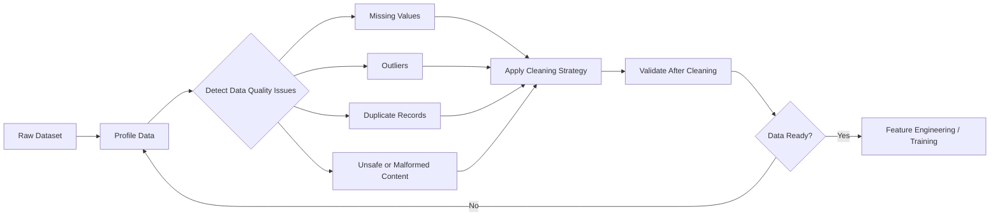

# Task 1.3: Data Preparation for ML and AI - Validate data quality and manage bias

## Skill 1.3.7: Clean data (for example, by detecting outliers, imputing missing data, deduplication)

---

## 1. Skill Overview

Cleaning data is the repair phase of data preparation. Before you can train a model, you need to detect and correct defects such as:

- Missing values
- Outliers
- Duplicate records
- Invalid values or inconsistent formats
- Unsafe or malformed content in generative AI datasets

Cleaning should be guided by profiling. You first measure how complete, valid, and unique the data is, then decide how to repair it. Cleaning choices are not neutral: filling missing values with the mean, dropping rows, removing outliers, or deleting duplicates can all change the distribution and affect model behavior.

---

## 2. Cleaning in the ML Data Preparation Workflow

Data cleaning usually follows a detect → clean → validate loop.

AWS services can help at each stage:

| Stage | AWS Tool Example |
| --- | --- |
| Profiling | AWS Glue DataBrew profile jobs, SageMaker Data Wrangler insights |
| Declarative data quality rules | AWS Glue Data Quality using DQDL |
| Interactive cleaning | AWS Glue DataBrew, Amazon SageMaker Data Wrangler |
| Content screening | Amazon Bedrock Guardrails, Amazon Comprehend |
| Monitoring cleaning jobs | Amazon CloudWatch |

---

## 3. Profile Before You Clean

You cannot choose a good repair strategy before you understand the defect.

A profile job can answer questions such as:

| Question | Example Finding |
| --- | --- |
| Which columns have missing values? | `customer_age` missing in 12% of rows |
| Which numeric columns have outliers? | `transaction_amount` has values above 3 IQR from Q3 |
| Are there duplicate rows? | 4% of records are exact duplicates |
| Are formats inconsistent? | Dates recorded as both `MM-DD-YYYY` and `DD/MM/YYYY` |
| Are categorical values invalid? | `country` contains `US`, `USA`, and `United States` |

AWS Glue DataBrew can generate a profile job that surfaces missing values, suspicious ranges, and inconsistent formats. SageMaker Data Wrangler also provides data quality insights for ML workflows.

---

## 4. Detecting Outliers

An outlier is a data point that lies far outside the expected range for a feature. Outliers can be legitimate extreme values, measurement errors, data entry errors, or rare events such as fraud or equipment failure.

### 4.1 Common Outlier Detection Methods

| Method | Formula / Approach | Best Used For |
| --- | --- | --- |
| Z-score | \(z = \frac{x - \mu}{\sigma}\); flag if \(|z| > 3\) | Normally distributed numeric columns |
| IQR rule | \(IQR = Q3 - Q1\); lower bound \(= Q1 - 1.5 \times IQR\); upper bound \(= Q3 + 1.5 \times IQR\) | Skewed numeric columns; robust to outliers |
| Domain rules | Example: age must be between 0 and 120, price cannot be negative | Validating against known business logic |
| Model/residual-based | Fit model and examine large residuals | Advanced diagnostics; not usually first step |

### 4.2 Handling Outliers

| Strategy | Description | When to Use | Risk |
| --- | --- | --- | --- |
| Remove row | Delete the entire record | Clear data entry error; very few outliers | Loses other useful fields; can remove rare events |
| Cap / winsorize | Replace extreme value with upper or lower bound | Continuous numeric feature with valid extreme values | Changes tail distribution |
| Transform | Apply log or box-cox to reduce skew | Feature is heavily skewed | Harder to interpret |
| Treat as missing, then impute | Mark invalid outliers as missing and impute | Outlier is known to be bad data | Adds imputation assumptions |
| Keep and flag | Add indicator column for extreme value | Outlier may be meaningful | Increases dimensionality |

**Important:** Outliers are not automatically bad. In fraud detection, rare large transactions may be the most important observations. Always combine statistical detection with domain judgment.

---

## 5. Imputing Missing Data

Missing values can occur because of survey non-response, sensor failure, join issues, or data pipeline errors. How you impute affects model bias and variance.

### 5.1 Common Imputation Strategies

| Strategy | Description | Works Well For | Cautions |
| --- | --- | --- | --- |
| Drop rows | Remove records containing missing values | Very few missing rows; very large dataset | Loses data; can bias if missingness is not random |
| Drop column | Remove the feature entirely | High percentage missing or low predictive value | May discard useful signal |
| Fill with mean | Replace numeric missing value with column mean | Numeric column with low skew; few outliers | Pulls distribution toward the center; lowers variance |
| Fill with median | Replace numeric missing value with column median | Numeric column with outliers | More robust than mean; still changes covariance |
| Fill with mode / constant | Replace categorical or numeric value with most common value or fixed constant | Categorical data; known default | Can overrepresent majority class; hide rare category |
| Forward/backward fill | Carry last known value forward or next value backward | Time series data | Assumes continuity; breaks with large gaps |
| Model-based imputation | Predict missing values using other features; KNN, MICE, etc. | Complex missing patterns | More compute; less interpretable |
| Add missing-value indicator | Create binary column indicating whether value was missing | Missingness itself may be informative | Adds dimensionality |

### 5.2 Example Trade-Off

A numeric feature `customer_income` is missing in 8% of rows.

- **Mean imputation** keeps all rows but makes the distribution more concentrated around the average.
- **Dropping those rows** preserves the observed distribution but removes all other information from those customers.
- **Median imputation** keeps rows and reduces sensitivity to extreme incomes.
- **Model-based imputation** may preserve relationships between features but is more complex.

The correct choice depends on why the data is missing and how much data you can afford to lose.

---

## 6. Deduplicating Data

Duplicate data can occur because of retries, repeated ingestion, join fan-out, or multiple systems reporting the same event.

### 6.1 Exact vs. Near Duplicates

| Type | Definition | Example |
| --- | --- | --- |
| Exact duplicate | Identical values across all relevant columns | Same row ingested twice |
| Near duplicate | Same real-world record, but slight formatting or timestamp differences | `John Smith, 123 Main St` vs. `John Smith, 123 Main St.` |

### 6.2 Why Deduplication Matters for ML

- Duplicates inflate the influence of the repeated pattern.
- Duplicate records split across training and validation can cause data leakage.
- Evaluation metrics can appear artificially strong because the model sees copies of the same record.
- If duplicates come from one class or group, they can deepen imbalance or representation bias.

### 6.3 Deduplication Approach

1. Identify a natural key: `transaction_id`, `customer_id`, `order_id`, or a combination of columns.
2. Decide which record to keep when near-duplicates exist: latest timestamp, highest-quality source, or canonical form.
3. Profile after deduplication to confirm the duplicate count is zero or within accepted tolerance.
4. Use tools such as AWS Glue DataBrew or SageMaker Data Wrangler to remove duplicates interactively.
5. Use AWS Glue Data Quality rules to validate uniqueness after cleaning.

Example: an e-commerce dataset has multiple rows for the same `order_id` because of retry events. For a model predicting delivery delay, deduplicate on `order_id` and keep the final status rather than treating each retry as an independent order.

---

## 7. AWS Services for Data Cleaning

| AWS Service | Primary Cleaning Use |
| --- | --- |
| AWS Glue DataBrew | Visual profiling and cleaning recipes; fill missing values, remove duplicates, encode values, filter rows, handle outliers |
| Amazon SageMaker Data Wrangler | Interactive ML-focused cleaning; impute, deduplicate, transform outliers, and export cleaned data to SageMaker |
| AWS Glue Data Quality | Declarative validation using DQDL; monitor completeness, uniqueness, range, duplicate counts after cleaning |
| Amazon Comprehend | Detect PII and sensitive entities in text data before training |
| Amazon Bedrock Guardrails | Filter unsafe or denied content from prompts and responses in generative AI data |
| Amazon CloudWatch | Track cleaning job metrics, failures, and validation results |

---

## 8. Cleaning Generative AI and Unstructured Data

For prompt-response or instruction-tuning datasets, cleaning also includes structural and safety checks.

| Check | Purpose |
| --- | --- |
| Remove duplicate prompt-response pairs | Prevent overfitting to repeated examples |
| Remove malformed examples | A response must answer its prompt; missing fields must be fixed |
| Screen for unsafe content | Remove toxic, harmful, or sensitive data before training |
| Redact PII | Use Amazon Comprehend or AWS Glue DataBrew to detect and mask PII |
| Standardize format | Ensure consistent instruction/response structure, tokenization, and whitespace |

---

## 9. Scenario-Based Exam Examples

### Question 1

A company is preparing a customer financial dataset for a supervised ML model. Profiling shows that `average_monthly_spend` is missing in 20% of rows and contains many extreme outliers. The team wants to keep as many rows as possible and avoid making the distribution artificially narrow.

Which cleaning approach is most appropriate?

- **A.** Drop all rows where `average_monthly_spend` is missing, then remove all outliers.
- **B.** Fill missing values with the column mean and leave outliers unchanged.
- **C.** Fill missing values with the column median and cap extreme outliers at the IQR boundaries.
- **D.** Fill missing values with zero and apply min-max scaling.

??? success "Answer & Explanation"

    **Correct Answer:** C. Fill missing values with the column median and cap extreme outliers at the IQR boundaries.

    **Explanation:**  
    Median imputation is more robust than mean imputation when outliers are present. Capping extreme values reduces the influence of outliers while preserving the rows. Dropping rows loses 20% of the data and may bias the dataset. Filling with zero would corrupt the financial feature.

---

### Question 2

An online marketplace dataset contains duplicate records for the same `order_id` because multiple services retried ingestion. A data scientist is building a model to predict late deliveries. The model should treat each real order as one example.

What is the first cleaning step?

- **A.** Shuffle the dataset randomly.
- **B.** Impute missing `order_id` values with the most common value.
- **C.** Deduplicate on `order_id` and retain the canonical or latest record for each order.
- **D.** Increase the model batch size.

??? success "Answer & Explanation"

    **Correct Answer:** C. Deduplicate on `order_id` and retain the canonical or latest record for each order.

    **Explanation:**  
    Duplicate `order_id` values mean the same real-world event is represented multiple times. This inflates the influence of duplicated orders and can leak copies into training and validation splits. Shuffling only changes row order; imputing an ID is inappropriate.

---

### Question 3

A data engineer wants to interactively clean a dataset before training a model in Amazon SageMaker. The engineer needs to fill missing values, identify outliers visually, remove duplicates, and export the cleaned data to a SageMaker training job.

Which AWS service is most appropriate?

- **A.** AWS Glue Data Quality
- **B.** Amazon SageMaker Data Wrangler
- **C.** Amazon Bedrock Guardrails
- **D.** Amazon CloudWatch

??? success "Answer & Explanation"

    **Correct Answer:** B. Amazon SageMaker Data Wrangler.

    **Explanation:**  
    SageMaker Data Wrangler provides interactive cleaning and feature engineering for ML workflows. AWS Glue Data Quality validates data using rules but is not primarily an interactive cleaning tool. Amazon Bedrock Guardrails screens generative AI content. Amazon CloudWatch monitors metrics but does not clean data.

---

## 10. Exam Tips and Traps

- **Profile before cleaning.** The exam often expects you to choose profiling or validation first, not immediately drop rows or impute.
- **Mean imputation narrows the distribution.** It makes the data look more certain than it is. Median imputation is preferred when outliers are present.
- **Dropping rows preserves the original distribution but can bias the dataset** if missingness is related to a group or outcome.
- **Shuffling only changes order.** It does not fix missing values, duplicate records, class imbalance, or underrepresentation.
- **Deduplicate before splitting.** If duplicates remain, the same record may appear in both training and test sets, causing leakage.
- **Do not assume all outliers are errors.** In anomaly detection, fraud detection, or predictive maintenance, outliers may be the most important class.
- **DataBrew vs. Data Wrangler.** Choose DataBrew when the workflow is more general or Glue-centric. Choose SageMaker Data Wrangler when the workflow is directly part of SageMaker ML preparation.
- **AWS Glue Data Quality validates; it does not replace cleaning.** Use it after cleaning to assert rules such as completeness, uniqueness, and range constraints.
- **Near-duplicates are a common ambiguous case.** A small difference in punctuation, spacing, or timestamp can represent the same real-world record. Define a business rule for which record to keep.
- **Cleaning can affect bias.** For example, deleting duplicates from an overrepresented group can reduce distribution skew, but dropping rows with missing values can remove underrepresented groups.

---

## 11. Quick Reference Summary

| Cleaning Task | Common Methods | AWS Tool Example |
| --- | --- | --- |
| Detect outliers | Z-score, IQR, domain rules | AWS Glue DataBrew profile, SageMaker Data Wrangler |
| Handle outliers | Remove, cap, transform, flag | AWS Glue DataBrew recipes, SageMaker Data Wrangler transforms |
| Impute missing values | Drop, mean, median, mode, forward/backfill, model-based | SageMaker Data Wrangler, AWS Glue DataBrew |
| Remove duplicates | Exact matching, natural key, fuzzy matching | AWS Glue DataBrew, SageMaker Data Wrangler |
| Validate cleaned data | DQDL completeness, uniqueness, range rules | AWS Glue Data Quality |
| Screen generative AI content | Content filters, denied topics, PII redaction | Amazon Bedrock Guardrails, Amazon Comprehend |

---

## 12. Key Takeaway

Data cleaning is not just a technical pass over the data. Every cleaning action—imputing a missing value, capping an outlier, or deleting a duplicate—changes the distribution the model will learn. The safest approach is to profile first, choose the least harmful strategy that aligns with the business problem, and validate the cleaned dataset before training.