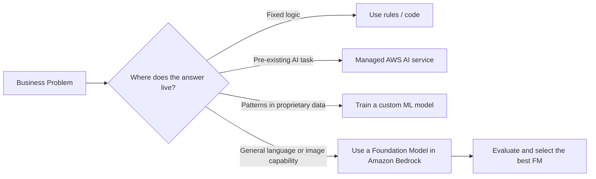
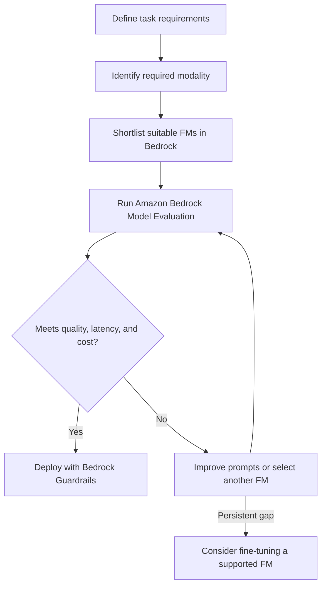

# Task 2.1: ML Model and Foundation Model (FM) Development - Choose Appropriate Modeling Approaches for ML and AI Solutions

## Skill 2.1.1: Evaluate and Select Appropriate FMs from Amazon Bedrock Based on Task Requirements and Performance Criteria

### 1. Purpose of This Skill

This skill tests whether you can move beyond vendor names and model popularity to make an **evidence-based** foundation model selection in Amazon Bedrock. The selection must account for:

- Task type and modality
- Output quality and domain fit
- Context window requirements
- Response latency
- Cost per request
- Customization and fine-tuning support
- Responsible AI, safety, and guardrails
- Retrieval-Augmented Generation readiness

Amazon Bedrock provides a single API to access multiple foundation models. That makes model switching possible, but only if you evaluate models against the actual workload rather than assuming one model fits every problem.

---

### 2. Where FMs Fit in the Modeling Decision

Not every problem needs a foundation model. The decision depends on where the underlying capability lives.

| Problem Profile | Recommended Approach | Example AWS Tool |
| --- | --- | --- |
| Fixed deterministic logic | Simple rule/code | No ML needed |
| Solved AI task such as OCR, object detection, speech transcription | Managed AI service | Textract, Rekognition, Transcribe |
| Proprietary tabular patterns, forecasting, churn prediction | Custom supervised ML | SageMaker AI built-in algorithms |
| General text generation, summarization, image generation, RAG | Foundation model | Amazon Bedrock |

---

### 3. Amazon Bedrock FM Categories

Amazon Bedrock exposes several model families across different modalities.

| Modality | Representative FM Families | Typical Use Cases |
| --- | --- | --- |
| Text generation and chat | Anthropic Claude, Meta Llama, Mistral, Cohere Command, Amazon Titan Text, AI21 Jurassic | Q&A, summarization, chat, code generation, translation |
| Embeddings | Amazon Titan Embeddings, Cohere Embed | Semantic search, RAG, document retrieval |
| Image generation | Stability AI Stable Diffusion XL, Amazon Titan Image Generator | Marketing assets, product imagery, design prototypes |

#### Model Family Strengths

| Model Family | Strength Profile | Best Fit |
| --- | --- | --- |
| **Anthropic Claude** | Strong long-document reasoning, large context windows, safety-focused | Legal/contract analysis, long reports, complex RAG |
| **Meta Llama** | Open-weight, flexible, strong fine-tuning capability, often cost-efficient | High-volume text work, custom fine-tuned assistants |
| **Mistral** | Excellent performance-to-size ratio, lower latency, multilingual and coding strength | Real-time chat, cost-sensitive workloads |
| **Cohere Command** | Enterprise RAG-oriented, multilingual | Internal enterprise search, multilingual Q&A |
| **Amazon Titan Text** | AWS-owned general purpose, easy to use, supports fine-tuning | Simple summarization, moderate Q&A, internal workflows |
| **Amazon Titan Embeddings** | Retrieval-optimized, cost-effective, supports RAG workloads | Knowledge bases, semantic search |
| **Cohere Embed** | Multilingual and retrieval-optimized | Multilingual RAG and semantic search |
| **Stability AI SDXL** | High-quality photorealistic and stylistic image generation | Creative marketing imagery |
| **Amazon Titan Image Generator** | Enterprise image generation with responsible AI controls | Product imagery, brand-safe image creation |

---

### 4. Selection Criteria

Use these criteria to compare FMs. They are evaluated together, not in isolation.

| Criterion | Question to Ask |
| --- | --- |
| **Modality** | Does the task need text generation, embeddings, or images? |
| **Quality/Accuracy** | Does the model meet domain-specific accuracy and factual reliability? |
| **Context Window** | Does the task require processing very long documents? |
| **Latency** | Is the use case interactive, real-time, or asynchronous batch? |
| **Cost** | What is the acceptable cost per 1,000 tokens or per request? |
| **Customization** | Will fine-tuning be required? Does the FM support fine-tuning? |
| **Language Support** | Which languages must the model understand or generate? |
| **Safety/Guardrails** | Are toxicity, PII removal, or prompt-injection defenses required? |
| **Availability** | Is the model accessible in the AWS region being used? |

#### Latency and Cost Considerations

| Deployment Mode | Use When | Trade-off |
| --- | --- | --- |
| **On-Demand** | Variable traffic, pay-as-you-go | Lower baseline cost, less predictable p99 latency |
| **Provisioned Throughput** | Strict latency SLAs, high volume | Predictable performance, higher reserved cost |

Provisioned throughput can improve latency consistency, but it does **not** reduce token-level cost. Choosing a smaller efficient model may be better for low-latency, low-cost workloads.

---

### 5. Evaluation Process

Do not select an FM based only on public benchmarks. Evaluate candidates against your own task and dataset.

#### Amazon Bedrock Model Evaluation

| Evaluation Type | Description |
| --- | --- |
| **Automatic Evaluation** | Amazon Bedrock evaluates models using predefined metrics such as semantic robustness, toxicity, factual knowledge, accuracy, or custom metrics from a labelled dataset |
| **Human Evaluation** | Internal reviewers or an AWS-managed evaluation team compare outputs on relevance, tone, style, and correctness |

For RAG systems, evaluate two layers:

1. **Retrieval quality** – Were the correct passages retrieved?
2. **Generation quality** – Did the model produce an accurate answer from the retrieved context?

A plausible answer that cites the wrong source is primarily a retrieval or evaluation problem, not necessarily a better generator problem.

---

### 6. Task-to-FM Mapping Examples

| Task | Recommended FM Family | Reason |
| --- | --- | --- |
| Summarizing 150-page legal contracts | Anthropic Claude | Large context window, strong reasoning, low hallucination tendency |
| Real-time customer chat with low cost and low latency | Mistral or Meta Llama | Efficient, strong price-performance balance |
| Product image generation from text descriptions | Stability AI SDXL or Amazon Titan Image Generator | Text-to-image modality |
| Retrieval over multilingual company documents | Cohere Embed or Amazon Titan Embeddings | Retrieval-optimized embeddings |
| Internal policy Q&A with citations | Amazon Bedrock Knowledge Bases + embedding model + Claude or Llama | RAG provides updated citations; generator answers from retrieved text |
| Simple meeting-note summarization | Amazon Titan Text or Mistral | General-purpose summarization with lower cost |

---

### 7. Scenario-Based Exam Examples

#### Scenario 1: Legal Document Q&A

**Problem:**  
A legal team wants an assistant that can answer questions about 100-page contracts and cite the exact clause used.

**Requirements:**  
- Long-document understanding
- High factual accuracy
- Source citations
- Documents change monthly

**Correct approach:**  
Use **Amazon Bedrock Knowledge Bases** for retrieval from current documents. Select **Anthropic Claude** for generation because of its strong long-context reasoning. Use an embedding model such as **Amazon Titan Embeddings** or **Cohere Embed**. Do **not** fine-tune; RAG reflects updates without retraining.

**Why not fine-tuning?**  
Documents change monthly. Fine-tuning would require retraining each time and would not provide clean source citations.

---

#### Scenario 2: High-Volume Brand-Tone Rewriting

**Problem:**  
An e-commerce company wants to rewrite product descriptions into on-brand marketing copy in five languages.

**Requirements:**  
- Multilingual
- Consistent brand tone
- High request volume
- Predictable cost

**Correct approach:**  
Select a multilingual text FM such as **Cohere Command** or **Meta Llama**. Use prompt engineering with brand examples first. If tone remains inconsistent after strong prompting, fine-tune a model that supports customization.

**Trap to avoid:**  
Do not immediately fine-tune. Prompt engineering with a few brand examples is faster and easier to update.

---

#### Scenario 3: Marketing Image Generation

**Problem:**  
A marketing team wants to create lifestyle product images from text prompts.

**Requirements:**  
- Text-to-image generation
- Brand-safe output
- High-quality visuals

**Correct approach:**  
Compare **Stability AI Stable Diffusion XL** and **Amazon Titan Image Generator** using human evaluation. Select the model that best matches the brand style while meeting safety and responsible AI requirements.

---

#### Scenario 4: RAG for Internal Knowledge Base

**Problem:**  
A support team needs answers from an internal policy library that changes frequently.

**Requirements:**  
- Fresh information
- Source citations
- Low hallucination

**Correct approach:**  
Use **Amazon Bedrock Knowledge Bases** with:

1. A retrieval-optimized embedding model
2. A strong text generation FM such as **Claude** for accurate answer synthesis
3. Guardrails to filter PII or off-topic answers

This is a better fit than fine-tuning because policy edits are visible almost immediately after re-ingestion.

---

#### Scenario 5: Selecting Between Two Candidate Models

**Problem:**  
A team has built a support chatbot and cannot decide between two FMs. The team has 200 labelled support conversations.

**Correct approach:**  
Use **Amazon Bedrock Model Evaluation**. Run automatic evaluation on accuracy, robustness, and toxicity using the labelled dataset. If needed, use human evaluation for tone and style. Select the FM with the best overall performance on the company's own data.

---

### 8. Exam Tips

| Tip | Explanation |
| --- | --- |
| **Prompt first, fine-tune later** | Few-shot prompting often fixes terminology and style without training overhead |
| **Use RAG for frequently changing content** | Retrieval reflects updates immediately; fine-tuned weights go stale |
| **Choose the FM by modality** | Text generation, embeddings, and image generation require different models |
| **Evaluate on your own data** | Public benchmarks are not enough; use Amazon Bedrock Model Evaluation |
| **Include retrieval quality in RAG** | Good generation cannot fix bad retrieval |
| **Match context window to document length** | Long legal or technical documents require FMs with large context windows |
| **Consider cost and latency together** | A bigger model may be more accurate but can breach latency and cost budgets |
| **Use Guardrails after selection** | Bedrock Guardrails can help with PII masking, toxicity, and prompt-injection defense |
| **Model availability matters** | A model may not be accessible in every AWS region |

---

### 9. Common Traps

| Trap | Correct Reasoning |
| --- | --- |
| Selecting the largest FM by default | Larger models are not always needed and increase cost and latency |
| Using an embedding model to generate final text | Embeddings create vectors for retrieval; they do not generate answers |
| Fine-tuning for terminology before trying prompts | Prompt engineering should usually be attempted first |
| Using an FM for tabular forecasting | FMs are not designed for structured time-series forecasting |
| Choosing an image generator for a text Q&A task | Modality must match the task |
| Assuming fine-tuning fixes changing policy content | RAG is better when content changes often |
| Believing provisioned throughput lowers token cost | It improves latency predictability but adds reserved capacity cost |
| Ignoring AWS-managed AI services | For OCR use Textract; for image recognition use Rekognition; do not build or prompt an FM for solved tasks |

---

### 10. Quick Recall

- **Text tasks** → Compare text FMs such as Claude, Llama, Mistral, Cohere, Titan Text.
- **Image tasks** → Compare Stability AI SDXL and Amazon Titan Image Generator.
- **Retrieval tasks** → Compare Amazon Titan Embeddings and Cohere Embed.
- **Customization** → Prompt first; fine-tune only when evaluation shows a persistent gap.
- **Dynamic content** → Use RAG, not fine-tuning.
- **Model choice evidence** → Use Amazon Bedrock Model Evaluation with your own data.