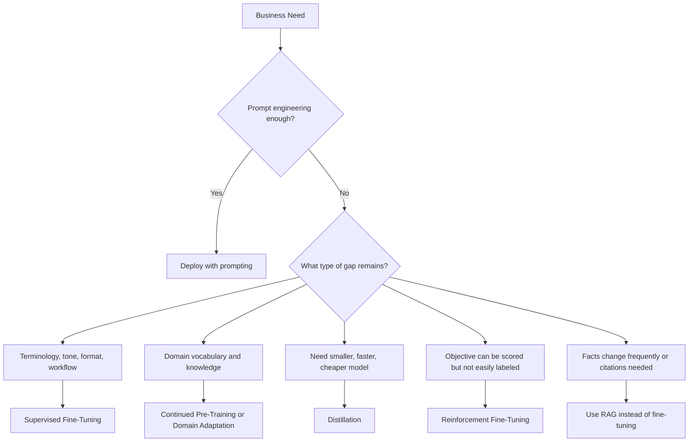
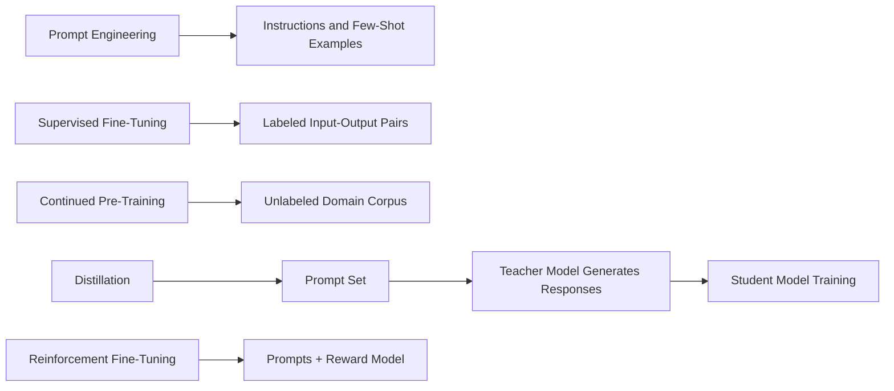

# Task 2.1: ML Model and Foundation Model (FM) Development - Choose appropriate modeling approaches for ML and AI solutions.

## Skill 2.1.2: Identify fine-tuning strategies for pre-trained FMs to meet business needs.

---

## 1. Core Concept

A pre-trained foundation model (FM) already carries broad language understanding, reasoning, and generation capability. **Fine-tuning** is the process of continuing to train that pre-trained model on a smaller, task-specific dataset so its weights adapt to the vocabulary, style, output structure, or behavior a business requires.

Important mental model for the exam:

> **Prompt first. Fine-tune only when prompting cannot close the gap.**

Fine-tuning is not the default. It is a deliberate decision that introduces data preparation, training cost, compute management, and model versioning overhead.

---

## 2. When Fine-Tuning Is Appropriate

Fine-tuning becomes appropriate when:

| Situation | Why Fine-Tuning Helps |
|---|---|
| Prompt instructions and few-shot examples still fail to produce consistent internal terminology | The model weights must adapt to the organization's language. |
| The model must follow a strict output format, tone, or compliance wording | Supervised examples can teach consistent structure and phrasing. |
| A smaller, cheaper, or lower-latency model must match the behavior of a larger model | Distillation transfers the large model's behavior into the smaller model. |
| The organization has a difficult-to-define objective that can be scored rather than labeled | Reinforcement fine-tuning can optimize against a reward function. |
| The model needs deep understanding of a specialized unlabeled domain corpus | Continued pre-training can adapt the model to legal, medical, scientific, or industry language. |

Fine-tuning is **not** the right tool when:

| Situation | Better Approach |
|---|---|
| The knowledge changes frequently | Retrieval Augmented Generation (RAG) with Amazon Bedrock Knowledge Bases |
| The model only needs better prompts or a few examples | Prompt engineering |
| The task is already solved by a managed AWS AI service | Amazon Textract, Transcribe, Comprehend, Rekognition |
| The business logic is fixed | Simple rules or code |
| The solution must provide source citations | RAG, not model weight customization |
| The main goal is to eliminate hallucinations | RAG and guardrails, not fine-tuning alone |

---

## 3. Fine-Tuning Strategies for Foundation Models

### 3.1 Supervised Fine-Tuning (SFT)

Supervised fine-tuning is the most common customization path.

You provide **labeled prompt-response pairs**. Each example contains:

- A prompt or input
- The expected target completion

For an insurance chatbot, the expected completion might include:

- Internal terminology
- Compliance disclaimers
- A required step-by-step explanation

SFT is the right choice when the gap is:

- Consistent output formatting
- Use of approved terminology
- Tone and style matching
- Following a specific internal process in responses

**What SFT requires:**

- Curated training dataset
- Clear, consistent, high-quality examples
- Evaluation after training
- Model version management
- Provisioned inference capacity for custom models

**AWS connection:**

- Amazon Bedrock model customization supports supervised fine-tuning.
- Amazon SageMaker JumpStart also supports fine-tuning foundation models.
- The custom model is then called through Amazon Bedrock using provisioned throughput.

---

### 3.2 Continued Pre-Training / Domain Adaptation

Continued pre-training adapts a foundation model to a new domain by training on:

- Large amounts of unlabeled domain-specific text
- Internal documents
- Industry publications
- Regulatory filings
- Scientific literature

This is **not** about teaching a specific instruction-response pattern. It is about teaching the model the vocabulary, facts, and relationships inside a domain.

| SFT | Continued Pre-Training |
|---|---|
| Labeled prompt-completion examples | Unlabeled domain corpus |
| Teaches how to respond | Teaches domain knowledge and vocabulary |
| Good for tone, format, workflow | Good for legal, medical, scientific domain adaptation |
| Usually smaller, curated dataset | Usually larger corpus |

**Example:**  
A healthcare organization wants a model that understands clinical abbreviations and treatment paths. They have millions of unlabeled clinical notes. Continued pre-training can adapt the model to that language before any instruction fine-tuning is applied.

---

### 3.3 Distillation

Distillation transfers the behavior of a larger, more capable teacher model into a smaller, cheaper, and faster student model.

Instead of requiring thousands of hand-labeled examples, distillation uses a set of prompts as the preparation data. The managed process asks the teacher model to generate responses from those prompts. The student model then learns from those teacher-generated responses.

**Why use distillation?**

- Lower inference latency
- Reduced cost per token
- Smaller deployment footprint
- Faster response for real-time applications
- Deployable on constrained infrastructure

**What distillation requires:**

- A set of prompts that represent the task distribution
- A teacher model
- Training to produce a student model
- Evaluation against the teacher model

**Example:**  
A customer service team uses a very large FM for high-quality support responses. A mobile application needs similar behavior but requires sub-second latency and lower cost. The team distills the large model into a smaller model.

---

### 3.4 Reinforcement Fine-Tuning / Reinforcement Learning from Human Feedback (RLHF)

Reinforcement fine-tuning optimizes a model against a **reward function** or **reward model** instead of fixed labeled responses.

This is useful when the desired behavior is hard to express as a single correct answer but can be scored.

Examples of reward signals:

- User engagement
- Click-through rate
- Customer satisfaction scores
- Safety or helpfulness ratings
- Preference rankings

The system generates responses, evaluates them using the reward model, and updates the model to produce higher-scoring behavior.

**What reinforcement fine-tuning requires:**

- A reward model or scoring function
- A set of prompts or interaction data
- A policy optimization process
- Careful guardrails to prevent reward hacking

**Example:**  
A marketing copy generator is optimized to produce product descriptions that increase the likelihood of a user clicking "Save for Later." The objective is not one right answer but a measurable outcome.

---

### 3.5 Parameter-Efficient Fine-Tuning (PEFT)

PEFT methods, such as adapters or LoRA, update only a small number of model parameters while keeping most of the base model frozen.

This reduces:

- Training memory
- Compute cost
- Risk of catastrophic forgetting

PEFT is useful when working with very large models in a self-managed environment.

**Note:** For the MLA-C02 exam, the main distinction is usually between supervised fine-tuning, continued pre-training, distillation, and reinforcement fine-tuning rather than implementation details of PEFT.

---

## 4. Choosing the Right Fine-Tuning Strategy

---

## 5. Scenario-Based Examples

### Scenario 1: Internal Policy Language

**Situation:**  
A bank uses an FM through Amazon Bedrock to draft customer responses. The compliance team requires exact phrases such as "subject to final credit approval" and "not a commitment to lend." Prompt instructions reduce some errors, but the model still paraphrases the required language inconsistently.

**Question:**  
Which customization strategy should be used?

**Answer:**  
Supervised fine-tuning on labeled prompt-response pairs that demonstrate the exact required wording.

**Reasoning:**  
The gap is not missing domain knowledge. The gap is consistent output style, terminology, and compliance phrasing. SFT teaches those expectations directly.

---

### Scenario 2: Mobile Latency and Cost

**Situation:**  
A travel company uses a large FM for itinerary recommendations. The web experience works well. A mobile app needs similar recommendations, but latency must stay under 150 milliseconds, and cost must drop significantly.

**Question:**  
Which fine-tuning approach fits best?

**Answer:**  
Distillation of the large teacher model into a smaller student model.

**Reasoning:**  
Distillation transfers behavior from the large model to a smaller model, reducing latency and cost while maintaining output quality close to the teacher.

---

### Scenario 3: Engagement Optimization

**Situation:**  
A streaming platform wants its recommendation explanations to maximize the likelihood that users add a title to their watchlist. There is no single correct explanation, but user actions can be scored.

**Question:**  
Which strategy is most appropriate?

**Answer:**  
Reinforcement fine-tuning using a reward function or reward model trained on user engagement.

**Reasoning:**  
The objective is a scored outcome rather than a fixed target response. Reinforcement fine-tuning optimizes against the reward signal.

---

### Scenario 4: Rapidly Changing Product Policies

**Situation:**  
A support bot must answer questions about return policies. The policies change weekly. The team wants the bot to always use the newest policy and cite the source document.

**Question:**  
Should the team fine-tune the model?

**Answer:**  
No. Use Retrieval Augmented Generation with Amazon Bedrock Knowledge Bases.

**Reasoning:**  
Fine-tuning writes knowledge into model weights. When policy changes, another training job is required, and exact source citations are difficult. RAG retrieves the current policy at request time and supports citations.

---

## 6. Key Comparisons

| Strategy | Input Prepared | Taught Behavior | Main Benefit | Main Risk |
|---|---:|---|---|---|
| Supervised Fine-Tuning | Labeled prompt-response pairs | Consistent terminology, tone, format, workflows | Precise behavior alignment | Catastrophic forgetting if trained too narrowly |
| Continued Pre-Training | Unlabeled domain corpus | Domain vocabulary and knowledge | Improved domain understanding | Expensive and slower |
| Distillation | Prompt set; teacher generates responses | Large-model behavior in smaller model | Lower latency and cost | Some quality loss |
| Reinforcement Fine-Tuning | Prompts plus reward model or scoring function | Behavior optimized to an objective | Optimizes hard-to-define goals | Reward hacking if not constrained |
| Prompt Engineering | Instructions and few-shot examples | In-context behavior without weight updates | Immediate, zero training cost | Context window use; may not generalize consistently |

---

## 7. Fine-Tuning Data and Preparation

For the exam, connect the customization path to the data it consumes:

---

## 8. Exam Tips and Traps

**Tip:** Fine-tuning is the second step after prompt engineering. If a question asks for the next step after prompting fails, supervised fine-tuning is often the correct answer.

**Trap:** Do not choose RAG or larger context windows for a problem that requires consistent terminology or style. RAG adds facts but does not teach style.

**Trap:** Do not choose fine-tuning for frequently changing content. Fine-tuning is slow and requires retraining when content changes.

**Trap:** Distillation does not require hand-labeled input-output pairs. It usually starts with prompts, and the teacher model generates the target responses.

**Trap:** "Reinforcement fine-tuning" means reward-based optimization, not supervised labeled examples.

**Trap:** Choosing a larger foundation model is not a fine-tuning strategy. Larger models may increase quality, but they also increase latency and cost.

**Tip:** Think about where the knowledge lives:

- Knowledge in model weights → fine-tuning
- Knowledge in external documents → RAG
- Knowledge in fixed rules → simple code
- Knowledge in a managed AWS service → API call

**Trap:** Catastrophic forgetting is a risk when fine-tuning is performed on a narrow dataset. The model may lose general ability. Blending broad data or using parameter-efficient methods helps reduce this risk.

**Tip:** Custom fine-tuned models in Amazon Bedrock require provisioned throughput and create ongoing costs. This is an important tradeoff compared with prompt engineering.

---

## 9. Rapid Recall Checklist

- **Name the three fine-tuning strategies from the exam perspective:**
  1. Supervised fine-tuning from labeled examples
  2. Reinforcement fine-tuning from reward functions
  3. Distillation from a larger teacher model

- **What data does each strategy require?**
  - SFT: labeled input-output pairs
  - Distillation: prompt set; teacher responses generated from prompts
  - Reinforcement: prompts plus reward model or scoring function

- **When should fine-tuning be avoided?**
  - When prompts can solve the gap
  - When content changes frequently
  - When citations are required
  - When the task is already available as a managed AWS AI service

- **What is the standard progression?**
  - Prompt engineering → evaluation → supervised fine-tuning if gap persists → RAG if the issue is knowledge freshness

---

## 10. Summary Statement

Identify fine-tuning strategies by understanding what gap remains after prompt engineering. Use supervised fine-tuning for style, terminology, and output structure. Use continued pre-training for domain adaptation. Use distillation for smaller, faster, cheaper models. Use reinforcement fine-tuning when the goal is a scored objective. Always compare fine-tuning with prompt engineering, RAG, managed AI services, and simple rules to ensure the modeling approach actually fits the business need.