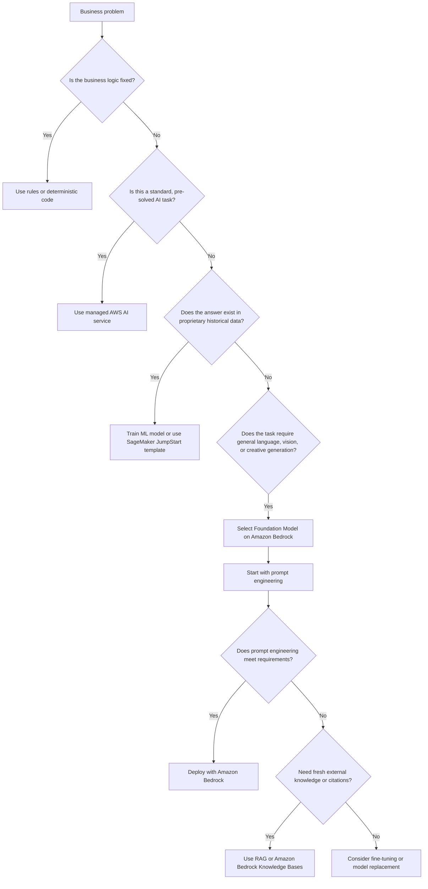
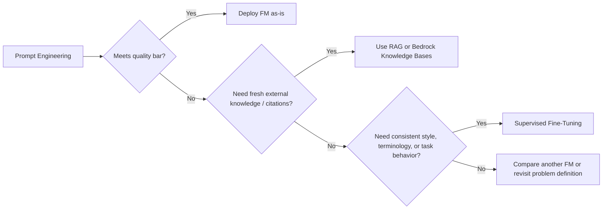

# Task 2.1: ML Model and Foundation Model (FM) Development - Choose appropriate modeling approaches for ML and AI solutions

## Skill 2.1.3: Compare and select appropriate ML models, generative AI (GenAI) models, algorithms, and solution templates to meet business needs (for example, interpretability, domain-specific performance, latency)

This skill is about making modeling decisions based on business requirements rather than model popularity. The correct choice depends on where the required capability lives: in fixed rules, in a managed AI service, in your organization’s proprietary data, or in a pre-trained foundation model.

---

## 1. Core Decision Framework

Use the following decision flow before choosing any model or service.

The key exam concept: interpretability, latency, domain-specific performance, and cost are selection criteria, not afterthoughts.

---

## 2. Comparing Modeling Approaches

| Approach | Best When | AWS Implementation | Typical Constraints | Limitations |
| --- | --- | --- | --- | --- |
| Deterministic rules | Business logic is fixed and explainable | Plain application code | Low cost, low latency, fully auditable | Cannot learn patterns from complex data |
| Managed AI service | Task is already solved as a standard service | Amazon Textract, Rekognition, Comprehend, Transcribe | Lowest development effort, fast time to value | Limited to pre-trained service capabilities |
| Traditional ML | The prediction depends on organization-specific historical data | Amazon SageMaker AI built-in algorithms, SageMaker JumpStart | Interpretability, domain-specific performance, controlled cost | Requires labeled data, training, tuning, and operational overhead |
| Foundation Model / Generative AI | Task requires general language understanding, generation, summarization, or creative output | Amazon Bedrock | Fast deployment, broad general capability | Lower inherent interpretability; possible higher latency and per-request cost |
| Retrieved-Augmented Generation | Model must answer from fresh, frequently changing knowledge with citations | Amazon Bedrock Knowledge Bases + vector store | Freshness, source attribution, no fine-tuning | Adds retrieval latency and ingestion complexity |
| Fine-tuned FM | Prompt engineering is insufficient; model must consistently follow internal style, terminology, or domain behavior | Amazon Bedrock custom fine-tuning or SageMaker fine-tuning | Strong domain-specific performance | Training overhead, risk of catastrophic forgetting, versioning burden |

---

## 3. Selection Criteria Deep Dive

### 3.1 Interpretability

Interpretability is critical when a human must explain, justify, or audit a prediction.

| Interpretability Need | Preferred Approach |
| --- | --- |
| Finance, risk, healthcare, or regulatory use cases | Linear models, decision trees, XGBoost with feature importance, logistic regression |
| Explainable custom ML at scale | Amazon SageMaker Clarify for SHAP values, bias reports, partial dependence plots |
| Generative AI explanations | Prompted reasoning, retrieval citations, guardrails, source attribution |
| High-stakes automated decisions | Avoid black-box FMs unless combined with human review or strong grounding |

A simpler, interpretable model that business stakeholders trust usually beats a more complex model they reject.

### 3.2 Domain-Specific Performance

Domain-specific performance means the model must perform well on the organization’s unique language, data, images, or processes.

| Scenario | Recommended Approach |
| --- | --- |
| Proprietary tabular data with historical labels | Train supervised ML using Amazon SageMaker AI |
| General task with unique company terminology or format | Prompt engineering first, fine-tune if evaluation shows persistent gap |
| Internal document Q&A requiring current policy or source citations | RAG with Amazon Bedrock Knowledge Bases |
| Standard document extraction or transcription | Managed AWS AI service such as Textract or Transcribe |

For FMs, do not assume fine-tuning is required just because the domain sounds specialized. Prompt engineering with clear instructions and few-shot examples often fixes terminology and formatting gaps immediately. Fine-tune only when evaluations prove prompting cannot close the gap.

### 3.3 Latency and Throughput

Latency requirements often determine whether you need a smaller model, a managed service, or batch inference.

| Latency Need | Consider |
| --- | --- |
| Real-time, synchronous user interaction | Smaller model, optimized endpoint, managed service, or lower-latency FM |
| Near real-time document or image analysis | Amazon Textract, Rekognition, or a lightweight custom endpoint |
| Batch or scheduled inference | Amazon SageMaker Batch Transform or larger FMs with batch processing |
| Strict response SLAs | Avoid oversized FMs solely for marginal quality gain |

For FMs, compare model latency, cost per request, and output quality together. A larger model may improve quality but can violate latency or budget requirements.

### 3.4 Cost and Engineering Effort

| Option | Engineering Effort | Operational Cost |
| --- | --- | --- |
| Rules/code | Low | Low |
| Managed AWS AI service | Lowest | Pay per API call |
| Foundation Model via Bedrock | Low to moderate | Pay per token/image |
| RAG architecture | Moderate | Ingestion, embedding, vector store, and inference |
| Custom ML training | High | Training jobs, model hosting, monitoring, retraining |
| Fine-tuning FMs | High | Dataset preparation, training jobs, version management |

Managed services remove the most undifferentiated heavy lifting. Custom training is justified only when the organization has proprietary historical data and the task requires tailored behavior.

---

## 4. Selecting Traditional ML Models and Solution Templates

### 4.1 Common SageMaker AI Built-In Algorithm Choices

| Problem Type | Candidate Algorithm | Notes |
| --- | --- | --- |
| Tabular regression/classification | XGBoost, Linear Learner | XGBoost strong for structured data; Linear Learner more interpretable |
| Time-series forecasting | SageMaker DeepAR | Learned from many related time series |
| Anomaly detection | Random Cut Forest, IP Insights | Good for unsupervised anomaly detection |
| Clustering | K-Means | Useful for customer segmentation |
| Recommendation | Factorization Machines | Good for user-item interaction data |
| Image classification | SageMaker Image Classification | Transfer learning on custom image data |
| Text classification | SageMaker BlazingText | Useful for language classification and word vectors |

Use a built-in algorithm when it fits the task and you want to avoid custom scripting. Use a custom training script when the model architecture or loss function requires behavior not available in built-in algorithms.

### 4.2 SageMaker JumpStart Solution Templates

SageMaker JumpStart provides pre-trained models and solution templates for common use cases such as fraud detection, churn prediction, demand forecasting, credit scoring, and computer vision.

Use JumpStart when:

- You need a working baseline quickly.
- You want to start from an existing model instead of an empty notebook.
- You need a solution template that can be customized with your data.
- You want to evaluate a pre-trained FM without building the training pipeline.

---

## 5. Selecting Foundation Models on Amazon Bedrock

### 5.1 FM Evaluation Criteria

| Criterion | What to Evaluate |
| --- | --- |
| Output quality | Benchmark score, human evaluation, automated metrics |
| Latency | Response time for representative prompts |
| Cost | Price per 1,000 input/output tokens or per image |
| Context window | Maximum token length supported for long documents or conversations |
| Modality | Text, image, embedding, or multimodal support |
| Fine-tuning availability | Whether the model family supports customization |
| Responsible AI features | Guardrails, content filtering, safety |
| Domain fit | Model strengths in reasoning, summarization, code, conversational style, etc. |

Amazon Bedrock provides access to multiple foundation model families, including Amazon Titan, Anthropic Claude, Meta Llama, Cohere, Mistral AI, and Stability AI. Select a model family based on measured evaluation results, not brand preference.

### 5.2 Prompt First, Then Customize

- **Prompt engineering** changes behavior immediately with no training.
- **RAG** keeps knowledge outside the model and supports source citations and fresh updates.
- **Fine-tuning** writes behavior into model weights and requires prepared data, training, and versioning.

### 5.3 Comparing RAG and Fine-Tuning

| Factor | RAG | Fine-Tuning |
| --- | --- | --- |
| Knowledge location | External vector store | Model weights |
| Knowledge freshness | Immediate after re-ingestion | Requires new training job |
| Source citations | Strong, from retrieved passages | Weak or unavailable |
| Best for | Frequently changing documents, Q&A with citations | Consistent style, tone, terminology, specialized behavior |
| Training overhead | Lower; ingestion and embedding needed | Higher; labeled dataset and training job needed |
| Latency impact | Adds retrieval time and prompt size | Model-dependent inference latency |

RAG and fine-tuning can be combined when use cases require both fresh knowledge and specialized behavior.

---

## 6. Managed AWS AI Services for Solved Tasks

| Service | Use Case | Choose When |
| --- | --- | --- |
| Amazon Textract | Extract text, forms, tables, invoices, receipts from documents | Scanned PDFs, invoices, forms; avoid custom OCR |
| Amazon Rekognition | Detect objects, scenes, faces, text, unsafe content in images and video | Visual analysis without custom CV training |
| Amazon Comprehend | Detect entities, key phrases, sentiment, PII, topic modeling from text | Text insight tasks that do not need custom labels |
| Amazon Transcribe | Convert speech audio to text | Call transcripts, subtitles, voice analytics |
| Amazon Translate | Translate text between languages | Localization and multilingual support |
| Amazon Polly | Convert text to speech | Voice output and accessibility |

These services are pre-trained and fully managed. If a standard task fits one of them, using the service is usually the least-effort and fastest path.

---

## 7. Scenario-Based Examples

### Scenario 1: Invoice Data Extraction

A company needs to extract total amount, vendor name, and line items from thousands of scanned invoices with varying layouts. The team has no existing ML model.

**Best choice:** Use Amazon Textract AnalyzeExpense.

**Why:** This is a pre-solved document extraction task. Managed Textract avoids custom OCR training, labeling, and model hosting.

---

### Scenario 2: Weekly Store Demand Forecasting

A retail chain has years of store-level sales data. Finance leaders must be able to explain each weekly forecast.

**Best choice:** Train a supervised regression model using historical sales, seasonality, and promotional features in Amazon SageMaker AI. Prefer interpretable algorithms or provide model explainability with SageMaker Clarify.

**Why:** The answer is in the organization’s own historical data. Finance requires interpretability, so a transparent model matters more than a black-box model.

---

### Scenario 3: Summarizing Support Tickets with Internal Terminology

A support application must summarize long tickets using company-specific terminology. The rollout must be fast.

**Best choice:** Use a text generation FM on Amazon Bedrock with prompt engineering first. Include instructions and a few example summaries in the prompt.

**Why:** Summarization is a general language capability already present in an FM. Prompt engineering is the fastest path. Only consider fine-tuning if evaluations show persistent terminology failures.

---

### Scenario 4: Policy Q&A with Current Citations

A chatbot must answer employee questions from an internal policy library that is updated frequently. Every answer must cite the source document, and edits must be reflected within minutes.

**Best choice:** Use Retrieval-Augmented Generation with Amazon Bedrock Knowledge Bases.

**Why:** RAG retrieves up-to-date passages from a vector index at request time, provides source metadata for citations, and reflects policy edits quickly after re-ingestion without model retraining.

---

### Scenario 5: Real-Time Object Detection in Video Streams

A security application must detect known objects in live camera streams with low latency.

**Best choice:** Use Amazon Rekognition Video or a smaller optimized custom vision model if highly specific object categories are required.

**Why:** For standard objects and scenes, Rekognition removes custom CV overhead. For highly custom visual classes, a trained model on SageMaker may be necessary.

---

## 8. Exam Tips and Traps

### 8.1 Key Tips

- Start with the four-tier decision: rules, managed AI service, traditional ML, foundation model.
- Treat **interpretability**, **latency**, **domain-specific performance**, and **cost** as first-class selection criteria.
- Prefer a simpler interpretable model when stakeholders must trust and explain predictions.
- Use Amazon Bedrock Knowledge Bases for fresh document Q&A with citations.
- Use prompt engineering before fine-tuning for FMs.
- Use a managed AWS AI service when the task is standard and pre-trained.
- Use SageMaker JumpStart when you need a pre-built starting point or solution template.
- Compare FMs using measured quality, latency, and cost per request.

### 8.2 Common Traps

- **Trap:** Choosing an FM for precise numerical forecasting from large tabular historical data.  
  **Correction:** Train a supervised ML model or use a time-series forecasting approach.

- **Trap:** Fine-tuning an FM because prompt engineering was not tried first.  
  **Correction:** Prompt with instructions and few-shot examples, then evaluate before fine-tuning.

- **Trap:** Building a custom OCR, speech, or NLP model when Amazon Textract, Transcribe, or Comprehend already solves the task.  
  **Correction:** Use managed services for solved tasks.

- **Trap:** Choosing the largest FM solely for higher quality while ignoring latency and cost constraints.  
  **Correction:** Evaluate quality against cost and latency for the exact use case.

- **Trap:** Assuming RAG is unnecessary when documents change frequently.  
  **Correction:** RAG reflects re-ingested edits quickly; fine-tuning does not.

- **Trap:** Assuming domain-specific terminology always requires fine-tuning.  
  **Correction:** Prompt engineering often fixes terminology immediately.

- **Trap:** Treating model selection as an accuracy-only decision.  
  **Correction:** Interpretability, latency, operational overhead, and cost are equally important.

- **Trap:** Overlooking the danger of catastrophic forgetting when fine-tuning a domain-specific FM.  
  **Correction:** Consider blending broader data into the fine-tuning mixture and evaluate general capability after training.

---

## 9. Exam-Ready Summary

| Requirement Signal | Likely Correct Choice |
| --- | --- |
| Fixed logic, must be auditable | Rules or code |
| Standard document, speech, image, or text task | Managed AWS AI service |
| Proprietary historical data with prediction need | SageMaker AI custom ML or JumpStart template |
| General language, summarization, creative generation | Amazon Bedrock FM |
| Frequently changing documents with citations | Amazon Bedrock Knowledge Bases / RAG |
| Consistent internal terminology after prompting fails | Fine-tune FM |
| Strict real-time latency | Smaller model or managed service |
| High interpretability requirement | Linear/tree-based model or explainability tooling |

The strongest exam mindset is to ask: **Where does the answer live?** If the answer is in fixed logic, use rules. If the answer is in a standard task, use a managed service. If the answer is in proprietary data, train a model. If the capability already exists in a general model, use a foundation model and prompt it first.