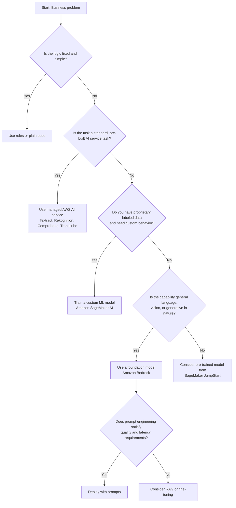

# Task 2.1: ML Model and Foundation Model (FM) Development - Choose appropriate modeling approaches for ML and AI solutions

## Skill 2.1.4: Evaluate tradeoffs between custom solutions, managed services, pre-trained models, and FMs to meet business needs

### Core Idea

Choosing the right modeling approach is not about listing options—it is about matching business constraints to where the underlying capability or knowledge resides. The four major approaches are:

1. **Custom ML models** trained on proprietary data.
2. **Managed AWS AI services** that already solve a standard task.
3. **Pre-trained models** that can be fine-tuned with a smaller dataset.
4. **Foundation models (FMs)** accessed through Amazon Bedrock and adapted with prompting, retrieval, or fine-tuning.

Requirements such as **interpretability**, **latency**, **cost**, **engineering effort**, and **data availability** must be part of the decision from the start, not evaluated after the fact.

---

### Four Approaches at a Glance

| Approach | What It Is | Best When | AWS Example |
| --- | --- | --- | --- |
| **Custom ML Model** | A model built and trained specifically on an organization’s own dataset. | Unique patterns exist in proprietary historical data and the organization needs full control or explainability. | Amazon SageMaker AI training jobs with built-in algorithms such as XGBoost or Linear Learner. |
| **Managed AI Service** | A pre-built, task-specific API that requires no training or model hosting. | The task is a standard, well-defined AI problem and the fastest time to market is desired. | Amazon Textract, Amazon Rekognition, Amazon Comprehend, Amazon Transcribe. |
| **Pre-trained Model** | A model already trained on a large public dataset that can be fine-tuned on a smaller domain dataset. | The task is similar to a common task, but the organization has some labeled data and needs more control than a managed service. | Amazon SageMaker JumpStart pre-trained models and solution templates. |
| **Foundation Model (FM)** | A large, general-purpose model that understands and generates natural language, images, or code. | The task involves general language understanding, summarization, Q&A, content generation, or creative work. | Amazon Bedrock with models from Anthropic, Meta, Amazon Titan, Cohere, Mistral, Stability AI. |

---

### The Capability Source Decision

Use the following decision flow to choose the most appropriate approach.

---

### Comparing the Options Across Key Tradeoffs

| Decision Factor | Custom ML Model | Managed AI Service | Pre-trained Model | Foundation Model |
| --- | --- | --- | --- | --- |
| **Time to deploy** | Slower; requires data prep, training, validation, and hosting setup. | Fastest; just call an API. | Medium; requires fine-tuning or transfer learning. | Fast if using prompting; slower if fine-tuning or building RAG. |
| **Engineering effort** | High; full ML lifecycle ownership. | Very low; no model development. | Medium; some ML expertise needed. | Low for prompting; medium for RAG/fine-tuning. |
| **Required data** | Large labeled dataset specific to the problem. | None or very little. | Small to medium labeled dataset for fine-tuning. | None for general tasks; custom data only if using RAG or fine-tuning. |
| **Interpretability** | Can be high if interpretable algorithms are selected. | Varies; often opaque but service behavior is standardized. | Depends on model type; can be moderate. | Generally low; FMs are black-box by nature. |
| **Control** | Full control over architecture, features, training, and deployment. | Little control; limited to API parameters. | Moderate control; can choose model, fine-tune, and deploy. | Low control over base model; adaptation through prompts, RAG, or fine-tuning. |
| **Cost profile** | Upfront training cost plus ongoing hosting; can be cost-effective at high volume. | Pay-per-request; predictable and low at low volume. | Training and hosting costs; can be balanced. | Token/request-based pricing; can become expensive at high volume. |
| **Latency** | Can be optimized for low latency with small custom models. | Usually fast; dependent on service. | Can be optimized after deployment. | Can be higher due to model size and API overhead. |
| **Maintenance** | Organization owns retraining, monitoring, and updates. | AWS manages the service; updates are seamless. | Organization manages fine-tuning and deployment. | AWS manages base model; organization manages prompts/RAG data or fine-tuned versions. |
| **Best for** | Proprietary prediction, forecasting, fraud detection, and scenarios needing explainability. | Document text extraction, speech-to-text, image object/scene detection, sentiment analysis. | Transfer learning on custom image or text classification with limited data. | Text summarization, conversational AI, content generation, semantic search, question answering. |

---

### Detailed Tradeoffs by Approach

#### 1. Custom ML Models (Amazon SageMaker AI)

**Definition**  
A custom ML model is trained from scratch or using a built-in algorithm on an organization’s own labeled dataset. The organization controls feature engineering, algorithm selection, hyperparameter tuning, training, evaluation, and deployment.

**When to choose**
- The organization has large amounts of proprietary historical data that contains unique patterns.
- Business stakeholders require **interpretability** or **explainability** for regulatory, financial, or operational trust.
- The task is a classic supervised problem such as demand forecasting, customer churn prediction, credit risk scoring, or equipment failure prediction.
- The organization needs full control over the model, training pipeline, and deployment environment.
- Inference volume is high enough that owning a smaller, optimized model may reduce long-term costs compared with per-request managed APIs or large FM tokens.

**Advantages**
- Maximum flexibility in model selection, features, and architecture.
- Can optimize for interpretability, latency, and cost simultaneously.
- Domain-specific performance can be very high when enough labeled data exists.
- Full data control and privacy; models can be deployed inside a VPC.

**Drawbacks**
- High engineering and operational overhead.
- Requires labeled data, feature engineering, model tuning, and ongoing maintenance.
- Slower time to market than managed services or FMs.
- Risk of building a model when a simpler or existing solution would suffice.

**Typical AWS implementation**
- Amazon SageMaker AI training jobs with built-in algorithms such as XGBoost, Linear Learner, DeepAR, or custom training scripts.
- Amazon SageMaker Clarify for explainability and bias detection.
- Amazon SageMaker Pipelines for CI/CD and retraining workflows.
- Amazon SageMaker Endpoints for real-time inference.

---

#### 2. Managed AWS AI Services

**Definition**  
AWS provides fully managed APIs that perform specific AI tasks out of the box. These services are pre-trained on large datasets by AWS and require no custom model training or infrastructure management.

**Key examples**
- **Amazon Textract** – extracts text, forms, tables, and key-value pairs from scanned documents and PDFs.
- **Amazon Rekognition** – detects objects, scenes, faces, celebrities, and unsafe content in images and video.
- **Amazon Comprehend** – extracts entities, key phrases, sentiment, syntax, and personally identifiable information from text.
- **Amazon Transcribe** – converts speech from audio to text and supports speaker diarization.
- Other relevant services: Amazon Polly, Amazon Translate, Amazon Personalize, Amazon Forecast.

**When to choose**
- The business problem matches a standard, pre-solved task such as OCR, speech-to-text, object detection, or sentiment analysis.
- The organization wants the **least development effort** and fastest time to production.
- There is little or no in-house ML expertise.
- The task does not require domain-specific fine-tuning or custom model behavior.
- Volume is low-to-moderate, and per-request pricing is acceptable.

**Advantages**
- Fastest deployment: call an API and receive results immediately.
- No model training, labeling, or infrastructure management.
- Predictable and simple pricing.
- Continuously maintained and improved by AWS.
- Integrated with other AWS services for event-driven workflows.

**Drawbacks**
- Limited customization; cannot teach the service new classes or domain-specific concepts.
- May not perform well on highly specialized or proprietary data.
- Data may leave the organization’s controlled environment depending on configuration.
- Per-request pricing can become expensive at very high volume.

**Typical use cases**
- Extracting data from invoices, receipts, and forms with Amazon Textract.
- Detecting products, celebrities, or scenes in images with Amazon Rekognition.
- Analyzing customer feedback sentiment with Amazon Comprehend.
- Transcribing call center audio with Amazon Transcribe.

---

#### 3. Pre-trained Models and Solution Templates (Amazon SageMaker JumpStart)

**Definition**  
Pre-trained models are models that have already been trained on large public datasets. In AWS, Amazon SageMaker JumpStart provides pre-trained models for common tasks such as image classification, object detection, text classification, and question answering. You can fine-tune these models with a smaller domain-specific dataset and deploy them on SageMaker.

**When to choose**
- The task is similar to a common ML task, but the organization has a small labeled dataset and needs better domain accuracy than a managed service offers.
- The organization wants to reduce training time and data requirements through transfer learning.
- There is some ML expertise, but not enough to build a model from scratch.
- The organization needs to deploy a model inside its own VPC for data privacy or latency reasons.

**Advantages**
- Significantly reduces data and training time compared with training from scratch.
- Provides a stronger starting point for custom image, text, or tabular problems.
- Can be deployed on SageMaker real-time endpoints or batch transform jobs.
- More control than managed services, including model selection and fine-tuning.
- Can handle custom classes or labels that managed services cannot learn.

**Drawbacks**
- Requires some ML knowledge to prepare data, fine-tune, and evaluate.
- Fine-tuning still requires labeled data and compute resources.
- May need ongoing model monitoring and retraining.
- Pre-trained model may not transfer well if the target domain is too different from the source data.

**Typical use cases**
- Classifying custom wildlife species from trail-camera images.
- Detecting specific product defects on an assembly line.
- Fine-tuning a text classification model for industry-specific document categories.
- Deploying a pre-trained summarization or question-answering model with domain adaptation.

---

#### 4. Foundation Models (Amazon Bedrock)

**Definition**  
Foundation models are large, general-purpose models trained on massive and diverse datasets. Amazon Bedrock provides managed API access to FMs from leading providers, including Anthropic Claude, Amazon Titan, Meta Llama, Cohere Command, Mistral, and Stability AI. FMs can be adapted through **prompt engineering**, **Retrieval Augmented Generation (RAG)**, or **fine-tuning**.

**When to choose**
- The task involves general language understanding, generation, summarization, question answering, or content creation.
- The organization wants fast time to market and low engineering overhead.
- No proprietary training data is initially required; the capability is already inside the model.
- The application needs to be built quickly and can use few-shot examples or system prompts to influence behavior.
- The business problem benefits from natural language interaction or generative outputs.

**Advantages**
- Very fast to prototype and deploy using natural language prompts.
- No model training or infrastructure management when using on-demand Bedrock APIs.
- High-quality general language and reasoning capabilities.
- Supports RAG for proprietary knowledge without modifying model weights.
- Supports fine-tuning when prompt engineering cannot close a performance gap.
- Pay-per-token pricing with no upfront cost.

**Drawbacks**
- Generally low interpretability; difficult to explain why a specific output was generated.
- Token-based pricing can become expensive at high volume or with long prompts.
- Large models may introduce higher latency than smaller custom or pre-trained models.
- Cannot directly model structured tabular data for tasks like numeric forecasting.
- Fine-tuning requires labeled prompt-response data and introduces model versioning and ongoing management.
- Risk of catastrophic forgetting if fine-tuned too narrowly.

**Adaptation order for FMs**
1. **Prompt engineering** – Provide instructions and few-shot examples in the prompt. This is the fastest and cheapest approach.
2. **Retrieval Augmented Generation (RAG)** – Use Amazon Bedrock Knowledge Bases to retrieve relevant proprietary content at query time. Use when the model needs access to fresh, source-cited organizational knowledge.
3. **Fine-tuning** – Train the FM on labeled examples to change its behavior. Use only when evaluations show prompt engineering and RAG cannot meet requirements.

**Typical use cases**
- Summarizing long support tickets, contracts, or research papers.
- Generating marketing copy, product descriptions, or personalized emails.
- Building conversational assistants or chatbots.
- Answering questions over a company knowledge base using RAG.

---

### Decision Heuristics: Rules of Thumb

- **Fixed business logic** → Use plain rules or code. Do not build ML for problems that can be solved with deterministic conditions.
- **Standard, pre-solved task** → Use a managed AWS AI service such as Textract, Rekognition, Comprehend, or Transcribe.
- **Patterns inside proprietary historical data** → Train a custom ML model on Amazon SageMaker AI.
- **General language or generative capability** → Use a foundation model on Amazon Bedrock.
- **Limited labeled data but common task** → Use a pre-trained model from SageMaker JumpStart and fine-tune.
- **Prompt first, fine-tune second** – Always exhaust prompt engineering before moving to fine-tuning.
- **Interpretability demands** → Prefer a custom ML model with an interpretable algorithm over a black-box FM.
- **Low latency and cost at high volume** → Prefer a small custom or pre-trained model deployed on a SageMaker real-time endpoint.
- **Fastest time to market** → Prefer a managed AI service or an FM with prompt engineering.

---

### Scenario-Based Examples

#### Scenario 1: Invoice Data Extraction

**Business problem**  
A finance department needs to extract line items, invoice numbers, and vendor names from thousands of scanned invoices. The invoices vary in layout and format. The team has no ML expertise and wants a working solution in two weeks.

**Best approach**  
Use **Amazon Textract**, a managed AWS AI service.

**Reasoning**
- Textract is purpose-built for document text, form, and table extraction.
- No training or labeling is needed.
- The problem is standard and fits a pre-solved task.
- Development effort is minimal compared with custom computer vision or fine-tuning an FM.

**Why not the other options?**
- Custom computer vision would require labeling hundreds of invoice layouts and training a model, which is unnecessary overhead.
- Fine-tuning a foundation model on invoices is resource-intensive and still requires data preparation.
- Fixed rules based on positions would break when invoice layouts change.

---

#### Scenario 2: Store Demand Forecasting with Explainability

**Business problem**  
A retail chain wants weekly demand forecasts for each store using five years of its own sales history. The finance team must be able to explain each forecast and trust the model’s predictions.

**Best approach**  
Train a **custom supervised ML model** on Amazon SageMaker AI using an interpretable algorithm such as Linear Learner or XGBoost with explanation tools.

**Reasoning**
- The historical sales data contains unique seasonal, promotional, and local patterns.
- The answer is in the organization’s own data.
- Finance requires interpretability, so a custom model with an explainable algorithm is preferred.
- The model can be tuned for cost and latency because it is deployed on SageMaker.

**Why not the other options?**
- A foundation model is not designed for precise tabular time-series forecasting across thousands of SKUs and stores.
- A managed service that generates written demand commentary does not provide numerical forecasts.
- Fixed reorder rules cannot model dynamic demand patterns like promotions or seasonality.

---

#### Scenario 3: Support Ticket Summarization

**Business problem**  
A customer support team wants to automatically summarize long support tickets using company-specific terminology. The rollout must be fast, and the team wants predictable costs.

**Best approach**  
Use a **foundation model in Amazon Bedrock** with **prompt engineering** and few-shot examples that include company terminology.

**Reasoning**
- Summarization is a general language capability already present inside FMs.
- Prompt engineering with instructions and example summaries can quickly adapt the model to company terminology.
- Deployment is fast and requires no training data or model training.
- Cost is predictable through Bedrock on-demand pricing.

**Why not the other options?**
- A custom regression or classification model cannot generate fluent summaries from text.
- Fine-tuning should not be the first step because prompting has not been tried and may be sufficient.
- A managed service like Comprehend can find key phrases but cannot generate a coherent summary.

**Important follow-up**  
If evaluation shows the FM still misses company terminology after prompting, then fine-tuning on labeled examples may be the next step. This follows the prompt-first, fine-tune-second order.

---

#### Scenario 4: Custom Wildlife Species Classification

**Business problem**  
A conservation group has 5,000 labeled images from trail cameras and needs to classify images into 20 specific species. The species are not recognizable by generic object detection services.

**Best approach**  
Use a **pre-trained image classification model from Amazon SageMaker JumpStart** and fine-tune it on the 5,000 labeled images.

**Reasoning**
- The task is image classification, which is a common ML problem.
- The organization has a small labeled dataset, so transfer learning is appropriate.
- Managed services like Amazon Rekognition cannot learn new custom species labels.
- Training a CNN from scratch would require much more data and time.
- A foundation model for general vision may be overkill and less controllable.

**Why not the other options?**
- Custom from scratch is expensive and data-hungry.
- A managed service cannot be customized for these specific species.
- A text-based FM is not appropriate for structured image classification.

---

### Key Non-Functional Requirements That Decide the Tradeoff

#### Interpretability and Explainability
- If stakeholders must understand and defend predictions, choose a **custom ML model** with an interpretable algorithm or explainability tools such as SageMaker Clarify.
- Avoid defaulting to large FMs or deep neural networks when transparency is mandatory.

#### Latency and Real-Time Constraints
- For low-latency, high-throughput applications, a small custom or pre-trained model deployed on a SageMaker endpoint may outperform a large FM.
- Managed services have generally low latency but are not tunable.
- FMs can introduce network and model-size latency, especially for long outputs.

#### Cost and Engineering Overhead
- **Least upfront cost and effort:** managed AI services or FMs with prompting.
- **Cost-effective at high volume:** a custom or pre-trained model may be cheaper than per-call or per-token pricing.
- **Highest maintenance:** custom ML models require retraining and versioning.

#### Data Availability and Domain Specificity
- **Rich proprietary labeled data:** custom ML model.
- **No or minimal data:** managed AI service or FM with prompting.
- **Small labeled data and common task:** pre-trained model fine-tuning.
- **Proprietary knowledge that changes frequently:** FM with RAG rather than fine-tuning.

#### Time to Market
- Fastest: managed AI service or FM with prompt engineering.
- Medium: pre-trained model fine-tuning.
- Slowest: custom ML model development.

---

### Exam Tips and Common Traps

#### Exam Tips
- If a question asks for the **least development effort** for a standard task like document text extraction, image moderation, or speech transcription, choose the corresponding managed AI service.
- If a question emphasizes **explainability** or **regulatory auditability**, choose a custom ML model with an interpretable algorithm, not a black-box FM.
- If a question states that the answer exists in **proprietary historical tabular data**, train a custom supervised model.
- If the problem involves **natural language generation, summarization, or conversational AI**, use Amazon Bedrock.
- Remember the **prompt first, fine-tune second** rule. Many questions will describe a situation where prompting has not been tried but domain adaptation is needed—prompting is usually the first step.
- For **custom classes** in image or text classification with a small labeled dataset, look for **SageMaker JumpStart pre-trained models** and fine-tuning.
- For **frequently changing knowledge** with source citation requirements, choose **RAG** using Amazon Bedrock Knowledge Bases rather than fine-tuning.
- Always evaluate **interpretability, latency, and cost** alongside accuracy. An answer that maximizes accuracy but ignores stakeholder explainability is often wrong.

#### Common Traps
- **Choosing fine-tuning before prompt engineering** – This is a classic incorrect answer unless the question explicitly states prompt engineering failed evaluations.
- **Using a foundation model for tabular forecasting or regression** – FMs are for language and generative tasks; they are poor choices for time-series demand forecasting on large tabular datasets.
- **Building a custom model when a managed service already solves the exact task** – This wastes engineering effort.
- **Using a managed service for highly specialized custom classes** – Managed services cannot learn new labels; custom or pre-trained fine-tuning is needed.
- **Ignoring explainability** – A high-accuracy black-box model may be rejected by business stakeholders; an interpretable model is often the correct choice.
- **Assuming "pre-trained model" and "foundation model" are the same** – In AWS context, SageMaker JumpStart provides pre-trained models for traditional transfer learning, while Amazon Bedrock provides FMs for generative tasks.
- **Overlooking ongoing cost** – A managed API may be cheap initially but expensive at high volume; a custom model may be more cost-effective long-term.
- **Forgetting data privacy** – If data cannot leave a VPC, a custom SageMaker model may be required over a managed API or Bedrock unless private connectivity is configured.

---

### Quick Recall

- **Fixed logic** → rules, not ML.
- **Standard task** → managed AWS AI service.
- **Proprietary patterns** → custom ML model.
- **General language or generative ability** → foundation model with prompt engineering first.
- **Small domain dataset for common task** → pre-trained model fine-tuning.

Use these decision points to quickly shortlist the correct approach on exam questions, then validate against the explicit business constraints in the scenario.