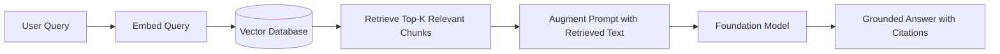
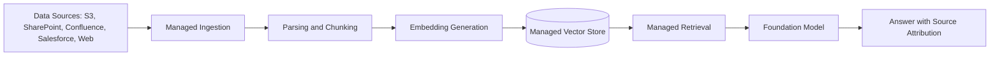
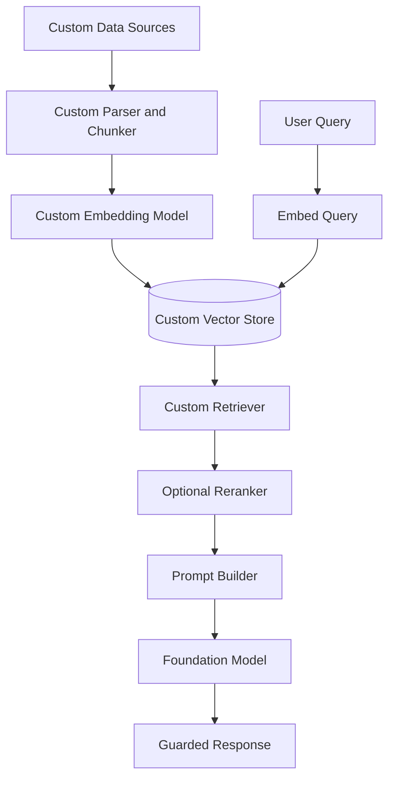
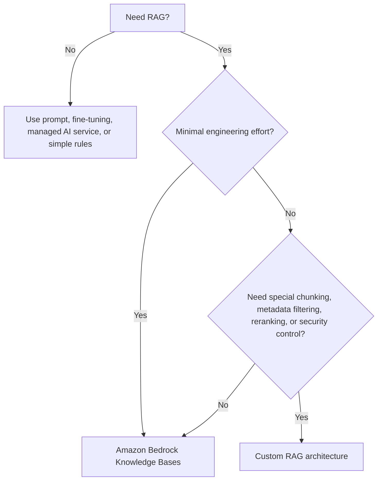

# Task 2.1: ML Model and Foundation Model (FM) Development - Choose appropriate modeling approaches for ML and AI solutions

## Skill 2.1.5: Select Retrieval Augmented Generation (RAG) architecture patterns based on use case requirements

### Overview

**Retrieval Augmented Generation (RAG)** is an architecture pattern that supplies a foundation model (FM) with relevant information retrieved from external content at inference time. Instead of writing knowledge into the model weights through fine-tuning, RAG keeps the knowledge in a separate, queryable store.

RAG is selected when the answer needs:

- **Current information** that changes frequently
- **Source attribution or citations**
- **Domain-specific content** from private documents
- **Lower maintenance** than repeatedly retraining or fine-tuning a model

It is not the correct pattern when the gap is behavioral, stylistic, or purely operational.

---

### 1. What RAG Actually Does

RAG does **not** modify the foundation model’s weights. The model reads externally retrieved passages added to its prompt and generates a response grounded in those passages.

---

### 2. Core RAG Pipeline Components

A production RAG architecture typically contains the following parts:

| Component | Purpose | Common AWS Implementation |
|---|---|---|
| **Source connectors** | Ingest documents from multiple repositories | Amazon Bedrock Knowledge Bases data sources: Amazon S3, Confluence, Salesforce, SharePoint, web crawler |
| **Document processing** | Parse, extract text, and split content | Amazon Bedrock Knowledge Bases parsing and chunking; Amazon Textract for scanned documents |
| **Embedding model** | Convert text chunks into vector embeddings | Amazon Titan Embeddings, Cohere Embed via Amazon Bedrock |
| **Vector store** | Index and search embeddings | Amazon OpenSearch Serverless, Pinecone, Redis Enterprise Cloud, MongoDB Atlas, Amazon Aurora PostgreSQL |
| **Retriever** | Find the most relevant chunks for a query | Bedrock Knowledge Bases `Retrieve` operation; custom query logic |
| **Generator** | Produce natural-language answer from retrieved context | Foundation models in Amazon Bedrock |
| **Orchestration** | Combine retrieval, prompting, model calling, and response handling | Amazon Bedrock Agents, AWS Lambda |
| **Guardrails** | Filter harmful content, PII, or off-limits answers | Amazon Bedrock Guardrails |

---

### 3. RAG Architecture Patterns by Use Case

Pattern selection depends on how much control you need and which retrieval challenges the use case presents.

#### Pattern A: Fully Managed RAG with Amazon Bedrock Knowledge Bases

**Use when:**

- The use case is a standard document Q&A assistant
- You need low operational overhead
- Content changes frequently and must be re-synced automatically
- You want native source citations without custom coding

**Strengths:**

- Automates ingestion, chunking, embedding, vector storage, and retrieval
- Supports scheduled syncing for fresh content
- Provides `Retrieve` and `RetrieveAndGenerate` workflows
- Easier to secure and maintain

**Limitations:**

- Less control over chunking strategy, retrieval algorithm, and reranking
- Limited customization of the retriever
- You must use supported vector stores and data sources

---

#### Pattern B: Custom RAG Architecture

Custom RAG gives you control over each stage: ingestion, chunking, embedding, storing, retrieval, reranking, and prompting.

**Use when:**

- You need specialized document processing
- You need metadata filtering by department, region, ACL, or document type
- You need fine-grained latency, cost, or retrieval-quality tuning
- You require a specific vector store, search algorithm, or security architecture
- You need hybrid or multi-stage retrieval

**Strengths:**

- Maximum control over performance and accuracy
- Can combine semantic search with lexical search
- Can add reranking, filtering, caching, and custom evaluation

**Limitations:**

- You own the engineering and operational burden
- More components to monitor, patch, and scale
- Longer time to production

---

#### Pattern C: Hybrid Retrieval: Semantic + Lexical Search

Semantic vector search understands meaning and paraphrases. Lexical keyword search is better for exact identifiers, codes, acronyms, and domain terms.

| Query Type | Best Retrieval |
|---|---|
| “Explain the return policy for damaged items” | Semantic vector search |
| “Show policy Z-4821” | Lexical/keyword search |
| “How does KMS protect AES-256 keys?” | Hybrid: semantic for meaning + lexical for exact acronyms and identifiers |

**Use when:**

- Documents include product codes, regulation numbers, SKU identifiers, or account IDs
- Users phrase questions informally but need exact entity matches
- Pure vector search misses exact terminology

**AWS pattern:**

- Use Amazon OpenSearch Service for both dense vector search and BM25/keyword search
- Combine results using score fusion or reciprocal rank fusion
- Optionally rerank combined candidates before sending to the FM

---

#### Pattern D: Multi-Stage Retrieval with Reranking

Stage 1 retrieves many candidates cheaply. Stage 2 reranks the top candidates using a higher-quality model.

**Use when:**

- The context window is limited
- High precision matters more than raw recall
- You need to reduce irrelevant chunks before generation
- You want to balance cost and answer quality

**Tradeoff:**

- Adds latency and possibly additional cost
- Improves relevance and reduces prompt size

---

#### Pattern E: Agentic RAG for Complex or Multi-Hop Queries

Agentic RAG combines retrieval with an orchestration layer that can decompose a question into sub-steps, call different tools, and reason over multiple retrievals.

**Use when:**

- The question requires evidence from multiple different document sets
- The agent must decide whether to retrieve, calculate, or call a service
- There are access-control boundaries or multiple APIs to query

On AWS, this may use **Amazon Bedrock Agents** linked to Knowledge Bases and action groups.

This is an advanced pattern. For the exam, focus on recognizing when simple RAG is sufficient versus when agents add value.

---

### 4. RAG vs Fine-Tuning vs Prompt Engineering

| Requirement | Preferred Approach | Reason |
|---|---|---|
| Reflect edited policy within minutes | **RAG** | Retrieval is external; content is updated without retraining |
| Cite the source document behind each answer | **RAG** | Retrieved chunks carry metadata and can be cited |
| Teach model internal terminology and response style after prompting fails | **Fine-tuning** | Retrieval supplies facts, not behavioral style or vocabulary |
| Answer general language tasks with no external private knowledge | **Prompt engineering with FM** | No external retrieval needed |
| Extract text from invoices | **Amazon Textract** | Managed AI service already solves the task |
| Fixed stock reorder rule | **Plain code/rule** | No machine learning required |

**Important:** If prompting with few-shot examples cannot fix terminology, RAG is unlikely to fix it either. The model may retrieve the correct document and still paraphrase incorrectly if it has not been trained on the required language pattern.

---

### 5. Chunking Strategies and Their Impact

Chunking determines how documents are split before embedding and retrieval.

| Chunking Strategy | Description | Best Use Case |
|---|---|---|
| **Fixed-size chunking** | Splits text into equal-sized chunks with optional overlap | Fast, predictable; good for simple documents |
| **Semantic chunking** | Groups text by topic, section, or meaning | Complex documents where context boundaries matter |
| **Hierarchical chunking** | Preserves parent-child relationships between sections | Multi-level documents or long manuals |
| **No chunking** | Sends the entire short document as one chunk | Small records or policies |

**Tradeoffs:**

- **Too small:** Loses context, can split a definition from its example
- **Too large:** Adds irrelevant content, increases token cost, dilutes retrieval precision
- **Overlap:** Preserves context across boundaries but increases storage and token usage

---

### 6. Amazon Bedrock Knowledge Bases in Detail

Amazon Bedrock Knowledge Bases provides a managed RAG path.

Key capabilities to know:

- Connects to data sources such as **Amazon S3**, **Confluence**, **SharePoint**, **Salesforce**, and **web crawlers**
- Automatically parses, chunks, and embeds documents
- Stores embeddings in a configured vector database
- Re-syncs content on schedule or on-demand
- Supports source metadata and citations
- Integrates with foundation models through:
  - `Retrieve`: returns relevant documented chunks
  - `RetrieveAndGenerate`: returns a generated answer grounded in those chunks
- Can be integrated with Amazon Bedrock Agents
- Can apply Amazon Bedrock Guardrails for safety and compliance

**Use Bedrock Knowledge Bases when:**

- Time to production matters
- The team does not want to manage vector databases manually
- The use case is mostly standard Q&A over enterprise documents
- Native citations and managed syncing are enough

---

### 7. Managed RAG vs Custom RAG Decision Guide

| Factor | Managed RAG: Bedrock Knowledge Bases | Custom RAG |
|---|---|---|
| Engineering effort | Lowest | Highest |
| Time to production | Fastest | Slower |
| Chunking control | Limited to available options | Full control |
| Retrieval algorithm | Managed | Fully customizable |
| Vector store choice | Curated options | Any supported service |
| Metadata filtering | Supported through the managed service | Full control |
| Reranking | Not always available or limited | Full control |
| Operational burden | Lower | Higher |
| Cost predictability | Consolidated AWS cost | Component-by-component cost |
| Security control | Managed with AWS security best practices | You must implement and validate |

---

### 8. Cost, Latency, and Performance Tradeoffs in RAG

| Decision | Impact |
|---|---|
| Retrieve more chunks | Better coverage but higher token cost and latency |
| Use larger FM | Higher-quality answers but slower and costlier |
| Add reranker | Better precision but extra latency and cost |
| Increase embedding dimension | Potentially better retrieval but higher storage and compute cost |
| Use hybrid search | Better for exact terms but more complex and slightly slower |
| Use managed RAG | Lower engineering overhead, faster go-live, less optimization flexibility |
| Use custom RAG | More tuning and control, but more maintenance and integration cost |

---

### 9. Scenario-Based Practice

#### Scenario 1

A support assistant must answer questions from a policy library that is revised often. Answers must reflect the newest wording and must cite the source document behind each answer.

**Which property of a RAG architecture satisfies both requirements?**

- **A.** The answer is generated from passages retrieved at request time
- **B.** The policy text sits inside the model weights after customization
- **C.** A larger foundation model is selected
- **D.** Requests are batched to improve efficiency

**Answer: A**

**Explanation:** RAG retrieves fresh passages from an external vector store at query time. Because the content is not embedded in the model weights, edits can be reflected as soon as the updated content is re-ingested. Retrieval also preserves source metadata, enabling citations.

---

#### Scenario 2

A legal research tool needs to answer questions from hundreds of thousands of regulatory documents. Users often search for exact regulation codes such as “42 CFR 482.23” but phrase the surrounding question informally.

**Which retrieval architecture best handles this requirement?**

- **A.** Only vector semantic search
- **B.** Only lexical keyword search
- **C.** Hybrid retrieval combining vector and keyword search
- **D.** Fine-tuning the foundation model on all regulation codes

**Answer: C**

**Explanation:** Hybrid retrieval combines semantic vector search with exact lexical search. Semantic search handles paraphrased questions, while keyword search reliably finds exact regulation codes, identifiers, and acronyms.

---

#### Scenario 3

A team needs to build a question-answering assistant over documents in Amazon S3 and SharePoint. The team has limited ML infrastructure experience and needs the solution to go live quickly. The content will be updated often.

**Which approach is most appropriate?**

- **A.** Train a custom document model with SageMaker AI
- **B.** Build a custom RAG pipeline on Amazon EC2
- **C.** Use Amazon Bedrock Knowledge Bases with managed ingestion and retrieval
- **D.** Fine-tune a foundation model on all documents

**Answer: C**

**Explanation:** Amazon Bedrock Knowledge Bases provides a managed RAG workflow with native S3 and SharePoint connectors, automated ingestion, chunking, embedding, and retrieval syncing. It minimizes engineering effort and accelerates deployment while supporting frequent content updates.

---

#### Scenario 4

An application fails to use internal terminology correctly even after prompting instructions and few-shot examples were added. The team considers adding more retrieved passages from its internal documents.

**Which statement is correct?**

- **A.** Adding retrieved passages will update the model weights and fix terminology
- **B.** RAG will force the model to use the exact internal wording in every response
- **C.** The issue is behavioral; fine-tuning on labeled examples is more appropriate
- **D.** Reducing retrieved passages will improve terminology

**Answer: C**

**Explanation:** RAG supplies external factual content, but it does not reliably train the model to adopt specific internal terminology, style, or formatting. If prompting has failed, the next step is supervised fine-tuning on labeled prompt-response examples that demonstrate the required wording.

---

### 10. Exam Tips and Traps

**Tips:**

- **Freshness + citations = RAG.** If a question says a policy must be reflected within minutes, choose retrieval.
- **No engineering team = Bedrock Knowledge Bases.** Managed RAG is the default for standard enterprise Q&A.
- **Exact codes, IDs, acronyms, or SKU numbers = hybrid or keyword-aware retrieval.**
- **High precision with limited context = reranking or multi-stage retrieval.**
- **Own-your-data sovereignty, specialized chunking, or custom security = custom RAG.**
- **Cite source documents = retrieval passages, not model weight memory.**
- **Prompt first, fine-tune later.** Do not recommend fine-tuning because RAG alone is insufficient for style or terminology.
- **RAG uses external documents at request time.** It does not modify the FM.

**Traps:**

- Treating RAG as a fine-tuning replacement for behavior or style
- Choosing RAG when the task is fixed logic or a managed AI service task
- Assuming more retrieved chunks always improve accuracy
- Ignoring chunking tradeoffs, metadata filtering, and source freshness
- Assuming managed RAG gives unlimited control
- Assuming custom RAG is always better because it is more flexible
- Believing citations guarantee factual correctness; citations show which source was used, but the model can still summarize incorrectly
- Overlooking Amazon Bedrock Guardrails or access-control requirements
- Choosing fine-tuning when the main issue is frequently changing external content

---

### 11. Quick Recall

Write the test without review:

- If the answer must come from up-to-date private documents and cite its source, choose **RAG**.
- If the gap is internal terminology or response style after prompting fails, choose **fine-tuning**.
- If the task is already solved by a purpose-built service, use **managed AWS AI services**.
- If the logic is fixed, use **simple rules**.
- If the use case is standard Q&A with limited ML engineering, use **Amazon Bedrock Knowledge Bases**.
- If exact identifiers and paraphrased questions both matter, use **hybrid retrieval**.

These distinctions are the core of selecting the right RAG architecture pattern on the AWS Certified Machine Learning - Associate exam.