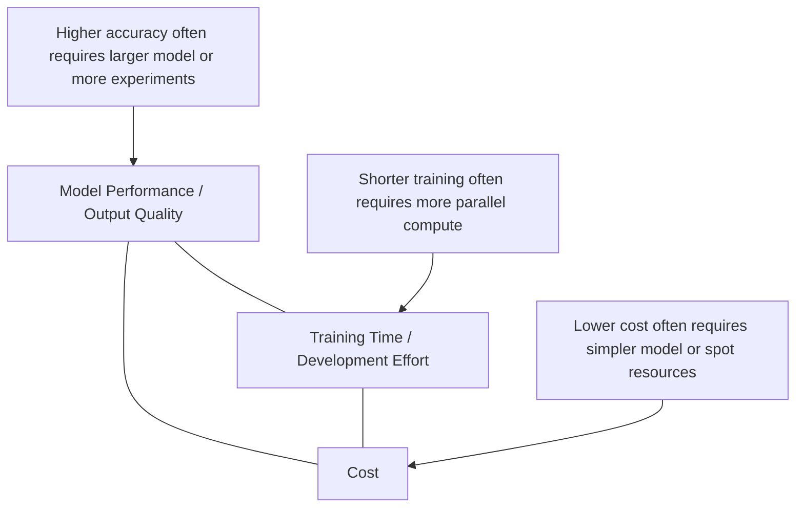
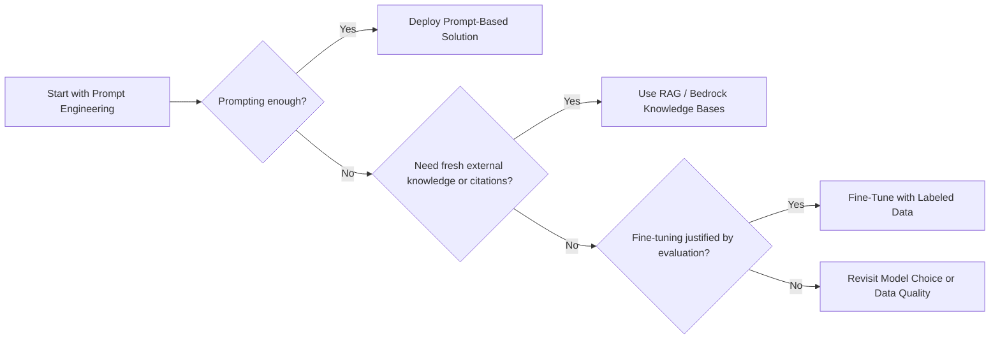
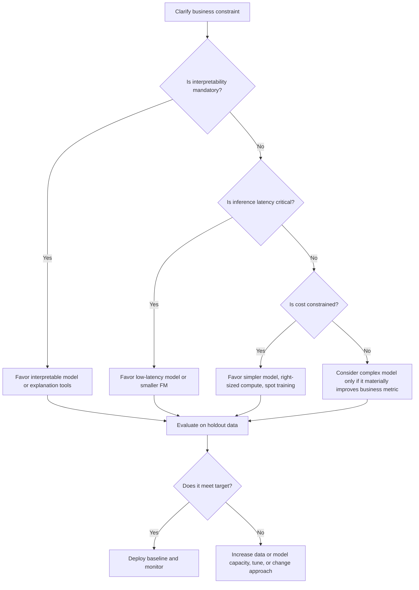

# Task 2.1: ML Model and Foundation Model (FM) Development - Choose appropriate modeling approaches for ML and AI solutions

## Skill 2.1.6: Assess tradeoffs between ML model performance, training time, and cost

### Overview

This skill is about making a deliberate, evidence-based decision when choosing between model quality, the time required to train or adapt a model, and the cost of building and operating it. The highest-performing model is not automatically the best model.

On the AWS Certified Machine Learning - Associate exam, you should expect questions that test whether you can:

- Recognize when a performance improvement is worth the additional training time or cost.
- Identify when a simpler, more interpretable, or lower-latency model is the better business choice.
- Compare traditional ML tradeoffs with foundation model tradeoffs.
- Decide between prompt engineering, fine-tuning, and retrieval-augmented generation (RAG) based on performance, time, and cost constraints.
- Select AWS services and features that optimize one dimension without violating another.

The core principle is:

> **Choose the least complex, least expensive approach that meets all business constraints, not the model with the highest metric.**

---

### The Performance–Time–Cost Triangle

Every ML or AI solution has to balance three competing forces.

- **Performance** is not only accuracy. It includes precision, recall, RMSE, latency, interpretability, calibration, and business-specific metrics.
- **Training time** includes initial training, hyperparameter tuning, experimentation, fine-tuning, and retraining frequency.
- **Cost** includes compute at training time, inference cost, data labeling, storage, engineering time, and ongoing maintenance.

A good way to think about the exam is:

> If a solution improves one corner of the triangle, which other corner is likely to suffer?

---

### Defining Model Performance

Performance must be defined before comparing models. The metric depends on the problem type.

| Problem Type | Common Metrics | What It Usually Tells You |
| --- | --- | --- |
| Binary classification | Accuracy, AUC-ROC, precision, recall, F1 | How well the model separates classes; important when classes are imbalanced |
| Multiclass classification | Accuracy, macro-F1, micro-F1 | How well the model performs across multiple classes |
| Regression | RMSE, MAE, MAPE, R² | How close predictions are to actual numeric values |
| Forecasting | MAPE, WAPE, quantile loss | Forecast error in the same units as the target |
| Ranking / recommendation | Precision@k, Recall@k, NDCG | Whether the model returns relevant items early |
| Anomaly detection | Precision, recall, F1, false positive rate | Ability to find rare events without overwhelming human reviewers |

For **foundation models**, performance typically means:

- Quality and relevance of generated output.
- Instruction following.
- Factual correctness and lower hallucination.
- Consistent tone, style, or terminology.
- Performance on the specific task, not just general benchmarks.
- Latency and cost per request at the required scale.

---

### Training Time and Cost Drivers

#### Traditional ML Training Time Drivers

| Driver | Impact on Training Time |
| --- | --- |
| Model complexity | Deep neural networks train much longer than linear models or tree ensembles |
| Dataset size | More rows or tokens usually means longer training |
| Number of epochs | More passes over the data increase time and risk overfitting |
| Hyperparameter search | Every additional trial multiplies training time |
| Compute configuration | More GPU instances reduce wall-clock time but increase cost |
| From scratch vs transfer learning | Training from scratch takes much longer than fine-tuning a pre-trained model |
| Distributed training | Reduces time but introduces communication overhead |

#### Traditional ML Cost Drivers

| Cost Component | What Drives It |
| --- | --- |
| Compute time | Instance count × instance price × training duration |
| Experimentation | Teams often train many failed or partial models |
| Data labeling | Human labeling is often more expensive and slower than compute |
| Storage | Raw data, features, model artifacts, logs, and datasets |
| Engineering and operations | Model design, feature engineering, deployment, monitoring, and retraining |
| Inference | Long-term serving cost can exceed training cost for high-traffic systems |

---

### Foundation Model Tradeoffs

Foundation models shift some of the cost from training to inference and from algorithm development to model selection and prompt design.

| Dimension | Prompting Only | RAG / Bedrock Knowledge Bases | Fine-Tuning |
| --- | --- | --- | --- |
| Model performance | Improves format, tone, and simple terminology | Adds current external knowledge and source citations | Changes model behavior based on labeled examples |
| Training time | None | Usually none for model training | Requires dataset preparation and model training |
| Cost | Low; pay per request | Medium; retrieval, vector store, embeddings, and generation | High; compute, data labeling, versioning, and retraining |
| Knowledge update speed | Immediate prompt updates | Very fast; update documents and re-ingest | Slow; requires retraining |
| Main risk | May not close large quality gaps | Retrieval can add latency and may miss relevant passages | Catastrophic forgetting and overfitting to small data |

#### Decision Order for Foundation Models

**Exam principle:** Fine-tuning is only justified when evaluation shows that prompt engineering and retrieval cannot close the performance gap.

---

### Traditional ML Model Selection Tradeoff Table

Use this to compare model families conceptually.

| Model Family | Performance Profile | Training Time | Inference Latency | Cost | Interpretability |
| --- | --- | --- | --- | --- | --- |
| Linear / logistic regression | Moderate for linear problems | Very low | Very low | Low | High |
| Tree ensembles such as XGBoost | Strong for tabular data | Low to moderate | Low | Low to moderate | Moderate with feature importance |
| Deep learning for images, text, audio | High for unstructured data | High | Moderate to high | High | Low |
| Custom foundation model fine-tune | Strong for specialized language tasks | Moderate to high | Moderate to high | High | Low |
| Prompt-based FM | Strong for general language capability | None for the model | Moderate to high | Pay-per-token | Low to moderate |

**Use traditional ML when:**

- The patterns are in your own structured or tabular data.
- You need interpretability for regulators, finance, or business stakeholders.
- Inference must be very fast and cheap.
- You have enough labeled historical data.

**Use a foundation model when:**

- The task requires general language understanding, generation, or summarization.
- No large labeled training set exists.
- You need a fast solution with limited ML engineering effort.
- The capability already exists in a pre-trained FM.

**Use a managed AWS AI service when:**

- The task is already solved by a service such as Amazon Textract, Rekognition, Comprehend, or Transcribe.
- You do not need to teach the model organization-specific patterns that go beyond the service's built-in capability.

---

### Evaluation-Driven Tradeoff Framework

A practical decision flow for balancing performance, time, and cost:

---

### AWS Service Levers for Balancing Tradeoffs

| AWS Service or Feature | What It Optimizes | Key Tradeoff or Risk |
| --- | --- | --- |
| Amazon SageMaker built-in algorithms | Reduces engineering time and cost | Less customization than custom training code |
| Amazon SageMaker managed Spot training | Reduces training cost greatly | Training can be interrupted; needs checkpointing |
| SageMaker distributed training | Reduces wall-clock training time | Uses more instances and may increase cost |
| SageMaker automatic model tuning | Improves model performance | Each tuning trial adds compute time and cost |
| Early stopping | Reduces training time and cost | If stopped too early, model may underfit |
| Transfer learning / SageMaker JumpStart | Reduces training time and required data | Pre-trained model may not match domain perfectly |
| Amazon Bedrock Model Evaluation | Helps choose model based on quality | Requires test datasets and may add engineering effort |
| Bedrock on-demand mode | No fixed cost; pay per token; good for variable traffic | May have throughput or latency variability |
| Bedrock provisioned throughput | Predictable latency and capacity for stable high traffic | Incurs fixed cost even if unused |
| Bedrock Knowledge Bases / RAG | Adds current knowledge without retraining | Adds retrieval latency, vector store cost, and ingestion work |
| Smaller or distilled FM | Reduces inference latency and cost | May reduce quality or reasoning ability |

---

### Scenario-Based Examples

#### Scenario 1: Fraud Detection with a Latency Constraint

A financial services company is building a real-time credit card fraud detection system. The scoring service must return a decision in under 50 milliseconds.

Two models are evaluated:

- **Model A:** Deep neural network ensemble with AUC of 0.99 but 600 ms inference latency and high serving cost.
- **Model B:** Gradient boosted tree with AUC of 0.98, 25 ms inference latency, and low serving cost.

Which model should be selected for production?

**Answer: Model B.**

The small gain from 0.98 to 0.99 AUC does not justify missing the strict latency budget and increasing serving cost. For real-time fraud screening, the model that meets the latency requirement while still achieving strong performance is the better tradeoff.

---

#### Scenario 2: Reducing Training Cost Without Losing Completion Time

A retail company is training a custom document classification model in Amazon SageMaker AI using transfer learning. The project has a three-week deadline, and the on-demand GPU training cost is too high.

Which option best balances cost and training time?

**A.** Use only CPU instances for all training.  
**B.** Use SageMaker managed Spot training with checkpointing.  
**C.** Use a larger model but train for only one epoch.  
**D.** Stop hyperparameter tuning and deploy the first model.

**Answer: B.**

Managed Spot training reduces compute cost substantially. Checkpointing allows the job to resume if capacity interrupts. Combined with transfer learning, this approach controls cost while still fitting within the project deadline. CPU-only training would likely be too slow, and skipping tuning entirely may reduce final performance.

---

#### Scenario 3: Selecting the Right Foundation Model Size

A customer support team built a chatbot powered by a large foundation model in Amazon Bedrock. The quality is strong, but the per-ticket cost is too high and the 95th percentile latency exceeds the application's target.

The team evaluates a smaller foundation model and finds that it passes the quality threshold on the same evaluation set.

What is the best next step?

**A.** Keep the large model and add provisioned throughput to improve latency.  
**B.** Fine-tune the large model to reduce latency.  
**C.** Switch to the smaller foundation model that passes the quality bar.  
**D.** Add more few-shot examples to prompt the large model to respond faster.

**Answer: C.**

If the smaller model meets the quality requirement, it is the better tradeoff because it reduces both inference latency and cost. Provisioned throughput may improve latency predictability but does not reduce per-token cost and introduces fixed cost. Fine-tuning a larger model would add training time and cost without directly solving the inference cost problem.

---

#### Scenario 4: Fresh Knowledge and Source Citations

A financial advisory assistant must answer questions based on internal policy documents that change frequently. The application must cite the source document for each answer.

The current foundation model has acceptable general language quality, but it sometimes uses outdated policy wording.

Which approach best satisfies the requirements?

**A.** Fine-tune the model on the policy documents.  
**B.** Use RAG through Amazon Bedrock Knowledge Bases.  
**C.** Switch to a larger foundation model.  
**D.** Add all policy documents directly to the system prompt.

**Answer: B.**

RAG through Bedrock Knowledge Bases retrieves current passages at request time. It supports source attribution because the model answers from retrieved chunks. It also avoids repeated fine-tuning every time a policy changes. Fine-tuning would bake knowledge into model weights, become stale quickly, and not provide reliable source citations.

---

### Exam Tips and Traps

- **Do not always pick the highest-accuracy model.** If it violates latency, cost, or interpretability constraints, it is the wrong choice.
- **Look for the hard constraint first.** Requirements such as “must return in under 100 ms,” “must be explainable to regulators,” or “must cost less than $0.01 per request” dominate the decision.
- **Prompt before fine-tuning.** For foundation models, prompt engineering is faster, cheaper, and easier to change. Fine-tuning is only justified when evaluation proves prompting is not enough.
- **RAG is not the same as fine-tuning.** RAG keeps knowledge outside the model and is better for frequently updated content and source citations. Fine-tuning changes model weights and is better for style, behavior, or specialized task patterns.
- **Spot training saves money but can extend time.** Use checkpointing and a time buffer. If the deadline is hard, on-demand instances may be the safer choice.
- **More compute does not always mean a proportionally faster job.** Distributed training introduces communication overhead, so doubling instances may not halve training time.
- **Consider inference cost over the model's lifetime.** A model that is cheap to train but expensive to serve can cost more overall than a moderately more expensive training job with lower serving cost.
- **Do not use a foundation model for a problem that is already solved by a managed AI service.** For example, extracting text from scanned invoices should point to Amazon Textract, not custom training or a general FM.
- **Traditional ML is still the right choice for many business problems.** Tabular demand forecasting, fraud models built on internal history, and applications requiring strong interpretability often favor supervised ML models.
- **Smaller foundation models are often underrated.** If a smaller FM passes your evaluation quality threshold, it will usually reduce both latency and cost.
