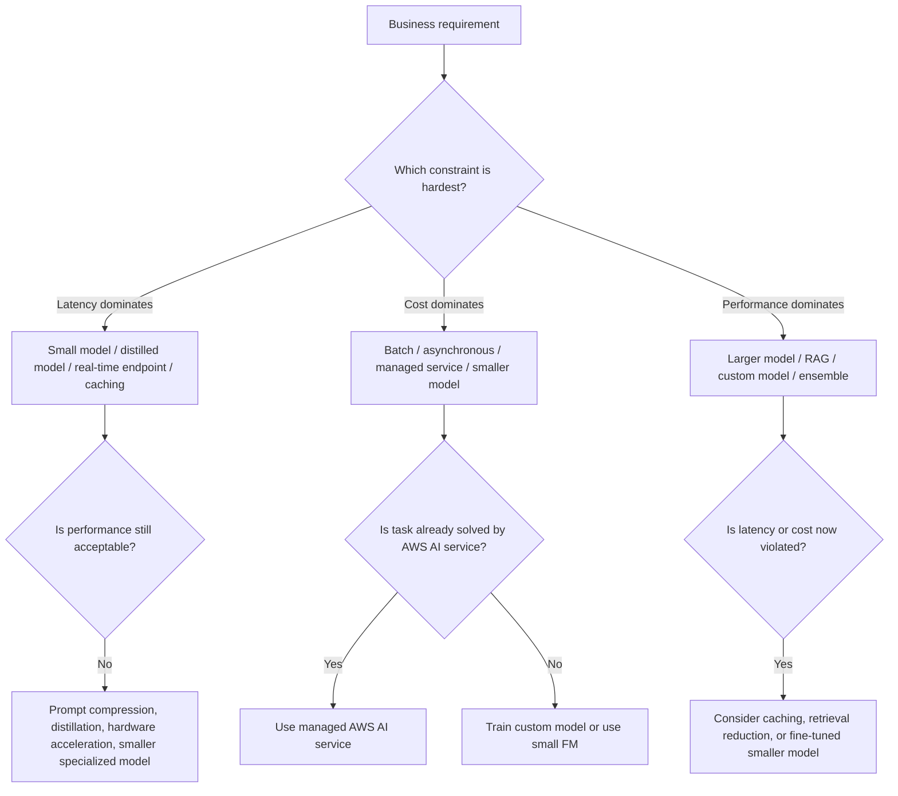
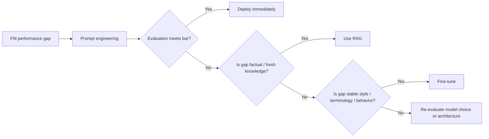

# Task 2.1: ML Model and Foundation Model (FM) Development - Choose appropriate modeling approaches for ML and AI solutions

## Skill 2.1.7: Assess tradeoffs between AI model performance, latency, and cost

### Overview

Assessing tradeoffs between model performance, latency, and cost is not a post-deployment activity. It is part of model and architecture selection itself. The exam expects you to read a business requirement and identify which of the three dimensions is dominant, then choose the modeling or deployment approach that respects the constraint.

The same mental model applies to both:

- **Traditional ML models** trained on an organization's own data.
- **Foundation models** accessed through Amazon Bedrock.
- **Managed AI services** such as Amazon Comprehend, Rekognition, Textract, and Transcribe.

For this skill, you should be able to:

- Compare models by quality, response time, and per-request cost.
- Decide when a smaller model is a better business choice than a more accurate larger one.
- Understand when real-time hosting is necessary versus when batch processing is better.
- Recognize how prompt engineering, fine-tuning, and Retrieval Augmented Generation (RAG) each affect the three axes differently.

---

## 1. The Three Axes

| Axis | Traditional ML meaning | Foundation model meaning | Common AWS consideration |
|---|---|---|---|
| **Performance** | Accuracy, precision, recall, RMSE, F1, ROC AUC, business KPI improvement | Answer correctness, reasoning quality, relevance, instruction following, hallucination rate, domain terminology adherence | SageMaker model evaluation, Bedrock Model Evaluation |
| **Latency** | Time from request to prediction, p50/p95/p99 latency | Time to first token, tokens per second, total response time | Real-time inference, batch transform, provisioned throughput, on-demand inference |
| **Cost** | Training cost, hosting cost, per-inference cost, engineering time | Input/output token cost, model size, provisioned throughput commitment, retrieval cost | On-demand vs provisioned, batching, caching, model distillation |

The central rule is:

> **You are almost never optimizing for all three at once. You are choosing which one or two constraints are non-negotiable and which one can flex.**

---

## 2. The Tradeoff Shape

In practice:

- **Better performance often costs more and takes longer.**
- **Lower latency often requires smaller or simpler models.**
- **Lower cost often requires batching, managed services, or less powerful models.**

---

## 3. How Different Approaches Affect the Tradeoff

| Approach | Performance impact | Latency impact | Cost impact |
|---|---|---|---|
| Larger foundation model | Usually higher reasoning quality | Usually slower token generation | Higher per-token cost |
| Smaller foundation model | May be lower for complex tasks | Faster response | Lower cost |
| Prompt engineering | Can close terminology and formatting gaps | Negligible | Very low |
| Fine-tuning | Improves domain-specific behavior | Similar inference latency unless model is downsized | Adds training cost, data prep, versioning, and maintenance |
| Distillation | Retains much capability from larger model | Lower latency than larger model | Lower inference cost |
| RAG | Improves factual grounding and freshness | Adds retrieval time and context processing | Adds embedding, vector database, and extra token cost |
| Managed AI service | Good for standard tasks, less control for specialized domain | API latency depends on service and input size | Pay per use, low engineering cost |
| Custom ML model | Can be tuned for proprietary data | Depends on model complexity and hosting | Training plus hosting cost |
| Real-time endpoint | Deployment as needed | Low and predictable when warm | Always-on cost, even with low traffic |
| Batch inference | Same model as real-time | No interactive SLA | Lower cost per inference; best for large jobs |
| Provisioned throughput | Stable model capability | Predictable latency | Fixed cost regardless of usage |
| On-demand inference | Same model | May have burst throttling | Pay only for usage |

---

## 4. Latency Requirements vs. Architecture

| Requirement | Typical latency budget | Suitable approach |
|---|---|---|
| Real-time fraud detection | Sub-second, often sub-100 ms | Lightweight custom model on SageMaker real-time endpoint |
| Conversational chat | ~1–5 seconds | Bedrock on-demand FM with streaming |
| Support ticket summarization | Seconds to minutes | Bedrock FM, possibly RAG |
| Nightly document classification | No real-time SLA | SageMaker batch transform |
| Large-scale document extraction | Minutes to hours | Amazon Textract asynchronous/batch |
| Voice transcription | Near real-time or batch | Amazon Transcribe streaming or batch |

Key exam concept:

> **If the question says "real-time," you must reject batch and asynchronous options. If it says "lowest cost per document at high volume," you should favor batch or asynchronous processing.**

---

## 5. Cost-Driven Decision Matrix

| If the requirement says | Dominant axis | Preferred choice |
|---|---|---|
| Millions of inferences per day, minimal cost per prediction | Cost | Batch inference or small/distilled model |
| Predictable latency for limited enterprise users | Latency | Provisioned throughput or real-time endpoint |
| Highly accurate legal or medical output, low volume | Performance | Large FM or purpose-tuned model, with human review |
| Frequent policy updates and source citations | Performance/freshness | RAG, not fine-tuning |
| Company-specific terminology/style | Performance/domain alignment | Prompt engineering first; fine-tune if prompt fails |

---

## 6. Foundation Model Selection on Amazon Bedrock

When selecting a foundation model, compare models on:

1. **Quality on your specific task**  
   Do not rely only on public benchmarks. Use Amazon Bedrock Model Evaluation or a held-out evaluation set.

2. **Latency**  
   A larger model may be unnecessary for classification, extraction, or summarization. A smaller model may satisfy the same latency target at lower cost.

3. **Cost per request**  
   Cost for FMs is generally driven by:
   - Input tokens
   - Output tokens
   - Model family/size
   - On-demand versus provisioned throughput

A useful exam simplification:

| Goal | Likely model choice |
|---|---|
| Simple task, high volume | Smaller FM or managed AI service |
| Complex reasoning, low volume | Larger FM |
| Repetitive requests | Semantic caching to reduce latency and cost |
| Domain terminology or style | Prompt engineering, then fine-tune if needed |
| Private, changing knowledge | RAG with Bedrock Knowledge Bases |
| Stable domain-specific knowledge at large scale | Fine-tuned smaller model may reduce cost/latency |

---

## 7. Prompt Engineering vs. Fine-Tuning vs. RAG

The three customization paths have different tradeoffs.

| Dimension | Prompt engineering | Fine-tuning | RAG |
|---|---|---|---|
| Performance gain | Format, style, task framing | Model internalizes domain behavior | External factual grounding |
| Latency impact | Negligible | Usually neutral; smaller fine-tuned model can lower latency | Adds retrieval and prompt-building latency |
| Cost impact | Minimal | Training, data preparation, versioning | Embeddings, vector store, extra tokens |
| Update speed | Immediate | Requires retraining or redeployment | Reflects updates after re-ingestion |
| Source citations | No | No | Yes |
| Typical exam signal | First step | Only after prompt/evaluation shows gap | Fresh documents, citations, private knowledge |

Exam trap:

> Do not jump directly to fine-tuning when a foundation model does not yet meet requirements. Prompt engineering is tried first because it is faster, cheaper, and easier to maintain.

---

## 8. Managed AI Services vs. Custom Models

Managed AWS AI services are important when the problem is already solved:

| Need | Managed service | Typical advantage |
|---|---|---|
| Extract text from scanned invoices | Amazon Textract | Fast to production, no training |
| Detect objects in images | Amazon Rekognition | No custom labeling |
| Identify sentiment/entities | Amazon Comprehend | No model training |
| Transcribe audio | Amazon Transcribe | Handles many accents/formats |

The tradeoff:

| | Managed AI service | Custom ML model |
|---|---|---|
| Development cost | Low | High |
| Domain-specific accuracy | Limited | Can be excellent with labeled data |
| Inference cost | Pay per use | Hosting cost plus per-inference |
| Latency | Controlled by service API | Controlled by your architecture |
| Maintenance | Provider-managed | Team-managed |

---

## 9. Scenario-Based Exam Examples

### Scenario 1: Real-Time Fraud Detection

> A bank needs to approve or decline credit card transactions in under 200 ms. It processes millions of transactions daily. The model must have high precision, but interpretability is less important than speed.

**Analysis:**

- Latency dominates: 200 ms rules out large FMs and complex ensembles.
- High volume rules out an always-on large GPU model that is expensive.
- A lightweight supervised model, such as a gradient-boosted or logistic model on SageMaker real-time inference, meets the latency and cost targets.
- Performance can be tuned toward precision and recall without choosing the largest model.

**Exam-style answer:** Use a smaller, low-latency ML model deployed to a real-time endpoint.

---

### Scenario 2: Support Ticket Summarization

> A company wants to summarize long support tickets using internal terminology. They have no ML model in-house. Budget is predictable, latency can be several seconds, and quality is important.

**Analysis:**

- The capability is general language understanding; it already exists in a foundation model.
- Start with Amazon Bedrock.
- Use prompt engineering with instructions and examples.
- If internal terminology remains inaccurate after evaluation, consider fine-tuning.
- Latency and cost are moderate, so a medium-sized FM often balances performance and cost.

**Exam-style answer:** Use Amazon Bedrock with a small or medium foundation model and task-specific prompt engineering.

---

### Scenario 3: High-Volume Invoice Extraction

> A logistics company processes hundreds of thousands of scanned invoices each night. No one is waiting for results in real time. The goal is the lowest cost per document.

**Analysis:**

- Latency is not a concern; batch is acceptable.
- Amazon Textract is a managed AI service that already solves document text extraction.
- Asynchronous or batch processing keeps cost low.
- No custom model or foundation model is needed.

**Exam-style answer:** Use Amazon Textract with asynchronous API calls for batch document extraction.

---

### Scenario 4: Policy Q&A with Citations

> A support assistant must answer from a changing internal policy library. Answers must cite the source document and reflect policy edits within minutes.

**Analysis:**

- Retrieval is the right approach because documents change frequently.
- Amazon Bedrock Knowledge Bases provides managed RAG.
- RAG adds some retrieval latency and cost, but the freshness and citation requirements dominate.
- Fine-tuning would be too slow to keep content current and cannot provide source citations.

**Exam-style answer:** Use Amazon Bedrock Knowledge Bases for managed retrieval and grounded responses.

---

## 10. Exam Tips

1. **Identify the dominant constraint first.**  
   If an exam scenario emphasizes real-time, the correct answer must not introduce batch or large-model latency. If it emphasizes minimal cost, avoid always-on expensive resources.

2. **Do not over-select large models.**  
   The best answer is not always the most powerful model. A smaller model that meets quality requirements is often preferred for cost and latency.

3. **Latency includes the entire system.**  
   Factor in preprocessing, retrieval, prompt length, output length, and network time. A fast model can still violate latency if retrieval is slow.

4. **Cost includes long-term ownership.**  
   Training, data preparation, hosting, vector databases, and model versioning all contribute to total cost. Managed services can reduce engineering cost even if per-request cost seems higher.

5. **Prompt first, fine-tune later.**  
   Fine-tuning adds project overhead and can reduce model flexibility. It becomes appropriate only after quality gaps persist despite strong prompt engineering.

6. **For changing facts, use RAG, not fine-tuning.**  
   RAG provides fresh citations and can update content without retraining. Fine-tuning writes knowledge into model weights and requires retraining to update.

7. **For fixed business logic, no model is needed.**  
   A simple rule can be cheaper, faster, and more auditable. Exam distractors often introduce unnecessary ML complexity.

---

## 11. Common Traps

| Trap | Why it is wrong |
|---|---|
| Choosing a large FM for a simple classification task | Increases cost and latency without meaningful quality gain |
| Selecting batch inference for an interactive chatbot | Violates real-time latency requirement |
| Using provisioned throughput for sparse, unpredictable traffic | Incurs fixed cost even when idle |
| Assuming more fine-tuning always improves performance | Can cause catastrophic forgetting or overfit narrow behavior |
| Ignoring output token length | Longer outputs increase both latency and cost |
| Treating p50 latency as sufficient | Production systems usually must satisfy p95 or p99 latency |
| Adding RAG without considering retrieval latency and token cost | Freshness improves but total response time and cost increase |
| Using a custom model when managed AI service solves the task | Adds training, hosting, and maintenance burden |

---

## 12. Quick Recall

- **Performance** answers: Does the model meet the business quality bar?
- **Latency** answers: Can the prediction or generation arrive inside the user-facing SLA?
- **Cost** answers: Can the organization afford the solution at scale?

The correct architecture is the one that satisfies the non-negotiable axis or axes while making the other axes efficient enough for production. For the exam, always connect the requirement wording to one of these three constraints before choosing a model, endpoint type, or customization path.